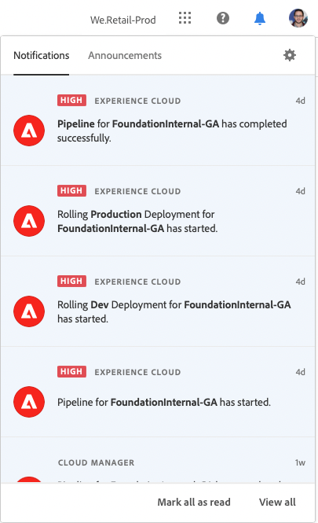
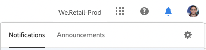

# Meddelanden {#notifications}

Lär dig hur Cloud Manager meddelar dig om viktiga händelser.

## Meddelanden i Cloud Manager {#cloud-manager-notifications}

[!UICONTROL Cloud Manager] skickar meddelanden till dig när en produktionspipeline startar och slutförs (utan fel eller slutförs) i början av en produktionsdistribution.

Dessa meddelanden skickas via [!UICONTROL Experience Cloud] meddelandesystem till användare i **Företagsägare**, **Programhanteraren** och **Distributionshanteraren** roller.

Meddelandena visas i ett sidofält i [!UICONTROL Cloud Manager] och Adobe [!UICONTROL Experience Cloud]. Klockikonen i sidhuvudet visas när du har nya meddelanden.

Klicka på klockikonen för att öppna sidofältet och visa meddelandena. The **Meddelanden** I sidlisten visas de senaste meddelandena, till exempel distributionsbekräftelser. Meddelanden gäller dina miljöer.

The **Meddelanden** -fliken innehåller produktinformation för Adobe. Meddelanden gäller produkten.

Klicka på ett meddelande eller meddelande för att visa information om det. Meddelanden som är kopplade till aktiviteter som pipeline-distributioner tar dig till detaljerna för den aktiviteten, som till exempel körningsfönstret för pipeline.

Klicka på **Visa alla** längst ned på panelen för att visa alla meddelanden i inkorgen.

Klicka på **Markera alla som lästa** längst ned på panelen för att markera alla olästa meddelanden som lästa och ta bort klockikonens märkning.

## Meddelandekonfiguration {#configuration}

Du kan anpassa hur du tar emot meddelanden och vilka meddelanden du får.

Klicka på kugghjulsikonen högst upp i sidofältet för meddelanden.

Då öppnas **Inställningar för Experience Cloud** fönster, där du kan definiera dina meddelandeprenumerationer och hur du får dina meddelanden.

### Prenumerationer {#subscriptions}

Prenumerationer definierar för vilka produkter du får meddelanden och vilka meddelanden.

Som standard får du alla meddelanden för alla produkter. Klicka på **Anpassa** bredvid en produkt för att definiera de typer av meddelanden du får för den produkten.

### Prioritet {#priority}

Prioritetsvarningar är markerade med en **HÖG** -taggen och kan konfigureras så att den endast tas emot som aviseringar. I **Prioritet** kan du definiera vilka kategorier som kvalificerar som prioritetsmeddelanden.

Använd listrutan för att lägga till i listan över kategorier som kvalificerar sig som prioritet. Klicka på X bredvid kategorinamnen för att ta bort dem.

### Varningar {#alerts}

Varningar visas i fönstrets övre högra hörn under några sekunder. Använd **Varningar** för att definiera för vilka meddelanden du får aviseringar.

Du kan definiera hur varningarna ska fungera.

* **Visa aviseringar för** - Definierar de typer av meddelanden som utlöser varningar
* **Varningar bör stanna kvar på skärmen tills jag stänger dem** - Anger om varningarna ska finnas kvar om du inte aktivt stänger dem
* **Varaktighet** - Definierar hur länge varningen ska finnas kvar på skärmen om du inte har valt att de ska stanna på skärmen.

### E-post {#emails}

Meddelanden finns i webbanvändargränssnittet i Adobe [!UICONTROL Experience Cloud] lösningar. Du kan också välja att dessa meddelanden ska skickas via e-post i **E-post** -avsnitt.

Inga e-postmeddelanden skickas som standard. Du kan välja att få e-post som:

* Direkt
* Dagligen
* Vecka

När **Snabbmeddelanden** väljs skickas e-postmeddelanden omedelbart för varje meddelande. För **Daglig sammandrag** och **Veckosammandrag** du kan välja när din dagliga digest ska skickas och på vilken dag och när din veckosammanfattning ska skickas.