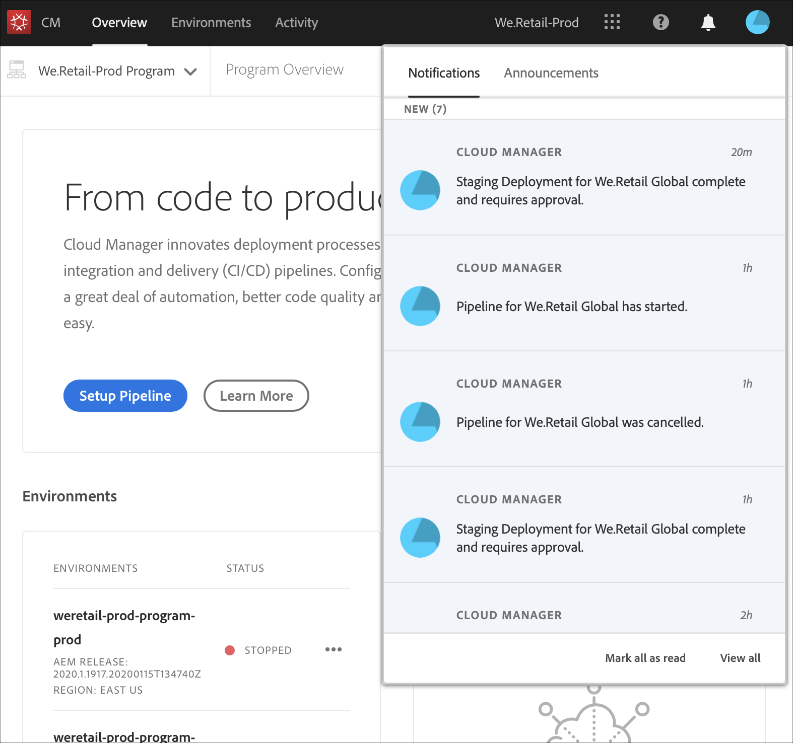

# Förstår aviseringar {#notifications}

[!UICONTROL Cloud Manager] gör att användaren kan ta emot meddelanden när produktionsflödet startar och slutförs (utan fel eller slutförs) i början av en produktionsdistribution. Dessa meddelanden skickas via meddelandesystemet i Adobe [!UICONTROL Experience Cloud].

>[!NOTE]
>
>Godkännandemeddelanden och schemalagda meddelanden skickas endast till användare med rollerna Business Owner, Program Manager och Deployment Manager.

Meddelandena visas i ett sidofält i [!UICONTROL Cloud Manager]-gränssnittet (användargränssnittet) och i hela Adobe [!UICONTROL Experience Cloud].

Klicka på klockikonen i sidhuvudet för att öppna sidlisten och visa meddelanden, som i bilden nedan:

I sidlisten visas de senaste meddelandena.

## E-postmeddelanden {#email-notifications}

Som standard är meddelanden tillgängliga i webbanvändargränssnittet för alla Adobe [!UICONTROL Experience Cloud]-lösningar. Enskilda användare kan också välja att dessa meddelanden ska skickas via e-post, antingen direkt eller i sammandrag.

Användaren kommer då till fönstret Meddelandeinställningar i Adobe [!UICONTROL Experience Cloud].

Användarna kan aktivera e-postmeddelanden och (valfritt) välja vilka typer av meddelanden de vill ta emot via e-post.

>[!NOTE]
>Du kan även aktivera hämtning från Adobe [!UICONTROL Experience Cloud].
