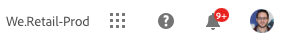

# Meddelanden {#notifications}

Läs om hur Cloud Manager meddelar dig om viktiga händelser.

## Meddelanden i Cloud Manager {#cloud-manager-notifications}

[!UICONTROL Cloud Manager] skickar meddelanden till dig när en produktionspipeline startar och slutförs (utan fel eller slutförs) i början av en produktionsdistribution.

Dessa meddelanden skickas via meddelandesystemet [!UICONTROL Experience Cloud] till användare i rollerna **Business Owner**, **Program Manager** och **Deployment Manager**.

Meddelandena visas i ett sidofält inom [!UICONTROL Cloud Manager] och i hela Adobe [!UICONTROL Experience Cloud]. Klockikonen i sidhuvudet visas när du har nya meddelanden.

Klicka på klockikonen för att öppna sidofältet och visa meddelandena. Fliken **Meddelanden** i sidlisten innehåller de senaste meddelandena, till exempel distributionsbekräftelser. Meddelanden gäller dina miljöer.

Fliken **Meddelanden** innehåller produktmeddelanden från Adobe. Meddelanden gäller produkten.

Klicka på ett meddelande eller meddelande för att visa information om det. Meddelanden som är kopplade till aktiviteter som pipeline-distributioner tar dig till detaljerna för den aktiviteten, som till exempel körningsfönstret för pipeline.

Klicka på alternativet **Visa alla** längst ned på panelen om du vill visa alla meddelanden i inkorgen.

Klicka på alternativet **Markera alla som lästa** längst ned på panelen om du vill markera alla olästa meddelanden som lästa och rensa klockikonens emblem.

## Meddelandekonfiguration {#configuration}

Du kan anpassa hur du tar emot meddelanden och vilka meddelanden du får.

Klicka på kugghjulsikonen högst upp i sidofältet för meddelanden för att öppna fönstret med **Experience Cloud-inställningar**. Härifrån kan du definiera dina meddelandeprenumerationer och hur du får dina meddelanden.

### Prenumerationer {#subscriptions}

Prenumerationer definierar för vilka produkter du får meddelanden och vilka meddelanden.

Som standard får du alla meddelanden för alla produkter både i programmet och via e-post. Klicka på nedtryckningen bredvid ett produktnamn för att visa de detaljerade alternativen och definiera de typer av meddelanden som du får för den produkten. Eller markera eller avmarkera alternativen på produktnivå för att markera/avmarkera alla alternativ för produkten.

### Prioritet {#priority}

Prioritetsvarningar har markerats med en **HIGH** -tagg. Du kan konfigurera så att de exklusivt tas emot som aviseringar. I avsnittet **Prioritet** kan du definiera vilka kategorier som kvalificerar som prioritetsmeddelanden.

Använd listrutan för att lägga till i listan över kategorier som kvalificerar sig som prioritet. Klicka på X bredvid kategorinamnen för att ta bort dem.

### Varningar {#alerts}

Varningar visas i fönstrets övre högra hörn under några sekunder. Använd avsnittet **Varningar** för att definiera för vilka aviseringar du får.

Du kan definiera hur varningarna ska fungera.

* **Visa aviseringar för** - Definierar de typer av meddelanden som utlöser aviseringar
* **Varningar ska finnas kvar på skärmen tills jag stänger av dem** - Anger om varningarna ska finnas kvar om du inte aktivt inaktiverar dem
* **Varaktighet** - Definierar hur länge varningen ska finnas kvar på skärmen om du inte har valt att de ska vara kvar på skärmen.

### E-post {#emails}

Meddelanden är tillgängliga i webbanvändargränssnittet för Adobe [!UICONTROL Experience Cloud]-lösningar. Du kan också välja att de här meddelandena ska skickas via e-post i avsnittet **E-post**.

Inga e-postmeddelanden skickas som standard. Du kan välja att få e-post som:

* Direkt
* Dagligen
* Vecka

När du väljer **Snabbmeddelanden** skickas e-postmeddelanden omedelbart för varje meddelande. För **Daglig sammandrag** och **Veckosammandrag** kan du välja när din dagliga sammandrag ska skickas och på vilken dag och när veckosammandraget ska skickas.