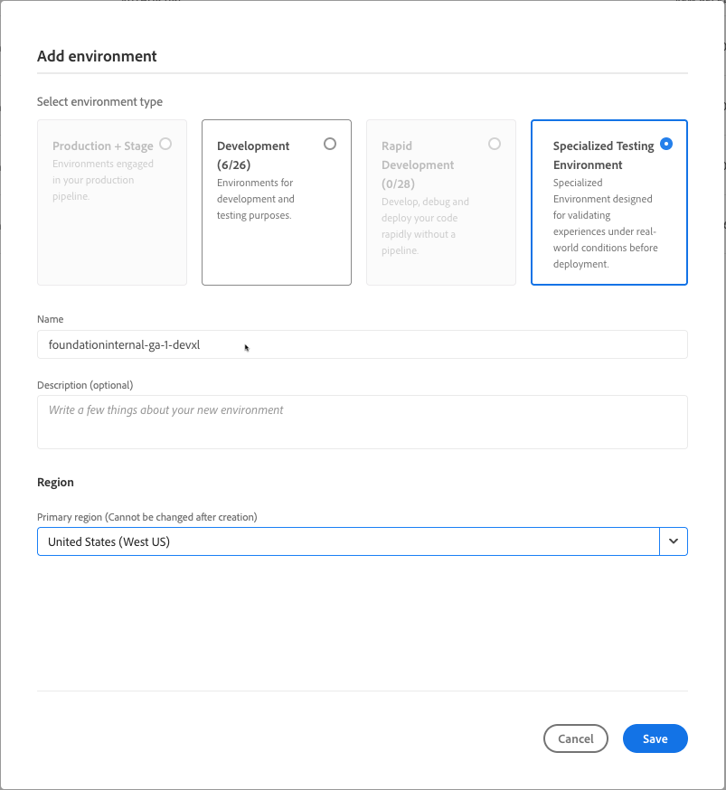

# Lägg till en anpassad testmiljö{#add-special-test-enviro}

>[!NOTE]
>
>&#x200B;>Funktionen som beskrivs i den här artikeln är endast tillgänglig via det privata betaprogrammet. Mer information om hur du registrerar dig för den privata betaversionen finns i [Specialiserad testmiljö](/help/implementing/cloud-manager/release-notes/current.md#specialized-test-environment).

Den specialiserade testmiljön, DevXL, är en ny typ av Cloud Manager-miljö som du kan skapa. Den är utformad för att stödja avancerade användningsfall som UAT (User Acceptance Testing) och prestandavalidering. Till skillnad från traditionella utvecklingsmiljöer, utvecklingsmiljöer och mellanlagringsmiljöer arbetar DevXL-miljöer utanför produktionsdistributionsflödet. De ger dig större flexibilitet och strikt isolering för att förhindra störningar i produktionsflödena.

DevXL är byggt för att spegla storleken, skalbarheten och konfigurationerna i en typisk mellanlagringsmiljö. Detta garanterar att tester som utförs i DevXL kan ge realistiska insikter i hur kod och innehåll fungerar under produktionsliknande förhållanden. Miljön har också stöd för direkt innehållskopiering från produktion eller scenen. Dessutom upprätthålls paritet med utvecklingsmiljöer när det gäller distributionsarbetsflöden, åtkomstkontroller och nätverkskonfigurationer.

## Viktiga funktioner och konfigurationer {#key-features}

| Kategori | DevXL, beteende |
| --- | --- |
| Syfte | UAT och prestandatestning. |
| Typ av pipeline | Inte i produktionsflödet. |
| Miljöstorlek | Matchar scenmiljön. |
| Isolering | Helt isolerad från andra miljöer. |
| Kodrörledningar | Samma som utvecklingsmiljön (validering, Skapa, distribuera). |
| Kopiera innehåll | Tillåts från Production, Stage eller Specialized Testing Environment. |
| Återställning av innehåll | Samma som utvecklingsmiljön. |
| Åtkomstloggar | Samma som utvecklingsmiljön. |
| Developer Console | Samma som utvecklingsmiljön. |
| `IP Allow List` | Samma som utvecklingsmiljön. |
| Nätverksbyggande | Samma som utvecklingsmiljön (tjänster, domännamn, SSL-certifikat, avancerat nätverk). |

Se även [Hantera miljöer](/help/implementing/cloud-manager/manage-environments.md)

## Lägg till en anpassad testmiljö {#add-specialized-testing-environment}

Om du vill lägga till eller redigera en miljö måste användaren vara medlem i rollen **Affärsägare**.

**Så här lägger du till en anpassad testmiljö:**

1. Logga in på Cloud Manager på [my.cloudmanager.adobe.com](https://my.cloudmanager.adobe.com/) och välj lämplig organisation.

1. På konsolen **[Mina program](/help/implementing/cloud-manager/navigation.md#my-programs)** klickar du på programmet som du vill lägga till en miljö för.

1. Gör något av följande:

   * På konsolen **[Mina program](/help/implementing/cloud-manager/navigation.md#my-programs)** klickar du på **Lägg till miljö** på **miljökortet**.
Om alternativet **Lägg till miljö** är nedtonat (inaktiverat) kan det bero på att behörigheter saknas eller att de är beroende av de licensierade resurserna.

   

   * Klicka på  **Miljöer** på den vänstra panelen och klicka sedan på **Lägg till miljö** på sidan Miljöer, i det övre högra hörnet.

     

1. Gör följande i dialogrutan **Lägg till miljö**:

   * Klicka på **Specialiserad testmiljö**.
   * Ange miljön **Namn**. Miljönamnet kan inte ändras efter att miljön har skapats.
   * (Valfritt) Ange en **beskrivning** för miljön.
   * Välj en **primär region** i listrutan. När den har skapats är den primära regionen i DevXL-miljön (till exempel *USA (väst)*) låst och kan inte ändras.

   

1. Klicka på **Spara**.

   Sidan **Översikt** visar nu din nya miljö på kortet **Miljöer**. Nu kan du ställa in rörledningar för din nya miljö.
