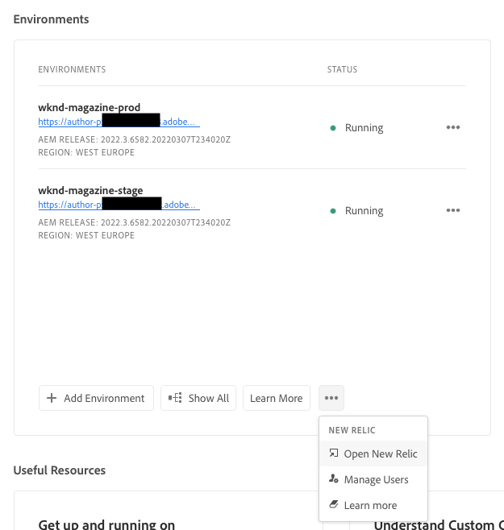

# New Relic One {#user-access}

Läs mer om New Relic One APM-tjänst (Application Performance Monitoring) för AEM as a Cloud Service och hur du kan komma åt den.

## Introduktion {#introduction}

Adobe lägger stor vikt vid övervakning, tillgänglighet och prestanda för programmet. AEM as a Cloud Service ger tillgång till en anpassad New Relic One-övervakningssvit som en del av standardprodukterbjudandet för att säkerställa att era team får största möjliga insyn i era AEM as a Cloud Service system- och miljöprestandamätningar.

I det här dokumentet beskrivs hur du hanterar åtkomst till New Relic One APM-funktioner (application performance monitoring) som är aktiverade i dina AEM as a Cloud Service miljöer för att ge bättre prestanda och få ut så mycket som möjligt av AEM as a Cloud Service.

När ett nytt produktionsprogram skapas skapas automatiskt det New Relic One-underkonto som är kopplat till ditt AEM as a Cloud Service program.

## Funktioner {#transaction-monitoring}

New Relic One APM för AEM as a Cloud Service har många funktioner.

* Direktåtkomst till ett dedikerat New Relic One-konto

* Instrumenterad New Relic One APM-agent som visar exakta metodanrop med radnummer, inklusive externa beroenden och databaser

* Holistisk prestandaoptimering genom att kombinera nyckelvärden från övervakning på infrastrukturnivå och programövervakning (Adobe Experience Manager)

* Exponering av AEM as a Cloud Service JMX-bönor och hälsokontroller direkt inom New Relic Insights-mätvärden, vilket gör det möjligt att göra djupgående kontroller av programstackens prestanda och hälsomått.

## Hantera New Relic One-användare {#manage-users}

Följ de här stegen för att definiera användare för ditt New Relic One-underkonto som är kopplat till ditt AEM as a Cloud Service program.

>[!NOTE]
>
>En användare i **Företagsägare** eller **Distributionshanteraren** roll måste vara inloggad för att hantera New Relic One-användare.

1. Logga in i Cloud Manager på [my.cloudmanager.adobe.com](https://my.cloudmanager.adobe.com/) och välja lämplig organisation.

1. Klicka på det program som du vill hantera dina New Relic One-användare för.

1. Längst ned på **Miljö** på programöversiktssidan klickar du på ellipsknappen och väljer **Hantera användare**.

   

   * Du kan även komma åt **Hantera användare** via ellipsknappen längst upp på **Miljö** programskärmen.

1. I **Hantera New Relic-användare** anger du för- och efternamnet för användaren som du vill lägga till och klickar på **Lägg till** -knappen. Upprepa det här steget för alla användare som du vill lägga till.

   

1. Om du vill ta bort en New Relic One-användare klickar du på borttagningsknappen i den högra änden av raden som representerar användaren.

1. Klicka **Spara** för att skapa användarna.

När användarna har definierats skickar New Relic ett bekräftelsemeddelande via e-post till varje användare som du har beviljat åtkomst, så att användaren kan slutföra installationsprocessen och logga in.

>[!NOTE]
>
>Om du hanterar New Relic One-användare måste du även lägga till dig själv som användare för att få tillgång till dem. Att vara **Företagsägare** eller **Distributionshanteraren** inte ger tillgång till New Relic One. Du måste också skapa dig själv som användare.

## Aktivera ditt New Relic One-användarkonto {#activate-account}

När ett New Relic One-användarkonto har skapats enligt beskrivningen i förhandsvisningsavsnittet [Hantera New Relic One-användare](#manage-users)skickar New Relic ett bekräftelsemeddelande till den angivna adressen. För att kunna använda dessa konton måste användarna först aktivera sina konton hos New Relic genom att återställa sina lösenord.

Följ de här stegen för att aktivera ditt konto som New Relic-användare.

1. Klicka på länken i mejlet från New Relic. Då öppnas webbläsaren och New Relic inloggningssida öppnas.

1. På inloggningssidan för New Relic väljer du **Har du glömt lösenordet?**.

   

1. Ange den e-postadress där du fick bekräftelsemeddelandet och välj **Skicka min återställningslänk**.

   

1. New Relic skickar ett e-postmeddelande med en länk för att bekräfta kontot.

Om du inte får något bekräftelsemeddelande från New Relic går du till [felsökningsavsnitt.](#troubshooting)

## Åtkomst till New Relic One {#accessing-new-relic}

När du har [har aktiverat ditt New Relic-konto,](#activate-account) du har tillgång till New Relic One via Cloud Manager eller direkt.

Så här kommer du åt New Relic One via Cloud Manager:

1. Logga in i Cloud Manager på [my.cloudmanager.adobe.com](https://my.cloudmanager.adobe.com/) och välja lämplig organisation.

1. Klicka på det program du vill använda New Relic One för.

1. Längst ned på **Miljö** på programöversiktssidan klickar du på ellipsknappen och väljer **Öppna New Relic**.

   

   * Du kan även öppna New Relic via ellipsknappen högst upp i **Miljö** programskärmen.

1. Logga in på New Relic One på den nya webbläsarfliken som öppnas.

Få direktåtkomst till New Relic One:

1. Gå till New Relic inloggningssida på [`https://login.newrelic.com/login`](https://login.newrelic.com/login)

1. Logga in på New Relic One.

### Verifiera din e-postadress {#verify-email}

Om du uppmanas att verifiera din e-postadress under inloggningen på New Relic One innebär det att din e-postadress är kopplad till flera konton. På så sätt kan du välja vilket konto du vill få åtkomst till.

Om du inte verifierar din e-postadress försöker New Relic logga in dig med den senast skapade användarposten som är kopplad till din e-postadress. Klicka på knappen **Kom ihåg mig** i inloggningsfönstret.

Om du vill ha mer hjälp öppnar du en supportanmälan via [AEM supportportal](https://helpx.adobe.com/enterprise/using/support-for-experience-cloud.html).

## Felsöka New Relic One Access {#troubleshooting}

Om du har lagts till som New Relic One-användare enligt beskrivningen i avsnittet [Hantera New Relic One-användare](#manage-users) och kan inte hitta det ursprungliga e-postmeddelandet med kontobekräftelsen genom att följa dessa steg.

1. Gå till New Relic inloggningssida på [`login.newrelic.com/login`](https://login.newrelic.com/login).

1. Välj **Har du glömt lösenordet?**.

   

1. Ange den e-postadress som användes för att skapa ditt konto och välj **Skicka min återställningslänk**.

   

1. New Relic skickar ett e-postmeddelande med en länk för att bekräfta kontot.

Om du har slutfört registreringsprocessen och inte kan logga in på ditt konto på grund av felmeddelanden i e-post eller lösenord loggar du en supportanmälan via [Admin Console.](https://adminconsole.adobe.com/)

Om du inte får något mejl från New Relic:

* Kontrollera [skräppostfilter](https://docs.newrelic.com/docs/accounts/accounts-billing/account-setup/create-your-new-relic-account/).
* Om tillämpligt, [lägg till New Relic i e-postmeddelandet tillåtelselista](https://docs.newrelic.com/docs/accounts/accounts/account-maintenance/account-email-settings/#email-whitelist).
* Om inget av förslagen hjälper dig kan du ge feedback på supportanmälan och Adobe Support-teamet kan hjälpa dig.

## Begränsningar {#limitations}

Följande begränsningar gäller när du lägger till användare i New Relic One:

* Högst 30 användare kan läggas till. Om det maximala antalet användare har uppnåtts tar du bort användare för att kunna lägga till nya användare.
* Användare som läggs till i New Relic är av samma typ **Begränsad**, se [Mer information finns i New Relic-dokumentationen.](https://docs.newrelic.com/docs/accounts/original-accounts-billing/original-users-roles/users-roles-original-user-model/#:~:text=In%20general%2C%20Admins%20take%20responsibility,Restricted%20Users%20can%20use%20them.&amp;text=One%20or%20more%20individuals%20vem,change)
* AEM as a Cloud Service har bara New Relic One APM-lösning och har inte stöd för varningar, loggning eller API-integreringar.

>[!NOTE]
>
>Om ingen aktivitet identifieras på ditt New Relic One-konto under minst 90 dagar stoppas APM-agenten.
>
>Öppna en supportanmälan via [AEM supportportal](https://helpx.adobe.com/enterprise/using/support-for-experience-cloud.html) om du vill återaktivera APM-agenten för dina AEMaaCS-miljöer.

Om du vill ha mer hjälp eller mer information om New Relic One-erbjudanden för ditt AEM as a Cloud Service program kan du öppna ett supportärende via [AEM supportportal](https://helpx.adobe.com/enterprise/using/support-for-experience-cloud.html).

## Frågor och svar om New Relic One {#faqs}

### Vad övervakar Adobe med New Relic One? {#adobe-monitor}

Adobe övervakar den AEM as a Cloud Service författaren, publicerar och förhandsgranskar (där det är tillgängligt) via New Relic One Java-plugin. Adobe möjliggör anpassad New Relic One APM-telemetri och övervakning i icke-produktion och produktion AEM as a Cloud Service miljöer.

Ditt New Relic One-konto är kopplat till ett primärt Adobe-underhållet konto och har flera program som rapporterar till det: tre per AEM as a Cloud Service Environment.

* Ett program för författartjänsten per miljö
* Ett program för publiceringstjänsten per miljö (inklusive Golden Publish)
* Ett program för förhandsgranskningstjänsten per miljö

Obs!

* Varje program använder en licensnyckel.
* AEM as a Cloud Service miljöer rapporterar till endast ett New Relic One-konto.
* Full övervakning av mätvärden och händelser för båda New Relic One bevaras i sju dagar.

### Vem har åtkomst till New Relic One molntjänstdata? {#access-new-relic-cloud}

Upp till 30 medlemmar i ditt team har full läsbehörighet. Läsåtkomst inkluderar alla APM-värden som samlas in av New Relic One-agenten.

### Stöds anpassad SSO-konfiguration? {#custom-sso}

Anpassad SSO-konfiguration stöds inte för New Relic One-kontot som tillhandahålls av Adobe.

### Vad händer om jag redan har en lokal New Relic-prenumeration? {#new-relic-subscription}

New Relic One är den nya plattformen för observerbarhet från New Relic och gör det möjligt för support från Adobe och era team att följa, övervaka och se mätvärden och händelser, allt på ett och samma ställe.

New Relic One ger användarna möjlighet att söka på alla konton där de har tillgång till och kan visualisera data från alla tjänster och värdar i en och samma vy.

Medan supporten i Adobe övervakar den AEM as a Cloud Service applikationen med New Relic One och andra interna verktyg som en del av din tjänst kan era team fortsätta att använda New Relic för lokala värdtjänster och infrastruktur. De kan visualisera data från både Adobe New Relic One-konto och kundhanterade New Relic-konton.

>[!NOTE]
>
>Om du vill visa båda datauppsättningarna inom New Relic One måste användaren ha rätt behörigheter och använda samma inloggningsmetod för båda kontona (Adobe New Relic One och kundhanterade New Relic-konton).

### APM-agenten för mitt New Relic One-konto har stoppats. Vad hände? {#deactivated}

[APM-agenter har stoppats](#limitations) om ingen aktivitet har identifierats under minst 90 dagar. Öppna en supportanmälan via [AEM supportportal](https://helpx.adobe.com/enterprise/using/support-for-experience-cloud.html) om du vill återaktivera APM-agenten för dina AEMaaCS-miljöer.
