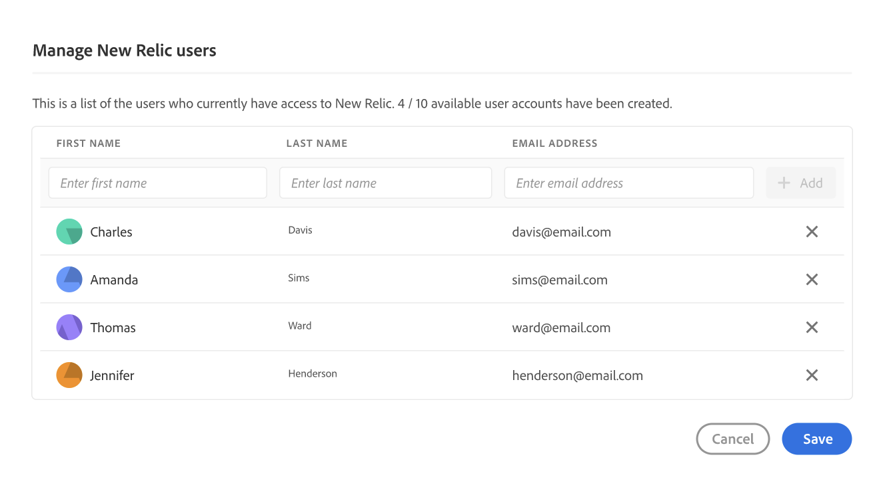

# New Relic One {#user-access}

Läs mer om tjänsten New Relic One Application Performance Monitoring (APM) för AEM as a Cloud Service och hur du kan komma åt den.

## Introduktion {#introduction}

Adobe lägger stor vikt vid övervakning, tillgänglighet och prestanda för programmet. AEM as a Cloud Service ger tillgång till en anpassad New Relic One-övervakningssvit som en del av standardprodukterbjudandet för att säkerställa att era team får största möjliga insyn i era AEM as a Cloud Service system- och miljöprestandamätningar.

I det här dokumentet beskrivs hur du hanterar åtkomsten till de nya APM-funktionerna (New Relic One application performance monitoring) som är aktiverade i dina AEM as a Cloud Service miljöer för att ge bättre prestanda och få ut så mycket som möjligt av AEM as a Cloud Service.

När ett nytt produktionsprogram skapas skapas automatiskt underkontot New Relic One som är kopplat till ditt AEM as a Cloud Service program.

## Funktioner {#transaction-monitoring}

New Relic One APM för AEM as a Cloud Service har många funktioner.

* Direktåtkomst till ett dedikerat nytt Relic One-konto (åtkomst hanteras av Adobe Support)

* Instrumented New Relic One APM-agent som visar exakta metodanrop med radnummer, inklusive externa beroenden och databaser

* Holistisk prestandaoptimering genom att kombinera nyckelvärden från övervakning på infrastrukturnivå och programövervakning (Adobe Experience Manager)

* Exponering av AEM as a Cloud Service JMX-bönor och hälsokontroller direkt inom nya Relic InsiInsights-mätvärden, vilket gör det möjligt att göra djupgående kontroller av programstackens prestanda och hälsomått.

## Hantera nya användare med Relie One {#manage-users}

Följ de här stegen för att definiera användare för ditt New Relic One-underkonto som är kopplat till ditt AEM as a Cloud Service program.

>[!NOTE]
>
>En användare i **Företagsägare** eller **Distributionshanteraren** roll måste vara inloggad för att hantera New Relic One-användare.

1. Logga in i Cloud Manager på [my.cloudmanager.adobe.com](https://my.cloudmanager.adobe.com/) och välja lämplig organisation.

1. Klicka på det program som du vill hantera dina New Relic One-användare för.

1. Växla till **Miljö** från **Programöversikt** genom att klicka på **Miljö** överst på skärmen.

1. På **Miljö** klickar du på ellipsknappen högst upp på skärmen bredvid **Lägg till miljö** -knappen.

1. Klicka på **Hantera användare**.

   

1. I **Hantera nya Relic-användare** anger du för- och efternamnet för användaren som du vill lägga till och klickar på **Lägg till** -knappen. Upprepa det här steget för alla användare som du vill lägga till.

   

1. Om du vill ta bort en ny användare klickar du på borttagningsknappen till höger på raden som representerar användaren.

1. Klicka **Spara** för att skapa användarna.

När användarna har definierats skickar New Relic ett bekräftelsemeddelande via e-post till varje användare som du har beviljat åtkomst, så att användaren kan slutföra installationsprocessen och logga in.

>[!NOTE]
>
>Om du hanterar New Relic One-användare måste du även lägga till dig själv som användare för att få tillgång till dem. Att vara **Företagsägare** eller **Distributionshanteraren** inte ger tillgång till New Relic One. Du måste också skapa dig själv som användare.

## Aktivera ditt nya Relic One-användarkonto {#activate-account}

När ett New Relic One-användarkonto har skapats, vilket beskrivs i förhandsvisningsavsnittet [Hantera nya användare med Relie One](#manage-users), skickar New Relic en bekräftelse till den angivna adressen via e-post. För att kunna använda dessa konton måste användarna först aktivera sina konton med New Relic genom att återställa sina lösenord.

Följ de här stegen för att aktivera ditt konto som en New Relic-användare.

1. Klicka på länken i e-postmeddelandet från New Relic. Då öppnas webbläsaren för inloggningssidan New Relic.

1. På inloggningssidan New Relic väljer du **Har du glömt lösenordet?**.

   

1. Ange den e-postadress där du fick bekräftelsemeddelandet och välj **Skicka min återställningslänk**.

   

1. New Relic skickar ett e-postmeddelande till dig med en länk för att bekräfta kontot.

Om du inte får något bekräftelsemeddelande från New Relic kan du läsa [felsökningsavsnitt.](#troubshooting)

## Använder New Relic One {#accessing-new-relic}

När du har [aktiverade ditt New Relic-konto,](#activate-account) du har tillgång till New Relic One via Cloud Manager eller direkt.

Så här kommer du åt New Relic One via Cloud Manager:

1. Logga in i Cloud Manager på [my.cloudmanager.adobe.com](https://my.cloudmanager.adobe.com/) och välja lämplig organisation.

1. Klicka på det program som du vill öppna New Relic One för.

1. Växla till **Miljö** från **Programöversikt** genom att klicka på **Miljö** överst på skärmen.

1. På **Miljö** klickar du på ellipsknappen högst upp på skärmen bredvid **Lägg till miljö** -knappen.

1. Klicka på **Öppna ny Relic**.

1. Logga in på New Relic One på den nya fliken i webbläsaren som öppnas.

Så här kommer du åt New Relic One direkt:

1. Gå till inloggningssidan för New Relic på [`https://login.newrelic.com/login`](https://login.newrelic.com/login)

1. Logga in på New Relic One.

### Verifiera din e-postadress {#verify-email}

Om du uppmanas att verifiera din e-postadress under inloggning på New Relic One innebär det att din e-postadress är kopplad till flera konton. På så sätt kan du välja vilket konto du vill få åtkomst till.

Om du inte verifierar din e-postadress försöker New Relic logga in dig med den senast skapade användarposten som är kopplad till din e-postadress. Klicka på knappen **Kom ihåg mig** i inloggningsfönstret.

Om du behöver mer hjälp kan du öppna ett supportärende via [AEM supportportal](https://helpx.adobe.com/enterprise/using/support-for-experience-cloud.html).

## Felsökning av ny Relic One Access {#troubleshooting}

Om du har lagts till som New Relic One-användare enligt beskrivningen i avsnittet [Hantera nya användare med Relie One](#manage-users) och kan inte hitta det ursprungliga e-postmeddelandet med kontobekräftelsen genom att följa dessa steg.

1. Gå till inloggningssidan för New Relic på [`login.newrelic.com/login`](https://login.newrelic.com/login).

1. Välj **Har du glömt lösenordet?**.

   

1. Ange den e-postadress som användes för att skapa ditt konto och välj **Skicka min återställningslänk**.

   

1. New Relic skickar ett e-postmeddelande till dig med en länk för att bekräfta kontot.

Om du har slutfört registreringsprocessen och inte kan logga in på ditt konto på grund av felmeddelanden via e-post eller lösenord loggar du en supportanmälan via [Admin Console.](https://adminconsole.adobe.com/)

Om du inte får något e-postmeddelande från New Relic:

* Kontrollera [skräppostfilter](https://docs.newrelic.com/docs/accounts/accounts-billing/account-setup/create-your-new-relic-account/).
* Om tillämpligt, [lägg till New Relic i e-postmeddelandet tillåtelselista](https://docs.newrelic.com/docs/accounts/accounts/account-maintenance/account-email-settings/#email-whitelist).
* Om ingen av dem föreslår hjälp, ge gärna feedback på supportanmälan så kommer Adobe Support att hjälpa dig vidare.

## Begränsningar {#limitations}

Följande begränsningar gäller för att lägga till användare i New Relic One:

* Högst 25 användare kan läggas till. Om det maximala antalet användare har uppnåtts tar du bort användare för att kunna lägga till nya användare.
* Användare som läggs till i New Relic är av typen **Begränsad** referera till [I New Relic-dokumentationen finns mer information.](https://docs.newrelic.com/docs/accounts/original-accounts-billing/original-users-roles/users-roles-original-user-model/#:~:text=In%20general%2C%20Admins%20take%20responsibility,Restricted%20Users%20can%20use%20them.&amp;text=One%20or%20more%20individuals%20vem,change)%20any%20New%20Relic%20features.)
* AEM as a Cloud Service har bara New Relic One APM-lösning och har inte stöd för varningar, loggning eller API-integreringar.

Om du vill ha mer hjälp eller mer information om nya Relic One-erbjudanden för ditt AEM as a Cloud Service program kan du öppna ett supportärende via [AEM supportportal](https://helpx.adobe.com/enterprise/using/support-for-experience-cloud.html).

## Vanliga frågor och svar om New Relic One {#faqs}

### Vad övervakar Adobe med New Relic One? {#adobe-monitor}

Adobe övervakar den AEM as a Cloud Service författaren, publicerar och förhandsgranskar (där det är tillgängligt) via Java-pluginen New Relic One. Adobe möjliggör anpassad New Relic One APM-telemetri och övervakning i icke-produktions- och produktionsmiljöer AEM as a Cloud Service miljöer.

Ditt nya Relic One-konto är kopplat till ett primärt konto som underhålls av Adobe och har flera program som rapporterar till det: tre per AEM as a Cloud Service Environment.

* Ett program för författartjänsten per miljö
* Ett program för publiceringstjänsten per miljö (inklusive Golden Publish)
* Ett program för förhandsgranskningstjänsten per miljö

Observera:

* Varje program använder en licensnyckel.
* AEM as a Cloud Service miljöer rapporterar till endast ett New Relic One-konto.
* Full övervakning av statistik och händelser för både New Relic One bevaras i sju dagar.

### Vem har åtkomst till molntjänsten New Relic One? {#access-new-relic-cloud}

Fullständig läsbehörighet ges för upp till 10 medlemmar i ditt team. Läsåtkomst inkluderar alla APM-mått som samlats in av New Relic One-agenten.

### Stöds anpassad SSO-konfiguration? {#custom-sso}

Anpassad SSO-konfiguration stöds inte för det nya Relic One-konto som tillhandahålls av Adobe.

### Vad händer om jag redan har en lokal New Relic-prenumeration? {#new-relic-subscription}

New Relic One är den nya observerbarhetsplattformen från New Relic och gör det möjligt för Adobe support och era team att observera, övervaka och se mätvärden och händelser på ett och samma ställe.

Med New Relic One kan användarna söka i alla konton där de har åtkomst till och visualisera data från alla tjänster och värdar i en och samma vy.

Medan supporten i Adobe övervakar den AEM as a Cloud Service applikationen med nya Relic One och andra interna verktyg som en del av din tjänst kan era team fortsätta att utnyttja New Relic för lokala värdtjänster och infrastrukturer. De kommer att kunna visualisera data från både Adobe New Relic One-kontot och kundhanterade New Relic-konton.

>[!NOTE]
>
>Om du vill visa båda datauppsättningarna i New Relic One måste användaren ha rätt behörigheter och använda samma inloggningsmetod för båda kontona (Adobe New Relic One och kundhanterade New Relic-konton).
