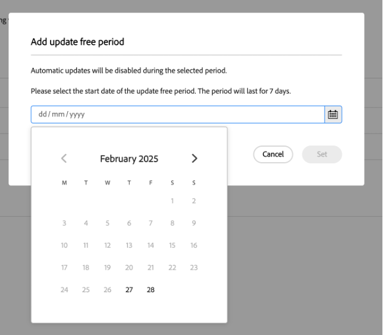

# Tysta timmar och Uppdatera lediga perioder {#quiet-hours-update-free-periods}

>[!NOTE]
>Den här funktionen kommer att vara tillgänglig som en **begränsad tillgänglighet** med början den 25 september. Skicka ett e-postmeddelande till [aemcs-update-free@adobe.com](mailto:aemcs-update-free@adobe.com) om du vill aktivera funktionen i dina program.

>[!WARNING]
>Du kan bara använda funktionerna tysta timmar och Uppdatera lediga perioder efter att du har anslutit till [automatiska underhållsuppdateringar](/help/implementing/deploying/aem-version-updates.md).

AEM as a Cloud Service [automatiska underhållsuppdateringar](/help/implementing/deploying/aem-version-updates.md) säkerställer att dina instanser är säkra och uppdaterade med de senaste underhållsversionerna. Men i vissa fall (som live-event) kan du behöva &quot;skydda&quot; dessa viktiga arbetstider från eventuella avbrott. Därför har AEM as a Cloud Service möjlighet att ange en tidsram där automatiska uppdateringar inte görs för dina pågående program.

Du kan konfigurera dessa tidsramar med två schemaläggningsalternativ:

* **Tysta timmar** - Du kan definiera ett dagligt tidsintervall (upp till 8 timmar) där uppdateringar inte ska ske.
* **Uppdatera lediga perioder** - Du kan definiera en 7-dagars tidsperiod under vilken uppdateringar inte kommer att ske. Du kan ha upp till tre kostnadsfria uppdateringsperioder inom en 12-månadersperiod.

De kostnadsfria uppdateringsperioderna och funktionerna för tysta timmar konfigureras per program.

Mer information om schemalagda automatiska underhållsperioder för AEM as a Cloud Service finns på sidan [Experience Manager Releases Roadmap](https://experienceleague.adobe.com/en/docs/experience-manager-release-information/aem-release-updates/update-releases-roadmap) .

## Tysta timmar {#quiet-hours}

Genom att använda funktionen för tysta timmar kan du definiera ett tidsfönster under dagen utan några automatiska uppdateringar. Alla underhållsuppdateringar utförs utanför det konfigurerade tidsfönstret. Om till exempel en uppdatering schemaläggs under de angivna tysta timmarna, startar den automatiskt efter att det tysta timintervallet har avslutats. Det konfigurerade tidsintervallet får inte överstiga 8 timmar, så att uppdateringar fortfarande kan utföras dagligen.

Du kan definiera dessa tysta timmar **per program** med din lokala tidszon.

### Så här konfigurerar du intervallet för tysta timmar {#configure-quiet-hours}

Det tysta timintervallet kan konfigureras med AEM Cloud Manager-gränssnittet enligt följande:

Gå till **Aktiviteter > Automatiska uppdateringar > Uppdateringsalternativ**.

1. Kontrollera att alternativet **Förhindra automatiska uppdateringar under vissa timmar** är aktiverat.
2. Klicka på **Redigera**.
3. Ange intervallet för tysta timmar i konfigurationsfönstret.

När du har angett detta gäller dina angivna start- och sluttimmar för varje kalenderdag som flyttas framåt. Du kan antingen inaktivera eller konfigurera om tidsvärdet för tysta timmar efter behov.

## Uppdatera lediga perioder {#update-free-periods}

Genom att använda funktionen för kostnadsfria uppdateringsperioder kan du definiera en 7-dagars tidsram där uppdateringar inte kommer att ske. När konfigurationen är klar ändras alla underhållsuppdateringar automatiskt till utanför den definierade tidsramen. Du kan ha upp till tre kostnadsfria uppdateringsperioder inom ett 12-månadersintervall. Dessutom kan kostnadsfria uppdateringsperioder anges upp till ett år i förväg.

När du konfigurerar det här alternativet bör du tänka på att (minst) ett veckolånga tidsintervall mellan perioder är obligatoriskt för att underlätta automatiska uppdateringar. Det innebär att det här veckotidsintervallet används automatiskt och läggs till i kalendern mellan de kostnadsfria uppdateringsperioderna som du konfigurerade. Detta kan leda till att vissa kalenderdagar inte kan väljas.

Du kan definiera kostnadsfria uppdateringsperioder **per program**.

### Så här konfigurerar du kostnadsfria uppdateringsperioder {#configure-update-free-periods}

Funktionen för kostnadsfria uppdateringsperioder kan konfigureras med AEM Cloud Manager-gränssnittet enligt följande:

Gå till **Aktiviteter > Automatiska uppdateringar > Uppdateringsalternativ**.

1. Gå till avsnittet Uppdatera lediga perioder.
2. Klicka på **Lägg till kostnadsfri uppdateringsperiod**.
3. Välj en veckas kostnadsfri uppdateringsperiod i kalendern.

En **aktiv**-ikon visas nära den aktiva uppdateringens lediga period och en **Complete** -ikon bredvid de slutförda uppdateringens lediga perioder.
