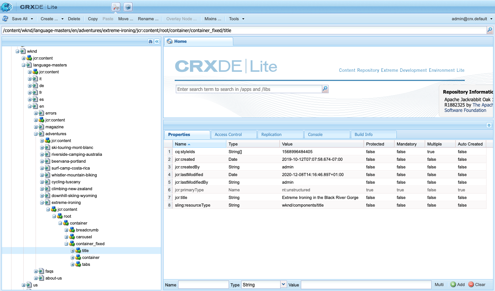

# Referenshandbok för komponenter {#components-reference-guide}

Komponenterna utgör kärnan i AEM. Med [kärnkomponenterna](https://experienceleague.adobe.com/docs/experience-manager-core-components/using/introduction.html) och [AEM Project Archetype](https://experienceleague.adobe.com/docs/experience-manager-core-components/using/developing/archetype/overview.html) är det enkelt att komma igång med en verktygsuppsättning med färdiga, robusta komponenter. I [WKND-självstudiekursen](/help/implementing/developing/introduction/develop-wknd-tutorial.md) får utvecklaren information om hur de här verktygen används och hur de anpassade komponenterna byggs för att skapa en ny AEM.

>[!TIP]
>
>Innan du refererar till det här dokumentet måste du kontrollera att du har slutfört [WKND-självstudiekursen](/help/implementing/developing/introduction/develop-wknd-tutorial.md) och därför känner till [kärnkomponenterna](https://experienceleague.adobe.com/docs/experience-manager-core-components/using/introduction.html) och [AEM Project Archettype.](https://experienceleague.adobe.com/docs/experience-manager-core-components/using/developing/archetype/overview.html)

Eftersom WKND-självstudiekursen täcker de flesta användningsfall är det här dokumentet endast avsett som komplement till dessa resurser. Den innehåller detaljerade tekniska detaljer om hur komponenterna är strukturerade och konfigurerade i AEM och är inte avsedd som en guide för att komma igång.

## Översikt {#overview}

I det här avsnittet beskrivs viktiga koncept och problem som en introduktion till den information som behövs när du utvecklar egna komponenter.

### Planering {#planning}

Innan du börjar konfigurera eller koda komponenten bör du fråga:

* Vad behöver du den nya komponenten till?
* Behöver du skapa komponenten från grunden, eller kan du ärva grunderna från en befintlig komponent?
* Kommer din komponent att behöva logik för att markera/ändra innehållet?
   * Logiken ska hållas åtskild från användargränssnittets lager. HTML är utformat för att säkerställa att detta sker.
* Behöver komponenten CSS-formatering?
   * CSS-formateringen ska hållas åtskild från komponentdefinitionerna. Definiera konventioner för namngivning av HTML-element så att du kan ändra dem via externa CSS-filer.
* Vilka säkerhetsåtgärder kan den nya komponenten ge upphov till?

### Återanvända befintliga komponenter {#reusing-components}

Innan du lägger tid på att skapa en helt ny komponent bör du överväga att anpassa eller utöka befintliga komponenter. [Core ](https://experienceleague.adobe.com/docs/experience-manager-core-components/using/introduction.html) Components erbjuder en serie flexibla, robusta och väl testade produktionsklara komponenter.

#### Utöka kärnkomponenter {#extending-core-components}

Core Components erbjuder också [tydliga anpassningsmönster](https://experienceleague.adobe.com/docs/experience-manager-core-components/using/developing/customizing.html) som du kan använda för att anpassa dem till ditt eget projekt.

#### Komponenter som ersätter {#overlying-components}

Komponenter kan också definieras om med en [övertäckning](/help/implementing/developing/introduction/overlays.md) baserat på sökvägslogiken. I så fall aktiveras inte [Sling Resource Merger](/help/implementing/developing/introduction/sling-resource-merger.md) och `/apps` måste definiera hela övertäckningen.

#### Utöka komponentdialogrutor {#extending-component-dialogs}

Det går också att åsidosätta en komponentdialogruta med Sling Resource Merger och definiera egenskapen `sling:resourceSuperType`.

Det innebär att du bara behöver definiera om skillnaderna, i stället för att definiera om hela dialogrutan.

### Innehållslogik och återgivningsmarkeringar {#content-logic-and-rendering-markup}

Komponenten återges med [HTML.](https://www.w3schools.com/htmL/html_intro.asp) Komponenten måste definiera den HTML som behövs för att ta det önskade innehållet och sedan återge det som det behövs, både i författarmiljön och i publiceringsmiljön.

Vi rekommenderar att koden som ansvarar för kod och återgivning hålls åtskild från koden som styr logiken som används för att markera komponentens innehåll.

Denna filosofi stöds av [HTL](https://experienceleague.adobe.com/docs/experience-manager-htl/using/overview.html), ett mallspråk som är avsiktligt begränsat för att säkerställa att ett riktigt programmeringsspråk används för att definiera den underliggande affärslogiken. Den här mekanismen markerar koden som anropas för en viss vy och, om det behövs, tillåter specifik logik för olika vyer av samma komponent.

Den här (valfria) logiken kan implementeras på olika sätt och anropas från HTML med specifika kommandon:

* Med Java - [HTL Java Use-API](https://helpx.adobe.com/experience-manager/htl/using/use-api-java.html) kan en HTML-fil få åtkomst till hjälpmetoder i en anpassad Java-klass. På så sätt kan du använda Java-kod för att implementera logiken för att välja och konfigurera komponentinnehållet.
* Om du använder JavaScript - [HTL JavaScript Use-API](https://experienceleague.adobe.com/docs/experience-manager-htl/using/htl/use-api-javascript.html) aktiveras en HTML-fil för åtkomst till hjälpkod som skrivits i JavaScript. På så sätt kan du använda JavaScript-kod för att implementera logiken för att välja och konfigurera komponentinnehållet.
* Använda bibliotek på klientsidan - Moderna webbplatser är starkt beroende av bearbetning på klientsidan som styrs av komplex JavaScript- och CSS-kod. Mer information finns i dokumentet [Använda klientbibliotek på AEM som en Cloud Service](/help/implementing/developing/introduction/clientlibs.md).

### Utveckla dina egna komponenter {#developing-your-own-components}

Utveckla innehåll här?

## Komponentstruktur {#structure}

Strukturen i en AEM är kraftfull och flexibel. Huvuddelarna är:

* [Resurstyp](#resource-type)
* [Komponentdefinition](#component-definition)
* [Egenskaper och underordnade noder för en komponent](#properties-and-child-nodes-of-a-component)
* [Dialogrutor](#dialogs)
* [Designdialogrutor](#design-dialogs)

### Resurstyp {#resource-type}

Ett nyckelelement i strukturen är resurstypen.

* Innehållsstrukturen deklarerar avsikter.
* Resurstypen implementerar dem.

Detta är en abstraktion som hjälper till att se till att avsikten stannar kvar även när utseendet och känslan förändras över tiden.

### Komponentdefinition {#component-definition}

Definitionen av en komponent kan delas upp enligt följande:

* AEM är baserade på [Sling.](https://sling.apache.org/documentation.html)
* AEM finns under `/libs/core/wcm/components`.
* Projekt-/platsspecifika komponenter finns under `/apps/<myApp>/components`.
* AEM standardkomponenter definieras som `cq:Component` och har nyckelelementen:
   * jcr Properties - En lista med jcr-egenskaper. Dessa är variabler och vissa kan vara valfria genom att grundstrukturen för en komponentnod, dess egenskaper och undernoder definieras av definitionen `cq:Component`.
   * Resurser - Dessa definierar statiska element som används av komponenten.
   * Skript - Dessa används för att implementera beteendet för den resulterande instansen av komponenten.

#### Viktiga egenskaper {#vital-properties}

* **Rotnod**:
   * `<mycomponent> (cq:Component)` - Komponentens hierarkiska nod.
* **Viktiga egenskaper**:
   * `jcr:title` - Komponenttitel; används till exempel som en etikett när komponenten visas i  [komponentbläddraren ](/help/sites-cloud/authoring/fundamentals/environment-tools.md#components-browser) och  [komponentkonsolen](/help/sites-cloud/authoring/features/components-console.md)
   * `jcr:description` - Beskrivning av komponenten. används som muspekningstips i komponentwebbläsaren och komponentkonsolen
   * Mer information finns i avsnittet [Komponentikon](#component-icon)
* **Viktiga underordnade noder**:
   * `cq:editConfig (cq:EditConfig)` - Definierar redigeringsegenskaperna för komponenten och aktiverar komponenten så att den visas i komponentwebbläsaren
      * Om komponenten har en dialogruta visas den automatiskt i komponentwebbläsaren eller i Sidekick, även om cq:editConfig inte finns.
   * `cq:childEditConfig (cq:EditConfig)` - Styr gränssnittsaspekter för författare för underordnade komponenter som inte definierar sina egna  `cq:editConfig`.
   * `cq:dialog (nt:unstructured)` - Dialog för den här komponenten. Definierar gränssnittet som tillåter användaren att konfigurera komponenten och/eller redigera innehåll.
   * `cq:design_dialog (nt:unstructured)` - Designredigering för den här komponenten

#### Komponentikon {#component-icon}

Ikonen eller förkortningen för komponenten definieras via JCR-egenskaperna för komponenten när komponenten skapas av utvecklaren. Dessa egenskaper utvärderas i följande ordning och den första giltiga egenskapen som hittas används.

1. `cq:icon` - Strängegenskap som pekar på en standardikon i  [Coral UI-](https://helpx.adobe.com/experience-manager/6-5/sites/developing/using/reference-materials/coral-ui/coralui3/Coral.Icon.html) biblioteket som ska visas i komponentwebbläsaren
   * Använd värdet för HTML-attributet för ikonen Koral.
1. `abbreviation` - String-egenskap för att anpassa förkortningen av komponentnamnet i komponentwebbläsaren
   * Förkortningen ska vara begränsad till två tecken.
   * Om du anger en tom sträng skapas förkortningen från de två första tecknen i egenskapen `jcr:title`.
      * Exempel:&quot;Im&quot; för&quot;Bild&quot;
      * Den lokaliserade titeln används för att skapa förkortningen.
   * Förkortningen översätts bara om komponenten har en `abbreviation_commentI18n`-egenskap, som sedan används som översättningstips.
1. `cq:icon.png` eller  `cq:icon.svg` - Ikon för den här komponenten, som visas i komponentwebbläsaren
   * 20 x 20 pixlar är storleken på ikonerna för standardkomponenter.
      * Storleken på större ikoner kommer att minskas (klientsidan).
   * Den rekommenderade färgen är rgb(112, 112, 112) > #707070
   * Bakgrunden för standardkomponentikoner är genomskinlig.
   * Endast `.png`- och `.svg`-filer stöds.
   * Om du importerar från filsystemet via plugin-programmet Eclipse måste filnamnen escape-konverteras till exempelvis `_cq_icon.png` eller `_cq_icon.svg`.
   * `.png` har företräde framför  `.svg` om båda finns.

Om inga av ovanstående egenskaper (`cq:icon`, `abbreviation`, `cq:icon.png` eller `cq:icon.svg`) hittas i komponenten:

* Systemet söker efter samma egenskaper i de överordnade komponenterna efter egenskapen `sling:resourceSuperType`.
* Om inget eller en tom förkortning hittas på den överordnade komponentnivån, kommer systemet att skapa förkortningen från de första bokstäverna i den aktuella komponentens `jcr:title`-egenskap.

Om du vill avbryta arvet av ikoner från superkomponenter återställs standardbeteendet om du anger en tom `abbreviation`-egenskap för komponenten.

I [komponentkonsolen](/help/sites-cloud/authoring/features/components-console.md#component-details) visas hur ikonen för en viss komponent definieras.

#### SVG-ikonexempel {#svg-icon-example}

```xml
<?xml version="1.0" encoding="utf-8"?>
<!DOCTYPE svg PUBLIC "-//W3C//DTD SVG 1.1//EN" "https://www.w3.org/Graphics/SVG/1.1/DTD/svg11.dtd">
<svg version="1.1" id="Layer_1" xmlns="https://www.w3.org/2000/svg" xmlns:xlink="https://www.w3.org/1999/xlink" x="0px" y="0px"
     width="20px" height="20px" viewBox="0 0 20 20" enable-background="new 0 0 20 20" xml:space="preserve">
    <ellipse cx="5" cy="5" rx="3" ry="3" fill="#707070"/>
    <ellipse cx="15" cy="5" rx="4" ry="4" fill="#707070"/>
    <ellipse cx="5" cy="15" rx="5" ry="5" fill="#707070"/>
    <ellipse cx="15" cy="15" rx="4" ry="4" fill="#707070"/>
</svg>
```

### Egenskaper och underordnade noder för en komponent {#properties-and-child-nodes-of-a-component}

Många av de noder/egenskaper som behövs för att definiera en komponent är gemensamma för båda gränssnitten, men skillnaderna är fortfarande oberoende så att komponenten kan fungera i båda miljöerna.

En komponent är en nod av typen `cq:Component` och har följande egenskaper och underordnade noder:

| Namn | Typ | Beskrivning |
|---|---|---|
| `.` | `cq:Component` | Detta representerar den aktuella komponenten. En komponent är av nodtypen `cq:Component`. |
| `componentGroup` | `String` | Detta representerar den grupp som komponenten kan väljas under i [komponentwebbläsaren.](/help/sites-cloud/authoring/fundamentals/environment-tools.md#components-browser) Ett värde som börjar med  `.` används för komponenter som inte är tillgängliga för val från gränssnittet, till exempel baskomponenter som andra komponenter ärver från. |
| `cq:isContainer` | `Boolean` | Detta anger om komponenten är en behållarkomponent och kan därför innehålla andra komponenter, till exempel ett styckesystem. |
| `cq:dialog` | `nt:unstructured` | Detta är definitionen av komponentens redigeringsdialogruta. |
| `cq:design_dialog` | `nt:unstructured` | Detta är definitionen av komponentens designdialogruta. |
| `cq:editConfig` | `cq:EditConfig` | Detta definierar redigeringskonfigurationen [för komponenten.](#edit-behavior) |
| `cq:htmlTag` | `nt:unstructured` | Detta returnerar ytterligare taggattribut som läggs till i den omgivande HTML-taggen. Möjliggör tillägg av attribut till de automatiskt genererade diven. |
| `cq:noDecoration` | `Boolean` | Om true återges inte komponenten med automatiskt genererade div- och css-klasser. |
| `cq:template` | `nt:unstructured` | Om den hittas används den här noden som en innehållsmall när komponenten läggs till från komponentwebbläsaren. |
| `jcr:created` | `Date` | Detta är datumet då komponenten skapades. |
| `jcr:description` | `String` | Detta är beskrivningen av komponenten. |
| `jcr:title` | `String` | Det här är komponentens namn. |
| `sling:resourceSuperType` | `String` | När den är inställd ärver komponenten från den här komponenten. |
| `component.html` | `nt:file` | Det här är komponentens HTML-skriptfil. |
| `cq:icon` | `String` | Detta värde pekar på [ikonen för komponenten](#component-icon) och visas i komponentwebbläsaren. |

Om vi tittar på komponenten **Text** kan vi se ett antal av dessa element:


Egenskaper av särskilt intresse är:

* `jcr:title` - Det här är titeln på komponenten som används för att identifiera komponenten i komponentwebbläsaren.
* `jcr:description` - Det här är beskrivningen för komponenten.
* `sling:resourceSuperType` - Detta anger arvets sökväg när en komponent utökas (genom att en definition åsidosätts).

Underordnade noder av särskilt intresse är:

* `cq:editConfig` - Detta styr visuella aspekter av komponenten vid redigering.
* `cq:dialog` - Här definieras dialogrutan för redigering av innehåll i den här komponenten.
* `cq:design_dialog` - Detta anger designredigeringsalternativen för den här komponenten.

### Dialogrutor {#dialogs}

Dialogrutor är ett nyckelelement i komponenten eftersom de tillhandahåller ett gränssnitt där författare kan konfigurera komponenten på en innehållssida och ange indata för den komponenten. Mer information om hur innehållsförfattare interagerar med komponenter finns i [redigeringsdokumentationen](/help/sites-cloud/authoring/fundamentals/editing-content.md).

Beroende på komponentens komplexitet kan din dialogruta behöva en eller flera flikar.

Dialogrutor för AEM:

* Är `cq:dialog`-noder av typen `nt:unstructured`.
* Finns under deras `cq:Component`-noder och bredvid deras komponentdefinitioner.
* Definiera dialogrutan för att redigera innehåll i den här komponenten.
* Definieras med GRE-komponenter.
* Renderas på serversidan (som Sling-komponenter), baserat på deras innehållsstruktur och egenskapen `sling:resourceType`.
* Innehåller en nodstruktur som beskriver fälten i dialogrutan
   * Dessa noder är `nt:unstructured` med den obligatoriska egenskapen `sling:resourceType`.


I dialogrutan definieras enskilda fält:


### Designdialogrutor {#design-dialogs}

Designdialogrutor liknar dialogrutorna som används för att redigera och konfigurera innehåll, men de ger mallskaparna ett gränssnitt där de kan konfigurera och tillhandahålla designinformation för den komponenten på en sidmall. Sidmallar används sedan av innehållsförfattarna för att skapa innehållssidor. Mer information om hur mallar skapas finns i [malldokumentationen](/help/sites-cloud/authoring/features/templates.md).

[Designdialogrutor används när du redigerar en sidmall](/help/sites-cloud/authoring/features/templates.md), men de behövs inte för alla komponenter. Till exempel har både **Title** och **Image Components** designdialogrutor, medan **Social Media Sharing Component** inte har det.

### Gränssnittet Coral och GRE-gränssnittet {#coral-and-granite}

Gränssnittet Coral och Granite definierar AEM utseende och känsla.

* [Coral ](https://helpx.adobe.com/experience-manager/6-5/sites/developing/using/reference-materials/coral-ui/coralui3/index.html) UI ger ett konsekvent användargränssnitt i alla molnlösningar.
* [Granite ](https://helpx.adobe.com/experience-manager/6-5/sites/developing/using/reference-materials/granite-ui/api/jcr_root/libs/granite/ui/index.html) UIger Coral UI-kod inkapslad i Sling-komponenter för att skapa UI-konsoler och dialogrutor.

Granite-gränssnittet innehåller ett stort urval av de grundläggande widgetar som behövs för att skapa en dialogruta i redigeringsmiljön. Vid behov kan du utöka den här markeringen och skapa en egen widget.

Mer information finns i följande resurser:

* [Användargränssnittshandbok för Coral](https://helpx.adobe.com/experience-manager/6-5/sites/developing/using/reference-materials/coral-ui/coralui3/index.html)
* [Bevilja gränssnittsdokumentation](https://helpx.adobe.com/experience-manager/6-5/sites/developing/using/reference-materials/granite-ui/api/index.html)
* [Struktur för AEM](/help/implementing/developing/introduction/ui-structure.md)

### Anpassa dialogrutefält {#customizing-dialog-fields}

>[!TIP]
>
>Se [AEM Gems-sessionen](https://docs.adobe.com/content/ddc/en/gems/customizing-dialog-fields-in-touch-ui.html) om att anpassa dialogfält.

Om du vill skapa en ny widget som ska användas i en komponentdialogruta måste du skapa en ny GRI-fältkomponent.

Om du ser dialogrutan som en enkel behållare för ett formulärelement kan du även se det primära innehållet i dialogrutan som formulärfält. Om du skapar ett nytt formulärfält måste du skapa en resurstyp; motsvarar att skapa en ny komponent. För att du ska få hjälp med den här uppgiften erbjuder Granite UI en generisk fältkomponent att ärva från (med `sling:resourceSuperType`):

`/libs/granite/ui/components/coral/foundation/form/field`

Mer specifikt ger GRE UI ett antal fältkomponenter som är lämpliga att använda i dialogrutor, eller mer allmänt i [formulär.](https://helpx.adobe.com/experience-manager/6-5/sites/developing/using/reference-materials/granite-ui/api/jcr_root/libs/granite/ui/components/foundation/form/index.html)

När du har skapat resurstypen kan du skapa en instans av fältet genom att lägga till en ny nod i dialogrutan där egenskapen `sling:resourceType` refererar till resurstypen som du just introducerat.

#### Åtkomst till dialogrutefält {#access-to-dialog-fields}

Du kan också använda återgivningsvillkor (`rendercondition`) för att styra vem som har åtkomst till specifika flikar/fält i dialogrutan. till exempel:

```text
+ mybutton
  - sling:resourceType = granite/ui/components/coral/foundation/button
  + rendercondition
    - sling:resourceType = myapp/components/renderconditions/group
    - groups = ["administrators"]
```

## Använda komponenter {#using-components}

När du har skapat en komponent måste du aktivera den för att kunna använda den. När du använder den visas hur komponentens struktur förhåller sig till strukturen för det resulterande innehållet i databasen.

### Lägga till komponenten i mallen {#adding-your-component-to-the-template}

När en komponent har definierats måste den göras tillgänglig för användning. Om du vill göra en komponent tillgänglig för användning i en mall måste du aktivera komponenten i principen för mallens layoutbehållare.

Mer information om hur mallar skapas finns i [malldokumentationen](/help/sites-cloud/authoring/features/templates.md).

### Komponenter och det innehåll de skapar {#components-and-the-content-they-create}

Om vi skapar och konfigurerar en instans av komponenten **Title** på sidan: `/content/wknd/language-masters/en/adventures/extreme-ironing.html`


Sedan kan vi se strukturen för det innehåll som skapas i databasen:



Om du tittar på den faktiska texten i en **Title Component**:

* Innehållet innehåller en `jcr:title`-egenskap som innehåller den faktiska texten i titeln som författaren angav.
* Den innehåller också en `sling:resourceType`-referens till komponentdefinitionen.

De definierade egenskaperna är beroende av de enskilda definitionerna. Även om de kan vara mer komplexa än tidigare följer de fortfarande samma grundläggande principer.

## Komponenthierarki och arv {#component-hierarchy-and-inheritance}

Komponenter i AEM omfattas av **Resurstyphierarkin**. Detta används för att utöka komponenter med egenskapen `sling:resourceSuperType`. Detta gör att komponenten kan ärva från en annan komponent.

Mer information finns i avsnittet [Återanvända komponenter](#reusing-components).

## Redigera beteende {#edit-behavior}

I det här avsnittet beskrivs hur du konfigurerar redigeringsbeteendet för en komponent. Detta inkluderar attribut som åtgärder som är tillgängliga för komponenten, egenskaper för in.place-redigeraren och avlyssnare som relaterar till händelser för komponenten.

Redigeringsbeteendet för en komponent konfigureras genom att en `cq:editConfig`-nod av typen `cq:EditConfig` läggs till under komponentnoden (av typen `cq:Component`) och genom att specifika egenskaper och underordnade noder läggs till. Följande egenskaper och underordnade noder är tillgängliga:

* `cq:editConfig` nodegenskaper
* [`cq:editConfig` underordnade noder](#configuring-with-cq-editconfig-child-nodes):
   * `cq:dropTargets` (nodtyp  `nt:unstructured`): definierar en lista med släppmål som kan acceptera en släppning från en resurs i innehållshanteraren (ett enskilt släppmål tillåts)
   * `cq:inplaceEditing` (nodtyp  `cq:InplaceEditingConfig`): definierar en redigeringskonfiguration på plats för komponenten
   * `cq:listeners` (nodtyp  `cq:EditListenersConfig`): definierar vad som händer före eller efter en åtgärd inträffar för komponenten

Det finns många befintliga konfigurationer i AEM. Du kan enkelt söka efter specifika egenskaper eller underordnade noder med frågeverktyget i **CRXDE Lite**.

### Konfigurera med cq:EditConfig-underordnade noder {#configuring-with-cq-editconfig-child-nodes}

#### Släpp resurser i en dialogruta - cq:dropTargets {#cq-droptargets}

Noden `cq:dropTargets` (nodtyp `nt:unstructured`) definierar släppmålet som kan acceptera en släppning från en resurs som dras från innehållssökaren. Det är en nod av typen `cq:DropTargetConfig`.

Den underordnade noden av typen `cq:DropTargetConfig` definierar ett släppmål i komponenten.

### Direktredigering - cq:inplaceEditing {#cq-inplaceediting}

Med en lokal redigerare kan användaren redigera innehåll direkt i innehållsflödet utan att behöva öppna någon dialogruta. Standardkomponenterna **Text** och **Titel** har till exempel båda en redigerare på mellannivå.

En redigerare på plats är inte nödvändig/meningsfull för varje komponenttyp.

Noden `cq:inplaceEditing` (nodtyp `cq:InplaceEditingConfig`) definierar en redigeringskonfiguration på plats för komponenten. Den kan ha följande egenskaper:

| Egenskapsnamn | Egenskapstyp | Egenskapsvärde |
|---|---|---|
| `active` | `Boolean` | `true` för att aktivera redigering på plats av komponenten. |
| `configPath` | `String` | Sökväg till redigerarkonfigurationen, som kan anges av en konfigurationsnod |
| `editorType` | `String` | De tillgängliga typerna är: `plaintext` för icke-HTML-innehåll konverterar `title` grafiska titlar till en vanlig text innan redigeringen börjar och `text` använder RTF-redigeraren |

Följande konfiguration aktiverar redigering på komponentens plats och definierar `plaintext` som redigerartyp:

```text
    <cq:inplaceEditing
        jcr:primaryType="cq:InplaceEditingConfig"
        active="{Boolean}true"
        editorType="plaintext"/>
```

### Hantera fälthändelser - cq:listeners {#cq-listeners}

Metoden för att hantera händelser i dialogfält utförs med avlyssnare i ett anpassat [klientbibliotek.](/help/implementing/developing/introduction/clientlibs.md)

För att lägga in logik i fältet bör du:

* Låt fältet vara markerat med en viss CSS-klass (kroken).
* I klientbiblioteket definierar du en JS-avlyssnare som är kopplad till det CSS-klassnamnet (detta garanterar att din anpassade logik endast omfattar fältet och inte påverkar andra fält av samma typ).

För att uppnå detta måste du känna till det underliggande widgetbiblioteket som du vill interagera med. [Se ](https://helpx.adobe.com/experience-manager/6-5/sites/developing/using/reference-materials/coral-ui/coralui3/index.html) dokumentationen för användargränssnittet för Coral för att se vilka händelser du vill reagera på.

Noden `cq:listeners` (nodtyp `cq:EditListenersConfig`) definierar vad som händer före eller efter en åtgärd på komponenten. I följande tabell definieras dess möjliga egenskaper.

| Egenskapsnamn | Egenskapsvärde |
|---|---|
| `beforedelete` | Hanteraren aktiveras innan komponenten tas bort. |
| `beforeedit` | Hanteraren aktiveras innan komponenten redigeras. |
| `beforecopy` | Hanteraren aktiveras innan komponenten kopieras. |
| `beforeremove` | Hanteraren aktiveras innan komponenten flyttas. |
| `beforeinsert` | Hanteraren aktiveras innan komponenten infogas. |
| `beforechildinsert` | Hanteraren aktiveras innan komponenten infogas i en annan komponent (endast behållare). |
| `afterdelete` | Hanteraren aktiveras när komponenten har tagits bort. |
| `afteredit` | Hanteraren aktiveras när komponenten har redigerats. |
| `aftercopy` | Hanteraren aktiveras när komponenten har kopierats. |
| `afterinsert` | Hanteraren aktiveras när komponenten har infogats. |
| `aftermove` | Hanteraren aktiveras när komponenten har flyttats. |
| `afterchildinsert` | Hanteraren aktiveras när komponenten har infogats i en annan komponent (endast behållare). |

>[!NOTE]
>
>När det gäller kapslade komponenter finns det vissa begränsningar för åtgärder som definierats som egenskaper på noden `cq:listeners`. För kapslade komponenter måste värdena för följande egenskaper **vara** `REFRESH_PAGE`:
>
>* `aftermove`
>* `aftercopy`


Händelsehanteraren kan implementeras med en anpassad implementering. (där `project.customerAction` är en statisk metod):

`afteredit = "project.customerAction"`

Följande exempel motsvarar konfigurationen `REFRESH_INSERTED`:

`afterinsert="function(path, definition) { this.refreshCreated(path, definition); }"`

Med följande konfiguration uppdateras sidan när komponenten har tagits bort, redigerats, infogats eller flyttats:

```text
    <cq:listeners
        jcr:primaryType="cq:EditListenersConfig"
        afterdelete="REFRESH_PAGE"
        afteredit="REFRESH_PAGE"
        afterinsert="REFRESH_PAGE"
        afterMove="REFRESH_PAGE"/>
```

### Fältvalidering {#field-validation}

Fältvalidering i GRENITUI och GREND-widgetar görs med API:t `foundation-validation`. Mer information finns i [`foundation-valdiation` Granite-dokumentationen](https://helpx.adobe.com/experience-manager/6-5/sites/developing/using/reference-materials/granite-ui/api/jcr_root/libs/granite/ui/components/coral/foundation/clientlibs/foundation/js/validation/index.html).

## Förhandsvisningsbeteende {#preview-behavior}

Cookien [WCM-läge](https://helpx.adobe.com/experience-manager/6-5/sites/developing/using/reference-materials/javadoc/com/day/cq/wcm/api/WCMMode.html) anges när du växlar till förhandsgranskningsläget även när sidan inte uppdateras.

Komponenter med en återgivning som är känslig för WCM-läget måste definieras så att de uppdateras specifikt och sedan baseras på värdet för cookien.

## Dokumenterar komponenter {#documenting-components}

Som utvecklare vill du ha enkel åtkomst till komponentdokumentation så att du snabbt kan förstå komponentens:

* Beskrivning
* Avsedd användning
* Innehållsstruktur och egenskaper
* Exponerade API:er och tilläggspunkter
* osv.

Därför är det ganska enkelt att göra befintliga dokumentationsmarkeringar tillgängliga i själva komponenten.

Allt du behöver göra är att placera en `README.md`-fil i komponentstrukturen.


Den här markeringen visas sedan i [komponentkonsolen.](/help/sites-cloud/authoring/features/components-console.md)


Den kod som stöds är densamma som för [innehållsfragment.](/help/assets/content-fragments/content-fragments.md)