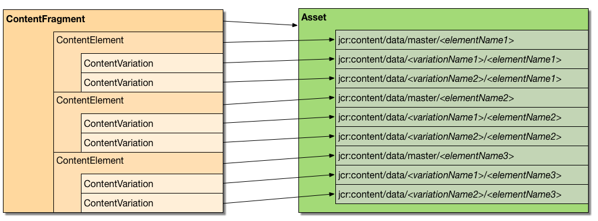

# Anpassa och utöka innehållsfragment{#customizing-and-extending-content-fragments}

I Adobe Experience Manager som molntjänst utökar ett innehållsfragment en standardresurs; se:

* [Skapa och hantera innehållsfragment](/help/assets/content-fragments/content-fragments.md) och [sidredigering med innehållsfragment](/help/sites-cloud/authoring/fundamentals/content-fragments.md) för mer information om innehållsfragment.

* [Hantera resurser](/help/assets/manage-digital-assets.md) och [anpassa och utöka resursredigeraren](/help/assets/extend-asset-editor.md) för mer information om standardresurser.

## Arkitektur {#architecture}

De grundläggande [beståndsdelarna](/help/assets/content-fragments/content-fragments.md#constituent-parts-of-a-content-fragment) i ett innehållsfragment är:

* Ett *innehållsfragment*,
* bestående av ett eller flera *innehållselement*,
* och som kan ha en eller flera *innehållsvariationer*.

Beroende på typen av fragment används även modeller eller mallen **Enkelt fragment** :

>[!CAUTION]
>
>[Modeller](/help/assets/content-fragments/content-fragments-models.md) för innehållsfragment rekommenderas nu för att skapa alla dina fragment.
>
>Modeller för innehållsfragment används för alla exempel i WKND.

* Modeller för innehållsfragment:

   * Används för att definiera innehållsfragment som innehåller strukturerat innehåll.
   * Modeller för innehållsfragment definierar strukturen för ett innehållsfragment när det skapas.
   * Ett fragment refererar till modellen. så ändringar i modellen kan/kommer att påverka beroende fragment.
   * Modeller är inbyggda i datatyper.
   * Funktioner för att lägga till nya varianter, osv., måste uppdatera fragmentet därefter.
   >[!NOTE]
   >
   >För att du ska kunna visa/återge ett innehållsfragment måste ditt konto ha läsbehörighet för modellen.

   >[!CAUTION]
   >
   >Alla ändringar i en befintlig innehållsfragmentmodell kan påverka beroende fragment. detta kan leda till egenskaper som är överblivna i dessa fragment.

* Mallar för innehållsfragment - **enkelt fragment**:

   * Används för att definiera enkla innehållsfragment.

   * Den här mallen definierar den (grundläggande, endast text) strukturen för ett innehållsfragment när det skapas.

   * Mallen kopieras till fragmentet när den skapas.

   * Funktioner för att lägga till nya varianter, osv., måste uppdatera fragmentet därefter.

   * Mallen för innehållsfragment (**enkelt fragment**) fungerar på ett annat sätt än andra mallfunktioner i AEM-ekosystemet (t.ex. sidmallar). Den bör därför beaktas separat.

   * När MIME-typen för innehållet baseras på mallen **Enkelt fragment** hanteras det faktiska innehållet. det innebär att varje element och variant kan ha olika MIME-typer.

### Integrering av webbplatser med resurser {#integration-of-sites-with-assets}

CFM (Content Fragment Management) ingår i AEM Assets som:

* Innehållsfragment är resurser.
* De använder befintliga Assets-funktioner.
* De är helt integrerade med Assets (Admin Consoles, etc.).

Innehållsfragment betraktas som en webbplatsfunktion som:

* De används när du redigerar sidorna.

#### Mappa strukturerade innehållsfragment till resurser {#mapping-structured-content-fragments-to-assets}



Innehållsfragment med strukturerat innehåll (dvs. baserat på en innehållsfragmentmodell) mappas till en enda resurs:

* Allt innehåll lagras under resursens `jcr:content/data` nod:

   * Elementdata lagras under huvudundernoden:
      `jcr:content/data/master`

   * Variationer lagras under en undernod som har variantens namn:
t.ex. `jcr:content/data/myvariation`

   * Data för varje element lagras i respektive undernod som en egenskap med elementnamnet:
Elementets innehåll `text` lagras som egenskap `text` på `jcr:content/data/master`

* Metadata och tillhörande innehåll lagras nedan `jcr:content/metadata`förutom rubriken och beskrivningen, som inte betraktas som traditionella metadata och lagras på `jcr:content`

#### Mappa enkla innehållsfragment till resurser {#mapping-simple-content-fragments-to-assets}


Enkla innehållsfragment (som baseras på mallen **Enkelt fragment** ) mappas till en sammansatt resurs som består av en huvudresurs och (valfritt) underresurser:

* All icke-innehållsinformation i ett fragment (som titel, beskrivning, metadata, struktur) hanteras exklusivt på huvudresursen.
* Innehållet i det första elementet i ett fragment mappas till den ursprungliga återgivningen av huvudresursen.

   * Variationerna (om det finns några) för det första elementet mappas till andra återgivningar av huvudresursen.

* Ytterligare element (om sådana finns) mappas till deltillgångar i huvudtillgången.

   * Huvudinnehållet i dessa ytterligare element mappas till den ursprungliga återgivningen av respektive underresurs.
   * Andra variationer (om tillämpligt) av eventuella ytterligare element överensstämmer med andra återgivningar av respektive deltillgång.

#### Resursplats {#asset-location}

Precis som med standardresurser finns ett innehållsavdrag under:

`/content/dam`

#### Tillgångsbehörigheter {#asset-permissions}

Mer information finns i [Innehållsfragment - Ta bort överväganden](/help/assets/content-fragments/content-fragments-delete.md).

#### Funktionsintegrering {#feature-integration}

Integrera med Assets Core:

* Funktionen Content Fragment Management (CFM) bygger på Assets core.

* CFM tillhandahåller egna implementeringar för objekt i vyerna kort/kolumn/lista. dessa plugin-program i befintliga resursåtergivningsimplementationer.

* Flera Assets-komponenter har utökats för att passa innehållsfragment.

### Använda innehållsfragment på sidor {#using-content-fragments-in-pages}

>[!CAUTION]
>
>Komponenten [Innehållsfragment är en del av kärnkomponenter](https://docs.adobe.com/content/help/en/experience-manager-core-components/using/components/content-fragment-component.html). Mer information finns i [Utveckla kärnkomponenter](https://docs.adobe.com/content/help/en/experience-manager-core-components/using/developing/developing.html) .

Innehållsfragment kan refereras från AEM-sidor, precis som andra resurstyper. AEM innehåller kärnkomponenten **[](https://docs.adobe.com/content/help/en/experience-manager-core-components/using/components/content-fragment-component.html)**Content Fragment - en[komponent som gör att du kan ta med innehållsfragment på sidorna](/help/sites-cloud/authoring/fundamentals/content-fragments.md#adding-a-content-fragment-to-your-page). Du kan också utöka den här kärnkomponenten för**[innehållsfragment](https://docs.adobe.com/content/help/en/experience-manager-core-components/using/developing/developing.html)** .

* Komponenten använder egenskapen `fragmentPath` för att referera till det faktiska innehållsfragmentet. Egenskapen hanteras på samma sätt som liknande egenskaper för andra tillgångstyper. `fragmentPath` till exempel när innehållsfragmentet flyttas till en annan plats.

* Med komponenten kan du välja varianten som ska visas.

* Dessutom kan ett antal stycken väljas för att begränsa utdata. Detta kan till exempel användas för utdata med flera kolumner.

* Komponenten tillåter mellanliggande innehåll:

   * Här kan du placera andra resurser (bilder, etc.) mellan styckena i det refererade fragmentet.

   * För det mellanliggande innehållet behöver du:

      * vara medvetna om risken för instabila referenser, mellanliggande innehåll (som läggs till när en sida redigeras) har ingen fast relation till det stycke som det placeras bredvid, och infogning av ett nytt stycke (i innehållsfragmentredigeraren) innan placeringen av det mellanliggande innehållet kan förlora den relativa positionen

      * överväga ytterligare parametrar (till exempel variant- och styckefilter) för att konfigurera vad som ska återges på sidan

>[!NOTE]
>
>**Content Fragment Model:**
>
>När du använder ett innehållsfragment som har baserats på en innehållsfragmentmodell på en sida, refereras modellen. Det innebär att om modellen inte har publicerats när du publicerar sidan, kommer den att flaggas och läggas till i resurserna som ska publiceras med sidan.
>
>**Mallar för innehållsfragment - enkelt fragment:**
>
>När du använder ett innehållsfragment som är baserat på mallen för innehållsfragment **Enkelt fragment** på en sida, finns det ingen referens eftersom mallen kopierades när fragmentet skapades.

### Integrering med andra ramar {#integration-with-other-frameworks}

Innehållsfragment kan integreras med:

* **Översättningar**

   Content Fragments är helt integrerat med arbetsflödet för AEM-översättning. Arkitekturnivå innebär följande:

   * De enskilda översättningarna av ett innehållsfragment är i själva verket separata fragment. till exempel:

      * De finns under olika språkrötter. men har exakt samma relativa sökväg under den relevanta språkroten:

         `/content/dam/<path>/en/<to>/<fragment>`

         jämfört med

         `/content/dam/<path>/de/<to>/<fragment>`
   * Förutom de regelbaserade sökvägarna finns det ingen ytterligare koppling mellan de olika språkversionerna av ett innehållsfragment. De hanteras som två separata fragment, även om användargränssnittet ger möjlighet att navigera mellan språkvarianterna.
   >[!NOTE]
   >
   >Arbetsflödet för AEM-översättning fungerar med `/content`:
   >
   >* När innehållsfragmentmodellerna finns i `/conf`inkluderas de inte i sådana översättningar. Du kan internationalisera gränssnittssträngarna.


* **Metadata-scheman**

   * Innehållsfragmenten (återanvänd) använder [metadatamodeller](/help/assets/metadata-schemas.md)som kan definieras med standardresurser.

   * CFM har ett eget specifikt schema:

      `/libs/dam/content/schemaeditors/forms/contentfragment`

      detta kan vid behov förlängas.

   * respektive schemaformulär är integrerat med fragmentredigeraren.

## API för hantering av innehållsfragment - serversidan {#the-content-fragment-management-api-server-side}

Du kan använda serversidans API för att komma åt dina innehållsfragment; se:

[com.adobe.cq.dam.cfm](https://docs.adobe.com/content/help/en/experience-manager-cloud-service/implementing/developing/ref/javadoc/com/adobe/cq/dam/cfm/package-frame.html)

>[!CAUTION]
>
>Vi rekommenderar att du använder serversidans API i stället för att komma åt innehållsstrukturen direkt.

### Nyckelgränssnitt {#key-interfaces}

Följande tre gränssnitt kan fungera som startpunkter:

* **Innehållsfragment** ([ContentFragment](https://docs.adobe.com/content/help/en/experience-manager-cloud-service/implementing/developing/ref/javadoc/com/adobe/cq/dam/cfm/ContentFragment.html))

   Med det här gränssnittet kan du arbeta med ett innehållsfragment på ett abstrakt sätt.

   Gränssnittet ger dig möjlighet att

   * Hantera grundläggande data (t.ex. get name;) get/set title/description)
   * Åtkomst till metadata
   * Åtkomstelement:

      * Listelement
      * Hämta element efter namn
      * Skapa nya element (se [Caveats](#caveats))

      * Åtkomst till elementdata (se `ContentElement`)
   * Listvarianter definierade för fragmentet
   * Skapa nya varianter globalt
   * Hantera associerat innehåll:

      * Listsamlingar
      * Lägg till samlingar
      * Ta bort samlingar
   * Åtkomst till fragmentets modell eller mall
   Gränssnitt som representerar de primära elementen i ett fragment är:

   * **Innehållselement** ([ContentElement](https://docs.adobe.com/content/help/en/experience-manager-cloud-service/implementing/developing/ref/javadoc/com/adobe/cq/dam/cfm/ContentElement.html))

      * Hämta grundläggande data (namn, titel, beskrivning)
      * Hämta/ange innehåll
      * Få åtkomst till varianter av ett element:

         * Listvarianter
         * Hämta varianter efter namn
         * Skapa nya varianter (se [Caveats](#caveats))
         * Ta bort variationer (se [Caveats](#caveats))
         * Åtkomst till variantdata (se `ContentVariation`)
      * Kortkommando för att matcha variationer (tillämpa ytterligare, implementeringsspecifik reservlogik om den angivna varianten inte är tillgänglig för ett element)
   * **Innehållsvariation** ([ContentVariation](https://docs.adobe.com/content/help/en/experience-manager-cloud-service/implementing/developing/ref/javadoc/com/adobe/cq/dam/cfm/ContentVariation.html))

      * Hämta grundläggande data (namn, titel, beskrivning)
      * Hämta/ange innehåll
      * Enkel synkronisering, baserat på den senast ändrade informationen
   Alla tre gränssnitten (, `ContentFragment`, `ContentElement`, `ContentVariation`) utökar `Versionable` gränssnittet, med nya versionshanteringsfunktioner som krävs för innehållsfragment:

   * Skapa en ny version av elementet
   * Lista versioner av elementet
   * Hämta innehållet i en specifik version av det versionshanterade elementet


### Adapting - Using customito() {#adapting-using-adaptto}

Följande kan anpassas:

* `ContentFragment` kan anpassas till

   * `Resource` - den underliggande Sling-resursen, Om du uppdaterar det underliggande `Resource` direkt måste du återskapa `ContentFragment` objektet.

   * `Asset` - DAM- `Asset` förkortningen som representerar innehållsfragmentet, för att uppdatera `Asset` direkt måste `ContentFragment` objektet återskapas.

* `ContentElement` kan anpassas till

   * `ElementTemplate` - för åtkomst till elementets strukturinformation.

* `Resource` kan anpassas till

   * `ContentFragment`

### Caveats {#caveats}

Det bör noteras att

* Hela API:t är utformat för att **inte** automatiskt behålla ändringar (om inget annat anges i API JavaDoc). Därför måste du alltid implementera resurslösaren för respektive begäran (eller den lösare som du använder).

* Uppgifter som kan kräva ytterligare arbete:

   * När du skapar/tar bort nya element uppdateras inte datastrukturen för enkla fragment (baserat på mallen **Enkelt fragment** ).

   * Skapa nya varianter från `ContentFragment` för att uppdatera datastrukturen.

   * Om du tar bort befintliga varianter uppdateras inte datastrukturen.

## API:t för hantering av innehållsfragment - klientsidan {#the-content-fragment-management-api-client-side}

>[!CAUTION]
>
>Klientsidans API är internt.

### Additional Information {#additional-information}

Se följande:

* `filter.xml`

   Hanteringen `filter.xml` av innehållsfragment är konfigurerad så att den inte överlappar det centrala resurspaketet.

## Redigera sessioner {#edit-sessions}

En redigeringssession startas när användaren öppnar ett innehållsfragment på någon av redigeringssidorna. Redigeringssessionen avslutas när användaren lämnar redigeraren genom att välja **Spara** eller **Avbryt**.

### Krav {#requirements}

Krav för att styra en redigeringssession är:

* Att redigera ett innehållsfragment, som kan sträcka sig över flera vyer (= HTML-sidor), bör vara atomiskt.

* Redigeringen bör också vara *transaktionsstyrd*. i slutet av redigeringssessionen måste ändringarna antingen verkställas (sparas) eller återställas (avbrytas).

* Kantlådor ska hanteras på rätt sätt. Detta kan exempelvis gälla när användaren lämnar sidan genom att ange en URL manuellt eller med global navigering.

* Det bör finnas en periodisk autosparfunktion (var x:e minut) för att förhindra dataförlust.

* Om ett innehållsfragment redigeras av två användare samtidigt bör de inte skriva över varandras ändringar.

<!--
#### Processes {#processes}

The processes involved are:

* Starting a session

  * A new version of the content fragment is created.

  * Auto save is started.

  * Cookies are set; these define the currently edited fragment and that there is an edit session open.

* Finishing a session

  * Auto save is stopped.

  * Upon commit:

    * The last modified information is updated.

    * Cookies are removed.

  * Upon rollback:

    * The version of the content fragment that was created when the edit session was started is restored.

    * Cookies are removed.

* Editing

  * All changes (auto save included) are done on the active content fragment - not in a separated, protected area.

  * Therefore, those changes are reflected immediately on AEM pages that reference the respective content fragment

#### Actions {#actions}

The possible actions are:

* Entering a page

  * Check if an editing session is already present; by checking the respective cookie.

    * If one exists, verify that the editing session was started for the content fragment that is currently being edited

      * If the current fragment, reestablish the session.

      * If not, try to cancel editing for the previously edited content fragment and remove cookies (no editing session present afterwards).

    * If no edit session exists, wait for the first change made by the user (see below).

  * Check if the content fragment is already referenced on a page and display appropriate information if so.

* Content change

  * Whenever the user changes content and there is no edit session present, a new edit session is created (see [Starting a session](#processes)).

-->

* Lämna en sida

   * Om det finns en redigeringssession och ändringarna inte har sparats, visas en modal bekräftelsedialogruta som meddelar användaren om potentiellt förlorat innehåll och låter dem stanna kvar på sidan.

## Exempel {#examples}

### Exempel: Åtkomst till ett befintligt innehållsfragment {#example-accessing-an-existing-content-fragment}

För att uppnå detta kan du anpassa resursen som representerar API:t till:

`com.adobe.cq.dam.cfm.ContentFragment`

Exempel:

```java
// first, get the resource
Resource fragmentResource = resourceResolver.getResource("/content/dam/fragments/my-fragment");
// then adapt it
if (fragmentResource != null) {
    ContentFragment fragment = fragmentResource.adaptTo(ContentFragment.class);
    // the resource is now accessible through the API
}
```

### Exempel: Skapa ett nytt innehållsfragment {#example-creating-a-new-content-fragment}

Om du vill skapa ett nytt innehållsfragment programmatiskt måste du använda ett`FragmentTemplate` anpassat från en modell- eller mallresurs.

Exempel:

```java
Resource templateOrModelRsc = resourceResolver.getResource("...");
FragmentTemplate tpl = templateOrModelRsc.adaptTo(FragmentTemplate.class);
ContentFragment newFragment = tpl.createFragment(parentRsc, "A fragment name", "A fragment description.");
```

### Exempel: Ange intervall för autosparande {#example-specifying-the-auto-save-interval}

Intervallet [för](/help/assets/content-fragments/content-fragments-managing.md#save-cancel-and-versions) automatiskt sparande (anges i sekunder) kan definieras med konfigurationshanteraren (ConfMgr):

* Nod: `<conf-root>/settings/dam/cfm/jcr:content`
* Egenskapsnamn: `autoSaveInterval`
* Typ: `Long`

* Standard: `600` (10 minuter); detta definieras på `/libs/settings/dam/cfm/jcr:content`

Om du vill ange ett intervall för automatiskt sparande på 5 minuter måste du definiera egenskapen på din nod; till exempel:

* Nod: `/conf/global/settings/dam/cfm/jcr:content`
* Egenskapsnamn: `autoSaveInterval`

* Typ: `Long`

* Värde: `300` (5 minuter motsvarar 300 sekunder)

## Komponenter för sidredigering {#components-for-page-authoring}

Mer information finns på

* [Kärnkomponenter - Innehållsfragmentkomponent](https://docs.adobe.com/content/help/en/experience-manager-core-components/using/components/content-fragment-component.html) (rekommenderas)
