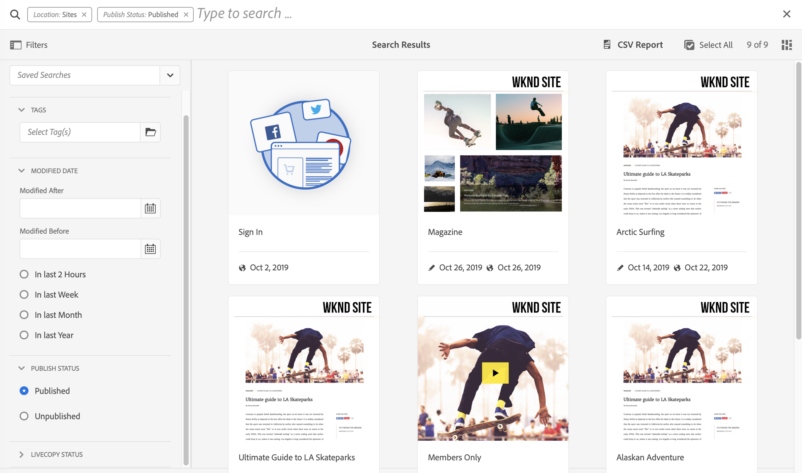
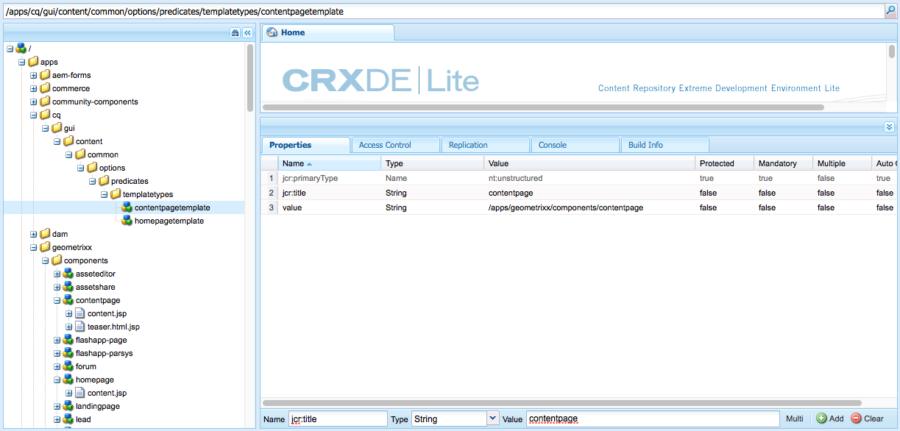

# Konfigurera Sök i Forms {#configuring-search-forms}

Adobe Experience Manager as a Cloud Service har en kraftfull [Sök](/help/sites-cloud/authoring/search.md) mekanism.

I kombination med detta finns det också en uppsättning fördefinierade alternativ som hjälper dig att filtrera innehållet. Dessa innehåller fördefinierade egenskaper som **Ändringsdatum**, **Publiceringsstatus**, eller **LiveCopy-status** så att du snabbt kan hitta de resurser du behöver.

Tillsammans hjälper vi er att snabbt och enkelt hitta ert innehåll:

* [Sök och filtrera](/help/sites-cloud/authoring/search.md#search-and-filter)
* [Järnvägsväljare](/help/sites-cloud/authoring/basic-handling.md#rail-selector)
* den [Resursläsaren](/help/sites-cloud/authoring/page-editor/editor-side-panel.md#assets-browser) (när sidor redigeras)

>[!NOTE]
>
>Du kan konfigurera underliggande [Innehållssökning och indexering](/help/operations/indexing.md) service.

Använda **Sök i Forms** kan du anpassa och utöka dessa paneler efter dina specifika behov.

The **Sök i Forms** gör att du kan välja [predikat](#predicates-and-their-settings) som du kan kombinera och definiera. The [dialogrutor för att konfigurera dessa formulär](#configuring-your-search-forms) kan nås via:

* **verktyg**
   * **Allmänt**
      * **Sök i Forms**

## Forms som standard {#default-forms}

När du först öppnar **Sök i Forms** konsolen ser du att alla konfigurationer har en hänglåssymbol. Detta anger att motsvarande konfiguration är standardkonfigurationen (ej ifylld) - och kan inte tas bort. När du har anpassat och sparat en konfiguration försvinner låset. Den kommer att visas igen när du [ta bort din anpassade konfiguration](#deleting-a-configuration-to-reinstate-the-default), i vilket fall standardinställningen (och hänglåsindikatorn) återställs.

Standardkonfigurationerna (i alfabetisk ordning) är:

* **Resursadministratörssökväg**
* **Sidredigeraren (dokumentsökning)**
* **Page Editor (Experience Fragments Search)**
* **Sidredigeraren (bildsökning)**
* **Page Editor (manuskriptsökning)**
* **Sidredigeraren (sidsökning)**
* **Page Editor (Styckesökning)**
* **Page Editor (produktsökning)**
* **Sidredigeraren (Scene7-sökning)**
* **Sidredigeraren (videosökning)**
* **Sökväg för projektadministratör**
* **Sökväg för projektöversättning**
* **Webbplatsadministratörens sökväg**
* **Snippets Admin Search Rail**
* **Stock Admin Search Rail**
* **Sökväg för innehållsfragmentsmodeller**
* **Sökväg för projektadministratör**
* **Sökväg för projektöversättning**

>[!NOTE]
>
>Mer information om resursrelaterade sökformulär finns i [Resurser - sökansikten](/help/assets/search-facets.md).

## Förutsägelser och deras inställningar {#predicates-and-their-settings}

### Predikat {#predicates}

Följande predikat är tillgängliga, beroende på konfigurationen:

<table>
 <tbody>
  <tr>
   <th>Förutse</th>
   <th>Syfte</th>
   <th>Inställningar</th>
  </tr>
  <tr>
   <td>Analyser</td>
   <td>Sök-/filterfunktioner i webbläsaren Sites när analysdata visas. Analyssökfilter läses in för att matcha mappade anpassade analyskolumner.</td>
   <td>
    <ul>
     <li>Fältetikett</li>
     <li>Beskrivning</li>
    </ul> </td>
  </tr>
  <tr>
   <td>Godkännandestatus</td>
   <td>Sök efter godkännandestatus.</td>
   <td>
    <ul>
     <li>Fältetikett</li>
     <li>Egenskapsnamn*</li>
     <li>Beskrivning</li>
    </ul> 
   </td>
  </tr>
  <tr>
   <td>Författare</td>
   <td>Sök efter författare.</td>
   <td>
    <ul>
     <li>Platshållare</li>
     <li>Egenskapsnamn*</li>
     <li>Beskrivning</li>
    </ul> 
   </td>
  </tr>
  <tr>
   <td>Utcheckad av</td>
   <td>Sök efter resurser som har checkats ut av en viss användare.</td>
   <td>
    <ul>
     <li>Fältetikett</li>
     <li>Platshållare</li>
     <li>Beskrivning</li>
    </ul> 
   </td>
  </tr>
  <tr>
   <td>Utcheckningsstatus</td>
   <td>Sök efter resurser med en viss utcheckningsstatus.</td>
   <td>
    <ul>
     <li>Fältetikett</li>
     <li>Egenskapsnamn*</li>
     <li>Beskrivning</li>
    </ul> 
   </td>
  </tr>
  <tr>
   <td>Komponenter</td>
   <td>Gör att en författare kan söka efter/filtrera sidor som har en viss komponent på sig. Exempel: ett bildgalleri.  </td>
   <td>
    <ul>
     <li>Platshållare</li>
     <li>Egenskapsnamn*</li>
     <li>Egenskapsdjup</li>
     <li>Beskrivning</li>
    </ul> </td>
  </tr>
  <tr>
   <td>Datumintervall</td>
   <td>Sök efter resurser som skapats inom ett angivet intervall efter en datumegenskap. På sökpanelen kan du ange start- och slutdatum.</td>
   <td>
    <ul>
     <li>Fältetikett</li>
     <li>Platshållare</li>
     <li>Egenskapsnamn*</li>
     <li>Intervalltext (från)*</li>
     <li>Intervall text (till)*</li>
     <li>Beskrivning</li>
    </ul> </td>
  </tr>
  <tr>
   <td>Förfallostatus</td>
   <td>Sök efter resurser baserat på förfallostatus.</td>
   <td>
    <ul>
     <li>Fältetikett</li>
     <li>Egenskapsnamn*</li>
     <li>Beskrivning</li>
    </ul> </td>
  </tr>
  <tr>
   <td>Filstorlek</td>
   <td>Filtrera resurser baserat på deras storlek.</td>
   <td>
    <ul>
     <li>Fältetikett</li>
     <li>Egenskapsnamn*</li>
     <li>Alternativbana</li>
     <li>Beskrivning</li>
    </ul> </td>
  </tr>
  <tr>
   <td>Filtyp</td>
   <td>Sök resurser baserat på fil-/mime-typen.</td>
   <td>
    <ul>
     <li>Fältetikett</li> 
     <li>Egenskapsnamn*</li>
     <li>MimeType-bana</li>
     <li>Beskrivning</li>
    </ul> 
   </td>
  </tr>
  <tr>
   <td>Fulltext</td>
   <td>Sök på predikatet efter fulltextsökningar. Den mappas med operatorn "jcr:contains".</td>
   <td>
    <ul>
     <li>Platshållare</li>
     <li>Egenskapsnamn</li>
     <li>Beskrivning</li>
    </ul> </td>
  </tr>
  <tr>
   <td>Grupp</td>
   <td>Sökpredikat för grupp (används endast inom Insights Predicate).</td>
   <td>
    <ul>
     <li>Fältetikett</li>
     <li>Beskrivning</li>
    </ul> </td>
  </tr>
  <tr>
   <td>Dolt filter</td>
   <td>Ett filter för egenskap och värde som inte är synligt för användaren.</td>
   <td>
    <ul>
     <li>Egenskapsnamn*</li>
     <li>Egenskapsvärde*</li>
     <li>Beskrivning</li>
    </ul> </td>
  </tr>
  <tr>
   <td>Insikter</td>
   <td>Sök efter ett urval Insights-parametrar.</td>
   <td>Det här är ett komplext predikat som består av flera predikat:
    <ul>
     <li>Grupp</li>
     <li>Intervall</li>
     <li>Alternativ</li>
    </ul> 
   </td>
  </tr>
  <tr>
   <td>Samlingsmedlem</td>
   <td>Sök efter resurser som är medlemmar i en samling</td>
   <td>
    <ul>
     <li>Beskrivning</li>
    </ul> 
   </td>
  </tr>
  <tr>
   <td>Flervärdesegenskap</td>
   <td>Sök efter flera värden för en angiven egenskap.</td>
   <td>
    <ul>
     <li>Fältetikett</li>
     <li>Platshållare</li>
     <li>Egenskapsnamn*</li>
     <li>Stöd för avgränsare</li>
     <li>Indataavgränsare</li>
     <li>Ignorera skiftläge</li>
     <li>Beskrivning</li>
    </ul> 
   </td>
  </tr>
  <tr>
   <td>Alternativ</td>
   <td>
Alternativen är innehållsnoder som skapas av användaren.
 
Se <a href="#addinganoptionspredicate">Lägga till en alternativpredikat</a> för mer information.
 </td>
   <td>
    <ul>
     <li>Fältetikett</li>
     <li>Egenskapsnamn*</li>
     <li>Enkel markering</li>
     <li>Lägg till alternativ</li>
     <li>Manuell</li>
     <li>Beskrivning</li>
    </ul> </td>
  </tr>
  <tr>
   <td>Alternativ, egenskap</td>
   <td>Sök efter en eller flera egenskaper för alternativet.</td>
   <td>
    <ul>
     <li>Fältetikett</li>
     <li>Egenskapsnamn*</li>
     <li>Alternativ nodsökväg</li>
     <li>Egenskapsdjup</li>
     <li>Enkel markering</li>
     <li>Beskrivning</li>
    </ul> </td>
  </tr>
  <tr>
   <td>Sidstatus</td>
   <td>Filtrera sidor efter status.</td>
   <td>
    <ul>
     <li>Fältetikett</li>
     <li>Namn på publiceringsegenskap*</li>
     <li>Egenskapsnamn för låsta sidor*</li>
     <li>Beskrivning</li>
    </ul> </td>
  </tr>
  <tr>
   <td>Bana</td>
   <td>Filtrera efter specifik sökväg. Du kan ange flera banor som alternativ.</td>
   <td>
    <ul>
     <li>Fältetikett</li>
     <li>Lägg till sökvägar</li>
     <li>Beskrivning</li>
    </ul> </td>
  </tr>
  <tr>
   <td>Sökvägsläsaren</td>
   <td>Ange en sökvägsläsare att söka i under en fördefinierad rotsökväg.</td>
   <td>
    <ul>
     <li>Platshållare</li>
     <li>Rotsökväg</li>
     <li>Beskrivning</li>
    </ul> 
   </td>
  </tr>
  <tr>
   <td>Dold bana</td>
   <td>Ett filter på sökvägen som inte är synligt för användaren.</td>
   <td>
    <ul>
     <li>Egenskapsnamn (`path`)</li>
     <li>Egenskapsvärde (`/content/dam`)</li>
    </ul> 
   </td>
  </tr>
  <tr>
   <td>Egenskap</td>
   <td>Sök på en angiven egenskap.</td>
   <td>
    <ul>
     <li>Fältetikett</li>
     <li>Platshållare</li>
     <li>Egenskapsnamn</li>
     <li>Delvis sökning</li>
     <li>Ignorera skiftläge</li>
     <li>Beskrivning</li>
    </ul> 
   </td>
  </tr>
  <tr>
   <td>Publiceringsstatus</td>
   <td>Filtrera resurser baserat på deras publiceringsstatus.</td>
   <td>
    <ul>
     <li>Fältetikett</li>
     <li>Egenskapsnamn*</li>
     <li>Beskrivning</li>
    </ul> </td>
  </tr>
  <tr>
   <td>Intervall</td>
   <td>Sök efter resurser som ligger inom ett angivet intervall. På sökpanelen kan du ange lägsta och högsta värden för intervallet.</td>
   <td>
    <ul>
     <li>Fältetikett</li>
     <li>Egenskapsnamn*</li>
     <li>Beskrivning</li>
    </ul> </td>
  </tr>
  <tr>
   <td>Klassificering</td>
   <td>Sök efter resurser utifrån deras genomsnittliga klassificering.  </td>
   <td>
    <ul>
     <li>Fältetikett</li>
     <li>Egenskapsnamn*</li>
     <li>Alternativbana</li>
     <li>Beskrivning</li>
    </ul> </td>
  </tr>
  <tr>
   <td>Relativt datum</td>
   <td>Filtrera resurser baserat på det relativa datumet då de skapades. Exempel: 1 vecka sedan, 1 månad sedan.</td>
   <td>
    <ul>
     <li>Fältetikett</li>
     <li>Egenskapsnamn*</li>
     <li>Relativt datum</li>
     <li>Beskrivning</li>
    </ul> </td>
  </tr>
  <tr>
   <td>Skjutreglageintervall</td>
   <td>Ett vanligt sökpredikat som utökar intervallpredikatet med skjutreglaget. Värdet för den egenskap som söks igenom måste vara mellan skjutreglagets gränser.</td>
   <td>
    <ul>
     <li>Fältetikett</li>
     <li>Egenskapsnamn*</li>
     <li>Alternativ nodsökväg</li>
     <li>Beskrivning</li>
    </ul> </td>
  </tr>
  <tr>
   <td>Status</td>
   <td>Sök efter status för godkännande och utcheckning.</td>
   <td>Det här är ett komplext predikat som består av flera predikat:
    <ul>
     <li>Godkännandestatus</li>
     <li>Utcheckningsstatus</li>
    </ul> 
   </td>
  </tr>
  <tr>
   <td>Taggar</td>
   <td>Sök baserat på taggar.</td>
   <td>
    <ul>
     <li>Fältlängd</li>
     <li>Platshållare</li>
     <li>Egenskapsnamn*</li>
     <li>Visa alternativet Matcha alla taggar</li>
     <li>Sökväg till rottaggar</li>
     <li>Beskrivning</li>
    </ul> </td>
  </tr>
  <tr>
   <td>Mallar</td>
   <td>Sök enligt den valda mallen.</td>
   <td>
    <ul>
     <li>Platshållare</li>
     <li>Egenskapsnamn*</li>
     <li>Beskrivning</li>
    </ul> 
   </td>
  </tr>
  <tr>
   <td>Översättningsstatus</td>
   <td>Sök efter översättningsstatus.</td>
   <td>
    <ul>
     <li>Fältetikett</li>
    </ul> 
   </td>
  </tr>
 </tbody>
</table>

<!--
  <tr>
   <td>Date ???</td>
   <td>Slider-based search of assets based on a date property.</td>
   <td>
    <ul>
     <li>Field Label</li>
     <li>Property Name*</li>
     <li>Description</li>
    </ul> </td>
  </tr>
  <tr>
   <td>Asset Last Modified ?????</td>
   <td>Date the asset was last modified.  </td>
   <td>A customized predicate, based on the Date Predicate.</td>
  </tr>
  <tr>
   <td>Range Options ???</td>
   <td>A specific search predicate for Assets and the same as common Slider Predicate. Is still available due to backward compatibilty issues.</td>
   <td>
    <ul>
     <li>Field Label</li>
     <li>Property Name*</li>
     <li>Option Path</li>
     <li>Description</li>
    </ul> </td>
  </tr>
  <tr>
   <td>Tag </td>
   <td>Search assets based on tags. You can configure the Path property to populate various tags in the Tags list.</td>
   <td>
    <ul>
     <li>Field Label</li>
     <li>Property Name*</li>
     <li>Option Path</li>
     <li>Description</li>
    </ul> </td>
  </tr>
-->

>[!NOTE]
>
>De vanliga sökpredikten definieras i:
>  `/libs/cq/gui/components/common/admin/customsearch/searchpredicates`
>
>Informationen är endast avsedd som referens och du får inte ändra `/libs`.

<!--
>* Search predicates related only to siteadmin (classic UI) are located under:
> `/libs/cq/gui/components/siteadmin/admin/searchpanel/searchpredicates`
>   * These are deprecated and only available for backward compatibility.
>
-->

### Predikatinställningar {#predicate-settings}

Beroende på predikatet finns ett urval av inställningar tillgängliga för konfiguration, bland annat:

* **Fältetikett**

  Den etikett som visas som ett komprimeringsbart huvud eller som fältetikett för predikatet.

* **Beskrivning**

  Beskrivande information för användaren.

* **Platshållare**

  Tom text eller platshållaren för predikatet om ingen filtreringstext anges.

* **Egenskapsnamn**

  Egenskapen som ska genomsökas. Den använder en relativ sökväg och jokertecknen `*/*/*` ange egenskapens djup i förhållande till `jcr:content` nod (varje asterisk representerar en nodnivå).

  Om du bara vill söka på en underordnad nod på första nivån för resursen som har `x` -egenskapen på `jcr:content` nod använder `*/jcr:content/x`

* **Egenskapsdjup**

  Det maximala djup som ska sökas efter den egenskapen i resurserna. En sökning på den egenskapen kan därför utföras på en resurs och rekursiva underordnade tills nivån på de underordnade är lika med det angivna djupet.

* **Egenskapsvärde**

  Egenskapsvärdet som en absolut sträng eller som ett uttrycksspråk, till exempel `cq:Page` eller

  `${empty requestPathInfo.suffix ? "/content" : requestPathInfo.suffix}`.

* **Intervalltext**

  Etiketten för intervallfältet i **Datumintervall** förutsäga.

* **Alternativbana**

  Användaren kan markera sökvägen med hjälp av Bandläsaren på fliken för predikatinställningar. När du har valt **+** -ikonen används för att lägga till markeringen i listan över giltiga alternativ (sedan **-** -ikonen som ska tas bort om det behövs).

  Alternativen är innehållsnoder som skapas av användaren och som har följande struktur:

  `(jcr:primaryType = nt:unstructured, value (String), jcr:title (String))`

* **Alternativ nodsökväg**
I praktiken samma som **Sökväg till alternativ**, det är bara det här som finns i det vanliga predikatfältet, det andra är specifikt för resurser.

* **Enkel markering**
Om det här alternativet är markerat återges alternativen som kryssrutor som bara tillåter ett urval. Om du av misstag markerar kryssrutan kan den avmarkeras.

* **Egenskapsnamn för Publicera och Live-kopia**
Etiketterna för publicerings- och Live copy-kryssrutorna för platsspecifika predikat.

* Det &amp;sista; på fältetiketterna i **Inställningar** -fliken betyder att fälten är obligatoriska och om de lämnas tomma visas ett felmeddelande.

## Konfigurera din sökning i Forms {#configuring-your-search-forms}

### Skapa/öppna en anpassad konfiguration {#creating-opening-a-customized-configuration}

1. Navigera till **verktyg**, **Allmänt**, **Sök i Forms**.

1. Välj den konfiguration som du vill anpassa.
1. Använd **Redigera** -ikonen för att öppna konfigurationen för uppdatering.
1. Om du gör en ny anpassning vill du antagligen [lägga till nya predikatfält och definiera inställningarna](#add-edit-a-predicate-field-and-define-field-settings) efter behov. Om en befintlig anpassning finns kan du välja ett befintligt fält och [uppdatera inställningarna](#add-edit-a-predicate-field-and-define-field-settings).
1. Välj **Klar** för att spara konfigurationen. Ändringarna visas nästa gång konfigurationen används.

   >[!NOTE]
   >
   >De anpassade konfigurationerna lagras (om det är lämpligt) under:
   >
   >* `/apps/cq/gui/content/facets/<option>`
   >* `/apps/commerce/gui/content/facets/<option>`

### Lägg till/redigera ett prediktionsfält och definiera fältinställningar {#add-edit-a-predicate-field-and-define-field-settings}

Du kan lägga till eller redigera fält och definiera/uppdatera deras inställningar:

1. [Öppna den anpassade konfigurationen](#creating-opening-a-customized-configuration) för uppdatering.
1. Om du vill lägga till ett nytt fält öppnar du **Välj predikat** och dra predikatet till önskad plats. Till exempel **Prediktion för datumintervall**:

   

1. Beroende på om:

   * Du lägger till ett nytt fält:

     När du har lagt till predikatet **Inställningar** öppnas och visar de egenskaper som kan definieras.

   * Du vill uppdatera ett befintligt predikat:

     Markera predikatfältet (till höger) och öppna sedan **Inställningar** -fliken.

   Till exempel inställningarna för **Prediktion för datumintervall**:

   

1. Gör dina ändringar efter behov och bekräfta med **Klar**. Ändringarna visas nästa gång konfigurationen används.

### Förhandsgranska sökkonfigurationen {#previewing-the-search-configuration}

1. Välj ikonen Förhandsgranska:

   

1. Visar sökformulären så som de visas (helt utökade) i kolumnen Sök i lämplig konsol.

   

1. **Stäng** förhandsgranskningen för att returnera och slutföra konfigurationen.

### Ta bort ett predikatfält {#deleting-a-predicate-field}

1. [Öppna den anpassade konfigurationen](#creating-opening-a-customized-configuration) för uppdatering.
1. Markera predikatfältet (till höger), öppna **Inställningar** och sedan väljer **Ta bort** ikon (längst ned till vänster).

   

1. En dialogruta begär att du bekräftar borttagningsåtgärden.

1. Bekräfta detta och andra ändringar med **Klar**.

### Ta bort en konfiguration (för att återställa standardkonfigurationen) {#deleting-a-configuration-to-reinstate-the-default}

När du har anpassat en konfiguration åsidosätter detta standardinställningarna. Du kan återställa standardkonfigurationen genom att ta bort den anpassade konfigurationen.

>[!NOTE]
>
>Du kan inte ta bort standardkonfigurationerna.

En anpassad konfiguration tas bort från konsolen:

1. Välj önskad konfiguration (till exempel **Page Editor (Styckesökning)**) och sedan **Ta bort** ikon i verktygsfältet:

   

1. Den anpassade konfigurationen tas bort och standardinställningen återställs (detta indikeras av att hänglåssymbolen visas igen i konsolen).

### Förutsägelser för tillägg av alternativ {#adding-options-predicates}

Alternativpredikat (Alternativ, Alternativ-egenskap) gör att du kan konfigurera ett objekt som du vill söka efter. De används vanligtvis för att söka efter något direkt under sidan, till exempel en egenskap på sidnoden.

I följande exempel (som används för att söka efter mallen som används för att skapa en sida) visas stegen som ingår:

1. Skapa noden som definierar den egenskap som du vill söka efter.

   Du behöver en rotnod som innehåller definitioner av de enskilda alternativen för att vara tillgängliga för användaren.

   Noderna för de enskilda alternativen behöver egenskaperna:

   * `jcr:title` - den fältetikett som ska visas i sökfältet
   * `value` - egenskapsvärdet som ska genomsökas

   

   >[!NOTE]
   >
   >Du ***måste*** ändrar ingenting i dialogrutan `/libs` bana.
   >
   >Detta beror på innehållet i `/libs` skrivs över nästa gång du uppgraderar din instans (och kan mycket väl skrivas över när du installerar en snabbkorrigering eller ett funktionspaket).
   >
   >Den rekommenderade metoden för konfiguration och andra ändringar är:
   >
   >1. Återskapa önskat objekt som det finns i `/libs`, under `/apps`. I det här fallet från:
   >1. `/libs/cq/gui/content/common/options/predicates`
   >1. Gör ändringar i `/apps.`

1. Öppna **Sök i Forms** och välj den konfiguration som du vill uppdatera. Till exempel: **Webbplatsadministratörens sökväg**. Välj sedan **Redigera**.

1. Beroende på konfigurationen lägger du till en **Alternativ** eller **Alternativ, egenskap** till konfigurationen.
1. Uppdatera fälten, särskilt:

   * **Egenskapsnamn**

     Specificera den nodegenskap som du vill söka efter på målnoderna. Till exempel:

     `jcr:content/cq:template`

   * **Alternativ nodsökväg**

     Välj den sökväg där du vill ha dina alternativ. Till exempel:

     `/apps/cq/gui/content/common/options/predicates/templatetype`

   

1. Välj **Klar** för att spara konfigurationen.
1. Navigera till rätt konsol (i det här exemplet **Webbplatser**) och öppna **Sök - filter** järnväg. De nya sökformulären, tillsammans med de olika alternativen, visas. Välj önskat alternativ för att visa sökresultaten.

   

## Användarbehörigheter {#user-permissions}

I följande tabell visas de behörigheter som krävs för att utföra redigerings-, borttagnings- och förhandsgranskningsåtgärder i sökformulär.

<table>
 <thead>
  <tr>
   <td><strong>Åtgärd</strong></td>
   <td><strong>Behörigheter</strong></td>
  </tr>
 </thead>
 <tbody>
  <tr>
   <td>Redigera </td>
   <td>Läsa, skriva behörigheter på <code>/apps </code>nod.</td>
  </tr>
  <tr>
   <td>Ta bort</td>
   <td>Läsa, skriva, ta bort behörigheter för <code>/apps</code> nod</td>
  </tr>
  <tr>
   <td>Förhandsgranska</td>
   <td>Läsa, skriva, ta bort behörigheter för <code>/var/dam/content</code> nod.  Läsa, skriva behörigheter på <code>/apps</code> nod.</td>
  </tr>
 </tbody>
</table>
