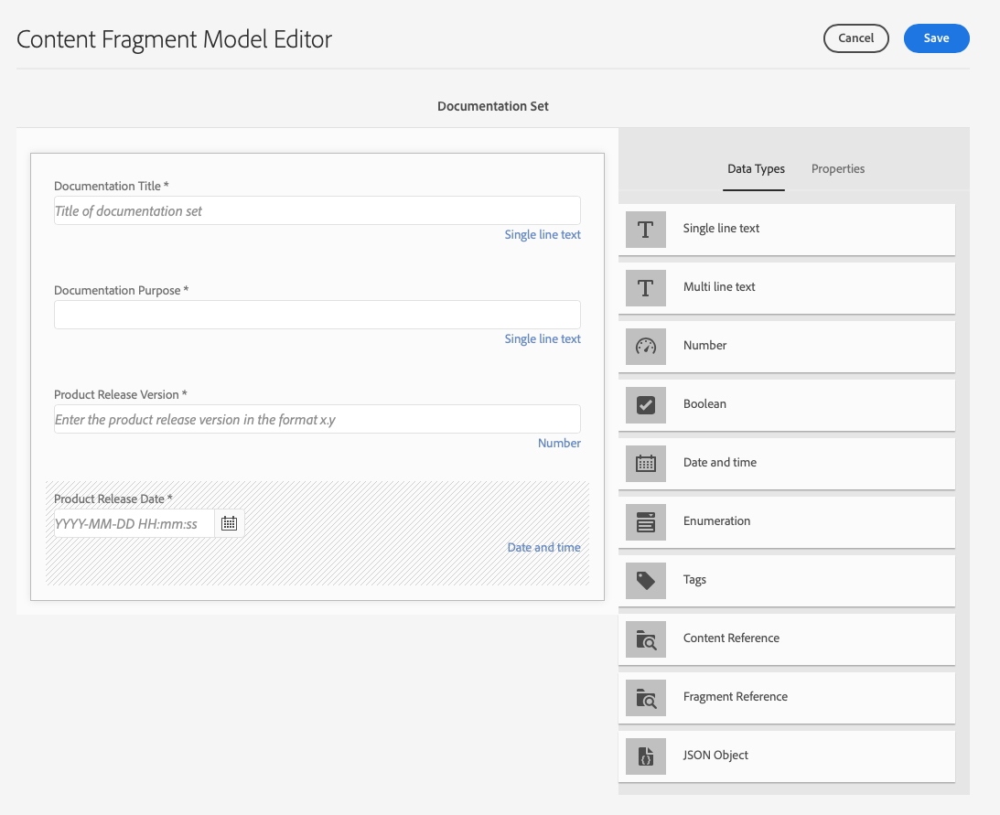
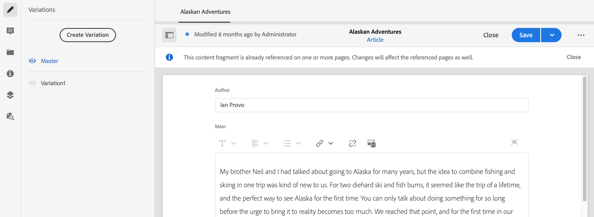

# Så här kommer du åt ditt innehåll via AEM Delivery API:er {#access-your-content}

>[!CAUTION]
>
>ARBETE PÅGÅR - Dokumentet skapas för närvarande och ska inte tolkas som fullständigt eller slutgiltigt och inte heller användas i tillverkningssyfte.

I den här delen av [AEM Headless Developer Journey](overview.md) kan du lära dig hur du använder GraphQL-frågor för att komma åt innehållet i dina innehållsfragment och skicka det till din app (headless delivery).

## Berättelsen hittills {#story-so-far}

I det föregående dokumentet från den AEM resan, [How to Model Your Content](model-your-content.md), lärde du dig grunderna i innehållsmodellering i AEM, så du bör nu förstå hur du modellerar innehållsstrukturen och sedan inse att strukturen med AEM Content Fragment Models och Content Fragments:

* Identifiera koncept och terminologi i samband med innehållsmodellering.
* Förstå varför innehållsmodellering behövs för leverans av Headless-innehåll.
* Förstå hur ni kan förverkliga den här strukturen med AEM Content Fragment Models (och skapa innehåll med Content Fragments).
* Förstå hur ni modellerar ert innehåll. principer med grundläggande urval.

Den här artikeln bygger på dessa grundläggande funktioner så att du förstår hur du får tillgång till ditt befintliga headless-innehåll i AEM med hjälp av AEM GraphQL API.

* **Målgrupp**: Nybörjare
* **Mål**: Lär dig hur du kommer åt innehållet i dina innehållsfragment med AEM GraphQL-frågor:
   * Introducera GraphQL och AEM GraphQL API.
   * Ta en titt på detaljerna i AEM GraphQL API.
   * Titta på några exempelfrågor för att se hur saker och ting fungerar i praktiken.

## Så du vill komma åt ditt innehåll? {#so-youd-like-to-access-your-content}

Så..har du allt det här innehållet, har en struktur (i innehållsfragment) och väntar bara på att mata in din nya app. Frågan är hur man får dit den?

Vad du behöver är ett sätt att rikta specifikt innehåll, välja vad du behöver och returnera det till appen för vidare bearbetning.

Med Adobe Experience Manager (AEM) som Cloud Service kan du selektivt komma åt dina innehållsfragment med hjälp av det AEM GraphQL-API:t och returnera endast det innehåll du behöver. Det innebär att du kan leverera strukturerat innehåll utan extra kostnad och använda det i dina program.

>[!NOTE]
>
>AEM GraphQL API är en anpassad implementering som baseras på standard-API-specifikationen GraphQL.

## GraphQL - en introduktion {#graphql-introduction}

GraphQL är en öppen källkodsspecifikation som ger:

* ett frågespråk där du kan välja specifikt innehåll från strukturerade objekt.
* en körningsmiljö där du kan utföra dessa frågor med ditt strukturerade innehåll.

GraphQL är ett *starkt*-typat API. Det innebär att *allt*-innehåll måste vara tydligt strukturerat och organiserat efter typ, så att GraphQL *förstår* vad som ska användas och hur. Datafälten definieras i GraphQL-scheman, som definierar strukturen för innehållsobjekten.

GraphQL-slutpunkterna tillhandahåller sedan de sökvägar som svarar på GraphQL-frågor.

Allt detta innebär att appen kan välja innehåll som den behöver på ett korrekt, tillförlitligt och effektivt sätt - precis vad du behöver när du använder AEM.

>[!NOTE]
>
>Se *GraphQL*.org och *GraphQL*.com.

## AEM och GraphQL {#aem-graphql}

GraphQL används på olika platser i AEM. till exempel:

* Innehållsfragment
   * Ett anpassat API har utvecklats för det här användningsfallet (Headless Delivery to your app).
      * Det här är AEM GraphQL API.
* Handel
   * AEM använder data från en handelsplattform via GraphQL.
   * Det finns GraphQL-integreringar mellan AEM och olika e-handelslösningar från tredje part, som används med de utbyggnadskopplingar som tillhandahålls av CIF Core Components.
      * Detta använder inte AEM GraphQL API.

>[!NOTE]
>
>Det här steget i Headless Journey gäller endast AEM GraphQL API och innehållsfragment.

## AEM GraphQL API {#aem-graphql-api}

AEM GraphQL API är en anpassad version som baseras på standard-specifikationen GraphQL API, som är särskilt konfigurerad för att du ska kunna utföra (komplexa) frågor på dina innehållsfragment.

Innehållsfragment används eftersom innehållet är strukturerat enligt modeller för innehållsfragment. Detta uppfyller ett grundläggande krav i GraphQL.

* En innehållsfragmentmodell består av ett eller flera fält.
   * Varje fält definieras enligt en datatyp.
* Content Fragment Models används för att generera motsvarande AEM GraphQL-scheman.

För att komma åt GraphQL för AEM (och innehållet) används en slutpunkt för att ange åtkomstsökvägen.

Innehållet som returneras via AEM GraphQL API kan sedan användas av dina program.

>[!NOTE]
>
>Implementeringen AEM GraphQL API baseras på GraphQL Java-biblioteken.

### Användningsexempel för redigerings- och publiceringsmiljöer {#use-cases-author-publish-environments}

Användningsexemplen för AEM GraphQL API kan vara beroende av vilken typ av AEM som en Cloud Service:

* Publiceringsmiljö. används för att:
   * Frågeinnehåll för JS-program (standardfall)

* Författarmiljö; används för att:
   * Fråga efter innehåll för&quot;innehållshanteringssyften&quot;:
      * GraphQL i AEM som en Cloud Service är för närvarande ett skrivskyddat API.
      * REST API kan användas för CR(u)D-åtgärder.

## Innehållsfragment för användning med AEM GraphQL API {#content-fragments-use-with-aem-graphql-api}

Innehållsfragment kan användas som bas för GraphQL för AEM scheman och frågor som:

* Med dem kan du utforma, skapa, strukturera och publicera sidoberoende innehåll.
* De baseras på en Content Fragment Model, som fördefinierar strukturen för det resulterande fragmentet med hjälp av definierade datatyper.
* Ytterligare strukturlager kan uppnås med datatypen Fragmentreferens, som är tillgänglig när du definierar en modell.

### Modeller för innehållsfragment {#content-fragments-models}

Dessa modeller för innehållsfragment:

* Används för att generera scheman en gång **Aktiverat**.

* Ange de datatyper och fält som krävs för GraphQL. De ser till att programmet bara begär det som är möjligt och får det som förväntas.

* Datatypen **Fragmentreferenser** kan användas i din modell för att referera till ett annat innehållsfragment, vilket innebär att ytterligare strukturnivåer införs.

### Fragmentreferenser {#fragment-references}

**Fragmentreferens**:

* Är en specifik datatyp tillgänglig när du definierar en innehållsfragmentmodell.

* Refererar till ett annat fragment, beroende på en viss innehållsfragmentmodell.

* Gör att du kan skapa och sedan hämta strukturerade data.

   * När det definieras som en **multifeed** kan flera delfragment refereras (hämtas) av det primära fragmentet.

### JSON Preview {#json-preview}

Om du vill ha hjälp med att utforma och utveckla dina modeller för innehållsfragment kan du förhandsgranska JSON-utdata i redigeraren för innehållsfragment.

### Skapa modeller för innehållsfragment och innehållsfragment {#creating-content-fragment-models-and-content-fragments}

Först aktiveras Content Fragment Models för din plats. Detta görs i Configuration Browser:


Därefter kan modellerna för innehållsfragment modelleras:



När du har valt lämplig modell öppnas ett innehållsfragment för redigering i redigeraren för innehållsfragment:



>[!NOTE]
>
>Se Arbeta med innehållsfragment.

## Generering av GraphQL-schema från innehållsfragment {#graphql-schema-generation-content-fragments}

GraphQL är ett starkt typbestämt API, vilket innebär att innehållet måste vara tydligt strukturerat och strukturerat efter typ. GraphQL-specifikationen innehåller en serie riktlinjer för hur du skapar ett robust API för att förhöra innehåll i en viss instans. För att göra detta måste klienten hämta schemat, som innehåller alla typer som krävs för en fråga.

För innehållsfragment baseras GraphQL-scheman (struktur och typer) på **Enabled** Content Fragment Models och deras datatyper.

>[!CAUTION]
>
>Alla GraphQL-scheman (härledda från modeller för innehållsfragment som har **aktiverats**) kan läsas via GraphQL-slutpunkten.
>
>Det innebär att du måste se till att inget känsligt innehåll är tillgängligt för att se till att inga känsliga data exponeras via GraphQL-slutpunkter. Detta inkluderar till exempel information som kan finnas som fältnamn i modelldefinitionen.

Om en användare till exempel har skapat en innehållsfragmentmodell med namnet `Article`, genererar AEM objektet `article` som är av typen `ArticleModel`. Fälten i den här typen motsvarar fälten och datatyperna som definieras i modellen.

1. En innehållsfragmentmodell:

   

1. Motsvarande GraphQL-schema (utdata från automatisk GraphiQL-dokumentation):
   

   Detta visar att den genererade typen `ArticleModel` innehåller flera [fält](#fields).

   * Tre av dem har kontrollerats av användaren: `author`, `main` och `referencearticle`.

   * De andra fälten lades till automatiskt av AEM och representerar användbara metoder för att tillhandahålla information om ett visst innehållsfragment. i det här exemplet är `_path`, `_metadata`, `_variations`. Dessa [hjälpfält](#helper-fields) är markerade med en föregående `_` för att skilja mellan vad som har definierats av användaren och vad som har genererats automatiskt.

1. När en användare har skapat ett innehållsfragment baserat på artikelmodellen kan det sedan förfrågas via GraphQL. Se till exempel exempelfrågor.md#graphql-sample-queries (baserat på en innehållsfragmentstruktur som du kan använda med GraphQL.

Schemat är flexibelt i GraphQL för AEM. Det innebär att den genereras automatiskt varje gång en innehållsfragmentmodell skapas, uppdateras eller tas bort. Cacheminnen för dataschemat uppdateras också när du uppdaterar en innehållsfragmentmodell.

Tjänsten Sites GraphQL lyssnar (i bakgrunden) efter ändringar som gjorts i en innehållsfragmentmodell. När uppdateringar upptäcks återskapas endast den delen av schemat. Denna optimering sparar tid och ger stabilitet.

Om du till exempel:

1. Installera ett paket som innehåller `Content-Fragment-Model-1` och `Content-Fragment-Model-2`:

   1. GraphQL-typer för `Model-1` och `Model-2` genereras.

1. Ändra sedan `Content-Fragment-Model-2`:

   1. Endast GraphQL-typen `Model-2` uppdateras.

   1. `Model-1` kommer att vara detsamma.

>[!NOTE]
>
>Detta är viktigt att observera om du vill göra satsvisa uppdateringar på modeller för innehållsfragment via REST-API:t, eller på annat sätt.

Schemat hanteras via samma slutpunkt som GraphQL-frågorna, med klienten som hanterar det faktum att schemat anropas med tillägget `GQLschema`. Om du till exempel utför en enkel `GET`-begäran på `/content/cq:graphql/global/endpoint.GQLschema` resulterar det i utdata från schemat med innehållstypen: `text/x-graphql-schema;charset=iso-8859-1`.

### Schemagenerering - opublicerade modeller {#schema-generation-unpublished-models}

När innehållsfragment är kapslade kan det hända att en överordnad Content Fragment Model publiceras, men ingen refererad modell gör det.

>[!NOTE]
>
>Gränssnittet AEM förhindrar detta, men om publiceringen görs programmatiskt eller med innehållspaket kan det ske.

När detta inträffar genererar AEM ett *ofullständigt*-schema för den överordnade modellen för innehållsfragment. Det innebär att fragmentreferensen, som är beroende av den opublicerade modellen, tas bort från schemat.

## AEM GraphQL-slutpunkter {#aem-graphql-endpoints}

<!--
need details/examples
-->

En slutpunkt är den bana som används för att komma åt GraphQL för AEM. Med den här sökvägen kan du (eller din app):

* tillgång till GraphQL-scheman,
* skicka GraphQL-frågor,
* ta emot svar (på GraphQL-frågor).

AEM tillåter:

* En global slutpunkt - tillgänglig för användning på alla webbplatser.
* Klientslutpunkter - som du kan konfigurera, specifika för en angiven plats/ett visst projekt.

## Behörigheter {#permissions}

Behörigheterna är de som krävs för åtkomst av resurser.

## AEM GraphiQL-gränssnitt {#aem-graphiql-interface}

En implementering av standardgränssnittet GraphiQL är tillgänglig för användning med GraphQL för att hjälpa dig att direkt mata in och testa frågor. Detta kan installeras med AEM.

Den innehåller funktioner som syntaxmarkering, automatisk komplettering, automatisk föreslå, samt historik och onlinedokumentation.


## Använda faktiskt AEM GraphQL API {#actually-using-aem-graphiql}

Om du vill använda det AEM GraphQL-API:t i en fråga kan vi använda de två mycket grundläggande modellstrukturerna för innehållsfragment:

* Företag
   * Namn
   * VD (person)
   * Anställda (personer)
* Person
   * Namn
   * Förnamn

Som du ser refererar fälten CEO och Employees till Personfragmenten.

Fragmentmodellerna används:

* när du skapar innehåll i Content Fragment Editor
* för att generera de GraphQL-scheman som du ska fråga efter

Frågorna kan anges i GraphiQL-gränssnittet, till exempel på:

* `http://localhost:4502/content/graphiql.html `

En enkel fråga är att returnera namnet på alla poster i företagsschemat. Här begär du en lista med alla företagsnamn:

```xml
query {
  companyList {
    items {
      name
    }
  }
}
```

En något mer komplex fråga är att markera alla personer som inte har namnet&quot;Jobs&quot;. Detta filtrerar alla personer för alla som inte har namnet Jobs. Detta uppnås med operatorn EQUALS_NOT (det finns många fler):

```xml
query {
  personList(filter: {
    name: {
      _expressions: [
        {
          value: "Jobs"
          _operator: EQUALS_NOT
        }
      ]
    }
  }) {
    items {
      name
      firstName
    }
  }
}
```

Du kan också skapa mer komplexa frågor. Du kan till exempel söka efter alla företag som har minst en anställd med namnet &quot;Smith&quot;. Den här frågan visar filtrering för alla personer med namnet &quot;Smith&quot;, vilket returnerar information från de kapslade fragmenten:

```xml
query {
  companyList(filter: {
    employees: {
      _match: {
        name: {
          _expressions: [
            {
              value: "Smith"
            }
          ]
        }
      }
    }
  }) {
    items {
      name
      ceo {
        name
        firstName
      }
      employees {
        name
        firstName
      }
    }
  }
}
```

<!-- need code / curl / cli examples-->

Mer information om hur du använder API:t för AEM GraphQL tillsammans med de nödvändiga elementen finns i följande exempel:

* Lär dig använda GraphQL med AEM
* Strukturen för exempelinnehållsfragment
* Att lära sig använda GraphQL med AEM - exempelinnehåll och frågor

## What&#39;s Next {#whats-next}

Nu när du har lärt dig att komma åt och fråga efter rubriklöst innehåll med AEM GraphQL API kan du nu [lära dig hur du använder REST API för att komma åt och uppdatera innehållet i dina innehållsfragment](/help/implementing/developing/headless-journey/update-your-content.md).

## Ytterligare resurser {#additional-resources}

* [GraphQL.org](https://graphql.org)
   * [Scheman](https://graphql.org/learn/schema/)
   * [Variabler](https://graphql.org/learn/queries/#variables)
   * [GraphQL Java-bibliotek](https://graphql.org/code/#java)
* [GraphiQL](https://graphql.org/learn/serving-over-http/#graphiql)
* [Lär dig använda GraphQL med AEM](/help/assets/content-fragments/graphql-api-content-fragments.md)
* [Strukturen för exempelinnehållsfragment](/help/assets/content-fragments/content-fragments-graphql-samples.md#content-fragment-structure-graphql)
* [Att lära sig använda GraphQL med AEM - exempelinnehåll och frågor](/help/assets/content-fragments/content-fragments-graphql-samples.md)
   * [Exempelfråga - Ett enskilt specifikt stadsfragment](/help/assets/content-fragments/content-fragments-graphql-samples.md#sample-single-specific-city-fragment)
   * [Exempelfråga för metadata - Ange metadata för utmärkelserna med namnet GB](/help/assets/content-fragments/content-fragments-graphql-samples.md#sample-metadata-awards-gb)
   * [Exempelfråga - Alla städer med en namngiven variant](/help/assets/content-fragments/content-fragments-graphql-samples.md#sample-cities-named-variation)
* [Aktivera funktionen för innehållsfragment i konfigurationsläsaren](/help/assets/content-fragments/content-fragments-configuration-browser.md#enable-content-fragment-functionality-in-configuration-browser)
* [Arbeta med innehållsfragment](/help/assets/content-fragments/content-fragments.md)
   * [Modeller för innehållsfragment](/help/assets/content-fragments/content-fragments-models.md)
   * [JSON-utdata](/help/assets/content-fragments/content-fragments-json-preview.md)
* [CORS (Cross-Origin Resource Sharing)](https://experienceleague.adobe.com/docs/experience-manager-learn/foundation/security/understand-cross-origin-resource-sharing.html?lang=en#understand-cross-origin-resource-sharing-(cors))
* [Genererar åtkomsttoken för API:er på serversidan](/help/implementing/developing/introduction/generating-access-tokens-for-server-side-apis.md)
* [Getting Started with AEM Headless](https://experienceleague.adobe.com/docs/experience-manager-learn/getting-started-with-aem-headless/graphql/overview.html) - En kort videosjälvstudiekurs med en översikt över hur du använder AEM headless-funktioner, inklusive innehållsmodellering och GraphQL.
