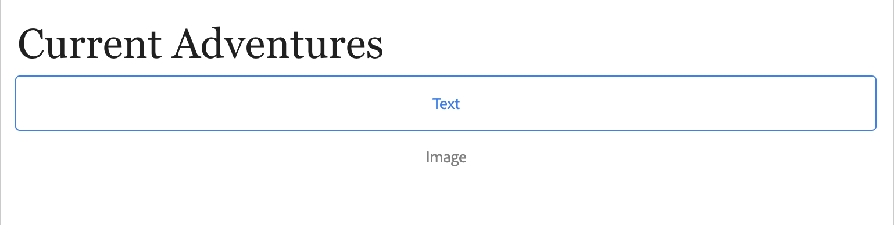
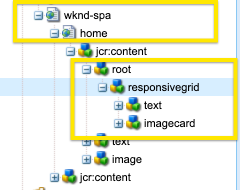

# Sammansatta komponenter i SPA {#composite-components-in-spas}

Komponenter som består av sammansatta komponenter är modulära AEM genom att kombinera flera baskomponenter till en enda komponent. Ett vanligt användningsfall för sammansatta komponenter är kortkomponenten som består av en kombination av bild- och textkomponenterna.

När sammansatta komponenter implementeras på rätt sätt i redigeringsramverket för AEM Single Page Application (SPA) kan innehållsförfattarna dra och släppa sådana komponenter som vilken annan komponent som helst, men ändå kunna redigera varje komponent som utgör den sammansatta komponenten separat.

I den här artikeln visas hur du kan lägga till en sammansatt komponent i ett enkelsidigt program för att fungera sömlöst med AEM SPA.

## Användningsfall {#use-case}

I den här artikeln används den vanliga kortkomponenten som exempel på hur den används. Kort är ett vanligt gränssnittselement för många digitala upplevelser och består vanligtvis av en bild och tillhörande text eller bildtext. En författare vill kunna dra och släppa hela kortet, men kan redigera kortets bild individuellt och anpassa den tillhörande texten.

## Förutsättningar {#prerequisites}

Följande modeller för stöd av användning av sammansatta komponenter kräver följande krav.

* Din AEM-utvecklingsinstans körs lokalt på port 4502 med ett exempelprojekt.
* Du har en fungerande extern React-app [som kan redigeras i AEM.](editing-external-spa.md)
* Appen React läses in i AEM [med komponenten RemotePage.](remote-page.md)

## Lägga till sammansatta komponenter i en SPA {#adding-composite-components}

Det finns tre olika modeller för implementering av den sammansatta komponenten beroende på SPA implementering i AEM.

* [Komponenten finns inte i ditt AEM.](#component-does-not-exist)
* [Komponenten finns i ditt AEM men det obligatoriska innehållet gör det inte.](#content-does-not-exist)
* [Komponenten och dess obligatoriska innehåll finns båda i AEM.](#both-exist)

I följande avsnitt ges exempel på hur du implementerar varje fall med kortkomponenten som exempel.

### Komponenten finns inte i ditt AEM. {#component-does-not-exist}

Börja med att skapa de komponenter som ska utgöra den sammansatta komponenten, det vill säga komponenterna för bilden och dess text.

1. Skapa textkomponenten i AEM.
1. Lägg till motsvarande `resourceType` från projektet i komponentens `editConfig` nod.

   ```text
    resourceType: 'wknd-spa/components/text' 
   ```

1. Använd `withMappable` hjälp för att aktivera redigering för komponenten.

   ```text
   export const AEMText = withMappable(Text, TextEditConfig); 
   ```

Textkomponenten liknar följande.

```javascript
import React from 'react';
import { withMappable } from '@adobe/aem-react-editable-components';

export const TextEditConfig = {
  emptyLabel: 'Text',
  isEmpty: function(props) {
    return !props || !props.text || props.text.trim().length < 1;
  },
  resourceType: 'wknd-spa/components/text'
};

export const Text = ({ cqPath, richText, text }) => {
  const richTextContent = () => (
    <div className="aem_text"
      id={cqPath.substr(cqPath.lastIndexOf('/') + 1)}
      data-rte-editelement
      dangerouslySetInnerHTML={{__html: text}} />
  );
  return richText ? richTextContent() : (
     <div className="aem_text">{text}</div>
  );
};

export const AEMText = withMappable(Text, TextEditConfig);
```

Om du skapar en bildkomponent på ett liknande sätt kan du kombinera den med `AEMText` till en ny kortkomponent, med bild- och textkomponenterna som underordnade.

```javascript
import React from 'react';
import { AEMText } from './AEMText';
import { AEMImage } from './AEMImage';

export const AEMCard = ({ pagePath, itemPath}) => (
  <div>
    <AEMText
       pagePath={pagePath}
       itemPath={`text`} />
    <AEMImage
       pagePath={pagePath}
       itemPath={`image`} />
   </div>
);
```

Den sammansatta komponenten kan nu placeras var som helst i programmet och platshållare för en text och en bildkomponent läggs till i SPA. I exemplet nedan läggs kortkomponenten till i hemkomponenten under rubriken.

```javascript
function Home() {
  return (
    <div className="Home">
      <h2>Current Adventures</h2>
      <AEMCard
        pagePath='/content/wknd-spa/home' />
    </div>
  );
}
```

Då visas en tom platshållare för text och bilder i redigeraren. När du anger värden för dessa med redigeraren lagras de på den angivna sidsökvägen, d.v.s. `/content/wknd-spa/home`  på rotnivån med de namn som anges i `itemPath`.



### Komponenten finns i ditt AEM men det obligatoriska innehållet gör det inte. {#content-does-not-exist}

I det här fallet har kortkomponenten redan skapats i ditt AEM med titel- och bildnoder. De underordnade noderna (text och bild) har motsvarande resurstyper.


Sedan kan du lägga till den i SPA och hämta dess innehåll.

1. Skapa en motsvarande komponent i SPA för detta. Se till att de underordnade komponenterna mappas till motsvarande AEM resurstyper i det SPA projektet. I detta exempel använder vi samma `AEMText` och `AEMImage` komponenter som detaljerade [i föregående fall.](#component-does-not-exist)

   ```javascript
   import React from 'react';
   import { Container, withMappable, MapTo } from '@adobe/aem-react-editable-components';
   import { Text, TextEditConfig } from './AEMText';
   import Image, { ImageEditConfig } from './AEMImage';
   
   export const AEMCard = withMappable(Container, {
     resourceType: 'wknd-spa/components/imagecard'
   });
   
   MapTo('wknd-spa/components/text')(Text, TextEditConfig);
   MapTo('wknd-spa/components/image')(Image, ImageEditConfig);
   ```

1. Eftersom det inte finns något innehåll för `imagecard` lägger du till kortet på sidan. Inkludera den befintliga behållaren från AEM i SPA.
   * Om det redan finns en behållare i det AEM projektet kan vi inkludera den i SPA i stället och lägga till komponenten i behållaren från AEM.
   * Kontrollera att kortkomponenten är mappad till motsvarande resurstyp i SPA.

   ```javascript
   <ResponsiveGrid
    pagePath='/content/wknd-spa/home'
    itemPath='root/responsivegrid' />
   ```

1. Lägg till skapade `wknd-spa/components/imagecard` till de tillåtna komponenterna för behållarkomponenten [i sidmallen](/help/sites-cloud/authoring/features/templates.md).

Nu `imagecard` kan läggas till direkt i behållaren i AEM.


### Komponenten och dess obligatoriska innehåll finns båda i AEM. {#both-exist}

Om innehållet finns i AEM kan det inkluderas direkt i SPA genom att ange sökvägen till innehållet.

```javascript
<AEMCard
    pagePath='/content/wknd-spa/home'
    itemPath='root/responsivegrid/imagecard' />
```



The `AEMCard` -komponenten är densamma som definierad [i det föregående användningsexemplet.](#content-does-not-exist) Här inkluderas det innehåll som definieras på ovanstående plats i AEM projekt i SPA.
