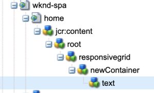

# Redigera en extern SPA i AEM {#editing-external-spa-within-aem}

Vid val [vilken nivå av integration](/help/implementing/developing/headful-headless.md) om du vill växla mellan SPA och AEM bör du tänka på att du ofta måste kunna redigera och visa SPA i AEM.

## Översikt {#overview}

I det här dokumentet beskrivs de rekommenderade stegen för att överföra en fristående SPA till en AEM, lägga till redigerbara innehållsavsnitt och aktivera redigering.

## Förutsättningar {#prerequisites}

Förutsättningarna är enkla.

* Kontrollera att en instans av AEM körs lokalt.
* Skapa ett AEM SPA projekt med [AEM Project Archetype](https://experienceleague.adobe.com/docs/experience-manager-core-components/using/developing/archetype/overview.html?#available-properties).
   * Forms ligger till grund för det AEM projektet som uppdateras för att inkludera det externa SPA.
   * För exemplen i det här dokumentet använder Adobe startpunkten för [WKND SPA](https://experienceleague.adobe.com/docs/experience-manager-learn/sites/spa-editor/spa-editor-framework-feature-video-use.html#spa-editor).
* Ha den fungerande, externa SPA som ni vill integrera till hands.

## Överför SPA till AEM {#upload-spa-to-aem-project}

Först måste du överföra den externa SPA till ditt AEM projekt.

1. Ersätt `src` i `/ui.frontend` projektmapp med React-programmets `src` mapp.
1. Inkludera eventuella ytterligare beroenden i appens `package.json` i `/ui.frontend/package.json` -fil.
   * Kontrollera att SPA SDK-beroenden är av [rekommenderade versioner](/help/implementing/developing/hybrid/getting-started-react.md#dependencies).
1. Inkludera anpassningar i `/public` mapp.
1. Inkludera eventuella infogade skript eller format som lagts till i `/public/index.html` -fil.

## Konfigurera SPA {#configure-remote-spa}

Nu när den externa SPA är en del av ditt AEM projekt måste den konfigureras inom AEM.

### Inkludera Adobe SPA SDK-paket {#include-spa-sdk-packages}

För att dra nytta av AEM SPA funktioner finns det beroenden av följande tre paket.

* [`@adobe/aem-react-editable-components`](https://github.com/adobe/aem-react-editable-components)
* [`@adobe/aem-spa-component-mapping`](https://www.npmjs.com/package/@adobe/aem-spa-component-mapping)
* [`@adobe/aem-spa-page-model-manager`](https://www.npmjs.com/login?next=/package/@adobe/aem-spa-model-manager)

The `@adobe/aem-spa-page-model-manager` paket innehåller API:t för initiering av en modellhanterare och hämtning av modellen från AEM. Den här modellen kan sedan användas för att återge AEM komponenter med API:er från `@adobe/aem-react-editable-components` och `@adobe/aem-spa-component-mapping`.

#### Installation {#installation}

Kör följande `npm` så att du kan installera de nödvändiga paketen.

```shell
npm install --save @adobe/aem-spa-component-mapping @adobe/aem-spa-page-model-manager @adobe/aem-react-editable-components
```

### ModelManager-initiering {#model-manager-initialization}

Innan appen återges visas [`ModelManager`](/help/implementing/developing/hybrid/blueprint.md#pagemodelmanager) måste initieras för att hantera skapandet av AEM `ModelStore`.

Den här initieringen måste göras i `src/index.js` -fil i programmet eller var programmets rot återges.

Du kan använda `initializationAsync` API från `ModelManager`.

Följande skärmbild visar hur du aktiverar initiering av `ModelManager` i ett enkelt React-program. Den enda begränsningen är att `initializationAsync` måste anropas före `ReactDOM.render()`.


I det här exemplet `ModelManager` har initierats och är tom `ModelStore` skapas.

The `initializationAsync` kan acceptera `options` objekt som parameter:

* `path` - Vid initiering hämtas modellen vid den definierade sökvägen och lagras i `ModelStore`. Den här sökvägen kan användas för att hämta `rootModel` vid initiering, om det behövs.
* `modelClient` - Tillåter att du anger en anpassad klient som ansvarar för att hämta modellen.
* `model` - A `model` objekt som skickas som en parameter som vanligtvis fylls i när [med SSR](/help/implementing/developing/hybrid/ssr.md).

### AEM Authorable Components {#authorable-leaf-components}

1. Skapa/identifiera en AEM som en redigerbar React-komponent skapas för. I det här exemplet används WKND-projektets textkomponent.

   

1. Skapa en enkel React-textkomponent i SPA. I det här exemplet finns en ny fil `Text.js` har skapats med följande innehåll.

   

1. Skapa ett konfigurationsobjekt så att du kan ange de attribut som krävs för att aktivera AEM.

   

   * `resourceType` är obligatoriskt för att mappa React-komponenten till AEM och aktivera redigering när den öppnas i AEM Editor.

1. Använda funktionen wrapper `withMappable`.

   

   Den här wrapper-funktionen mappar React-komponenten till AEM `resourceType` anges i konfigurationen och aktiverar redigeringsfunktioner när de öppnas i AEM Editor. För fristående komponenter hämtas även modellinnehållet för den specifika noden.

   >[!NOTE]
   >
   >I det här exemplet finns det separata versioner av komponenten: AEM inkapslade och oomslutna React-komponenter. Den omslutna versionen måste användas när komponenten används explicit. När komponenten är en del av en sida kan du fortsätta använda standardkomponenten på samma sätt som i SPA.

1. Återge innehåll i komponenten.

   JCR-egenskaperna för textkomponenten visas på följande sätt i AEM.

   

   Dessa värden skickas som egenskaper till de skapade `AEMText` Reaktionskomponent och kan användas för att återge innehållet.

   ```javascript
   import React from 'react';
   import { withMappable } from '@adobe/aem-react-editable-components';
   
   export const TextEditConfig = {
       // Empty component placeholder label
       emptyLabel:'Text', 
       isEmpty:function(props) {
          return !props || !props.text || props.text.trim().length < 1;
       },
       // resourcetype of the AEM counterpart component
       resourceType:'wknd-spa-react/components/text'
   };
   
   const Text = ({ text }) => (<div>{text}</div>);
   
   export default Text;
   
   export const AEMText = withMappable(Text, TextEditConfig);
   ```

   Följande är hur komponenten visas när de AEM konfigurationerna är klara.

   ```javascript
   const Text = ({ cqPath, richText, text }) => {
      const richTextContent = () => (
         <div className="aem_text" id={cqPath.substr(cqPath.lastIndexOf('/') + 1)} data-rte-editelement dangerouslySetInnerHTML={{__html: text}}/>
      );
      return richText ? richTextContent() : (<div className="aem_text">{text}</div>);
   };
   ```

   >[!NOTE]
   >
   >I det här exemplet gjordes ytterligare anpassningar av den återgivna komponenten för att matcha den befintliga textkomponenten. Det är inte relaterat till redigering i AEM.

#### Lägg till redigerbara komponenter på sidan {#add-authorable-component-to-page}

När du har skapat de redigerbara React-komponenterna kan du använda dem i hela programmet.

Låt oss ta en exempelsida där du måste lägga till text från WKND-SPA. I det här exemplet vill du visa texten&quot;Hello World!&quot; på `/content/wknd-spa-react/us/en/home.html`.

1. Ange sökvägen till noden som ska visas.

   * `pagePath`: Den sida som innehåller noden, i det här exemplet `/content/wknd-spa-react/us/en/home`
   * `itemPath`: Sökväg till noden på sidan, i detta exempel `root/responsivegrid/text`
      * Innehåller namnen på objekten på sidan.

   

1. Lägg till en komponent på önskad plats på sidan.

   

   The `AEMText` -komponenten kan läggas till vid den önskade positionen på sidan med `pagePath` och `itemPath` värden som angetts som egenskaper. `pagePath` är en obligatorisk egenskap.

#### Verifiera redigering av textinnehåll på AEM {#verify-text-edit}

Testa nu komponenten på den AEM som körs.

1. Kör följande Maven-kommando från `aem-guides-wknd-spa` så att du kan skapa och distribuera projektet till AEM.

```shell
mvn clean install -PautoInstallSinglePackage
```

1. Navigera AEM till `http://<host>:<port>/editor.html/content/wknd-spa-react/us/en/home.html`.


The `AEMText` -komponenten är nu AEM.

### AEM sidor {#aem-authorable-pages}

1. Identifiera en sida som ska läggas till för redigering i SPA. Det här exemplet använder `/content/wknd-spa-react/us/en/home.html`.
1. Skapa en fil (till exempel `Page.js`) för den redigerbara sidkomponenten. använda den sidkomponent som finns i `@adobe/cq-react-editable-components`.
1. Upprepa steg fyra i avsnittet [AEM skrivbara komponenter](#authorable-leaf-components). Använda funktionen wrapper `withMappable` på komponenten.
1. Använd `MapTo` till AEM för alla underordnade komponenter på sidan.

   ```javascript
   import { Page, MapTo, withMappable } from '@adobe/aem-react-editable-components';
   import Text, { TextEditConfig } from './Text';
   
   export default withMappable(Page);
   
   MapTo('wknd-spa-react/components/text')(Text, TextEditConfig);
   ```

   >[!NOTE]
   >
   >I det här exemplet används den obrutna React-textkomponenten i stället för den omslutna texten `AEMText` tidigare. Orsaken är att när komponenten är en del av en sida/behållare och inte fristående, tar behållaren hand om rekursiv mappning av komponenten. Och att aktivera redigeringsfunktioner och extra wrapper behövs inte för varje underordnat objekt.

1. Om du vill lägga till en skrivbar sida i SPA följer du samma steg i avsnittet [Lägg till redigerbara komponenter på sidan](#add-authorable-component-to-page). Här kan du hoppa över `itemPath` -egenskap.

#### Verifiera sidinnehåll på AEM {#verify-page-content}

Följ stegen nedan för att verifiera att sidan kan redigeras [Verifiera redigering av textinnehåll på AEM](#verify-text-edit).


Sidan kan nu redigeras på AEM med en layoutbehållare och en underordnad textkomponent.

### Virtuella lövkomponenter {#virtual-leaf-components}

I de föregående exemplen lade du till komponenter i SPA med befintligt AEM. Det finns dock fall där innehåll ännu inte har skapats i AEM, men måste läggas till senare av innehållsförfattaren. För att passa detta scenario kan frontendutvecklaren lägga till komponenter på lämpliga platser i SPA. Dessa komponenter visar platshållare när de öppnas i redigeraren i AEM. När innehållet har lagts till i platshållarna av innehållsförfattaren skapas noderna i JCR-strukturen och innehållet bevaras. Komponenten som skapas tillåter samma uppsättning åtgärder som de fristående bladkomponenterna.

I det här exemplet återanvänder du `AEMText` som har skapats tidigare. Du vill att ny text ska läggas till under den befintliga textkomponenten på WKND-startsidan. Tillägget av komponenter är detsamma som för normala bladkomponenter. Men `itemPath` kan uppdateras till den sökväg där den nya komponenten måste läggas till.

Eftersom den nya komponenten måste läggas till under den befintliga texten på `root/responsivegrid/text`, är den nya banan `root/responsivegrid/{itemName}`.

```html
<AEMText
 pagePath='/content/wknd-spa-react/us/en/home'
 itemPath='root/responsivegrid/text_20' />
```

The `TestPage` -komponenten ser ut så här när den virtuella komponenten har lagts till.


>[!NOTE]
>
>Kontrollera `AEMText` komponenten har `resourceType` anges i konfigurationen så att du kan aktivera den här funktionen.

Du kan nu distribuera ändringarna till AEM genom att följa stegen i avsnittet [Verifiera redigering av textinnehåll på AEM](#verify-text-edit). En platshållare visas för de befintliga `text_20` nod.


När innehållsförfattaren uppdaterar den här komponenten visas en ny `text_20` noden skapas på `root/responsivegrid/text_20` in `/content/wknd-spa-react/us/en/home`.


#### Krav och begränsningar {#limitations}

Det finns flera krav för att lägga till virtuella bladkomponenter och vissa begränsningar.

* The `pagePath` -egenskapen är obligatorisk för att skapa en virtuell komponent.
* Den sidnod som finns på sökvägen i `pagePath` måste finnas i AEM.
* Namnet på noden som ska skapas måste anges i `itemPath`.
* Komponenten kan skapas på alla nivåer.
   * Om du anger en `itemPath='text_20'` i föregående exempel skapas den nya noden direkt under sidan, det vill säga, `/content/wknd-spa-react/us/en/home/jcr:content/text_20`
* Sökvägen till noden där en ny nod skapas måste vara giltig när den anges via `itemPath`.
   * I detta exempel `root/responsivegrid` måste finnas så att den nya noden `text_20` kan skapas där.
* Det går bara att skapa lövkomponenter. Virtuell behållare och sida stöds i framtida versioner.

### Virtuella behållare {#virtual-containers}

Möjligheten att lägga till behållare stöds, även om motsvarande behållare ännu inte har skapats i AEM. Konceptet och tillvägagångssättet liknar [virtuella lövkomponenter](#virtual-leaf-components).

Utvecklaren kan lägga till behållarkomponenter på lämpliga platser i SPA och dessa komponenter visar platshållare när de öppnas i redigeraren i AEM. Författaren kan sedan lägga till komponenter och deras innehåll i behållaren, vilket skapar de nödvändiga noderna i JCR-strukturen.

Om en behållare till exempel finns på `/root/responsivegrid`och utvecklaren vill lägga till en underordnad behållare:


The `newContainer` finns ännu inte i AEM.

När du redigerar sidan som innehåller den här komponenten i AEM visas en tom platshållare för en behållare där författaren kan lägga till innehåll.


När författaren lägger till en underordnad komponent i behållaren skapas den nya behållarnoden med motsvarande namn i JCR-strukturen.




Fler komponenter och innehåll kan läggas till i behållaren nu när författaren kräver det och ändringarna bevaras.

#### Krav och begränsningar {#container-limitations}

Det finns flera krav för att lägga till virtuella behållare och vissa begränsningar.

* Principen för att bestämma vilka komponenter som kan läggas till ärvs från den överordnade behållaren.
* Den omedelbara överordnade behållaren för den behållare som ska skapas måste finnas i AEM.
   * Om behållaren `root/responsivegrid` finns i AEM-behållaren, kan en ny behållare skapas genom att sökvägen anges `root/responsivegrid/newContainer`.
   * Men `root/responsivegrid/newContainer/secondNewContainer` är inte möjligt.
* Det går bara att skapa en ny komponentnivå åt gången.

## Ytterligare anpassningar {#additional-customizations}

Om du följde de föregående exemplen går det nu att redigera den externa SPA i AEM. Det finns dock andra aspekter av ditt externa SPA som du kan anpassa ytterligare.

### Rotnods-ID {#root-node-id}

Som standard kan du anta att React-programmet återges i en `div` för element-ID `spa-root`. Om det behövs kan den här syntaxen anpassas.

Anta till exempel att du har ett SPA där programmet återges inuti en `div` för element-ID `root`. Syntaxen måste återspeglas i tre filer.

1. I `index.js` av React-ansökan (eller var `ReactDOM.render()` anropas)

   

1. I `index.html` av React-programmet

   

1. I AEM sidkomponentbrödtext:

   1. Skapa en `body.html` för sidkomponenten.

   

   1. Lägg till rotelementet i det nya `body.html` -fil.

   

### Redigera en SPA med routning {#editing-react-spa-with-routing}

Om det finns flera sidor i det externa SPA React-programmet [kan använda routning för att bestämma vilken sida/komponent som ska renderas](/help/implementing/developing/hybrid/routing.md). Det grundläggande användningsexemplet är att matcha den aktiva URL:en mot sökvägen som anges för ett flöde. Om du vill aktivera redigering för sådana routningsaktiverade program måste sökvägen som ska matchas mot omformas för att rymma AEM information.

I följande exempel har du ett enkelt React-program med två sidor. Den sida som ska återges bestäms genom att matcha sökvägen som har angetts till routern mot den aktiva URL:en. Om du är på `mydomain.com/test`, `TestPage` återges.


Följande steg krävs för att aktivera redigering i AEM för det här SPA.

1. Identifiera nivån som skulle fungera som AEM.

   * För ditt urval bör du överväga wknd-spa-response/us/en som SPA. Den här roten innebär att allt som finns före den sökvägen AEM bara sidor/innehåll.

1. Skapa en sida på önskad nivå.

   * I det här exemplet redigeras sidan `mydomain.com/test`. `test` finns i programmets rotsökväg. Rotsökvägen måste också bevaras när du skapar sidan i AEM. Därför kan du skapa en sida på den rotnivå som definierades i föregående steg.
   * Den nya sidan måste ha samma namn som sidan som ska redigeras. I detta exempel `mydomain.com/test`måste den nya sidan skapas `/path/to/aem/root/test`.

1. Lägg till hjälpredor i SPA.

   * Den skapade sidan kan ännu inte återge det förväntade innehållet i AEM. Orsaken är att routern förväntar sig en sökväg till `/test` Den AEM aktiva banan är `/wknd-spa-react/us/en/test`. För att få plats med den AEM delen av URL:en måste du lägga till några hjälpredor på SPA.

   

   * The `toAEMPath` hjälpen från `@adobe/cq-spa-page-model-manager` kan användas. Den omformar sökvägen för routning så att den innehåller AEM delar när programmet är öppet i en AEM. Den godkänner tre parametrar:
      * Sökvägen som krävs för routning
      * Den ursprungliga URL:en för den AEM instansen där SPA redigeras
      * Projektroten på AEM enligt det första steget

   * Dessa värden kan anges som miljövariabler för större flexibilitet.

1. Verifiera redigering av sidan i AEM.

   * Distribuera projektet till AEM och navigera till det skapade projektet `test` sida. Sidinnehållet återges nu och AEM kan redigeras.

## Rambegränsningar {#framework-limitations}

RemotePage-komponenten förväntar sig att implementeringen tillhandahåller ett tillgångsmanifest som den [hittades här](https://github.com/shellscape/webpack-manifest-plugin). RemotePage-komponenten har bara testats för att fungera med React Framework (och Next.js via komponenten remote-page-next) och stöder därför inte fjärrinläsning av program från andra ramverk, till exempel Angular.

## Ytterligare resurser {#additional-resources}

Följande referensmaterial kan vara användbart för att förstå SPA i samband med AEM.

* [Headless and Headless in AEM](/help/implementing/developing/headful-headless.md)
* [AEM Project Archetype](https://experienceleague.adobe.com/docs/experience-manager-core-components/using/developing/archetype/overview.html)
* [WKND-SPA](https://experienceleague.adobe.com/docs/experience-manager-learn/sites/spa-editor/spa-editor-framework-feature-video-use.html)
* [Komma igång med SPA i AEM med React](/help/implementing/developing/hybrid/getting-started-react.md)
* [SPA (API-referenser)](/help/implementing/developing/hybrid/reference-materials.md)
* [SPA Blueprint och PageModelManager](/help/implementing/developing/hybrid/blueprint.md#pagemodelmanager)
* [SPA](/help/implementing/developing/hybrid/routing.md)
* [SPA- och serveråtergivning](/help/implementing/developing/hybrid/ssr.md)
