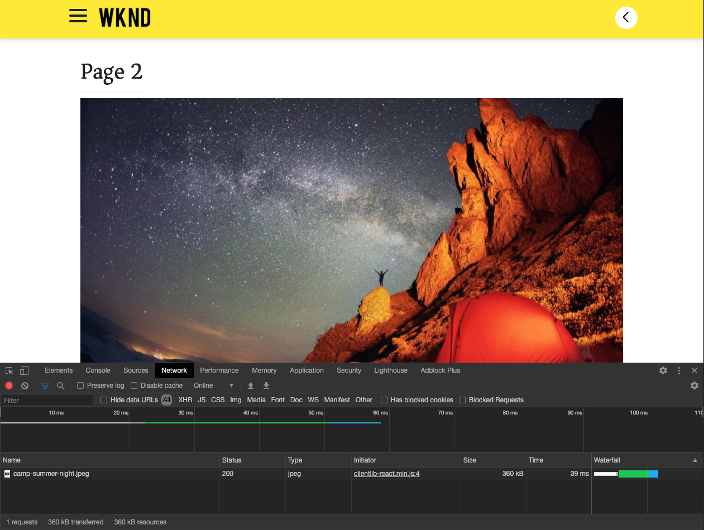
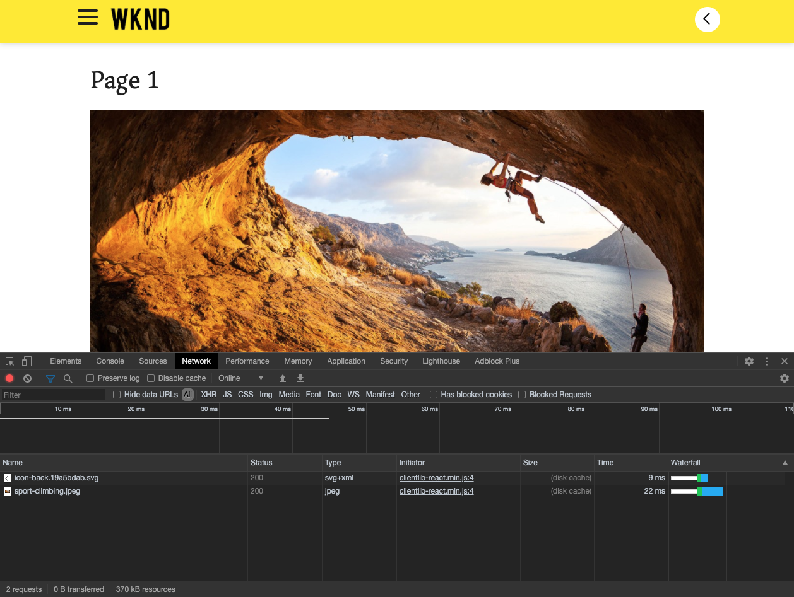

# SPA introduktion och genomgång {#spa-introduction}

Single page applications (SPA) can offer compelling experiences for website users. Utvecklare vill kunna skapa webbplatser med SPA ramverk och författare vill smidigt redigera innehåll i AEM för en webbplats som skapats med sådana ramverk.

SPA Editor erbjuder en omfattande lösning för SPA inom AEM. I den här artikeln går vi igenom hur du använder ett grundläggande SPA för att skapa och visar hur det är relaterat till den underliggande AEM SPA Editor.

## Introduktion {#introduction}

### Artikelmål {#article-objective}

I den här artikeln introduceras de grundläggande begreppen för SPA innan läsaren vägleds genom en genomgång av SPA redigeringsprogram med hjälp av ett enkelt SPA som demonstrerar grundläggande innehållsredigering. Sedan går det ned på hur sidan är uppbyggd och hur det SPA programmet relaterar till och interagerar med AEM SPA.

Målet med den här introduktionen och genomgången är att visa AEM utvecklare varför SPA är relevanta, hur de i allmänhet fungerar, hur en SPA hanteras av AEM SPA Editor och hur det skiljer sig från ett AEM standardprogram.

Genomgången baseras på AEM och exempelappen WKND SPA Project. [Ladda ned och installera exempelappen WKND SPA Project från GitHub här.](https://github.com/adobe/aem-guides-wknd-spa)

>[!CAUTION]
>
>I det här dokumentet används [WKND-SPA](https://github.com/adobe/aem-guides-wknd-spa) endast i demonstrationssyfte. Det ska inte användas för något projektarbete.

>[!TIP]
>
>Alla AEM ska utnyttja den AEM projekttypen [som stöder SPA projekt med React eller Angular och använder SPA SDK.](https://docs.adobe.com/content/help/en/experience-manager-core-components/using/developing/archetype/overview.html)

### Vad är en SPA? {#what-is-a-spa}

Ett enkelsidigt program (SPA) skiljer sig från en konventionell sida på så sätt att det återges på klientsidan och i huvudsak är Javascript-drivet, beroende på Ajax-anrop för att läsa in data och dynamiskt uppdatera sidan. Det mesta eller allt innehåll hämtas en gång på en sida, och ytterligare resurser läses in asynkront efter behov baserat på användarinteraktionen med sidan.

Detta minskar behovet av siduppdatering och ger användaren en upplevelse som är smidig, snabb och som känns mer som en appupplevelse.

Med AEM SPA Editor kan gränssnittsutvecklare skapa SPA som kan integreras i en AEM webbplats, vilket gör att innehållsförfattarna kan redigera SPA innehåll lika enkelt som annat AEM.

### Varför en SPA? {#why-a-spa}

Genom att vara snabbare, smidigare och mer som ett systemspecifikt program blir en SPA en mycket attraktiv upplevelse inte bara för besökaren på webbsidan, utan även för marknadsförare och utvecklare på grund av hur SPA fungerar.


#### Besökare {#visitors}

* Besökarna vill ha upplevelser som påminner om varandra när de interagerar med innehållet.
* Det finns tydliga data om att ju snabbare en sida är, desto troligare blir konverteringen.

#### Marknadsförare {#marketers}

* Marknadsförarna vill erbjuda innehållsrika, verklighetstrogna upplevelser som lockar besökarna att engagera sig fullt ut i innehållet.
* Personalisering kan göra dessa upplevelser ännu mer övertygande.

#### Utvecklare {#developers}

* Utvecklarna vill att det ska finnas tydliga skillnader mellan innehåll och presentation.
* Ren separation gör systemet mer utbyggbart samt möjliggör oberoende framend-utveckling.

### Hur fungerar en SPA? {#how-does-a-spa-work}

Den främsta idén bakom en SPA är att anrop till och beroende av en server minskas för att minimera fördröjningar som orsakas av serverfördröjning så att SPA närmar sig svarstiden för ett internt program.

På en traditionell, sekventiell webbsida läses bara de data som behövs för den omedelbara sidan in. Det innebär att när besökaren flyttar till en annan sida anropas servern för de extra resurserna. Ytterligare anrop kan behövas eftersom besökaren interagerar med element på sidan. Dessa anrop kan ge en känsla av fördröjning eller fördröjning eftersom sidan måste hinna ifatt besökarens önskemål.


För en smidigare upplevelse, som närmar sig vad en besökare förväntar sig av mobilappar och appar, läser en SPA in alla nödvändiga data för besökaren vid den första inläsningen. Detta kan ta lite längre tid i början, men eliminerar sedan behovet av ytterligare serveranrop.

Genom att återge på klientsidan reagerar sidelementen snabbare, och besökarens interaktioner med sidan sker direkt. Eventuella ytterligare data som kan behövas anropas asynkront för att maximera sidans hastighet.

>[!TIP]
>
>Teknisk information om hur SPA arbetar i AEM finns i artiklarna:
>* [Komma igång med SPA i AEM med React](getting-started-react.md)
>* [Getting Started with SPA in AEM Using Angular](getting-started-angular.md)

>
>
Mer information om design, arkitektur och tekniska arbetsflöden i SPA Editor finns i artikeln:
>* [Översikt över](editor-overview.md) SPA.


## Innehållsredigering med SPA {#content-editing-experience-with-spa}

När en SPA har byggts för att dra nytta av den AEM SPA redigeraren märker innehållsförfattaren ingen skillnad när du redigerar och skapar innehåll. Vanliga AEM är tillgängliga och inga ändringar i författarens arbetsflöde krävs.

1. Redigera WKND SPA Project-appen i AEM.

   `http://localhost:4502/editor.html/content/wknd-spa-react/us/en/home.html`

   

1. Markera en textkomponent och lägg märke till att ett verktygsfält ser ut som en annan komponent. Välj **Redigera**.

   

1. Redigera innehållet som vanligt i AEM och notera att ändringarna bevaras.

   

1. Använd Resursläsaren för att dra och släppa en ny bild i en bildkomponent.

   

1. Ändringen är beständig.

   

Ytterligare redigeringsverktyg som att dra och släppa ytterligare komponenter på sidan, ordna om komponenter och ändra layouten stöds som i andra program än SPA AEM.

>[!NOTE]
>
>SPA redigerare ändrar inte programmets DOM. SPA ansvarar själv för DOM.
>
>Om du vill se hur det fungerar fortsätter du till nästa avsnitt i den här artikeln [SPA Appar och AEM SPA Editor](#spa-apps-and-the-aem-spa-editor).

## SPA och AEM SPA{#spa-apps-and-the-aem-spa-editor}

Genom att uppleva hur en SPA fungerar för slutanvändaren och sedan inspektera den SPA sidan blir det lättare att förstå hur en SAP-app fungerar med SPA Editor i AEM.

### Använda ett SPA {#using-an-spa-application}

1. Läs in WKND SPA Project-programmet antingen på publiceringsservern eller med alternativet **Visa som publicerad** på menyn **Sidinformation** i sidredigeraren.

   `http://<host>:<port>/content/wknd-spa-react/us/en/home.html`

   

   Lägg märke till sidstrukturen, inklusive navigering till underordnade sidor, menyer och artikelkort.

1. Navigera till en underordnad sida via menyn och se att sidan läses in omedelbart utan att behöva uppdateras.

   

1. Öppna webbläsarens inbyggda utvecklarverktyg och övervaka nätverksaktiviteten när du navigerar bland de underordnade sidorna.

   

   Trafiken är mycket liten när du går från sida till sida i appen. Sidan läses inte in igen och endast de nya bilderna efterfrågas.

   SPA hanterar innehållet och routningen enbart på klientsidan.

Så om sidan inte läses in igen när du navigerar genom de underordnade sidorna, hur läses den in?

I nästa avsnitt, [Läsa in ett SPA](#loading-a-spa-application), läses djupare in i mekanismerna för inläsning av SPA och hur innehåll kan läsas in synkront och asynkront.

### Läser in ett SPA {#loading-a-spa-application}

1. Om den inte redan är inläst läser du in WKND SPA Project-programmet antingen på publiceringsservern eller med alternativet **Visa som publicerad** på menyn **Sidinformation** i sidredigeraren.

   `http://<host>:<port>/content/wknd-spa-react/us/en/home.html`

   

1. Använd det inbyggda verktyget i webbläsaren för att visa sidans källa.
1. Observera att källans innehåll är begränsat.

   ```html
    <!DOCTYPE html>
    <html lang="en">
    <head>
        <meta charset="UTF-8"/>
        <title>WKND SPA React Home Page</title>
   
        <meta name="template" content="spa-page-template"/>
        <meta name="viewport" content="width=device-width, initial-scale=1"/>
   
    <link rel="stylesheet" href="/etc.clientlibs/wknd-spa-react/clientlibs/clientlib-base.min.css" type="text/css">
   
    <meta name="theme-color" content="#000000"/>
    <link rel="icon" href="/etc.clientlibs/wknd-spa-react/clientlibs/clientlib-react/resources/favicon.ico"/>
    <link rel="apple-touch-icon" href="/etc.clientlibs/wknd-spa-react/clientlibs/clientlib-react/resources/logo192.png"/>
    <link rel="manifest" href="/etc.clientlibs/wknd-spa-react/clientlibs/clientlib-react/resources/manifest.json"/>
   
    <!-- AEM page model -->
    <meta property="cq:pagemodel_root_url" content="/content/wknd-spa-react/us/en.model.json"/>
    <link href="//fonts.googleapis.com/css?family=Source+Sans+Pro:400,600|Asar&display=swap" rel="stylesheet"/>
    <meta property="cq:datatype" content="JSON"/>
    <meta property="cq:wcmmode" content="edit"/>
   
    <link rel="stylesheet" href="/libs/cq/gui/components/authoring/editors/clientlibs/internal/page.min.css" type="text/css">
    <link rel="stylesheet" href="/etc.clientlibs/wcm/foundation/clientlibs/main.min.css" type="text/css">
    <script type="text/javascript" src="/libs/cq/gui/components/authoring/editors/clientlibs/internal/messaging.min.js"></script>
    <script type="text/javascript" src="/libs/cq/gui/components/authoring/editors/clientlibs/utils.min.js"></script>
    <script type="text/javascript" src="/libs/granite/author/deviceemulator/clientlibs.min.js"></script>
    <script type="text/javascript" src="/libs/cq/gui/components/authoring/editors/clientlibs/internal/page.min.js"></script>
    <script type="text/javascript" src="/etc.clientlibs/wcm/foundation/clientlibs/main.min.js"></script>
    <script type="text/javascript" src="/etc.clientlibs/clientlibs/granite/jquery.min.js"></script>
    <script type="text/javascript" src="/etc.clientlibs/clientlibs/granite/utils.min.js"></script>
    <script type="text/javascript" src="/etc.clientlibs/clientlibs/granite/jquery/granite.min.js"></script>
    <script type="text/javascript" src="/etc.clientlibs/foundation/clientlibs/jquery.min.js"></script>
    <script type="text/javascript" src="/etc.clientlibs/foundation/clientlibs/shared.min.js"></script>
   
    <!--cq{"decorated":false,"type":"cq/cloudconfig/components/scripttags/header","path":"/content/wknd-spa-react/us/en/home/jcr:content/cloudconfig-header","structurePath":"/content/wknd-spa-react/us/en/home/jcr:content/cloudconfig-header","selectors":null,"servlet":"Script /libs/cq/cloudconfig/components/scripttags/header/header.html","totalTime":2,"selfTime":2}-->
   
    <link rel="stylesheet" href="/etc.clientlibs/wknd-spa-react/clientlibs/clientlib-react.min.css" type="text/css">
   
    </head>
   
    <body class="page basicpage">
        <noscript>You need to enable JavaScript to run this app.</noscript>
    <div id="spa-root"></div>
   
    <script type="text/javascript" src="/etc.clientlibs/wknd-spa-react/clientlibs/clientlib-react.min.js"></script>
   
    <script type="text/javascript" src="/etc.clientlibs/core/wcm/components/commons/site/clientlibs/container.min.js"></script>
    <script type="text/javascript" src="/etc.clientlibs/wknd-spa-react/clientlibs/clientlib-base.min.js"></script>
   
    <script type="text/javascript" src="/libs/cq/gui/components/authoring/editors/clientlibs/internal/pagemodel/messaging.min.js"></script>
   
    <link rel="stylesheet" href="/etc.clientlibs/wknd-spa-react/clientlibs/clientlib-author.min.css" type="text/css">
   
    <!--cq{"decorated":true,"type":"cq/cloudserviceconfigs/components/servicecomponents","path":"/content/wknd-spa-react/us/en/home/jcr:content/cloudservices","selectors":null,"servlet":"Script /libs/cq/cloudserviceconfigs/components/servicecomponents/servicecomponents.jsp","totalTime":2,"selfTime":2}-->
   
    <!--cq{"decorated":false,"type":"cq/cloudconfig/components/scripttags/footer","path":"/content/wknd-spa-react/us/en/home/jcr:content/cloudconfig-footer","structurePath":"/content/wknd-spa-react/us/en/home/jcr:content/cloudconfig-footer","selectors":null,"servlet":"Script /libs/cq/cloudconfig/components/scripttags/footer/footer.html","totalTime":2,"selfTime":2}-->
   
    </body>
    </html>
    <!--cq{"decorated":false,"type":"wknd-spa-react/components/page","path":"/content/wknd-spa-react/us/en/home/jcr:content","selectors":null,"servlet":"Script /apps/spa-project-core/components/page/page.html","totalTime":39,"selfTime":33}-->
   ```

   Sidan har inget innehåll i sin brödtext. Den består huvudsakligen av formatmallar och ett anrop till olika skript, till exempel `clientlib-react.min.js`.

   Dessa skript är de primära drivrutinerna för det här programmet och ansvarar för att återge allt innehåll.

1. Använd webbläsarens inbyggda verktyg för att inspektera sidan. Se innehållet i DOM som är fullständigt inläst.

   

1. Växla till fliken Nätverk i panelen Granska och läs in sidan igen.

   Observera att de primära resurser som har lästs in för sidan är själva sidan, CSS, React Javascript, dess beroenden samt JSON-data för sidan.

   

1. Läs in `home.model.json` på en ny flik.

   `http://<host>:<port>/content/wknd-spa-react/us/en/home.model.json`

   

   AEM redigerare använder [AEM Content Services](/help/assets/content-fragments/content-fragments.md) för att leverera hela sidans innehåll som en JSON-modell.

   Genom att implementera specifika gränssnitt ger Sling Models den information som behövs för SPA. Leveransen av JSON-data delegeras nedåt till varje komponent (från sida, stycke, komponent osv.).

   Varje komponent väljer vad den visar och hur den återges (på serversidan med HTML eller på klientsidan med React eller Angular). Den här artikeln fokuserar på klientåtergivning med React.

1. Modellen kan också gruppera sidor så att de läses in synkront, vilket minskar antalet sidomladdningar som behövs.

   I exemplet med WKND SPA Project-appen läses sidorna `home`, `page-1`, `page-2` och `page-3` in synkront, eftersom besökarna vanligtvis besöker alla dessa sidor.

   Detta beteende är inte obligatoriskt och är helt definierbart.

   

1. Om du vill visa den här skillnaden i beteende läser du in sidan `home` igen och rensar nätverksaktiviteten för inspektören. Navigera till `page-1` på sidmenyn och se att den enda nätverksaktiviteten är en begäran för bilden av `page-1`. `page-1` behöver inte läsas in.

   

### Interaktion med SPA Editor {#interaction-with-the-spa-editor}

Med exempelprogrammet WKND SPA Project är det tydligt hur appen fungerar och läses in när den publiceras, och utnyttjar innehållstjänster för JSON-innehållsleverans samt asynkron inläsning av resurser.

Dessutom är det smidigt för innehållsförfattaren att skapa innehåll med en SPA redigerare i AEM.

I följande avsnitt utforskar vi kontraktet som gör det möjligt för SPA Editor att relatera komponenter i SPA till AEM komponenter och uppnå denna smidiga redigeringsupplevelse.

1. Läs in programmet WKND SPA Project i redigeraren och växla till läget **Förhandsgranska**.

   `http://<host>:<port>/editor.html/content/wknd-spa-react/us/en/home.html`

1. Kontrollera sidans innehåll med hjälp av webbläsarens inbyggda utvecklarverktyg. Använd markeringsverktyget och markera en redigerbar komponent på sidan och visa elementinformationen.

   Observera att komponenten har ett nytt dataattribut `data-cq-data-path`.

   

   Till exempel

   `data-cq-data-path="/content/wknd-spa-react/us/en/home/jcr:content/root/responsivegrid/text`

   Den här sökvägen tillåter hämtning och associering av konfigurationsobjektet för redigeringssammanhanget för varje komponent.

   Det här är det enda markeringsattribut som krävs för att redigeraren ska kunna identifiera det som en redigerbar komponent i SPA. Utifrån det här attributet avgör SPA redigerare vilken redigerbar konfiguration som är kopplad till komponenten, så att rätt bildruta, verktygsfält osv. har lästs in.

   Vissa specifika klassnamn läggs också till för att markera platshållare och för att dra och släppa resurser.

   >[!NOTE]
   >
   >Detta skiljer sig från serversidans återgivna sidor i AEM, där ett `cq`-element infogas för varje redigerbar komponent.
   >
   >Med den här metoden i SPA Editor elimineras behovet av att mata in anpassade element, endast ytterligare ett dataattribut används, vilket gör markeringen enklare för klientutvecklaren.

## Nästa steg {#next-steps}

Nu när du förstår SPA redigeringsupplevelsen i AEM och hur en SPA relaterar till SPA redigerare kan du fördjupa dig i hur en SPA byggs.

* [Getting Started with SPA in AEM using ](getting-started-react.md) Reactvisar hur en grundläggande SPA fungerar med SPA Editor i AEM med React
* [Getting Started with SPA in AEM using ](getting-started-angular.md) Angularshows how a basic SPA is built to work with the SPA Editor in AEM using Angular
* [SPA ](editor-overview.md) översiktsredigeraren går in mer på kommunikationsmodellen mellan AEM och SPA.
* [Utveckla SPA för ](developing.md) AEMbeskriver hur man engagerar gränssnittsutvecklare för att utveckla en SPA för AEM samt hur SPA interagerar med AEM arkitektur.
