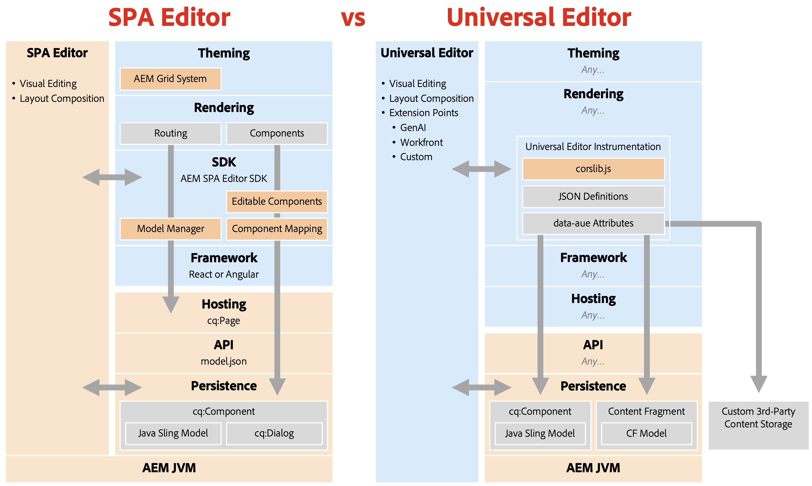

# Borttagning av SPA-redigerare {#spa-editor-deprecation}

Även om SPA-redigeraren fortfarande stöds av Adobe kan du ta reda på vad borttagningen innebär för ditt projekt och vilka alternativ du har för framtida projekt.

## Sammanfattning {#summary}

Adobe har ersatt SPA-redigeraren med [version 2025.01 av AEM as a Cloud Service](/help/release-notes/release-notes-cloud/2025/release-notes-2025-1-0.md#spa-editor), vilket innebär att inga ytterligare förbättringar eller uppdateringar kommer att göras av SDK:erna. Adobe rekommenderar att du använder [Universal Editor](/help/implementing/universal-editor/introduction.md) för alla nya projekt för att utnyttja AEM senaste innovationer.

## Information om borttagning {#details}

Borttagningen av SPA-redigeraren **innebär inte omedelbar borttagning**, och om du har befintliga implementeringar kan **du fortsätta använda den så länge som det passar dina behov.** Observera dock följande konsekvenser av att det har tagits bort.

* Framöver kommer Adobe endast att åtgärda P1- och P2-problem och säkerhetsproblem.
* Inga ytterligare utvecklingar, förbättringar eller uppdateringar kommer att göras av SDK:n.

Föråldringen innebär att följande SDK:er nu fryser.

* [AEM Project Archetype](https://github.com/adobe/aem-project-archetype/)
* [AEM SPA Project Core](https://github.com/adobe/aem-spa-project-core)
* [AEM SPA Page Model Manager](https://github.com/adobe/aem-spa-page-model-manager)
* [AEM SPA-komponentmappning](https://github.com/adobe/aem-spa-component-mapping)
* [AEM SPA React Editable Components](https://github.com/adobe/aem-react-editable-components)
   * [AEM React Core Components](https://github.com/adobe/aem-react-core-wcm-components)
   * [AEM React Core Components Base](https://github.com/adobe/aem-react-core-wcm-components-base)
   * [AEM React Core Components SPA](https://github.com/adobe/aem-react-core-wcm-components-spa)
   * [Exempel på AEM React Core-komponenter](https://github.com/adobe/aem-react-core-wcm-components-examples)
* [AEM SPA Angular Editable Components](https://github.com/adobe/aem-angular-editable-components)
   * [AEM Angular Core Components](https://github.com/adobe/aem-angular-core-wcm-components)
   * [AEM Angular Core Components Base](https://github.com/adobe/aem-angular-core-wcm-components-base)
   * [AEM Angular Core Components SPA](https://github.com/adobe/aem-angular-core-wcm-components-spa)
   * [Exempel på AEM Angular Core-komponenter](https://github.com/adobe/aem-angular-core-wcm-components-examples)
* [AEM SPA Vue Editable Components](https://github.com/mavicellc/aem-vue-editable-components)

## Alternativ till SPA-redigeraren {#alternatives}

Vilken som är den lämpligaste ersättningen för SPA-redigeraren beror på dina projektbehov.

* **[Den universella redigeraren](/help/edge/wysiwyg-authoring/authoring.md)** är den bästa direkta ersättningen för SPA-redigeraren.
   * Universal Editor är också en visuell redigerare och har tagits fram specifikt för fristående implementeringar som innehåller all Adobe-funktionalitet från SPA Editor.
   * Den universella redigeraren har också [släppts för AEM 6.5](https://experienceleague.adobe.com/sv/docs/experience-manager-65/content/implementing/developing/headless/universal-editor/introduction) (med version 2024.11.05 av AEM 6.5) och stöder därför AMS och lokala användningsfall förutom molntjänster.
* **[Innehållsfragmentsredigeraren](/help/assets/content-fragments/content-fragments-managing.md)** är ett alternativ för dem som föredrar en formulärbaserad redigerare.
   * Innehållsfragmentsredigeraren passar bäst när innehållet är strukturerat som innehållsfragment i stället för som sidor.

Att strukturera innehåll med innehållsfragment utesluter inte användningen av den universella redigeraren som en visuell redigerare, och båda redigerarna kan användas tillsammans.

## Migrera till Universal Editor {#migrate-ue}

Universell redigerare har många fördelar, vilket gör migrering till en bra lösning för nya projekt.

* **Visuell redigering:** Precis som för SPA-redigeraren kan författare redigera innehåll direkt i förhandsgranskningen och omedelbart se hur ändringarna påverkar besökarupplevelsen.
* **Framtidsgranskning:** AEM färdplan prioriterar den universella redigeraren som visuell redigerare. Genom att använda det får du tillgång till de senaste innovationerna och förbättringarna.
* **Förenklad integrering:** Det krävs ingen AEM-specifik SDK för att använda den universella redigeraren, vilket reducerar tilllåsning av högtalarsystem.
* **Använd din egen app:** Den universella redigeraren har stöd för alla webbramverk och -arkitekturer, vilket gör att du kan börja använda programmet utan att behöva göra en komplex omfaktorisering.
* **Utbyggbarhet:** Den universella redigeraren drar nytta av ett robust [tilläggsramverk,](/help/implementing/universal-editor/extending.md) inklusive integreringar med GenAI, Workfront med flera.

Det finns ingen direkt migreringsväg från SPA-redigeraren till den universella redigeraren. Detta beror på de två teknikernas grundläggande skillnader.

* Den universella redigeraren återinför inte funktioner som mallredigeraren, formatsystemet eller det responsiva stödrastret.
   * De här användningsexemplen kan nu hanteras effektivare med tunn frontend-CSS och JS i Edge Delivery Services eller headless-projekt.
* Eftersom den universella redigeraren är en redigerare som en tjänst kan den inte tillåta att implementerare injicerar CSS eller JS i komponentdialogrutorna.
   * Detta förhindrar automatisk konvertering av komponentdialogrutor från sidredigeraren.
   * Detta påverkar många områden i dialogrutorna, t.ex. anpassade widgetar, fältvalidering, visa/dölj regler och mallbaserade anpassningar.

Med tanke på dessa tekniska skillnader är Adobe rekommendation att

* Behåll befintliga SPA Editor-sajter som de är eftersom supporten fortsätter.
* Använd den universella redigeraren för all ny utveckling, inklusive nya webbplatser, avsnitt och sidor.

Tänk på att även om det inte finns någon direkt implementering av vissa SPA-redigeringsfunktioner i den universella redigeraren, finns det nya sätt att lösa samma problem med hjälp av den nya flexibiliteten i den universella redigeraren.

## Jämföra SPA-redigeraren och den universella redigeraren {#spa-vs-ue}

Den universella redigeraren ger mycket större frihet för utvecklare av webbprogram, vilket illustreras i det här diagrammet.

|  | SPA Editor | Universal Editor |
|---|---|---|
| **Tema** | App måste implementera layout med AEM CSS för stödraster. | Appen kan använda vilken modern CSS-teknik som helst för layout. |
| **Återgivning** | Appen måste följa SPA Editors routningsstruktur. | Appen kan implementeras fritt, utan regler eller mönster som följer. |
| **SDK** | Implementeringen måste vara nära integrerad med SDK. | På författarnivå läser appen bara in `corlib.js` och instruerar den universella redigeraren via HTML anteckningar. |
| **Framework** | Appen måste använda en version av React eller Angular som stöds. | Appen kan använda vilket ramverk eller vilken arkitektur som helst. |
| **Hosting** | Appen måste finnas på AEM domäner. | Appen kan frikopplas helt och vara värd var som helst. |
| **API** | Appen måste hämta innehåll från API:t `model.json`. | Appen kan använda alla API:er, inklusive anpassade. |
| **Persistence** | SPA Editor stöder endast sidinnehåll för visuell redigering. | Universal Editor stöder redigering av sidor och innehållsfragment. |
|  |  | Den universella redigeraren kan utökas för att redigera externt innehåll med samma visuella funktioner. |
|  | Utvecklare måste distribuera Sling-modeller och `cq:Dialog` i AEM. | Utvecklarna behöver lite eller ingen erfarenhet av AEM och behöver inte skriva Java. |
