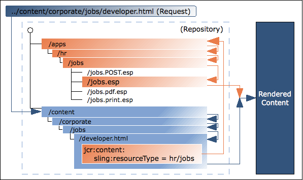

# AEM Technical Foundations {#aem-technical-foundations}

AEM är en stabil plattform som bygger på beprövade, skalbara och flexibla tekniker. I det här dokumentet finns en detaljerad översikt över de olika delar som AEM består av och är avsedda som ett tekniskt tillägg för en AEM som utvecklar en hel hög. Den är inte avsedd som en guide för att komma igång. Om du inte är van vid AEM ska du titta i självstudiekursen [Getting Started Developing AEM Sites - WKND](develop-wknd-tutorial.md) som ett första steg.

>[!TIP]
>
>Adobe rekommenderar att du slutför självstudiekursen [Komma igång med att utveckla AEM Sites - WKND innan du börjar använda tekniken i AEM.](develop-wknd-tutorial.md)

## Grundläggande {#fundamentals}

Som ett modernt innehållshanteringssystem använder AEM standardwebbtekniker:

* Request-response-cykeln (XMLHttpRequest / XMLHttpResponse)
* HTML
* CSS
* JavaScript

Den underliggande innehållsdatabasen och affärslogiken bygger på Java-tekniker:

* JCR
* Sling
* OSGi

## Java Content Repository {#java-content-repository}

Java Content Repository (JCR)-standarden, [JSR 283](https://docs.adobe.com/content/docs/en/spec/jcr/2.0/index.html), anger ett leverantörsoberoende och implementeringsoberoende sätt att komma åt innehåll dubbelriktat på en detaljnivå i en innehållsdatabas. Specifikationsledaren innehas av Adobe Research (Schweiz) AG.

[JCR API 2.0](https://docs.adobe.com/docs/en/spec/javax.jcr/javadocs/jcr-2.0/index.html)-paketet `javax.jcr.*` används för direkt åtkomst och redigering av databasinnehåll.

AEM bygger på en JCR.

## Apache Jackrabbit Oak {#jackrabbit-oak}

[Apache Jackrabbit ](https://jackrabbit.apache.org/oak/) Oakis är en implementering av ett skalbart och högpresterande hierarkiskt innehållsarkiv som kan användas som grund för moderna webbplatser i världsklass och andra krävande innehållsapplikationer som uppfyller JCR-standarden.

Jackrabbit Oak (även kallad Oak) är implementeringen av JCR-standarden som AEM bygger på.

## Sling Request Processing {#sling-request-processing}

AEM byggs med [Sling](https://sling.apache.org/site/index.html), ett ramverk för webbapplikationer som bygger på REST-principer som gör det enkelt att utveckla innehållsorienterade applikationer. Sling använder en JCR-databas, som Apache Jackrabbit Oak, som datalager. Sling har bidragit till Apache Software Foundation - mer information finns på Apache.

### Introduktion till Sling {#introduction-to-sling}

Med Sling är den typ av innehåll som ska återges inte den första bearbetningen. Det viktigaste är i stället om URL:en tolkas till ett innehållsobjekt för vilket ett skript sedan kan användas för återgivningen. Detta ger ett utmärkt stöd för dem som skapar webbmaterial att bygga sidor som enkelt kan anpassas efter deras behov.

Fördelarna med den här flexibiliteten är uppenbara i program med många olika innehållselement eller när du behöver sidor som enkelt kan anpassas. Detta gäller särskilt när man implementerar ett system för hantering av webbinnehåll, t.ex. AEM.

Se [Upptäck Sling på 15 minuter](https://sling.apache.org/documentation/getting-started/discover-sling-in-15-minutes.html) för de första stegen för att utveckla med Sling.

I följande diagram förklaras Sling-skriptupplösningen: visar hur du hämtar från HTTP-begäran till innehållsnod, från innehållsnod till resurstyp, från resurstyp till skript och vilka skriptvariabler som är tillgängliga.


I följande diagram förklaras alla dolda, men kraftfulla, frågeparametrar som du kan använda när du arbetar med `SlingPostServlet`, standardhanteraren för alla begäranden om POSTER, som ger dig oändliga alternativ för att skapa, ändra, ta bort, kopiera och flytta noder i databasen.


### Sling är innehållscentrerad {#sling-is-content-centric}

Sling är *innehållscentrerad*. Detta innebär att bearbetningen är inriktad på innehållet eftersom varje HTTP-begäran mappas till innehåll i form av en JCR-resurs (en databasnod):

* Det första målet är den resurs (JCR-nod) som innehåller innehållet
* För det andra finns representationen, eller skriptet, från resursegenskaperna i kombination med vissa delar av begäran (t.ex. väljare och/eller tillägg)

### RESTful Sling {#restful-sling}

På grund av sin innehållsorienterade filosofi implementerar Sling en REST-orienterad server och har därmed ett nytt koncept i ramverk för webbapplikationer. Fördelarna är:

* Mycket RESTful, inte bara på ytan; resurser och representationer är korrekt modellerade i servern
* Tar bort en eller flera datamodeller
   * Andra content management-ramverk kan kräva URL-struktur, affärsobjekt och DB-schema för att komma åt en resurs.
   * Med Sling minskas detta till: URL = resurs = JCR-struktur

### URL-disposition {#url-decomposition}

Vid Sling styrs bearbetningen av URL:en för användarförfrågningen. Här definieras vilket innehåll som ska visas av rätt skript. Det gör du genom att extrahera information från webbadressen.

Om vi analyserar följande URL:

```text
https://myhost/tools/spy.printable.a4.html/a/b?x=12
```

Vi kan dela upp det i dess sammansatta delar:

| protocol | host |  | innehållsbana | väljare | extension |  | suffix |  | param(er) |
|---|---|---|---|---|---|---|---|---|---|
| `https://` | `myhost` | `/` | `tools/spy` | `.printable.a4.` | `html` | `/` | `a/b` | `?` | `x=12` |

* **protocol** - HTTPS
* **host**  - Domän för platsen
* **Innehållssökväg**  - Sökväg som anger det innehåll som ska återges och som används i kombination med tillägget. i det här exemplet översätter de till  `tools/spy.html`
* **väljare**  - Används för alternativa metoder för återgivning av innehållet. i det här exemplet en utskriftsvänlig version i A4-format
* **extension** - Content format; anger även vilket skript som ska användas för återgivning
* **suffix** - Kan användas för att ange ytterligare information
* **param(er)**  - Alla parametrar som krävs för dynamiskt innehåll

#### Från URL till innehåll och skript {#from-url-to-content-and-scripts}

Använda principerna för URL-nedbrytning:

* Mappningen använder innehållssökvägen som extraherats från begäran för att hitta resursen.
* När rätt resurs hittas extraheras sling-resurstypen och används för att hitta skriptet som ska användas för återgivning av innehållet.

Följande bild visar vilken mekanism som används, vilket beskrivs mer ingående i följande avsnitt.



Med Sling anger du vilket skript som ska återge en viss enhet (genom att ange egenskapen `sling:resourceType` i JCR-noden). Den här mekanismen ger mer frihet än en där skriptet får åtkomst till datatabellerna (som en SQL-sats i ett PHP-skript skulle göra) eftersom en resurs kan ha flera renderingar.

#### Mappa begäranden till resurser {#mapping-requests-to-resources}

Begäran har delats upp och nödvändig information har extraherats. Databasen genomsöks efter den begärda resursen (innehållsnod):

* First Sling kontrollerar om det finns en nod på den plats som anges i begäran. t.ex. `../content/corporate/jobs/developer.html`
* Om ingen nod hittas tas tillägget bort och sökningen upprepas. t.ex. `../content/corporate/jobs/developer`
* Om ingen nod hittas returnerar Sling http-koden 404 (Hittades inte).

Med Sling kan även andra saker än JCR-noder vara resurser, men det här är en avancerad funktion.

### Hitta skriptet {#locating-the-script}

När rätt resurs (innehållsnod) finns extraheras resurstypen **sling**. Detta är en sökväg som letar upp skriptet som ska användas för återgivning av innehållet.

Sökvägen som anges av `sling:resourceType` kan antingen vara:

* Absolut
* Relativt till en konfigurationsparameter

>[!TIP]
>
>Relativa sökvägar rekommenderas av Adobe när de ökar portabiliteten.

Alla Sling-skript lagras i undermappar för antingen `/apps` (mutable, user scripts) eller `/libs` (immutable, system scripts), som söks igenom i den här ordningen.

Några andra punkter att notera är:

* När metoden (GET, POST) krävs, specificeras den med versaler enligt HTTP-specifikationen, t.ex. `jobs.POST.esp`
* Olika skriptmotorer stöds, men de vanliga, rekommenderade skripten är HTML och JavaScript.

Listan över skriptmotorer som stöds av den angivna AEM finns på Felix Management Console ( `http://<host>:<port>/system/console/slingscripting`).

Om du använder föregående exempel om `sling:resourceType` är `hr/jobs` är det för:

* GET/HEAD och URL:er som slutar på `.html` (standardbegärandetyper, standardformat)
   * Skriptet kommer att vara `/apps/hr/jobs/jobs.esp`; det sista avsnittet i `sling:resourceType` utgör filnamnet.
* Begäranden om POST (alla begärandetyper utom GET/HEAD, metodnamnet måste vara versaler)
   * POSTEN används i skriptnamnet.
   * Skriptet är `/apps/hr/jobs/jobs.POST.esp`.
* URL:er i andra format, slutar inte med `.html`
   * Till exempel `../content/corporate/jobs/developer.pdf`
   * Skriptet kommer att vara `/apps/hr/jobs/jobs.pdf.esp`; suffixet läggs till i skriptnamnet.
* URL:er med väljare
   * Väljare kan användas för att visa samma innehåll i ett alternativt format. Till exempel en utskriftsvänlig version, ett RSS-flöde eller en sammanfattning.
   * Om vi tittar på en utskriftsvänlig version där väljaren kan vara `print`; som i `../content/corporate/jobs/developer.print.html`
   * Skriptet kommer att vara `/apps/hr/jobs/jobs.print.esp`; väljaren läggs till i skriptnamnet.
* Om ingen `sling:resourceType` har definierats:
   * Innehållssökvägen används för att söka efter ett lämpligt skript (om sökvägen som är baserad på `ResourceTypeProvider` är aktiv).
   * Skriptet för `../content/corporate/jobs/developer.html` skulle till exempel generera en sökning i `/apps/content/corporate/jobs/`.
   * Den primära nodtypen kommer att användas.
* Om inget skript hittas används standardskriptet.
   * Standardåtergivningen stöds för närvarande som oformaterad text (`.txt`), HTML (`.html`) och JSON (`.json`), som alla listar nodens egenskaper (lämpligt formaterade). Standardåtergivningen för tillägget `.res`, eller begäranden utan ett tillägg till en begäran, är att resursen ska buffras (där det är möjligt).
* För http-felhantering (kod 403 eller 404) söker Sling efter ett skript på antingen:
   * Platsen `/apps/sling/servlet/errorhandler` för anpassade skript
   * Eller platsen för standardskriptet `/libs/sling/servlet/errorhandler/404.jsp`

Om flera skript gäller för en viss begäran väljs det skript som matchar bäst. Ju mer specifik en träff är, desto bättre är den. Med andra ord matchar den fler väljaren bättre, oavsett vilket tillägg eller metodnamn som används i begäran.

Ta till exempel en begäran om åtkomst till resursen

* `/content/corporate/jobs/developer.print.a4.html`

av typen

* `sling:resourceType="hr/jobs"`

Anta att vi har följande skriptlista på rätt plats:

1. `GET.esp`
1. `jobs.esp`
1. `html.esp`
1. `print.esp`
1. `print.html.esp`
1. `print/a4.esp`
1. `print/a4/html.esp`
1. `print/a4.html.esp`

Sedan är ordningen (8) - (7) - (6) - (5) - (4) - (3) - (2) - (1).

Förutom resurstyperna (som primärt definieras av egenskapen `sling:resourceType`) finns det även resursens supertyp. Detta anges vanligtvis av egenskapen `sling:resourceSuperType`. De här supertyperna beaktas också när du försöker hitta ett skript. Fördelen med resurssupertyper är att de kan utgöra en hierarki av resurser där standardresurstypen `sling/servlet/default` (används av standardservletarna) är roten.

Resursens överordnade typ kan definieras på två sätt:

* av resursens `sling:resourceSuperType`-egenskap.
* av egenskapen `sling:resourceSuperType` för den nod som `sling:resourceType` pekar på.

Till exempel:

* `/`
   * `a`
   * `b`
      * `sling:resourceSuperType = a`
   * `c`
      * `sling:resourceSuperType = b`
   * `x`
      * `sling:resourceType = c`
   * `y`
      * `sling:resourceType = c`
      * `sling:resourceSuperType = a`

Typhierarkin för:

* `/x`
   * Är `[ c, b, a, <default>]`
* Om `/y`
   * Hierarkin är `[ c, a, <default>]`

Detta beror på att `/y` har egenskapen `sling:resourceSuperType` men `/x` inte har det och dess supertyp tas därför från sin resurstyp.

#### Sling-skript kan inte anropas direkt {#sling-scripts-cannot-be-called-directly}

I Sling kan skript inte anropas direkt eftersom detta skulle bryta det strikta begreppet med en REST-server. kan du blanda resurser och representationer.

Om du anropar representationen (skriptet) direkt döljer du resursen i skriptet, så att ramverket (Sling) inte längre vet om det. Därför förlorar du vissa funktioner:

* Automatisk hantering av andra http-metoder än GET, inklusive:
   * POST, PUT, DELETE som hanteras med en Sing-standardimplementering
   * `POST.jsp`-skriptet på din `sling:resourceType`-plats
* Din kodarkitektur är inte längre så ren eller så tydligt strukturerad som den ska vara. av största vikt för storskalig utveckling

### Sling API {#sling-api}

Detta använder Sling API-paketet, `org.apache.sling.*` och taggbiblioteken.

### Referera till befintliga element med sling:include {#referencing-existing-elements-using-sling-include}

En sista sak är behovet av att referera till befintliga element i skripten.

Mer komplicerade skript (aggregerande skript) kan behöva ha åtkomst till flera resurser (t.ex. navigering, sidospalt, sidfot, element i en lista) och göra det genom att ta med *resurs*.

Om du vill göra det kan du använda kommandot `sling:include("/<path>/<resource>")`. Detta inkluderar effektivt definitionen av den refererade resursen.

## OSGi {#osgi}

OSGi (Open Services Gateway Initiative) definierar en arkitektur för utveckling och driftsättning av modulära program och bibliotek (kallas även Dynamic Module System för Java). Med OSGi-behållare kan du dela in programmet i enskilda moduler (är jar-filer med ytterligare metainformation och kallas buntar i OSGi-terminologi) och hantera korsberoenden mellan dem med:

* Tjänster som implementeras i behållaren
* Ett kontrakt mellan behållaren och programmet

Dessa tjänster och kontrakt utgör en arkitektur som gör att enskilda element dynamiskt kan identifiera varandra för samarbete.

Ett OSGi-ramverk ger dig dynamisk inläsning/borttagning, konfigurering och kontroll av dessa paket - utan att du behöver starta om.

>[!NOTE]
>
>Fullständig information om OSGi-teknik finns på [OSGi-webbplatsen](https://www.osgi.org).
>
>På sidan Grundläggande utbildning finns en samling presentationer och självstudiekurser.

Med den här arkitekturen kan du utöka Sling med programspecifika moduler. Sling, och därför AEM, använder implementeringen av OSGi i [Apache Felix](https://felix.apache.org/). De är båda samlingar av OSGi-paket som körs i ett OSGi-ramverk.

Detta gör att du kan utföra följande åtgärder på något av paketen i din installation:

* Installera
* Start
* Stoppa
* Uppdatera
* Avinstallera
* Se aktuell status
* Få mer detaljerad information (t.ex. symboliskt namn, version, plats) om de specifika paketen

Mer information finns i [Konfigurera OSGi för AEM som en Cloud Service](/help/implementing/deploying/configuring-osgi.md).

## Struktur i databasen {#structure-within-the-repository}

I följande lista visas en översikt över strukturen som visas i databasen.

* `/apps` - Ansökningsrelaterade; innehåller komponentdefinitioner som är specifika för din webbplats. Komponenterna som du utvecklar kan baseras på de färdiga komponenter som finns på `/libs/core/wcm/components`.
* `/content` - Innehåll som skapats för din webbplats.
* `/etc`
* `/home` - Användar- och gruppinformation.
* `/libs` - Bibliotek och definitioner som hör till kärnan i AEM. Undermapparna i `/libs` representerar de färdiga AEM. Innehållet i `/libs` får inte ändras. Funktioner som är specifika för din webbplats bör anges under `/apps`.
* `/tmp` - Tillfälligt arbetsområde.
* `/var` - Filer som ändras och uppdateras av systemet. som granskningsloggar, statistik, händelsehantering.

>[!CAUTION]
>
>Den här strukturen, eller de filer som finns i den, bör ändras med försiktighet. Se till att du är helt medveten om konsekvenserna av de ändringar du gör.
>
>Du får inte ändra något i `/libs`-sökvägen. För konfiguration och andra ändringar kopierar du objektet från `/libs` till `/apps` och gör eventuella ändringar i `/apps`.
