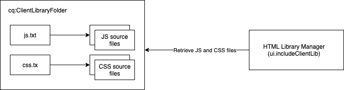

# Använda klientbibliotek på AEM som Cloud Service {#using-client-side-libraries}

Digitala upplevelser är till stor del beroende av bearbetning på klientsidan som styrs av komplex JavaScript- och CSS-kod. Med AEM-bibliotek (klientbibliotek) kan du ordna och centralt lagra dessa klientbibliotek i databasen. I kombination med [frontendbyggprocessen i den AEM projekttypen ](https://docs.adobe.com/content/help/en/experience-manager-core-components/using/developing/archetype/uifrontend.html) blir det enkelt att hantera slutkoden för ditt AEM.

Fördelarna med att använda klienter i AEM är bland annat:

* Kod på klientsidan lagras i databasen precis som all annan programkod och annat innehåll
* Med Clientlibs in AEM kan du samla all CSS och JS i en enda fil
* Visa klientlibs via en sökväg som är tillgänglig via [dispatchern](/help/implementing/dispatcher/disp-overview.md)
* Tillåter omskrivning av sökvägar för refererade filer eller bilder

Clientlibs är den inbyggda lösningen för att leverera CSS och Javascript från AEM.

>[!TIP]
>
>Utvecklare som skapar CSS och Javascript för AEM bör också bekanta sig med [AEM Project Archetype och dess automatiserade front end-byggprocess.](https://docs.adobe.com/content/help/en/experience-manager-core-components/using/developing/archetype/uifrontend.html)

## Vad är klientbibliotek? {#what-are-clientlibs}

Webbplatser kräver JavaScript och CSS samt statiska resurser som ikoner och webbteckensnitt för att kunna bearbetas på klientsidan. En klientlib är AEM som refererar (efter kategori om det behövs) och betjänar sådana resurser.

AEM samlar in webbplatsens CSS och Javascript till en enda fil, på en central plats, för att säkerställa att endast en kopia av en resurs inkluderas i HTML-utdata. Detta maximerar effektiviteten vid leverans och gör att sådana resurser kan underhållas centralt i databasen via proxy, vilket skyddar åtkomsten.

## Front-End-utveckling för AEM som en Cloud Service {#fed-for-aemaacs}

Alla JavaScript-, CSS- och andra frontresurser ska bevaras i modulen [ui.front i AEM Project Archetype.](https://docs.adobe.com/content/help/en/experience-manager-core-components/using/developing/archetype/uifrontend.html) Tack vare den flexibla arkitekturen kan du använda dina moderna webbverktyg för att skapa och hantera dessa resurser.

Arkitypen kan sedan kompilera resurserna till en enda CSS- och JS-fil, och bädda in dem automatiskt i en `cq:clientLibraryFolder` i databasen.

## Mappstruktur för klientbibliotek {#clientlib-folders}

En biblioteksmapp på klientsidan är en databasnod av typen `cq:ClientLibraryFolder`. Dess definition i [CND-notation](https://jackrabbit.apache.org/node-type-notation.html) är

```text
[cq:ClientLibraryFolder] > sling:Folder
  - dependencies (string) multiple
  - categories (string) multiple
  - embed (string) multiple
  - channels (string) multiple
```

* `cq:ClientLibraryFolder` noder kan placeras var som helst i  `/apps` underträdet i databasen.
* Använd egenskapen `categories` för noden för att identifiera de bibliotekskategorier som den tillhör.

Varje `cq:ClientLibraryFolder` fylls med en uppsättning JS- och/eller CSS-filer, tillsammans med några stödfiler (se nedan). Viktiga egenskaper för `cq:ClientLibraryFolder` är konfigurerade enligt följande:

* `allowProxy`: Eftersom alla klientbibliotek måste lagras under  `apps`kan den här egenskapen ge åtkomst till klientbibliotek via en proxyserver. Se [Leta reda på en biblioteksmapp och Använda servern för proxyklientbibliotek](#locating-a-client-library-folder-and-using-the-proxy-client-libraries-servlet) nedan.
* `categories`: Identifierar de kategorier som uppsättningen med JS- och/eller CSS-filer i den här  `cq:ClientLibraryFolder` färgen hamnar i. Med egenskapen `categories`, som är flervärd, kan en biblioteksmapp ingå i mer än en kategori (se nedan hur detta kan vara användbart).

Om klientbiblioteksmappen innehåller en eller flera källfiler som sammanfogas till en enda JS- och/eller CSS-fil vid körning. Den genererade filens namn är nodnamnet med filnamnstillägget `.js` eller `.css`. Till exempel resulterar biblioteksnoden `cq.jquery` i den genererade filen `cq.jquery.js` eller `cq.jquery.css`.

Klientbiblioteksmappar innehåller följande objekt:

* JS- och/eller CSS-källfiler
* Statiska resurser som stöder CSS-format, t.ex. ikoner, webbteckensnitt osv.
* En `js.txt`-fil och/eller en `css.txt`-fil som identifierar de källfiler som ska sammanfogas i de genererade JS- och/eller CSS-filerna



## Skapar biblioteksmappar på klientsidan {#creating-clientlib-folders}

Klientbibliotek måste finnas under `/apps`. Detta för att bättre isolera kod från innehåll och konfiguration.

En proxyserver används för att klientbiblioteken under `/apps` ska vara tillgängliga. Åtkomstkontrollistorna används fortfarande i klientbiblioteksmappen, men med den kan innehållet läsas via `/etc.clientlibs/` om egenskapen `allowProxy` är `true`.

1. Öppna CRXDE Lite i en webbläsare (`https://<host>:<port>/crx/de`).
1. Markera mappen `/apps` och klicka på **Skapa > Skapa nod**.
1. Ange ett namn för biblioteksmappen och välj `cq:ClientLibraryFolder` i listan **Typ**. Klicka på **OK** och sedan på **Spara alla**.
1. Om du vill ange kategorin eller kategorierna som biblioteket tillhör väljer du noden `cq:ClientLibraryFolder`, lägger till följande egenskap och klickar sedan på **Spara alla**:
   * Namn: `categories`
   * Typ: Sträng
   * Värde: Kategorinamnet
   * Flera: Markerad
1. Om du vill att klientbiblioteken ska vara tillgängliga via proxy under `/etc.clientlibs` markerar du noden `cq:ClientLibraryFolder`, lägger till följande egenskap och klickar sedan på **Spara alla**:
   * Namn: `allowProxy`
   * Typ: Boolean
   * Värde: `true`
1. Om du behöver hantera statiska resurser skapar du en undermapp med namnet `resources` nedanför klientbiblioteksmappen.
   * Om du lagrar statiska resurser under mappen `resources` kan de inte refereras till på en publiceringsinstans.
1. Lägg till källfiler i biblioteksmappen.
   * Detta görs vanligtvis i den inledande byggprocessen för [AEM Project Archetype.](https://docs.adobe.com/content/help/en/experience-manager-core-components/using/developing/archetype/uifrontend.html)
   * Du kan ordna källfiler i undermappar om du vill.
1. Markera klientbiblioteksmappen och klicka på **Skapa > Skapa fil**.
1. Skriv något av följande filnamn i rutan Filnamn och klicka på OK:
   * **`js.txt`:** Använd det här filnamnet för att generera en JavaScript-fil.
   * **`css.txt`:** Använd det här filnamnet för att generera en CSS (Cascading Style Sheet).
1. Öppna filen och skriv följande text för att identifiera källfilernas rot:
   * `#base=*[root]*`
   * Ersätt `[root]` med sökvägen till mappen som innehåller källfilerna i förhållande till TXT-filen. Använd till exempel följande text när källfilerna finns i samma mapp som TXT-filen:
      * `#base=.`
   * Följande kod anger roten som mappen mobile under noden `cq:ClientLibraryFolder`:
      * `#base=mobile`
1. På raderna under `#base=[root]` skriver du sökvägarna för källfilerna i förhållande till roten. Placera varje filnamn på en separat rad.
1. Klicka på **Spara alla**.

## Serverar klientbibliotek {#serving-clientlibs}

När klientbiblioteksmappen är [konfigurerad enligt behov](#creating-clientlib-folders) kan dina klienter begäras via proxy. Exempel:

* Du har ett klientlib i `/apps/myproject/clientlibs/foo`
* Du har en statisk bild i `/apps/myprojects/clientlibs/foo/resources/icon.png`

Med egenskapen `allowProxy` kan du begära:

* Klientlib via j`/etc.clientlibs/myprojects/clientlibs/foo.js`
* Den statiska bilden via `/etc.clientlibs/myprojects/clientlibs/foo/resources/icon.png`

### Läser in klientbibliotek via HTML {#loading-via-htl}

När dina klienter har lagrats och hanterats i klientbiblioteksmappen kan de nås via HTML.

Klientbibliotek läses in via en hjälpmall från AEM, som du kommer åt via `data-sly-use`. Hjälpmallar är tillgängliga i den här filen, som kan anropas via `data-sly-call`.

Varje hjälpmall förväntar sig ett `categories`-alternativ för att referera till de önskade klientbiblioteken. Det alternativet kan antingen vara en array med strängvärden eller en sträng som innehåller en kommaseparerad värdelista.

[Mer information om hur du läser in klientlibs via HTML finns i HTML-](https://docs.adobe.com/content/help/en/experience-manager-htl/using/getting-started/getting-started.html#loading-client-libraries) dokumentationen.

<!--
### Setting Cache Timestamps {#setting-cache-timestamps}

This is possible. Still need detail.
-->

## Klientbibliotek på författare jämfört med Publicera {#clientlibs-author-publish}

De flesta klientlibs krävs i den AEM publiceringsinstansen. Det vill säga att de flesta kundens syften är att skapa en användarupplevelse av innehållet. För klientbibliotek på publiceringsinstanser kan [frontendbyggverktygen](#fed-for-aemaacs) användas och distribueras via [klientbiblioteksmappar enligt beskrivningen ovan.](#creating-clientlib-folders)

Det finns dock tillfällen då klientbibliotek kan behövas för att anpassa redigeringsupplevelsen. Om du till exempel anpassar en dialogruta kan det krävas att du distribuerar små bitar av CSS eller JS till AEM.

### Hantera klientbibliotek på författaren {#clientlibs-on-author}

Om du behöver använda klientbibliotek på författaren kan du skapa dina klientbibliotek under `/apps` med samma metoder som för publicering, men skriva det direkt under `/apps/.../clientlibs/foo` i stället för att skapa ett helt projekt för att hantera det.

Du kan sedan&quot;koppla&quot; till JS:t för redigering genom att lägga till dina klientbibliotek i en körklar klientbibliotekskategori.

## Felsökningsverktyg {#debugging-tools}

AEM innehåller flera verktyg för felsökning och testning av klientbiblioteksmappar.

### Identifiera klientbibliotek {#discover-client-libraries}

Komponenten `/libs/cq/granite/components/dumplibs/dumplibs` genererar en sida med information om alla klientbiblioteksmappar i systemet. Noden `/libs/granite/ui/content/dumplibs` har komponenten som en resurstyp. Om du vill öppna sidan använder du följande URL (ändra värd och port efter behov):

`https://<host>:<port>/libs/granite/ui/content/dumplibs.test.html`

Informationen omfattar bibliotekets sökväg och typ (CSS eller JS) samt värdena för biblioteksattributen, t.ex. kategorier och beroenden. Efterföljande tabeller på sidan visar biblioteken i varje kategori och kanal.

### Se Genererade utdata {#see-generated-output}

Komponenten `dumplibs` innehåller en testväljare som visar den källkod som genereras för `ui:includeClientLib`-taggar. Sidan innehåller kod för olika kombinationer av js-, css- och temaattribut.

1. Använd någon av följande metoder för att öppna sidan Testa utdata:
   * På sidan `dumplibs.html` klickar du på länken i texten **Klicka här för utdatatestning**.
   * Öppna följande URL i webbläsaren (använd en annan värd och port efter behov):
      * `http://<host>:<port>/libs/granite/ui/content/dumplibs.html`
   * Standardsidan visar utdata för taggar utan värde för attributet categories.
1. Om du vill visa utdata för en kategori anger du värdet för klientbibliotekets `categories`-egenskap och klickar på **Skicka fråga**.

## Ytterligare funktioner i klientbiblioteksmappen {#additional-features}

Det finns ett antal andra funktioner som stöds av klientbiblioteksmappar i AEM. Dessa är dock inte obligatoriska AEM som Cloud Service och därför bör de inte användas. De listas här för fullständighetens skull.

>[!WARNING]
>
>Dessa extrafunktioner i klientbiblioteksmappar behövs inte AEM som Cloud Service och därför bör de inte användas. De listas här för fullständighetens skull.

### Adobe Granite HTML Library Manager {#html-library-manager}

Ytterligare inställningar för klientbibliotek kan styras via panelen **Adobe Granite HTML Library Manager** i systemkonsolen på `https://<host>:<port>/system/console/configMgr`).

### Ytterligare mappegenskaper {#additional-folder-properties}

Ytterligare mappegenskaper kan styra beroenden och inbäddningar, men behövs vanligtvis inte längre och användningen bör därför inte användas:

* `dependencies`: Det här är en lista över andra klientbibliotekskategorier som den här biblioteksmappen är beroende av. Om till exempel två `cq:ClientLibraryFolder`-noder `F` och `G` krävs en annan fil i `F` för att en fil i `G` ska fungera korrekt, måste minst en av `categories` för `G` vara bland `dependencies` för `F`.
* `embed`: Används för att bädda in kod från andra bibliotek. Om noden `F` bäddar in noderna `G` och `H` blir den resulterande HTML-koden en sammanfogning av innehåll från noderna `G` och `H`.

### Länkar till beroenden {#linking-to-dependencies}

När koden i klientbiblioteksmappen refererar till andra bibliotek identifierar du de andra biblioteken som beroenden. Taggen `ui:includeClientLib` som refererar till klientbiblioteksmappen gör att HTML-koden innehåller en länk till den biblioteksfil som genereras samt beroenden.

Beroenden måste vara en annan `cq:ClientLibraryFolder`. Om du vill identifiera beroenden lägger du till en egenskap i `cq:ClientLibraryFolder`-noden med följande attribut:

* **namn:** beroenden
* **text:** String[]
* **Värden:** Värdet på egenskapen categories för den cq:ClientLibraryFolder-nod som den aktuella biblioteksmappen är beroende av.

`/etc/clientlibs/myclientlibs/publicmain` är till exempel beroende av `cq.jquery`-biblioteket. Sidan som refererar till huvudklientbiblioteket genererar HTML som innehåller följande kod:

```xml
<script src="/etc/clientlibs/foundation/cq.jquery.js" type="text/javascript">
<script src="/etc/clientlibs/mylibs/publicmain.js" type="text/javascript">
```

### Bädda in kod från andra bibliotek {#embedding-code-from-other-libraries}

Du kan bädda in kod från ett klientbibliotek i ett annat klientbibliotek. Vid körning innehåller de genererade JS- och CSS-filerna för inbäddningsbiblioteket koden för det inbäddade biblioteket.

Inbäddning av kod är användbart för att ge åtkomst till bibliotek som lagras i skyddade områden i databasen.

#### Appspecifika klientbiblioteksmappar {#app-specific-client-library-folders}

Det är en god vana att behålla alla programrelaterade filer i programmappen under `/app`. Det är också en god vana att neka åtkomst för webbplatsbesökare till mappen `/app`. Om du vill följa båda de bästa metoderna skapar du en klientbiblioteksmapp under mappen `/etc` som bäddar in klientbiblioteket som är under `/app`.

Använd egenskapen categories för att identifiera klientbiblioteksmappen som ska bäddas in. Om du vill bädda in biblioteket lägger du till en egenskap i noden `cq:ClientLibraryFolder` med följande egenskapsattribut:

* **namn:** bädda in
* **text:** String[]
* **Värde:** Värdet på egenskapen categories för den  `cq:ClientLibraryFolder` nod som ska bäddas in.

#### Använda inbäddning för att minimera begäranden {#using-embedding-to-minimize-requests}

I vissa fall kan du upptäcka att den slutliga HTML-koden som genereras för den typiska sidan av publiceringsinstansen innehåller ett relativt stort antal `<script>`-element.

I sådana fall kan det vara användbart att kombinera all nödvändig klientbibliotekskod till en enda fil så att antalet fram- och tillbaka-begäranden vid sidinläsning minskar. För att göra detta kan du `embed` använda de nödvändiga biblioteken i ditt programspecifika klientbibliotek med hjälp av egenskapen embed för noden `cq:ClientLibraryFolder`.

#### Sökvägar i CSS-filer {#paths-in-css-files}

När du bäddar in CSS-filer använder den genererade CSS-koden sökvägar till resurser som är relativa till inbäddningsbiblioteket. Det offentligt tillgängliga biblioteket `/etc/client/libraries/myclientlibs/publicmain` bäddar in klientbiblioteket `/apps/myapp/clientlib`:

Filen `main.css` innehåller följande format:

```javascript
body {
  padding: 0;
  margin: 0;
  background: url(images/bg-full.jpg) no-repeat center top;
  width: 100%;
}
```

CSS-filen som `publicmain`-noden genererar innehåller följande format med den ursprungliga bildens URL:

```javascript
body {
  padding: 0;
  margin: 0;
  background: url(../../../apps/myapp/clientlib/styles/images/bg-full.jpg) no-repeat center top;
  width: 100%;
}
```

#### Se Inbäddade filer i HTML-utdata {#see-embedded-files}

Om du vill spåra ursprunget för inbäddad kod eller se till att inbäddade klientbibliotek ger det förväntade resultatet, kan du se namnen på de filer som bäddas in under körning. Om du vill visa filnamnen lägger du till parametern `debugClientLibs=true` i webbsidans URL. Biblioteket som skapas innehåller `@import`-satser i stället för den inbäddade koden.

I exemplet i föregående [avsnitt om att bädda in kod från andra bibliotek](#embedding-code-from-other-libraries) bäddar `/etc/client/libraries/myclientlibs/publicmain`-mappen för klientbiblioteket in `/apps/myapp/clientlib`-mappen för klientbiblioteket. Om du lägger till parametern på webbsidan skapas följande länk i webbsidans källkod:

```xml
<link rel="stylesheet" href="/etc/clientlibs/mycientlibs/publicmain.css">
```

När du öppnar `publicmain.css`-filen visas följande kod:

```javascript
@import url("/apps/myapp/clientlib/styles/main.css");
```

1. Lägg till följande text till HTML-adressen i webbläsarens adressruta:
   * `?debugClientLibs=true`
1. Visa sidans källa när sidan läses in.
1. Klicka på länken som anges som href för länkelementet för att öppna filen och visa källkoden.

### Använda förprocessorer {#using-preprocessors}

AEM tillåter anslutningsbara preprocessorer och levereras med stöd för [YUI Compressor](https://github.com/yui/yuicompressor#yui-compressor---the-yahoo-javascript-and-css-compressor) för CSS och JavaScript och [Google Closure Compiler (GCC)](https://developers.google.com/closure/compiler/) för JavaScript med YUI inställt som AEM standardpreprocessor.

De anslutningsbara preprocessorerna möjliggör flexibel användning, inklusive:

* Definiera ScriptProcessors som kan bearbeta skriptkällor
* Processorer kan konfigureras med alternativ
* Processorer kan användas för miniatyrbilder, men även för icke-miniatyrärenden
* clientlib kan definiera vilken processor som ska användas

>[!NOTE]
>
>Som standard använder AEM YUI-kompressor. I [YUI Compressor GitHub-dokumentationen](https://github.com/yui/yuicompressor/issues) finns en lista med kända fel. Om du växlar till GCC-komprimerare för vissa klienter kan vissa problem som uppstår när du använder YUI lösas.

>[!CAUTION]
>
>Placera inte ett miniatyrbibliotek i ett klientbibliotek. Ange i stället Raw-biblioteket och om miniatyrbilder krävs använder du alternativen för preprocessorerna.

#### Användning {#usage}

Du kan välja att konfigurera preprocessorer-konfigurationen per klientbibliotek eller system i hela systemet.

* Lägg till flervärdesegenskaperna `cssProcessor` och `jsProcessor` i klientbiblioteksnoden
* Du kan också definiera systemstandardkonfigurationen via konfigurationen **HTML Library Manager** OSGi

En preprocessorkonfiguration på klientlib-noden har företräde framför OSGI-konfigurationen.

#### Format och exempel {#format-and-examples}

##### Format {#format}

```javascript
config:= mode ":" processorName options*;
mode:= "default" | "min";
processorName := "none" | <name>;
options := ";" option;
option := name "=" value;
```

##### YUI-kompressor för CSS Minification och GCC för JS {#yui-compressor-for-css-minification-and-gcc-for-js}

```javascript
cssProcessor: ["default:none", "min:yui"]
jsProcessor: ["default:none", "min:gcc;compilationLevel=advanced"]
```

##### Typescript to Preprocess and then GCC to Minify and Obfuscate {#typescript-to-preprocess-and-then-gcc-to-minify-and-obfuscate}

```javascript
jsProcessor: [
   "default:typescript",
   "min:typescript",
   "min:gcc;obfuscate=true"
]
```

##### Ytterligare GCC-alternativ {#additional-gcc-options}

```javascript
failOnWarning (defaults to "false")
languageIn (defaults to "ECMASCRIPT5")
languageOut (defaults to "ECMASCRIPT5")
compilationLevel (defaults to "simple") (can be "whitespace", "simple", "advanced")
```

Mer information om GCC-alternativ finns i [GCC-dokumentationen](https://developers.google.com/closure/compiler/docs/compilation_levels).

#### Ange systemstandardminiatyr {#set-system-default-minifier}

YUI anges som standardminifierare i AEM. Följ de här stegen för att ändra detta till GCC.

1. Gå till Apache Felix Config Manager på (`http://<host>:<portY/system/console/configMgr`)
1. Hitta och redigera **Adobe Granite HTML Library Manager**.
1. Aktivera alternativet **Minify** (om det inte redan är aktiverat).
1. Ange **JS-processorns standardkonfigurationer** till `min:gcc`.
   * Alternativ kan skickas om de avgränsas med ett semikolon, t.ex. `min:gcc;obfuscate=true`.
1. Klicka på **Spara** för att spara ändringarna.
