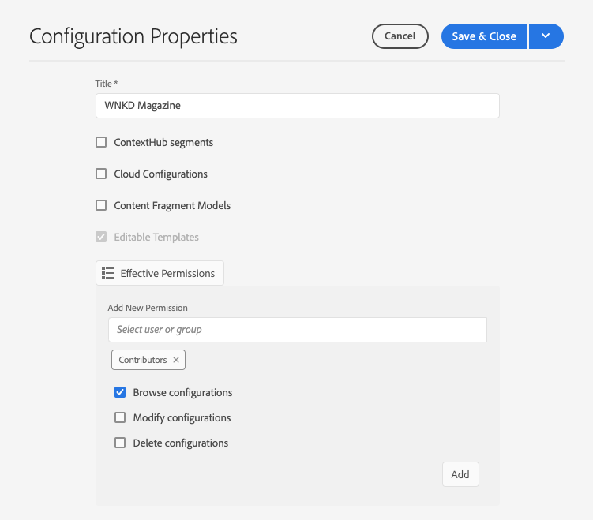

# Konfigurationer och Configuration Browser {#configuration-browser}

AEM konfigurationer används för att hantera inställningar i AEM och fungerar som arbetsytor.

## Vad är en konfiguration? {#what-is-a-configuration}

En konfiguration kan övervägas från två olika vypunkter.

* [En administratör](#configurations-administrator) använder konfigurationer som arbetsytor i AEM för att definiera och hantera grupper av inställningar.
* [En utvecklare](#configurations-developer) använder den underliggande konfigurationsmekanismen som implementerar Sling Context-Aware Configurations för att behålla och slå upp inställningarna i AEM.

Ur administratörens synvinkel är konfigurationer helt enkelt hur du skapar arbetsytor för att hantera inställningar i AEM, medan utvecklaren bör förstå hur AEM består och letar upp dessa konfigurationer i databasen.

Oavsett perspektiv har konfigurationerna två huvudsyften AEM:

* Konfigurationer möjliggör vissa funktioner för användargrupper.
* Konfigurationer definierar åtkomsträttigheter för dessa funktioner.

## Konfigurationer som administratör {#configurations-administrator}

AEM administratör och författare kan betrakta konfigurationer som arbetsytor. De här arbetsytorna kan användas för att samla ihop grupper av inställningar samt tillhörande innehåll för organisering genom att implementera åtkomsträttigheter för dessa funktioner.

Du kan skapa konfigurationer för många olika funktioner i AEM.

* [Molnkonfigurationer](/help/implementing/developing/introduction/configurations.md)
* [Kontextnavsegment](/help/sites-cloud/authoring/personalization/contexthub-segmentation.md)
* [Modeller för innehållsfragment](/help/assets/content-fragments/content-fragments-models.md)
* [Redigerbara mallar](/help/sites-cloud/authoring/features/templates.md)

En administratör kan till exempel skapa två konfigurationer för redigerbara mallar.

* WKND-General
* WKND-Magazine

Administratören kan sedan skapa allmänna sidmallar med WKND-General-konfigurationen och sedan använda mallar som är specifika för tidskriften under WKND-Magazine.

Administratören kan sedan koppla WKND-general till allt innehåll på WKND-webbplatsen. Konfigurationen av WKND-Magazine skulle bara kopplas till tidskriftswebbplatsen.

Genom att göra detta:

* När en skribent skapar en ny sida för tidningen kan han eller hon välja bland allmänna mallar (WKND-General) eller tidskriftsmallar (WKND-Magazine).
* När en innehållsförfattare skapar en ny sida för en annan del av webbplatsen som inte är tidskriften, kan författaren bara välja bland de allmänna mallarna (WKND-General).

Liknande inställningar kan göras inte bara för redigerbara mallar utan även för molnkonfigurationer, ContextHub-segment och Content Fragment-modeller.

### Använda Konfigurationsläsaren {#using-configuration-browser}

Med Configuration Browser kan en administratör enkelt skapa, hantera och konfigurera åtkomsträttigheter för konfigurationer i AEM.

>[!NOTE]
>
>Det är bara möjligt att skapa konfigurationer med hjälp av Konfigurationsläsaren om användaren har `admin` behörighet. `admin` Rättigheter krävs också för att tilldela behörighet till konfigurationen eller på annat sätt ändra en konfiguration.

#### Skapa en konfiguration {#creating-a-configuration}

Det är mycket enkelt att skapa en ny konfiguration i AEM med hjälp av Configuration Browser.

1. Logga in AEM som Cloud Service och välj **Verktyg** -> **Allmänt** -> **Konfigurationsläsare** på huvudmenyn.
1. Tryck eller klicka på **Skapa**.
1. Ange en **titel** och ett **namn** för konfigurationen.

   

   * Titeln **ska vara** beskrivande.
   * Namnet **** blir nodnamnet i databasen.
      * Den genereras automatiskt baserat på titeln och justeras enligt [AEM namnkonventioner.](naming-conventions.md)
      * Den kan vid behov justeras.
1. Kontrollera vilken typ av konfigurationer du vill tillåta.
   * [Molnkonfigurationer](/help/implementing/developing/introduction/configurations.md)
   * [Kontextnavsegment](/help/sites-cloud/authoring/personalization/contexthub-segmentation.md)
   * [Modeller för innehållsfragment](/help/assets/content-fragments/content-fragments-models.md)
   * [Redigerbara mallar](/help/sites-cloud/authoring/features/templates.md)
1. Tryck eller klicka på **Skapa**.

>[!TIP]
>
>Konfigurationer kan vara kapslade.

#### Redigera konfigurationer och deras åtkomsträttigheter {#access-rights}

Om du tänker på konfigurationer som arbetsytor kan åtkomsträttigheter anges för dessa konfigurationer för att framtvinga vem som får och inte får komma åt dessa arbetsytor.

1. Logga in AEM som Cloud Service och välj **Verktyg** -> **Allmänt** -> **Konfigurationsläsare** på huvudmenyn.
1. Markera den konfiguration som du vill ändra och tryck eller klicka sedan på **Egenskaper** i verktygsfältet.
1. Välj eventuella ytterligare funktioner som du vill lägga till i konfigurationen
   >[!NOTE]
   >
   >Det går inte att avmarkera en funktion när konfigurationen har skapats.
1. Använd knappen **Effektiva behörigheter** för att visa en matris med roller och vilka behörigheter de för närvarande har för konfigurationer.
   
1. Om du vill tilldela nya behörigheter anger du användar- eller gruppnamnet i fältet **Välj användare eller grupp** i avsnittet **Lägg till nya behörigheter** .
   * Fältet **Välj användare eller grupp** erbjuder automatisk komplettering baserat på befintliga användare och roller.
1. Välj lämplig användare eller roll bland resultaten för automatisk komplettering.
   * Du kan markera flera användare eller roller.
1. Kontrollera de åtkomstalternativ som de markerade användarna eller rollerna ska ha och klicka på **Lägg till**.
   
1. Upprepa stegen för att välja användare eller roller och tilldela ytterligare åtkomsträttigheter efter behov.
1. Tryck eller klicka på **Spara och stäng** när du är klar.

## Konfigurationer som utvecklare {#configurations-developer}

Som utvecklare är det viktigt att du vet hur AEM som Cloud Service fungerar med konfigurationer och hur den hanterar konfigurationsupplösning.

### Separation av konfiguration och innehåll {#separation-of-config-and-content}

Även om [administratören och användarna kan tänka på konfigurationer som arbetsytor](#configurations-administrator) för att hantera olika inställningar och innehåll, är det viktigt att förstå att konfigurationer och innehåll lagras och hanteras separat av AEM i databasen.

* `/content` är hemma i allt innehåll.
* `/conf` är startsida för all konfiguration.

Innehållet refererar till den associerade konfigurationen via en `cq:conf` egenskap. AEM utför en sökning baserat på innehållet och dess kontextuella `cq:conf` egenskap för att hitta rätt konfiguration.

### Ett enkelt exempel {#example}

I det här exemplet antar vi att du har programkod som är intresserad av DAM-inställningar.

```java
Conf conf = resource.adaptTo(Conf.class);
ValueMap imageServerSettings = conf.getItem("dam/imageserver");
String bgkcolor = imageServerSettings.get("bgkcolor", "FFFFFF");
```

Startpunkten för all konfigurationssökning är en innehållsresurs, vanligtvis någon annanstans under `/content`. Det kan vara en sida, en komponent på en sida, en resurs eller en DAM-mapp. Det här är det innehåll som vi letar efter rätt konfiguration för i det här sammanhanget.

Nu när objektet är `Conf` tillgängligt kan vi hämta det specifika konfigurationsobjekt som vi är intresserade av. I det här fallet är det `dam/imageserver`en samling inställningar som är relaterade till `imageserver`. Samtalet `getItem` returnerar en `ValueMap`. Sedan läser vi en `bgkcolor` strängegenskap och anger standardvärdet FFFFFF om egenskapen (eller hela config-objektet) inte finns.

Nu ska vi titta på motsvarande JCR-innehåll:

```text
/content/dam/wknd
    + jcr:content
      - cq:conf = "/conf/wknd"
    + image.png [dam:Asset]

/conf/wkns
    + settings
      + dam
        + imageserver [cq:Page]
          + jcr:content
            - bgkcolor = "FF0000"
```

I det här exemplet antar vi en WKND-specifik DAM-mapp här och en motsvarande konfiguration. Från och med den mappen `/content/dam/wknd`ser vi att det finns en strängegenskap med namnet `cq:conf` som refererar till konfigurationen som ska användas för underträdet. Egenskapen ställs vanligtvis in på `jcr:content` en resursmapp eller -sida. Dessa `conf` länkar är tydliga, så det är enkelt att följa dem genom att bara titta på innehållet i CRXDE.

Om vi hoppar in `/conf`följer vi referensen och ser att det finns en `/conf/wknd` nod. Detta är en konfiguration. Observera att sökningen är helt genomskinlig för programkoden. Exempelkoden har aldrig någon dedikerad referens till den, den döljs bakom `Conf` objektet. Vilken konfiguration som tillämpas styrs helt av JCR-innehållet.

Vi ser att konfigurationen innehåller en fast namngiven `settings` nod som innehåller de faktiska objekten, inklusive det `dam/imageserver` vi behöver i vårt fall. Ett sådant objekt kan tolkas som ett inställningsdokument och representeras vanligtvis av ett `cq:Page` inklusive ett `jcr:content` innehåll som innehåller det faktiska innehållet.

Slutligen ser vi egenskapen `bgkcolor` som exempelkoden behöver. Det `ValueMap` vi kommer tillbaka från `getItem` baseras på sidans `jcr:content` nod.

### Konfigurationsupplösning {#configuration-resolution}

I det grundläggande exemplet ovan visades en enda konfiguration. Men det finns många fall där du vill ha olika konfigurationer, till exempel en global standardkonfiguration, en som skiljer sig åt för varje varumärke och kanske en specifik konfiguration för dina delprojekt.

Som stöd för detta har konfigurationssökningen i AEM arv- och reservmekanism i följande prioritetsordning:

1. `/conf/<siteconfig>/<parentconfig>/<myconfig>`
   * Specifik konfiguration som refereras från `cq:conf` någonstans i `/content`
   * Hierarkin är godtycklig och kan utformas precis som webbplatsstrukturen, det är inte programkodens sak att veta detta
   * Kan ändras vid körning av användare med konfigurationsprivilegier
1. `/conf/<siteconfig>/<parentconfig>`
   * Bläddra bland föräldrar efter reservkonfigurationer
   * Kan ändras vid körning av användare med konfigurationsprivilegier
1. `/conf/<siteconfig>`
   * Bläddra bland föräldrar efter reservkonfigurationer
   * Kan ändras vid körning av användare med konfigurationsprivilegier
1. `/conf/global`
   * Systemglobala inställningar
   * Vanligtvis globala standardinställningar för din installation
   * Ange efter en `admin` roll
   * Kan ändras vid körning av användare med konfigurationsprivilegier
1. `/apps`
   * Standardinställningar för program
   * Korrigerat med programdistribution
   * Skrivskyddad vid körning
1. `/libs`
   * AEM
   * Endast ändringsbar av Adobe, projektåtkomst tillåts inte
   * Korrigerat med programdistribution
   * Skrivskyddad vid körning

### Använda konfigurationer {#using-configurations}

Konfigurationer i AEM baseras på Sling Context-Aware Configurations. Sling-paketen innehåller ett tjänst-API som kan användas för att få kontextmedvetna konfigurationer. Kontextmedvetna konfigurationer är konfigurationer som är relaterade till en innehållsresurs eller ett resursträd enligt [beskrivningen i föregående exempel.](#example)

Mer information om Context-Aware Configurations, exempel och hur du använder dem [finns i Sling-dokumentationen.](https://sling.apache.org/documentation/bundles/context-aware-configuration/context-aware-configuration.html)

### ConfMgr-webbkonsol {#confmgr-web-console}

För felsökning och testning finns det en **ConfMgr** -webbkonsol på `https://<host>:<port>/system/console/conf`, som kan visa konfigurationer för en viss sökväg/ett visst objekt.


Ange bara:

* **Innehållsbana**
* **Objekt**
* **Användare**

Klicka på **Lös** för att se vilka konfigurationer som är lösta och få exempelkod som löser dessa konfigurationer.

### Kontextmedveten webbkonsol för konfiguration {#context-aware-web-console}

För felsökning och testning finns det en webbkonsol för **kontextmedveten konfiguration** på `https://<host>:<port>/system/console/slingcaconfig`som gör det möjligt att fråga efter kontextmedvetna konfigurationer i databasen och visa deras egenskaper.


Ange bara:

* **Innehållsbana**
* **Konfigurationsnamn**

Klicka på **Lös** för att hämta associerade kontextsökvägar och egenskaper för den valda konfigurationen.
