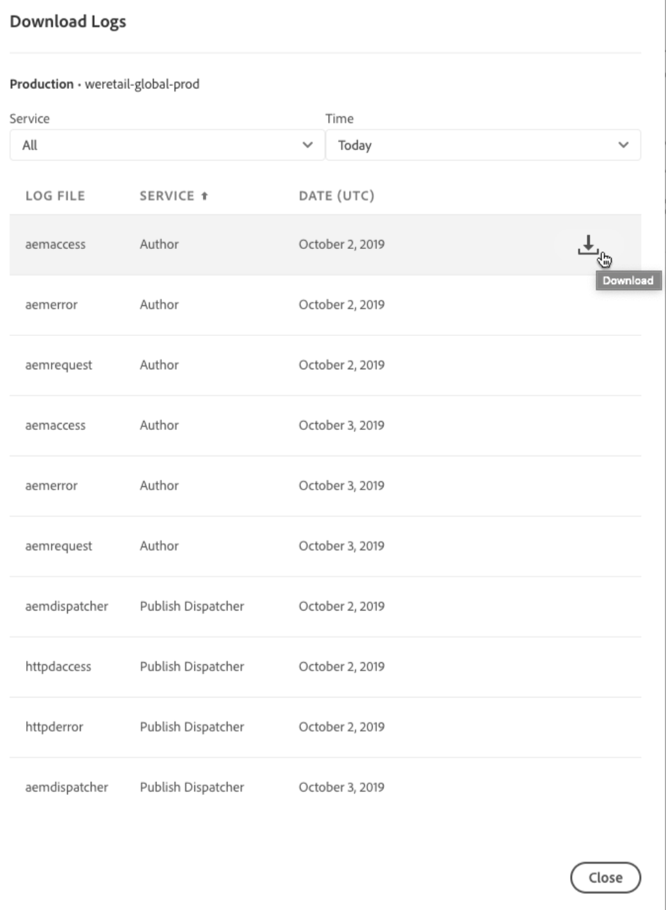

# Loggning{#logging}

AEM som molntjänst är en plattform där kunderna kan inkludera anpassad kod för att skapa unika upplevelser för sina kunder. Med detta i åtanke är loggning en viktig funktion för att felsöka anpassad kod i molnmiljöer och mer specifikt för lokala utvecklingsmiljöer.


<!-- ## Global Logging {#global-logging}

[Apache Sling Logging Configuration](https://sling.apache.org/documentation/development/logging.html#user-configuration---osgi-based) is used to configure the root logger. This defines the global settings for logging in AEM as a Cloud Service:

* the logging level
* the location of the central log file
* the number of versions to be kept
* version rotation; either maximum size or a time interval
* the format to be used when writing the log messages
-->

## AEM som loggning av molntjänster {#aem-as-a-cloud-service-logging}

Med AEM som molntjänst kan du konfigurera:

* globala parametrar för den centrala loggningstjänsten
* begära dataloggning, en särskild loggningskonfiguration för begärandeinformation
* särskilda inställningar för enskilda tjänster

För lokal utveckling skrivs loggposterna till lokala filer i `/crx-quickstart/logs` mappen.

I molnmiljöer kan utvecklare hämta loggar via Cloud Manager eller använda ett kommandoradsverktyg för att avsluta loggarna.

>[!NOTE]
>
>Inloggning av AEM som molntjänst baseras på Sling-principer. Mer information finns i [Sling Logging](https://sling.apache.org/site/logging.html) .

## AEM som Java-loggning i molntjänst {#aem-as-a-cloud-service-java-logging}

### Standardloggare och -författare {#standard-loggers-and-writers}

> [!IMPORTANT]
> Dessa kan anpassas vid behov, men standardkonfigurationen passar de flesta installationer. Om du behöver anpassa standardloggningskonfigurationerna måste du dock se till att du bara gör det i `dev` miljöer.

Vissa loggare och skrivprogram ingår i en standard-AEM som en molninstallation.

Det första är ett specialfall eftersom det styr både `request` - och `access` -loggarna:

* Loggaren:

   * Dataloggning för anpassningsbara Apache Sling-begäranden

      (org.apache.sling.engine.impl.log.RequestLoggerService)

   * Skriv meddelanden om att begära innehåll till `request.log`.

* Länkar till:

   * Apache Sling Request Logger

      (org.apache.sling.engine.impl.log.RequestLogger)

   * Skriver meddelanden till antingen `request.log` eller `access.log`.

De andra paren följer standardkonfigurationen:

* Loggaren:

   * Konfiguration av loggningsloggare för Apache Sling

      (org.apache.sling.Commons.log.LogManager.factory.config)

   * Skriver `Information` meddelanden till `logs/error.log`.

* Länkar till skrivprogrammet:

   * Konfiguration av skrivprogram för Apache Sling Logging

      (org.apache.sling.Commons.log.LogManager.factory.writer)

* Loggaren:

   * Konfiguration av Apache Sling Logging Logger (org.apache.sling.Commons.log.LogManager.factory.config.649d51b7-6425-45c9-81e6-2697a03d6be7)

   * Skriver `Warning` meddelanden till `../logs/error.log` för tjänsten `org.apache.pdfbox`.

* Länkar inte till ett specifikt skrivprogram, så skapar och använder ett implicit skrivprogram med standardkonfiguration (daglig loggrotation).

**AEM som loggning av HTTP-begäran om molntjänst**

Alla åtkomstbegäranden till AEM WCM och databasen registreras här.

Exempelutdata:

**AEM HTTP Request/Response Access Logging**

Varje åtkomstbegäran registreras här tillsammans med svaret.

Exempelutdata:

**Apache Web Server/Dispatcher Logging**

Detta är en logg som används för felsökning av Dispatcher-problem. Mer information finns i [Felsöka konfigurationen](https://docs.adobe.com/content/help/en/experience-manager-cloud-service/implementing/)av Apache och Dispatcher.

<!-- Besides the three types of logs present on an AEM as a Cloud Service instance (`request`, `access` and `error` logs) there is another dispatcher/overview.html#debugging-apache-and-dispatcher-configuration.

leftover text from the last breakaway chunk (re dispatcher) -->

När det gäller god praxis rekommenderar vi att du anpassar dig till de konfigurationer som för närvarande finns i AEM som en molntjänstdeformattyp. Dessa anger olika logginställningar och nivåer för olika miljötyper:

* för `local dev` och `dev` i miljöer ställer du in loggningsvärdet på nivån **DEBUG** på `error.log`
* för `stage`anger du **WARN** -nivån till `error.log`
* for `prod`, ställ in logger på **ERROR** -nivå på `error.log`

Se exempel nedan för varje konfiguration:

* `dev` miljöer:

```
<?xml version="1.0" encoding="UTF-8"?>
<jcr:root xmlns:sling="http://sling.apache.org/jcr/sling/1.0"
    xmlns:jcr="http://www.jcp.org/jcr/1.0" jcr:primaryType="sling:OsgiConfig"
    org.apache.sling.commons.log.level="debug"
    org.apache.sling.commons.log.names="[com.mycompany.myapp]" />
```


* `stage` miljöer:

```
<?xml version="1.0" encoding="UTF-8"?>
<jcr:root xmlns:sling="http://sling.apache.org/jcr/sling/1.0"
    xmlns:jcr="http://www.jcp.org/jcr/1.0" jcr:primaryType="sling:OsgiConfig"
    org.apache.sling.commons.log.level="warn"
    org.apache.sling.commons.log.names="[com.mycompany.myapp]" />
```

* `prod` miljöer:

```
<?xml version="1.0" encoding="UTF-8"?>
<jcr:root xmlns:sling="http://sling.apache.org/jcr/sling/1.0"
    xmlns:jcr="http://www.jcp.org/jcr/1.0" jcr:primaryType="sling:OsgiConfig"
    org.apache.sling.commons.log.level="error"
    org.apache.sling.commons.log.names="[com.mycompany.myapp]" />
```

### Loggare och skribenter för enskilda tjänster {#loggers-and-writers-for-individual-services}

Förutom de globala loggningsinställningarna kan du med AEM som molntjänst konfigurera specifika inställningar för en enskild tjänst:

* den specifika loggningsnivån
* loggaren (OSGi-tjänsten som tillhandahåller loggmeddelanden)

På så sätt kan du kanalisera loggmeddelanden för en enskild tjänst till en separat fil. Detta kan vara särskilt användbart under utveckling eller testning. om du till exempel behöver en högre loggnivå för en viss tjänst.

AEM som en molntjänst använder följande för att skriva loggmeddelanden till filen:

1. En **OSGi-tjänst** (logger) skriver ett loggmeddelande.
1. En **loggningsloggare** tar det här meddelandet och formaterar det enligt din specifikation.
1. En **loggningsskrivare** skriver alla dessa meddelanden till den fysiska filen som du har definierat.

Dessa element är länkade med följande parametrar för de relevanta elementen:

* **Logger (loggningslogg)**

   Definiera de tjänster som genererar meddelandena.

<!-- * **Log File (Logging Logger)**

  Define the physical file for storing the log messages.

  This is used to link a Logging Logger with a Logging Writer. The value must be identical to the same parameter in the Logging Writer configuration for the connection to be made.

* **Log File (Logging Writer)**

  Define the physical file that the log messages will be written to.

  This must be identical to the same parameter in the Logging Writer configuration, or the match will not be made. If there is no match then an implicit Writer will be created with default configuration (daily log rotation).
-->

## Ange loggnivå {#setting-the-log-level}

Om du vill ändra loggnivåerna för molnmiljöer bör du ändra Sling Logging OSGI-konfigurationen, följt av en fullständig omdistribution. Eftersom detta inte sker omedelbart bör du vara försiktig med att aktivera utförliga loggar i produktionsmiljöer som tar emot mycket trafik. I framtiden kan det finnas mekanismer för att snabbare ändra loggnivån.

>[!NOTE]
>
> För att kunna utföra de konfigurationsändringar som anges nedan måste du skapa dem i en lokal utvecklingsmiljö och sedan överföra dem till en AEM-instans som en molntjänst. Mer information om hur du gör detta finns i [Distribuera till AEM som en molntjänst](/help/implementing/deploying/overview.md).

### Aktivera felsökningsloggnivån {#activating-the-debug-log-level}

>[!WARNING]
>
> Om du aktiverar loggnivån DEBUG globalt genereras en stor mängd information som är svår att gå igenom. Vi rekommenderar att du bara aktiverar den för de tjänster som kräver felsökning. Mer information finns i [Loggare and Writers for Individual Services](logging.md#loggers-and-writers-for-individual-services).

Standardloggnivån är INFO, d.v.s. DEBUG-meddelanden loggas inte.
Om du vill aktivera DEBUG-loggnivån anger du

``` /libs/sling/config/org.apache.sling.commons.log.LogManager/org.apache.sling.commons.log.level ```

egenskap som ska felsökas. Lämna inte loggen på DEBUG-loggnivån längre än nödvändigt eftersom den genererar många loggar.
En rad i felsökningsfilen börjar oftast med DEBUG och anger sedan loggnivån, installationsåtgärden och loggmeddelandet. Till exempel:

``` DEBUG 3 WebApp Panel: WebApp successfully deployed ```

Loggnivåerna är följande:

| 0 | Allvarligt fel | Åtgärden misslyckades och installationsprogrammet kan inte fortsätta. |
|---|---|---|
| 1 | Fel | Åtgärden misslyckades. Installationen fortsätter, men en del av CRX installerades inte korrekt och kommer inte att fungera. |
| 2 | Varning | Åtgärden har slutförts men problem uppstod. CRX fungerar eventuellt inte korrekt. |
| 3 | Information | Åtgärden har slutförts. |

### Skapa egna loggare och författare {#creating-your-own-loggers-and-writers}

Du kan definiera ett eget par för loggare/skrivare:

1. Skapa en ny instans av loggningskonfigurationen [för](https://sling.apache.org/documentation/development/logging.html#user-configuration---osgi-based)Apache Sling-loggning för fabrikskonfiguration.

   1. Ange loggaren.

<!-- 1. Create a new instance of the Factory Configuration [Apache Sling Logging Writer Configuration](https://sling.apache.org/documentation/development/logging.html#user-configuration---osgi-based).

    1. Specify the Log File - this must match that specified for the Logger.
    1. Configure the other parameters as required. -->

### Konfigurera loggning {#configure-logging}

>[!NOTE]
>
>När du arbetar med Adobe Experience Manager finns det flera metoder för att hantera konfigurationsinställningarna för sådana tjänster.

I vissa fall kanske du vill skapa en anpassad logg med en annan loggnivå. Du kan göra detta i databasen genom att:

1. Om den inte redan finns skapar du en ny konfigurationsmapp ( `sling:Folder`) för projektet `/apps/<*project-name*>/config`.
1. Under `/apps/<*project-name*>/config`skapar du en nod för den nya konfigurationen för loggningsloggning för Apache Sling:

   * Namn: `org.apache.sling.commons.log.LogManager.factory.config-<*identifier*>` (eftersom detta är en loggare)

      Där `<*identifier*>` ersätts av fri text som du (måste) anger för att identifiera förekomsten (du kan inte utelämna den här informationen).

      Till exempel, `org.apache.sling.commons.log.LogManager.factory.config-MINE`

   * Typ: `sling:OsgiConfig`
   >[!NOTE]
   >
   >Även om det inte är ett tekniskt krav är det tillrådligt att göra `<*identifier*>` unikt.

<!-- 1. Set the following properties on this node:

    * Name: `org.apache.sling.commons.log.file`

      Type: String

      Value: specify the Log File; for example, `logs/myLogFile.log`

    * Name: `org.apache.sling.commons.log.names`

      Type: String[] (String + Multi)

      Value: specify the OSGi services for which the Logger is to log messages; for example, all of the following:

        * `org.apache.sling`
        * `org.apache.felix`
        * `com.day`

    * Name: `org.apache.sling.commons.log.level`

      Type: String

      Value: specify the log level required ( `debug`, `info`, `warn` or `error`); for example `debug`

    * Configure the other parameters as required:

        * Name: `org.apache.sling.commons.log.pattern`

          Type: `String`

          Value: specify the pattern of the log message as required; for example,

          `{0,date,dd.MM.yyyy HH:mm:ss.SSS} *{4}* [{2}] {3} {5}`

   >[!NOTE]
   >
   >`org.apache.sling.commons.log.pattern` supports up to six arguments.

   >
   >
   >{0} The timestamp of type `java.util.Date`
   >{1} the log marker
   >{2} the name of the current thread
   >{3} the name of the logger
   >{4} the log level
   >{5} the log message

   >
   >
   >If the log call includes a `Throwable` the stacktrace is appended to the message.

   >[!CAUTION]
   >
   >org.apache.sling.commons.log.names must have a value.

   >[!NOTE]
   >
   >Log writer paths are relative to the `crx-quickstart` location.
   >
   >
   >Therefore, a log file specified as:
   >
   >
   >`logs/thelog.log`

   >
   >
   >writes to:
   >
   >
   >`` ` ` `<*cq-installation-dir*>/``crx-quickstart/logs/thelog.log`.
   >
   >
   >And a log file specified as:
   >
   >
   >`../logs/thelog.log`

   >
   >
   >writes to a directory:
   >
   >
   >` <*cq-installation-dir*>/logs/`
   >``(i.e. next to ` `<*cq-installation-dir*>/`crx-quickstart/`)
 -->

<!-- open question: see if we need to leave the above warning note in place, but adjust it so that it doesn't mention filenames -->

<!-- 1. This step is only necessary when a new Writer is required (i.e. with a configuration that is different to the default Writer).

   >[!CAUTION]
   >
   >A new Logging Writer Configuration is only required when the existing default is not suitable.

   >
   >
   >If no explicit Writer is configured the system will automatically generate an implicit Writer based on the default.

   Under `/apps/<*project-name*>/config`, create a node for the new `Apache Sling Logging Writer` Configuration:

    * Name: `org.apache.sling.commons.log.LogManager.factory.writer-<*identifier*>` (as this is a Writer)

      As with the Logger, `<*identifier*>` is replaced by free text that you (must) enter to identify the instance (you cannot omit this information). For example, `org.apache.sling.commons.log.LogManager.factory.writer-MINE`

    * Type: `sling:OsgiConfig`

   >[!NOTE]
   >
   >Although not a technical requirement, it is advisable to make `<*identifier*>` unique.

   Set the following properties on this node:

    * Name: `org.apache.sling.commons.log.file`

      Type: `String`

      Value: specify the Log File so that it matches the file specified in the Logger;

      for this example, `../logs/myLogFile.log`.

    * Configure the other parameters as required:

        * Name: `org.apache.sling.commons.log.file.number`

          Type: `Long`

          Value: specify the number of log files you want kept; for example, `5`

        * Name: `org.apache.sling.commons.log.file.size`

          Type: `String`

          Value: specify as required to control file rotation by size/date; for example, `'.'yyyy-MM-dd`

   >[!NOTE]
   >
   >`org.apache.sling.commons.log.file.size` controls the rotation of the log file by setting either:
   >
   >* a maximum file size
   >* a time/date schedule
   >
   >to indicate when a new file will be created (and the existing file renamed according to the name pattern).
   >
   >* A size limit can be specified with a number. If no size indicator is given, then this is taken as the number of bytes, or you can add one of the size indicators - `KB`, `MB`, or `GB` (case is ignored).
   >* A time/date schedule can be specified as a `java.util.SimpleDateFormat` pattern. This defines the time period after which the file will be rotated; also the suffix appended to the rotated file (for identification).
   >
   >The default is '.'yyyy-MM-dd (for daily log rotation).
   >
   >So for example, at midnight of January 20th 2010 (or when the first log message after this occurs to be precise), ../logs/error.log will be renamed to ../logs/error.log.2010-01-20. Logging for the 21st of January will be output to (a new and empty) ../logs/error.log until it is rolled over at the next change of day.
   >
   >      | `'.'yyyy-MM` |Rotation at the beginning of each month |
   >      |---|---|
   >      | `'.'yyyy-ww` |Rotation at the first day of each week (depends on the locale). |
   >      | `'.'yyyy-MM-dd` |Rotation at midnight each day. |
   >      | `'.'yyyy-MM-dd-a` |Rotation at midnight and midday of each day. |
   >      | `'.'yyyy-MM-dd-HH` |Rotation at the top of every hour. |
   >      | `'.'yyyy-MM-dd-HH-mm` |Rotation at the beginning of every minute. |
   >
   >      Note: When specifying a time/date:
   >      1. You should "escape" literal text within a pair of single quotes (' ');
   >      this is to avoid certain characters being interpreted as pattern letters.
   >      1. Only use characters allowed for a valid file name anywhere in the option.

1. Read your new log file with your chosen tool.

   The log file created by this example will be `../crx-quickstart/logs/myLogFile.log`. -->

Felix Console innehåller även information om stöd för loggning på `../system/console/slinglog`. till exempel `https://localhost:4502/system/console/slinglog`.draw

## Komma åt och hantera loggar {#manage-logs}

Användare kan komma åt en lista över tillgängliga loggfiler för den valda miljön med hjälp av miljökortet.  Användarna kan komma åt en lista över tillgängliga loggfiler för den valda miljön.

De här filerna kan hämtas via användargränssnittet, antingen från **översiktssidan** .


Eller **miljösidan** :


>[!Note]
>Oavsett var den öppnas visas samma dialogruta så att du kan hämta en enskild loggfil.




### Loggar via API {#logs-thorugh-api}

Förutom att hämta loggar via användargränssnittet är loggar tillgängliga via API:t och kommandoradsgränssnittet.

Om du till exempel vill hämta loggfilerna för en viss miljö, skulle kommandot vara något alldeles för stort som raderna i

```java
$ aio cloudmanager:download-logs --programId 5 1884 author aemerror
```

Med följande kommando kan du anpassa loggar:

```java
$ aio cloudmanager:tail-log --programId 5 1884 author aemerror
```

För att få tillgång till miljö-ID (1884 i det här fallet) och tillgängliga service- eller loggnamnsalternativ kan du använda:

```java
$ aio cloudmanager:list-environments
Environment Id Name                     Type  Description                          
1884           FoundationInternal_dev   dev   Foundation Internal Dev environment  
1884           FoundationInternal_stage stage Foundation Internal STAGE environment
1884           FoundationInternal_prod  prod  Foundation Internal Prod environment
 
 
$ aio cloudmanager:list-available-log-options 1884
Environment Id Service    Name         
1884           author     aemerror     
1884           author     aemrequest   
1884           author     aemaccess    
1884           publish    aemerror     
1884           publish    aemrequest   
1884           publish    aemaccess    
1884           dispatcher httpderror   
1884           dispatcher aemdispatcher
1884           dispatcher httpdaccess
```

>[!Note]
>Det går att hämta **loggfiler** både via användargränssnittet och API:t, men **loggspårning** är bara API/CLI.

### Ytterligare resurser {#resources}

Mer information om API:t för Cloud Manager och Adobe I/O CLI finns i följande extraresurser:

* [API-dokumentation för Cloud Manager](https://www.adobe.io/apis/experiencecloud/cloud-manager/docs.html)
* [Adobe I/O CLI](https://github.com/adobe/aio-cli-plugin-cloudmanager)