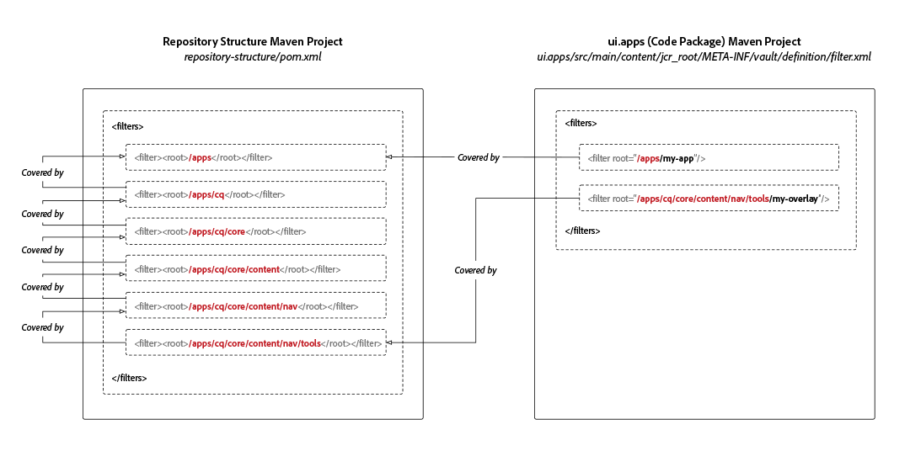

# Strukturpaket för AEM-projektdatabas

Maven-projekt för Adobe Experience Manager som Cloud Service kräver en underpaketsdefinition för databasstruktur vars enda syfte är att definiera de JCR-databasrötter som projektets kodunderpaket distribueras till. Detta garanterar att installationen av paket i Experience Manager som en Cloud Service automatiskt beställs av JCR-resursberoenden. Saknade beroenden kan leda till scenarier där understrukturer installeras före sina överordnade strukturer och därför tas bort oväntat, vilket bryter distributionen.

Om kodpaketet distribueras till en plats som **inte täcks** av kodpaketet måste alla överordnade resurser (JCR-resurser som ligger närmare JCR-roten) räknas upp i databasstrukturpaketet för att dessa beroenden ska kunna etableras.



Databasstrukturpaketet definierar det förväntade, vanliga tillståndet `/apps` som paketvalideraren använder för att fastställa områden som är&quot;säkra från potentiella konflikter&quot; när de är standardrötter.

De vanligaste sökvägarna som ska inkluderas i databasstrukturpaketet är:

+ `/apps` som är en systemansluten nod
+ `/apps/cq/...`, `/apps/dam/...`, `/apps/wcm/...`och `/apps/sling/...` som innehåller gemensamma övertäckningar för `/libs`.
+ `/apps/settings` som är den delade kontextmedvetna konfigurationsrotsökvägen

Observera att det här underpaketet **inte har** något innehåll och att det endast består av en `pom.xml` definition av filterrötterna.

## Skapa databasstrukturpaketet

Om du vill skapa ett databasstrukturpaket för ditt Maven-projekt skapar du ett nytt tomt Maven-underprojekt med följande `pom.xml`och uppdaterar projektets metadata så att de överensstämmer med det överordnade Maven-projektet.

Uppdatera filen så `<filters>` att den innehåller alla sökvägar till JCR-databasen som dina kodpaket distribueras till.

Se till att du lägger till det nya delprojektet Maven i `<modules>` listan över överordnade projekt.

```xml
<?xml version="1.0" encoding="UTF-8"?>
<project xmlns="http://maven.apache.org/POM/4.0.0" xmlns:xsi="http://www.w3.org/2001/XMLSchema-instance" xsi:schemaLocation="http://maven.apache.org/POM/4.0.0 http://maven.apache.org/maven-v4_0_0.xsd">
    <modelVersion>4.0.0</modelVersion>

    <!-- ====================================================================== -->
    <!-- P A R E N T  P R O J E C T  D E S C R I P T I O N                      -->
    <!-- ====================================================================== -->
    <parent>
        <groupId>com.my-company</groupId>
        <artifactId>my-app</artifactId>
        <version>x.x.x</version>
        <relativePath>../pom.xml</relativePath>
    </parent>

    <!-- ====================================================================== -->
    <!-- P R O J E C T  D E S C R I P T I O N                                   -->
    <!-- ====================================================================== -->
    <artifactId>ui.apps.structure</artifactId>
    <packaging>content-package</packaging>
    <name>UI Apps Structure - Repository Structure Package for /apps</name>

    <description>
        Empty package that defines the structure of the Adobe Experience Manager repository the code packages in this project deploy into.
        Any roots in the code packages of this project should have their parent enumerated in the filters list below.
    </description>

    <build>
        <plugins>
            <plugin>
                <groupId>org.apache.jackrabbit</groupId>
                <artifactId>filevault-package-maven-plugin</artifactId>
                <extensions>true</extensions>
                <properties>
                    <!-- Set Cloud Manager Target to none, else this package will be deployed and remove all defined filter roots -->
                    <cloudManagerTarget>none</cloudManagerTarget>
                </properties>
                <configuration>
                    <properties>
                        <!-- Set Cloud Manager Target to none, else this package will be deployed and remove all defined filter roots -->
                        <cloudManagerTarget>none</cloudManagerTarget>
                    </properties>
                    <filters>

                        <!-- /apps root -->
                        <filter><root>/apps</root></filter>

                        <!--
                        Examples of complex roots


                        Overlays of /libs typically require defining the overlayed structure, at each level here.

                        For example, adding a new section to the main AEM Tools navigation, necessitates the following rules:

                        <filter><root>/apps/cq</root></filter>
                        <filter><root>/apps/cq/core</root></filter>
                        <filter><root>/apps/cq/core/content</root></filter>
                        <filter><root>/apps/cq/core/content/nav/</root></filter>
                        <filter><root>/apps/cq/core/content/nav/tools</root></filter>


                        Any /apps level Context-aware configurations need to enumerated here. 
                        
                        For example, providing email templates under `/apps/settings/notification-templates/com.day.cq.replication` necessitates the following rules:

                        <filter><root>/apps/settings</root></filter>
                        <filter><root>/apps/settings/notification-templates</root></filter>
                        <filter><root>/apps/settings/notification-templates/com.day.cq.replication</root></filter>
                        -->

                    </filters>
                </configuration>
            </plugin>
        </plugins>
    </build>
</project>
```

## Referera till databasstrukturpaketet

Om du vill använda strukturpaketet för databasen refererar du till det via alla kodpaket (underpaket som distribueras till `/apps`) Maven-projekt via `<repositoryStructurePackage>` konfigurationen för innehållspaketet Maven.

I `ui.apps/pom.xml`och andra kodpaket lägger du `pom.xml`till en referens till projektets konfiguration för databasstrukturpaket (#database-structure-package) i plugin-programmet för FileVault-paketet Maven.

```xml
...
<build>
  <plugins>
    <plugin>
      <groupId>org.apache.jackrabbit</groupId>
      <artifactId>filevault-package-maven-plugin</artifactId>
      <extensions>true</extensions>
      <configuration>
        ...
        <repositoryStructurePackages>
          <repositoryStructurePackage>
              <groupId>${project.groupId}</groupId>
              <artifactId>ui.apps.structure</artifactId>
              <version>${project.version}</version>
          </repositoryStructurePackage>
        </repositoryStructurePackages>
      </configuration>
    </plugin>
    ...
</build>
<dependencies>
    <!-- Add the dependency for the repository structure package so it resolves -->
    <dependency>
        <groupId>${project.groupId}</groupId>
        <artifactId>ui.apps.structure</artifactId>
        <version>${project.version}</version>
        <type>zip</type>
    </dependency>
    ...
</dependencies>
```

## Användningsfall för paket med flera koder

Ett mindre vanligt och mer komplicerat användningsfall är stöd för driftsättning av flera kodpaket som installeras i samma områden i JCR-databasen.

Till exempel:

+ Kodpaket A distribuerar till `/apps/a`
+ Kodpaket B distribueras till `/apps/a/b`

Om ett beroende på paketnivå inte har etablerats från kodpaket B i kodpaket A, kan kodpaket B distribueras först till `/apps/a`, följt av kodpaket B, som distribueras till `/apps/a`, vilket resulterar i att det tidigare installerade paketet tas bort `/apps/a/b`.

I detta fall:

+ Kodpaket A ska definiera en `<repositoryStructurePackage>` i projektets databasstrukturpaket (som ska ha ett filter för `/apps`).
+ Kodpaket B ska definiera ett `<repositoryStructurePackage>` kodpaket för A, eftersom kodpaket B distribueras till ett utrymme som delas av kodpaket A.

## Fel och felsökning

Om databasstrukturpaketen inte är korrekt konfigurerade, kommer ett fel att rapporteras när Maven bygger:

```
1 error(s) detected during dependency analysis.
Filter root's ancestor '/apps/some/path' is not covered by any of the specified dependencies.
```

Detta anger att det inte finns någon kod `<repositoryStructurePackage>` som listas `/apps/some/path` i dess filterlista.

## Ytterligare resurser

+ [Plugin-programmet FileVault Content Package Maven](http://jackrabbit.apache.org/filevault-package-maven-plugin/)
