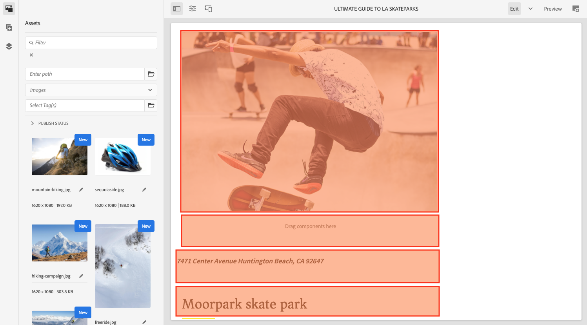

# Struktur för AEM {#structure-of-the-aem-ui}

Det AEM användargränssnittet har flera bakomliggande principer och består av flera nyckelelement:

## Konsoler {#consoles}

### Grundläggande layout och storleksändring {#basic-layout-and-resizing}

Gränssnittet fungerar både för mobila och stationära enheter, men i stället för att skapa två format använder AEM ett format som fungerar för alla skärmar och enheter.

Alla moduler använder samma grundläggande layout, AEM detta kan ses som:

Layouten följer en responsiv designstil och anpassas till storleken på enheten/fönstret som du använder.

Om upplösningen till exempel ligger under 1 024 px (som på en mobil enhet) justeras skärmen därefter:

### Sidhuvudsfält {#header-bar}

Rubrikraden visar globala element som:

* logotypen och den specifika produkt/lösning som du för närvarande använder; för AEM utgör detta också en länk till den globala navigeringen
* Sökning
* Ikon för att komma åt hjälpresurserna
* Ikon för att komma åt andra lösningar
* En indikator för (och åtkomst till) alla varningar eller inkorgsobjekt som väntar på dig
* Användarikonen tillsammans med en länk till din profilhantering

### Toolbar {#toolbar}

Verktygsfältet är sammanhangsberoende för din plats och de ytverktyg som är relevanta för att styra vyn eller resurserna på sidan nedan. Verktygsfältet är produktspecifikt, men det finns vissa gemensamma element.

Alla tillgängliga åtgärder visas i verktygsfältet:

Beroende på om en resurs är markerad:

### Vänster linje {#left-rail}

Den vänstra listen kan öppnas/döljas efter behov för att visa:

* **Endast innehåll**
* **Innehållsträd**
* **Tidslinje**
* **Referenser**
* **Filter**

Standardvärdet är Endast **innehåll** (dold räl).

## Sidredigering {#page-authoring}

När du skapar sidor är de strukturella områdena följande.

### Innehållsram {#content-frame}

Sidinnehållet återges i innehållsramen. Innehållsramen är helt oberoende av redigeraren för att säkerställa att det inte finns några konflikter på grund av CSS eller javascript.

Innehållsramen finns till höger i fönstret, under verktygsfältet.

### Redigeringsram {#editor-frame}

Redigeringsramen aktiverar redigeringsfunktionerna.

Redigeringsramen är en behållare (abstrakt) för alla sidredigeringselement. Den ligger ovanpå innehållsramen och innehåller:

* Det övre verktygsfältet
* Sidpanelen
* Alla övertäckningar
* Alla andra sidredigeringselement. komponentens verktygsfält

### Side Panel {#side-panel}

Det här innehåller tre standardflikar. På flikarna **Resurser** och **Komponenter** kan du markera sådana element och dra dem från panelen och släppa dem på sidan. På fliken **Innehållsträd** kan du inspektera innehållshierarkin på sidan.

Sidpanelen är dold som standard. När det här alternativet är markerat visas det antingen på vänster sida, eller glida över för att täcka hela fönstret när fönsterstorleken är under bredden 1024px. till exempel på en mobil enhet.

### Side Panel - Assets {#side-panel-assets}

På fliken Resurser kan du välja bland flera resurser. Du kan också filtrera efter en viss term eller välja en grupp.

### Sida - Resursgrupper {#side-panel-asset-groups}

På fliken Resurser finns det en listruta där du kan välja specifika resursgrupper.

### Side Panel - Components {#side-panel-components}

På fliken Komponenter kan du välja bland komponenterna. Du kan också filtrera efter en viss term eller välja en grupp.

### Panelen Sida - Innehållsträd {#side-panel-content-tree}

På fliken Innehållsträd kan du visa hierarkin med innehåll på sidan. Om du klickar på en post på fliken flyttas den till och markerar objektet på sidan i redigeraren.

### Övertäckningar {#overlays}

Dessa täcker innehållsramen och används av [lagren](#layer) för att realisera mekanismerna för hur du kan interagera (helt genomskinligt) med komponenterna och deras innehåll.

Övertäckningarna finns i redigerarramen (med alla andra sidredigeringselement), även om de faktiskt täcker över rätt komponenter i innehållsramen.

### Lager {#layer}

Ett lager är ett oberoende funktionspaket som kan aktiveras för att:

* Ange en annan vy av sidan
* Tillåt att du manipulerar och/eller interagerar med en sida

Lagren har avancerade funktioner för hela sidan, i motsats till specifika åtgärder för en enskild komponent.

AEM innehåller flera lager som redan har implementerats för sidredigering, som till exempel redigerar, förhandsgranskar och kommenterar lager.

>[!NOTE]
>
>Lager är ett kraftfullt koncept som påverkar hur användaren ser på och interagerar med sidinnehållet. När du utvecklar egna lager måste du se till att lagret rensas när det avslutas.

### Lagerväxlare {#layer-switcher}

Med lagerväljaren kan du välja det lager som du vill använda. När det är stängt visas det lager som används.

Lagerväljaren är tillgänglig som en listruta från verktygsfältet (längst upp i fönstret, i redigeringsramen).

### Komponentverktygsfältet {#component-toolbar}

Varje instans av en komponent visar verktygsfältet när användaren klickar på det (antingen en gång eller med ett långsamt dubbelklick). Verktygsfältet innehåller de specifika åtgärder (t.ex. kopiera, klistra in, öppna redigeringsprogram) som är tillgängliga för komponentinstansen på sidan.

Beroende på vilket utrymme som är tillgängligt placeras komponentens verktygsfält i det övre, eller nedre, högra hörnet av respektive komponent.

## Ytterligare information {#further-information}

<!--For more details about the concepts around the touch-enabled UI, continue to the article [Concepts of the AEM Touch-Enabled UI](/help/sites-developing/touch-ui-concepts.md).-->

Mer teknisk information finns i [JS-dokumentationen som angetts](https://helpx.adobe.com/experience-manager/6-5/sites/developing/using/reference-materials/jsdoc/ui-touch/editor-core/index.html) för sidredigeraren.
