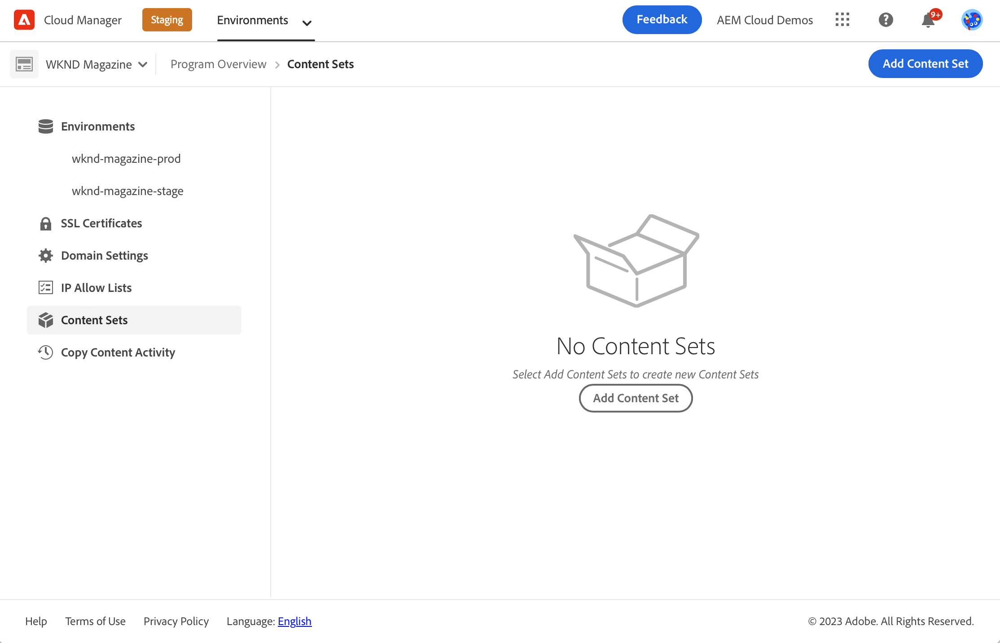
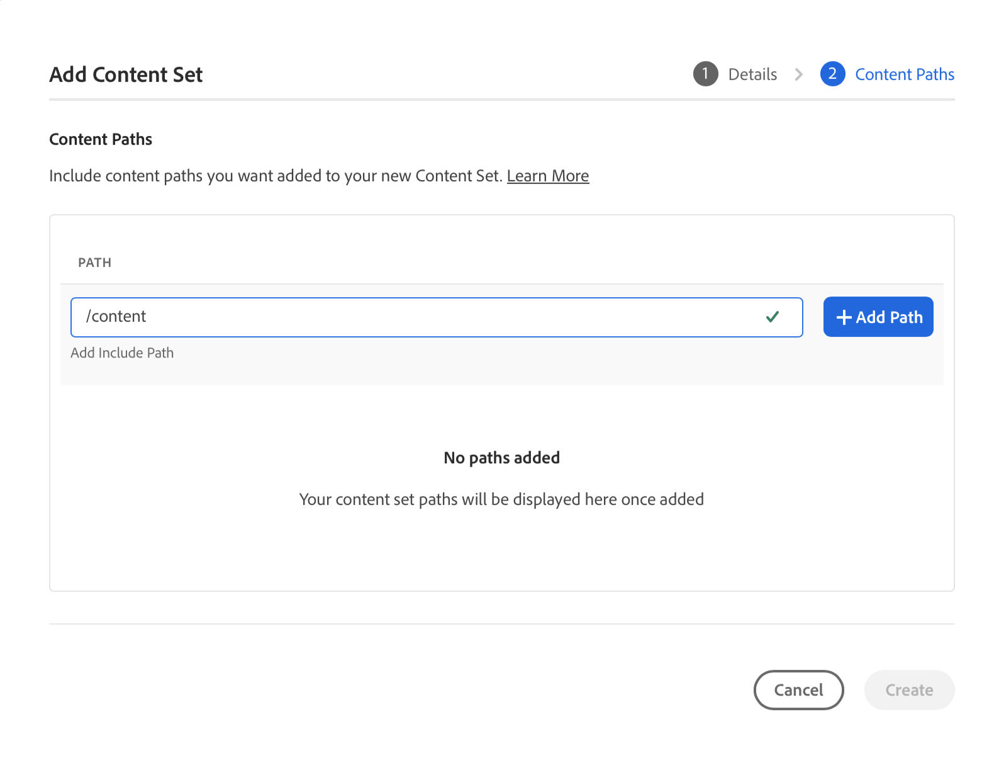
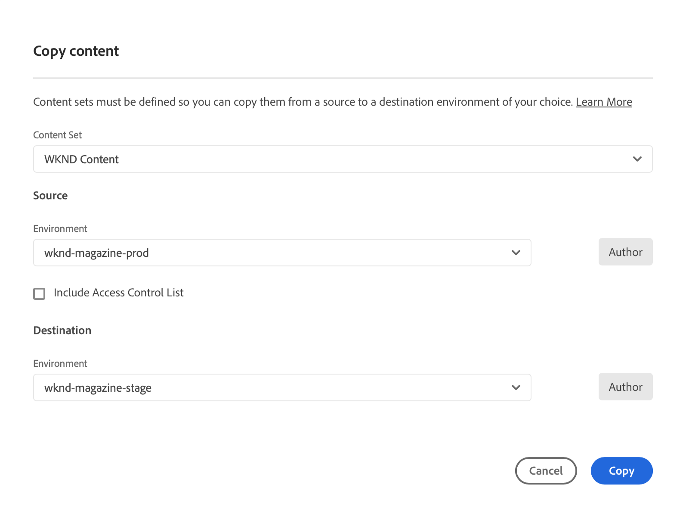
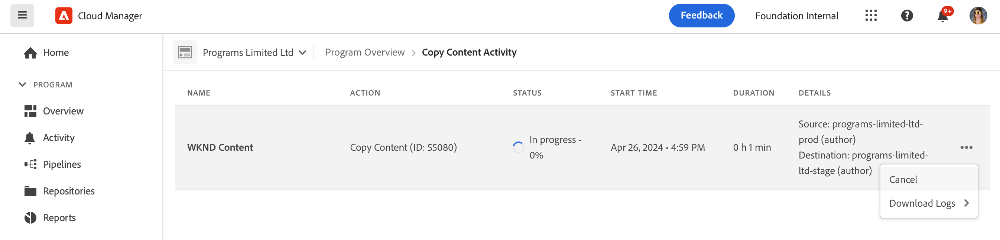

# Verktyget Innehållskopia {#content-copy}

Med innehållskopieringsverktyget kan man kopiera muterbart innehåll on-demand från produktionsmiljöer i AEM as a Cloud Service till lägre miljöer för teständamål.

>[!NOTE]
>Det primära innehållskopieringsflödet är från högre miljöer till lägre miljöer, men med en ytterligare funktion - **Framåtflöde** - kan du kopiera från lägre icke-produktionsmiljöer till högre icke-produktionsmiljöer (till exempel Dev → Stage, RDE → Stage). Mer information, inklusive tillgänglighetskrav, finns i [Begränsningar](#limitations).

## Introduktion {#introduction}

Aktuella, riktiga data är värdefulla för testning, validering och för att ge användaren erkännande. Med innehållskopieringsverktyget kan du kopiera innehåll från en AEM as a Cloud Service-produktionsmiljö till en staging-, development- eller [Rapid Development Environment (RDE)](/help/implementing/developing/introduction/rapid-development-environments.md) -miljö för sådan testning.

En innehållsuppsättning definierar innehållet som ska kopieras. En innehållsuppsättning består av en lista med JCR-sökvägar. Dessa sökvägar innehåller det muterbara innehåll som ska kopieras från en källredigeringstjänstmiljö till en målredigeringstjänstmiljö, allt inom samma Cloud Manager-program. Följande sökvägar tillåts i en innehållsuppsättning:

```text
/content
/conf/**/settings/wcm
/conf/**/settings/dam/cfm/models
/conf/**/settings/graphql/persistentQueries
/etc/clientlibs/fd/themes
```

När du kopierar innehåll är källmiljön en källa till sanning.

* Om käll- och målsökvägarna matchar skriver innehåll från källan över ändrat innehåll i målmiljön.
* Om banorna inte är likadana sammanfogas innehåll från källan med innehållet i målplatsen.

## Behörigheter {#permissions}

Om du vill använda verktyget för innehållskopiering krävs vissa behörigheter i både käll- och målmiljöer.

| Innehållskopia | AEM Administrator Group | Distributionshanterarroll |
|---|---|---|
| Skapa och ändra [innehållsuppsättningar](#create-content-set) | Krävs inte | Obligatoriskt |
| Starta eller avbryta [innehållskopieringsprocessen](#copy-content) | Obligatoriskt | Obligatoriskt |

Mer information om behörigheter och hur du ställer in dem finns i [AEM as a Cloud Service Team och produktprofiler](/help/onboarding/aem-cs-team-product-profiles.md).

## Skapa en innehållsuppsättning {#create-content-set}

Innan något innehåll kan kopieras måste en innehållsuppsättning definieras. När innehållet har definierats kan det återanvändas för att kopiera innehållet. Följ de här stegen för att skapa en innehållsuppsättning.

1. Logga in på Cloud Manager på [my.cloudmanager.adobe.com](https://my.cloudmanager.adobe.com/) och välj rätt organisation och program.

1. Navigera till fliken **Innehållsuppsättningar** på sidan **Översikt** med hjälp av sidnavigeringspanelen.

1. Klicka på **Lägg till innehållsuppsättning** längst upp till höger på skärmen.

   

1. Ange ett namn och en beskrivning för innehållsuppsättningen på fliken **Detaljer** i guiden och välj **Fortsätt**.

   

1. På fliken **Innehållssökvägar** i guiden anger du sökvägarna till det ändringsbara innehåll som ska inkluderas i innehållsuppsättningen.

   1. Ange sökvägen i fältet **Lägg till inkluderingssökväg**.
   1. Klicka på **Lägg till sökväg** för att lägga till sökvägen till innehållsuppsättningen.
   1. Klicka på **Lägg till sökväg** igen om det behövs.
      * Upp till 50 banor är tillåtna.

   

1. Om du måste förfina eller begränsa din innehållsuppsättning kan delbanor uteslutas.

   1. I listan med inkluderade sökvägar klickar du på alternativet **Lägg till exkludera delsökvägar** intill den sökväg som du vill begränsa.
   1. Ange den delbana som ska uteslutas från den markerade banan.
   1. Välj **Uteslut sökväg**.
   1. Välj **Lägg till exkludera delsökvägar** igen om du vill lägga till ytterligare sökvägar som ska exkluderas efter behov.
      * Undantagna sökvägar måste vara relativa till den inkluderade sökvägen.
      * Det finns ingen gräns för antalet uteslutna banor.

   

1. Du kan redigera de angivna sökvägarna om det behövs.

   1. Klicka på X bredvid de uteslutna delbanorna så att du kan ta bort dem.
   1. Klicka på ellipsknappen bredvid sökvägarna så att du kan visa alternativen **Redigera** och **Ta bort**.

   

1. Välj **Skapa** för att skapa innehållsuppsättningen.

Innehållsuppsättningen kan nu användas för att kopiera innehåll mellan miljöer.

## Redigera en innehållsuppsättning {#edit-content-set}

1. Följ liknande steg som när du skapar ett innehållssteg. I stället för att klicka på **Lägg till innehållsuppsättning** markerar du en befintlig uppsättning i konsolen och väljer **Redigera** på ellipsmenyn.


1. När du redigerar din innehållsuppsättning kan du expandera de konfigurerade sökvägarna så att de uteslutna delsökvägarna visas.

## Kopiera innehåll {#copy-content}

När en innehållsuppsättning har skapats kan du använda den för att kopiera innehåll.

>[!NOTE]
> Använd inte innehållskopiering i en miljö när en [innehållsöverföring](/help/journey-migration/content-transfer-tool/using-content-transfer-tool/overview-content-transfer-tool.md)-åtgärd körs i den miljön.

**Så här kopierar du innehåll:**

1. Logga in på Cloud Manager på [my.cloudmanager.adobe.com](https://my.cloudmanager.adobe.com/) och välj rätt organisation och program.

1. Gå till **Miljö** > **Innehållsuppsättningar** på sidan **Översikt**.

1. Välj en innehållsuppsättning på konsolen.

1. Klicka på **Kopiera innehåll** på ellipsmenyn.

   

   >[!NOTE]
   >
   >En miljö kan inte markeras om något av följande stämmer:
   >
   >* Användaren har inte rätt behörighet.
   >* Miljön har en pågående pipeline eller en åtgärd för att kopiera innehåll.
   >* Miljön försätts i viloläge eller startar.

1. I dialogrutan **Kopiera innehåll** anger du källan och målet för kopieringsåtgärden.

   

   * Innehåll kan bara kopieras från en högre miljö till en lägre miljö eller mellan utvecklings-/RDE-miljöer där miljöhierarkin är som följer (från högst upp till lägst):
      * Produktion
      * Mellanlagring
      * Utveckling/RDE
   * Som standard är&quot;Cross-Program&quot;-innehållskopiering inaktiverat. På kundens begäran kan den dock aktiveras, vilket gör ytterligare ett **målprogram** -indatafält tillgängligt.

1. (Valfritt) Om du vill kan du ange följande:

   * **Inkludera åtkomstkontrollistor** - Välj om du vill kopiera innehållets åtkomstkontrollbehörighet tillsammans med innehållet.
   * **Rensa** - Välj det här alternativet om du vill ta bort det befintliga innehållet på målet innan du startar importen, så att du kan börja från en ren skiffer och undvika konflikter med befintligt innehåll. Om du låter **Rensa** vara avmarkerat importerar Cloud Manager det nya innehållet ovanpå det befintliga målinnehållet. Ett bekräftelsemeddelande visas innan rensningen börjar och Cloud Manager loggar rensningsåtgärden och importinformationen för spårbarhet.

1. Klicka på **Kopiera**.

Kopieringsprocessen startar. Kopieringsprocessens status visas i konsolen för den valda innehållsuppsättningen.

## Kopiera innehåll {#copy-activity}

Du kan övervaka statusen för dina kopieringsprocesser på sidan **Kopiera innehållsaktivitet**.

1. Logga in på Cloud Manager på [my.cloudmanager.adobe.com](https://my.cloudmanager.adobe.com/) och välj rätt organisation och program.

1. Gå till skärmen **Miljö** från sidan **Översikt**.

1. Navigera till sidan **Kopiera innehållsaktivitet** från skärmen **Miljö**.


### Status för innehållskopia {#statuses}

När du börjar kopiera innehåll kan processen ha någon av följande statusar.

| Status | Beskrivning |
| --- | --- |
| Pågår | Kopiering av innehåll pågår. |
| Misslyckades | Åtgärden Kopiera innehåll misslyckades. |
| Slutförd | Åtgärden Kopiera innehåll slutfördes. |
| Avbruten | En användare avbryter en innehållskopia när den har startats. |

### Avbryta en kopieringsprocess {#canceling}

Om du måste avbryta en innehållskopia efter att du startat den kan du också avbryta den.

På sidan **Kopiera innehållsaktivitet** väljer du åtgärden **Avbryt** på ellipsmenyn för den kopieringsprocess som du startade tidigare.



>[!NOTE]
>
>När du avbryter en innehållskopia kan det resultera i en partiell kopia av innehållet i målmiljön. Detta kan göra att målmiljön inte kan användas.
>
>Om din miljö är i ett sådant läge på grund av att du har avbrutit kontaktar du Adobe kundtjänst för hjälp.

### Åtkomstloggar {#accessing-logs}

Du kan kontrollera loggarna för både käll- och målmiljöer för att se om det finns några slutförda innehållskopieringsprocesser.

**Så här kommer du åt loggar:**

1. På sidan **Kopiera innehållsaktivitet** klickar du på **Loggar** på ellipsmenyn för kopieringsprocessen som du vill granska. Välj sedan miljö.


Loggarna hämtas till din lokala dator.

1. Om hämtningen inte startar kontrollerar du inställningarna för popup-blockering.

## Begränsningar {#limitations}

Verktyget för innehållskopiering har följande begränsningar.

* Verktyget Innehållskopiering har stöd för två flödeslägen:
   1. Uppifrån och ned-flöde - Innehållet kan kopieras från högre miljöer till lägre miljöer (t.ex. Production → Stage, Stage → Development/RDE).
   2. Framåtflöde (ny funktion) - Innehållet kan också kopieras från en lägre icke-produktionsmiljö till en högre icke-produktionsmiljö (till exempel Development → Stage, RDE → Stage). Den här funktionen är bara tillgänglig efter explicit begäran och är aktiverad tills explicit begärd att inaktiveras. Produktionsmiljöer är aldrig giltiga mål för Forward Flow.
* Innehåll kan bara kopieras från och till redigeringstjänster.
* Det går inte att köra samtidiga innehållskopieringsåtgärder i samma miljö.
* Upp till 50 sökvägar kan anges per innehållsuppsättning. Det finns ingen begränsning för uteslutna banor.
* Använd inte verktyget för innehållskopiering som kloning eller spegling eftersom det inte går att spåra flyttat eller borttaget innehåll i källan.
* Verktyget för innehållskopiering har ingen versionshantering och kan inte automatiskt identifiera ändrat innehåll eller skapat innehåll i källmiljön i en innehållsuppsättning sedan den senaste kopieringsåtgärden.
   * Om du bara vill uppdatera målmiljön med innehållsändringar sedan den senaste kopieringsåtgärden måste du skapa en innehållsuppsättning. Ange sedan sökvägarna i källinstansen där ändringar har gjorts sedan den senaste kopieringsåtgärden.
* Versionsinformation ingår inte i en innehållskopia.
* [Modeller för innehållsfragment](/help/sites-cloud/administering/content-fragments/content-fragment-models.md#data-types) kan ange referensfält baserat på UUID (Universally Unique ID). Sådana UUID:n är databasspecifika, så innehållskopieringsverktyget beräknar om UUID:n i målmiljön när innehållsfragment kopieras.
