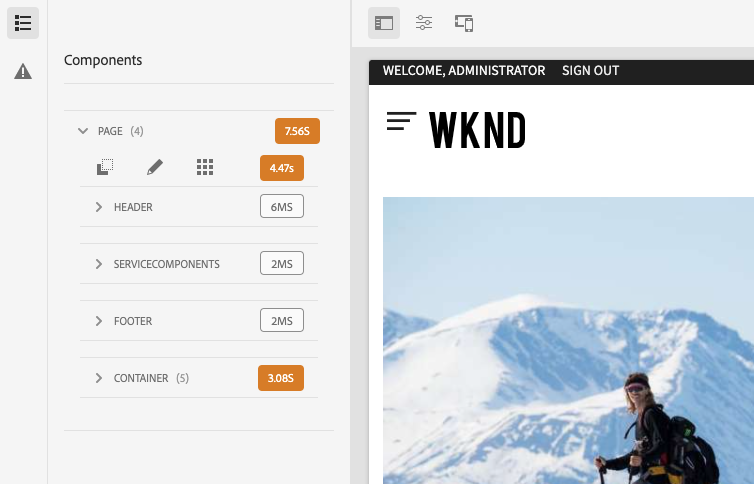

# Utvecklarläge {#developer-mode}

När du redigerar sidor i AEM [lägen](/help/sites-cloud/authoring/fundamentals/environment-tools.md#page-modes) är tillgängliga, inklusive läget Utvecklare. I utvecklarläget öppnas en sidopanel med flera flikar som ger utvecklaren teknisk information om den aktuella sidan.

Det finns två flikar:

* **[Komponenter](#components)** för att visa struktur- och prestandainformation.
* **[Fel](#errors)** för att se om det uppstår några problem.

Detta hjälper en utvecklare att:

* **Upptäck** hur sidorna disponeras.
* **Felsök:** vad som händer var och när, vilket i sin tur hjälper till att lösa problem.

>[!NOTE]
>
>Utvecklarläge:
>
>* Är inte tillgängligt på mobila enheter eller små fönster på skrivbordet (på grund av utrymmesbegränsningar).
>  * Detta inträffar när bredden är mindre än 1024px.
>* Är endast tillgänglig för användare som är medlemmar i `administrators` grupp.

## Öppnar utvecklarläge {#opening-developer-mode}

Utvecklarläget implementeras som en sidopanel i sidredigeraren. Om du vill öppna panelen väljer du **Utvecklare** från lägesväljaren i verktygsfältet i sidredigeraren:

Panelen är uppdelad i två flikar:

* **[Komponenter](#components)** - Detta visar ett komponentträd, som liknar [innehållsträd](/help/sites-cloud/authoring/fundamentals/environment-tools.md#content-tree) för författare
* **[Fel](#errors)** - När problem uppstår visas information för varje komponent.

### Fliken Komponenter {#components}

Detta visar ett komponentträd som:

* Skapar konturer för kedjan med komponenter och mallar som återges på sidan. Trädet kan expanderas för att visa kontext i hierarkin.
* Visar den datortid på serversidan som krävs för att återge komponenten.
* Gör att du kan expandera trädet och välja specifika komponenter i trädet. Markeringen ger åtkomst till komponentinformation, till exempel:
   * Databassökväg
   * Länkar till skript (används i CRXDE Lite)
   * Komponentdetaljer enligt [Komponentkonsol](/help/sites-cloud/authoring/features/components-console.md)
* Komponenter som är markerade i trädet markeras med en blå kant i redigeraren.

På fliken Komponenter kan du

* Fastställ och jämför återgivningstiden per komponent.
* Se och förstå hierarkin.
* Förstå och förbättra sidinläsningstiden genom att hitta långsamma komponenter.

Varje komponentpost kan ha följande alternativ:

* **Visa detaljer:** En länk till en lista som visar:
   * Alla komponentskript som används för att återge komponenten.
   * Databasens innehållssökväg för den här specifika komponenten.

     

* **Redigera skript:** En länk som öppnar komponentskriptet i CRXDE Lite.

* **Visa komponentinformation:** Öppnar informationen om komponenten i [Komponentkonsol](/help/sites-cloud/authoring/features/components-console.md).

Om du expanderar en komponentpost genom att trycka eller klicka på gruppen kan du även visa:

    * Hierarkin i den markerade komponenten.
    * Återgivningstider för den markerade komponenten separat, alla enskilda kapslade komponenter i den och den kombinerade summan.

### Fliken Fel {#errors}

Förhoppningsvis **Fel** tabben kommer alltid att vara tom (som ovan), men när problem uppstår kan följande information visas för varje komponent:

* En varning om komponenten skriver en post i felloggen, tillsammans med information om felet och direktlänkar till rätt kod i CRXDE Lite.
* En varning om komponenten öppnar en administratörssession.

Om till exempel en odefinierad metod anropas visas det resulterande felet i **Fel** och komponentposten i trädet i **Komponenter** -fliken markeras också med en indikator när ett fel inträffar.
