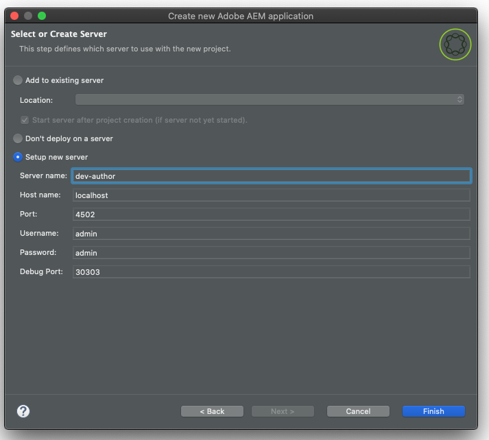

# AEM Developer Tools for Eclipse{#aem-developer-tools-for-eclipse}


## Ökning {#overview}

_Experience Manager Developer Tools for Eclipse_ är en Eclipse-plugin som baseras på [Eclipse-pluginen för Apache Sling](https://sling.apache.org/documentation/development/ide-tooling.html) som släppts under Apache License 2.

Den har flera funktioner som underlättar utvecklingen av AEM:

* Smidig integrering med AEM-instanser via Eclipse Server Connector
* Synkronisering för både innehåll och OSGi-paket
* Felsökningsstöd med möjlighet att byta kod under drift
* Enkel Bootstrap av AEM-projekt genom en särskild projektguide
* Enkel redigering av JCR-egenskaper

## Krav {#requirements}

Innan du använder AEM Developer Tools måste du:

* Hämta och installera [Eclipse IDE för Java- och webbutvecklare för företag.](https://www.eclipse.org/downloads/packages/)
   * Version 1.4.0 av AEM Developer Tools för Eclipse är kompatibel med Eclipse 2022-12 (4.26) eller senare och kräver Java 17 eller senare för att kunna köras.
* Konfigurera Eclipse-installationen så att du har minst 1 GB stackminne genom att redigera `eclipse.ini`-konfigurationsfilen enligt beskrivningen i [Vanliga frågor om Eclipse.](https://wiki.eclipse.org/FAQ_How_do_I_increase_the_heap_size_available_to_Eclipse%3F)

>[!NOTE]
>
>I macOS måste du högerklicka på **Eclipse.app** och sedan välja **Visa paketinnehåll** för att hitta `eclipse.ini`.

## Installera AEM Developer Tools for Eclipse {#how-to-install-the-aem-developer-tools-for-eclipse}

När du har uppfyllt [kraven](#requirements) ovan kan du installera utvecklarverktygets plugin-program på följande sätt:

1. Öppna webbplatsen [AEM Developer Tools.](https://eclipse.adobe.com/)

1. Kopiera **installationslänken**.

   * Du kan även hämta ett arkiv i stället för att använda installationslänken.
   * Den här metoden tillåter offlineinstallation men du får inga meddelanden om automatiska uppdateringar.

1. Öppna menyn **Hjälp** i Eclipse.
1. Klicka på **Installera ny programvara**.
1. Klicka på **Lägg till..**.
1. Ange **i fältet** Namn`AEM Developer Tools`.
1. Kopiera installations-URL:en i fältet **Plats**.
1. Klicka på **Lägg till**.
1. Kontrollera både **AEM**- och **Sling**-plugin-program.
1. Klicka på **Nästa**.
1. Granska de objekt som ska installeras i fönstret **Installera information** och klicka på **Nästa** igen.
1. Acceptera licensavtalen och klicka på **Slutför**.
1. I dialogrutan **Lita på utfärdare** som visas väljer du behörighet/plats `https://eclipse.adobe.com` och klickar på **Lita på markerade**.
1. I dialogrutan **Lita på artefakter** som visas markerar du kodsignerarna och klickar på **Lita på markerade**.
1. Klicka på **RestartNow** för att starta om Eclipse.

## AEM Perspective {#the-aem-perspective}

I Eclipse avgör ett **perspektiv** vilka åtgärder och vyer som är tillgängliga i ett fönster och aktiverar uppgiftsorienterad interaktion med resurser i Eclipse. Mer information om perspektiv finns i [Eclipse-dokumentationen.](https://help.eclipse.org/latest/index.jsp).

_Experience Manager utvecklingsverktyg för Eclipse_ har ett AEM-perspektiv som ger dig full kontroll över dina AEM-projekt och instanser. Så här öppnar du AEM-perspektivet:

1. Välj **Fönster** > **Perspektiv** > **Öppna perspektiv** > **Annat** på Eclipse-menyraden.
1. Välj **AEM** i dialogrutan och klicka på **Öppna**.


## Exempel på flermodulsprojekt {#sample-multi-module-project}

_Experience Manager Developer Tools for Eclipse_ innehåller ett exempel på ett projekt med flera moduler som hjälper dig att snabbt komma igång med projektkonfigurationen i Eclipse. Det är också en praktisk guide till flera AEM-funktioner som utnyttjar [AEM Project Archetype.](https://github.com/adobe/aem-project-archetype)

Så här skapar du exempelprojektet:

1. Gå till avsnittet **AEM** på menyn **Arkiv** > **Nytt** > **Projekt** och välj **AEM Sample Multi-Module Project**.

   

1. Klicka på **Nästa**.

   >[!NOTE]
   >
   >Det här steget kan ta en stund eftersom [m2eclipse](https://eclipse.dev/m2e/) måste söka igenom arkivtypskatalogerna.

1. `com.adobe.aem : aem-project-archetype : <highest-number>` ska väljas automatiskt i listrutan **Arketyp**. Välj en tidigare version om du vill. Klicka på **Nästa**.

   

1. Ange följande fält för exempelprojektet:

   * **Namn**
   * **Grupp-ID**
   * **Artefakt-ID**
   * **appId** - Du kan behöva utöka alternativen för **Avancerat** för att ange det här värdet.
   * **appTitle** - Du kan behöva utöka alternativen för **Avancerat** för att ange det här värdet.
   * **Paket** - Du kan behöva utöka alternativen för **Avancerat** för att ange det här värdet.

   

1. Klicka på **Nästa**.

1. Konfigurera en AEM-server som Eclipse ansluter till genom att välja **Konfigurera ny server** och ange ett servernamn och nödvändig anslutningsinformation.

   

   * Om du vill använda felsökningsfunktionen måste du starta AEM i felsökningsläge genom att ange parametern `-agentlib`, till exempel:

   ```text
   $ java -agentlib:jdwp=transport=dt_socket,server=y,suspend=n,address=*:5005 -jar aem-author-p4502.jar
   ```

   >[!TIP]
   >
   >Mer information om hur du felsöker projekt som körs på en lokal AEM SDK finns i dokumentet [Fjärrfelsökning i AEM SDK.](https://experienceleague.adobe.com/sv/docs/experience-manager-learn/cloud-service/debugging/debugging-aem-sdk/remote-debugging)

1. Klicka på **Slutför**.

Projektstrukturen skapas. Det kan ta en stund att hämta nödvändiga artefakter till projektet.

>[!NOTE]
>
>Vid en ny installation eller när Maven-beroenden inte har hämtats tidigare kan Eclipse rapportera att projektet har skapats med fel. I det här fallet följer du proceduren som beskrivs i avsnittet [Åtgärdar ogiltig projektdefinition.](#resolving-invalid-project-definition)

## Importera befintliga projekt {#how-to-import-existing-projects}

Använd funktionen **Nytt projekt** för att skapa den grundläggande projektstrukturen.

1. Följ instruktionerna för att skapa ett [exempel på ett flermodulsprojekt](#sample-multi-module-project) som skapar en grundläggande projektstruktur med en felfri problemlösning:

   * `PROJECT.ui.apps` för `/apps`- och `/etc`-innehåll
   * `PROJECT.ui.content` för `/content` som har skapats
   * `PROJECT.core` för Java-paket
   * `PROJECT.it.launcher` och `PROJECT.it.tests` för integreringstester

1. Ersätt innehållet i ditt `PROJECT.ui.apps`-projekt med mapparna `apps` och `etc` i ditt paket:

   1. Expandera **>** > `PROJECT.ui.apps` > `src` > `main` > `content` på panelen `jcr_root`Projektutforskaren`apps`.
   1. Högerklicka på mappen `apps` och välj **Visa i** > **Systemutforskaren**.
   1. Ta bort mapparna `apps` och `etc` där.
   1. Placera `apps`- och `etc`-mapparna för ditt innehållspaket på samma plats.
   1. Högerklicka på projektet `PROJECT.ui.apps` i Eclipse och välj **Uppdatera**.

1. Gör sedan samma sak för `PROJECT.ui.content` och ersätt dess innehållsmapp med ett av dina paket:

   1. Expandera **>** > `PROJECT.ui.content` > `src` > `main` > `content` på panelen `jcr_root`Projektutforskaren`content`.
   1. Högerklicka på den djupare innehållsmappen och välj **Visa i** > **Systemutforskaren**.
   1. Ta bort innehållsmappen där.
   1. Placera innehållsmappen för ditt innehållspaket på samma plats.
   1. Högerklicka på projektet `PROJECT.ui.content` i Eclipse och välj **Uppdatera**.

1. Uppdatera `filter.xml`-filerna för dessa två projekt så att de motsvarar innehållet i ditt innehållspaket genom att öppna `META-INF/vault/filter.xml`-filen för ditt innehållspaket i en separat text-/kodredigerare.

   * Detta är ett exempel på hur din `filter.xml`-fil kan se ut:

   ```xml
   <?xml version="1.0" encoding="UTF-8"?>
   <workspaceFilter version="1.0">
       <filter root="/apps/foo"/>
       <filter root="/apps/foundation/components/bar"/>
       <filter root="/etc/designs/foo"/>
       <filter root="/content/foo"/>
       <filter root="/content/dam/foo"/>
       <filter root="/content/usergenerated/content/foo"/>
   </workspaceFilter>
   ```

1. När det gäller innehållet i ditt paket som delats upp i två projekt måste du också dela upp dessa filterregler i två och uppdatera `filter.xml`-filerna för de två projekten i enlighet med detta.

   1. Öppna `PROJECT.ui.apps/src/main/content/META-INF/filter.xml` i Eclipse.
   1. Ersätt innehållet i elementet `<workspaceFilter>` med reglerna i paketet som börjar med `/apps` och `/etc`
      * Till exempel:

        ```xml
        <?xml version="1.0" encoding="UTF-8"?>
        <workspaceFilter version="1.0">
           <filter root="/apps/foo"/>
           <filter root="/apps/foundation/components/bar"/>
           <filter root="/etc/designs/foo"/>
        </workspaceFilter>
        ```

   1. Öppna sedan `PROJECT.ui.content/src/main/content/META-INF/filter.xml`.
   1. Ersätt reglerna med reglerna i ditt paket som börjar med `/content`.
      * Till exempel:

        ```xml
        <?xml version="1.0" encoding="UTF-8"?>
        <workspaceFilter version="1.0">
           <filter root="/content/foo"/>
           <filter root="/content/dam/foo"/>
           <filter root="/content/usergenerated/content/foo"/>
        </workspaceFilter>
        ```

1. Spara alla ändringar. Nu kan du synkronisera det nya innehållet med din AEM-instans.

1. Kontrollera att anslutningen har startats och, om så är fallet, starta den på panelen **Servrar**.

1. Klicka på ikonen **Rensa och publicera** .

När du är klar bör paketet köras på din instans. När du sparar synkroniseras alla ändringar automatiskt till instansen.

Om du vill återskapa ett paket från ditt projekt högerklickar du på `PROJECT.ui.apps` eller `PROJECT.ui.content` och väljer **Kör som** > **Maven Install**.

Nu har du skapat en målmapp med ditt paket (som till exempel kallas `PROJECT.ui.apps-0.0.1-SNAPSHOT.zip`).

## Felsökning {#troubleshooting}

### Löser ogiltig projektdefinition {#resolving-invalid-project-definition}

Så här löser du ogiltiga beroenden och projektdefinitioner:

1. Markera alla skapade projekt.
1. Högerklicka.
1. Välj **Maven** > **Uppdatera projekt** på snabbmenyn.
1. Kontrollera **Tvinga uppdateringar av ögonblicksbild/släppningar**.
1. Klicka på **OK**.

Eclipse hämtar nödvändiga beroenden. Det här kan ta en stund.

## Mer information {#more-information}

Den officiella versionen av Apache Sling IDE-verktygen för Eclipse-webbplatsen innehåller ytterligare användbar information:

* [**Apache Sling IDE-verktygen för Eclipse** Användarhandbok](https://sling.apache.org/documentation/development/ide-tooling.html) vägleder dig genom de övergripande begreppen, serverintegrationen och distributionsfunktionerna som stöds av AEM utvecklingsverktyg.
* [Felsökning av verktyg för Apache Sling IDE](https://sling.apache.org/documentation/development/ide-tooling.html#troubleshooting)
* [Lista över kända fel](https://sling.apache.org/documentation/development/ide-tooling.html#known-issues)

Följande officiella [Eclipse](https://www.eclipse.org/)-dokumentation kan hjälpa dig att konfigurera miljön:

* [Komma igång med Eclipse](https://eclipseide.org/getting-started/)
* [Eclipse Luna Help System](https://help.eclipse.org/latest/index.jsp)
* [Maven Integration (m2eclipse)](https://www.eclipse.org/m2e/)
