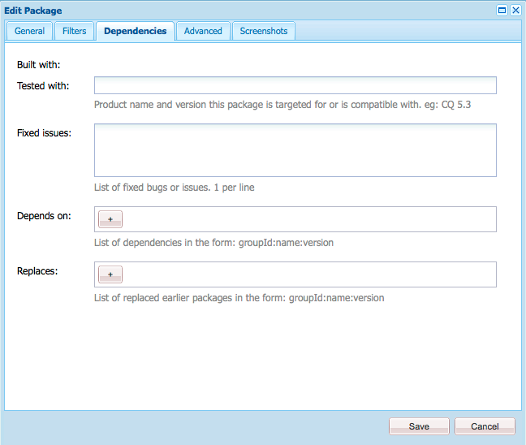
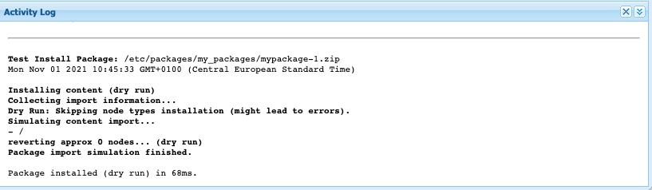

# Pakethanteraren {#working-with-packages}

Med paket kan du importera och exportera databasinnehåll. Du kan använda paket för att installera nytt innehåll, överföra innehåll mellan instanser och säkerhetskopiera databasinnehåll.

Med Package Manager kan du överföra paket mellan AEM och det lokala filsystemet i utvecklingssyfte.

## Vad är paket? {#what-are-packages}

Ett paket är en ZIP-fil som innehåller databasinnehåll i ett filsystemsserialiseringsformat, som kallas vaultserialisering, och som ger en lättanvänd och lättredigerad representation av filer och mappar. Innehåll som ingår i paketet definieras med hjälp av filter.

Ett paket innehåller även vaultmetainformation, inklusive filterdefinitioner och importkonfigurationsinformation. Ytterligare innehållsegenskaper, som inte används för paketextrahering, kan inkluderas i paketet, till exempel en beskrivning, en visuell bild eller en ikon. Dessa extra innehållsegenskaper är endast avsedda för innehållspaketkonsumenten och för informationsändamål.

>[!NOTE]
>
>Paket representerar den aktuella versionen av innehållet när paketet skapas. De innehåller inga tidigare versioner av det innehåll som AEM sparar i databasen.

## Paket i AEM as a Cloud Service {#aemaacs-packages}

Innehållspaket som skapas för AEM as a Cloud Service program måste ha en ren separation mellan oföränderligt och muterbart innehåll. Pakethanteraren kan därför bara användas för att hantera paket som innehåller innehåll. All kod måste distribueras via Cloud Manager.

>[!NOTE]
>
>Paket kan bara innehålla innehåll. Alla funktioner (till exempel innehåll som lagras under `/apps`) måste vara [distribueras med CI/CD-pipeline i Cloud Manager](/help/implementing/cloud-manager/deploy-code.md).

>[!IMPORTANT]
>
>Pakethanterarens gränssnitt kan returnera en **undefined** felmeddelande om ett paket tar längre tid än 10 minuter att installera.
>
>Detta beror inte på ett fel i installationen, utan på en timeout som Cloud Servicen har för alla begäranden.
>
>Försök inte installera igen om du ser ett sådant fel. Installationen fortsätter korrekt i bakgrunden. Om du startar om installationen kan vissa konflikter uppstå vid flera samtidiga importprocesser.

Mer information om hur du hanterar paket för AEMaaCS finns i [Distribuera till AEM as a Cloud Service](/help/implementing/deploying/overview.md) i användarhandboken för distribution.

## Paketstorlek {#package-size}

Adobe rekommenderar att du inte skapar stora paket. Detta för att undvika timeoutproblem vid överföring och hämtning av paket.

Som regel bör ett paket skickas i sin helhet inom 60 sekunder. Detta ger följande formel som vägledning.

```text
MaxPackageSize (in MB) = ConnectionSpeed (in MB/s) * 60 s
```

Eftersom nätverkstrafiken varierar och alltid är mindre än det annonserade maximala teoretiska värdet kan du testa med ett hastighetstest online.

Internet-hastigheter är nästan alltid olika för överföringar och nedladdningar. Om du måste både överföra och hämta paket bör du använda det lägre värdet (vanligen överföringshastigheten) i beräkningen.

### Exempel {#example}

Med ett testverktyg för Internet-hastighet ser jag att min nuvarande överföringshastighet är cirka 100 Mbit/s.

```text
100 Mbps = 12.5 MB/s
12.5 MB/s * 60 s = 750 MB
```

Alla paket jag skapar bör därför vara mindre än 750 MB.

>[!NOTE]
>
>Nätverkshastigheterna regleras av aktuella lokala villkor. Även om du nyligen har gjort ett hastighetstest kan det faktiska dataflödet variera.
>
>Formeln är därför bara en riktlinje och din maximala rekommenderade paketstorlek kan variera.

## Pakethanteraren {#package-manager}

Pakethanteraren hanterar paketen i AEM. Efter att du har [har tilldelats nödvändiga behörigheter](#permissions-needed-for-using-the-package-manager) du kan använda Package Manager för olika åtgärder, bland annat för att konfigurera, bygga, hämta och installera dina paket.

### Nödvändiga behörigheter {#required-permissions}

För att kunna skapa, ändra, överföra och installera paket måste användarna ha rätt behörighet på följande noder:

* Fullständig behörighet exklusive radering `/etc/packages`
* Noden som innehåller paketinnehållet

>[!CAUTION]
>
>Om du beviljar behörigheter för paket kan det leda till att känslig information röjs och att data går förlorade.
>
>För att begränsa de här riskerna rekommenderar vi att du endast ger särskilda gruppbehörigheter för dedikerade underträd.

### Åtkomst till Package Manager {#accessing}

Du kommer åt Package Manager på tre sätt:

1. Från AEM huvudmeny > **verktyg** > **Distribution** > **Paket**
1. Från [CRXDE Lite](crxde.md) med hjälp av det övre växlingsfältet
1. Direkt via åtkomst `http://<host>:<port>/crx/packmgr/`

### Pakethanterarens användargränssnitt {#ui}

Pakethanteraren är uppdelad i fyra huvudsakliga funktionsområden:

* **Vänster navigeringspanel** - Med den här panelen kan du filtrera och sortera paketlistan.
* **Paketlista** - Det här är listan med paket i din instans som filtrerats och sorterats efter val i den vänstra navigeringspanelen.
* **Aktivitetslogg** - Den här panelen minimeras först och utökas för att beskriva aktiviteten i Package Manager, till exempel när ett paket byggs eller installeras. Det finns ytterligare knappar på fliken Aktivitetslogg för att:
   * **Rensa logg**
   * **Visa/dölj**
* **Verktygsfält** - Verktygsfältet innehåller uppdateringsknappar för den vänstra navigeringspanelen och paketlistan samt knappar för sökning, skapande och överföring av paket.


Om du klickar på ett alternativ i den vänstra navigeringspanelen filtreras paketlistan omedelbart.

När du klickar på ett paketnamn expanderas posten i paketlistan så att du får mer information om paketet.


Det finns ett antal åtgärder som kan utföras på ett paket via de verktygsfältsknappar som är tillgängliga när paketdetaljen expanderas.

* [Redigera](#edit-package)
* [Bygge](#building-a-package)
* [Installera om](#reinstalling-packages)
* [Ladda ned](#downloading-packages-to-your-file-system)

Ytterligare åtgärder finns under **Mer** -knappen.

* [Ta bort](#deleting-packages)
* [Täckning](#package-coverage)
* [Innehåll](#viewing-package-contents-and-testing-installation)
* [Radbryt](#rewrapping-a-package)
* [Andra versioner](#other-versions)
* [Avinstallera](#uninstalling-packages)
* [Testa installationen](#viewing-package-contents-and-testing-installation)
* [Validera](#validating-packages)
* [Replikera](#replicating-packages)

### Paketstatus {#package-status}

Varje post i paketlistan har en statusindikator som gör att du snabbt kan se paketets status. När du hovrar över statusen visas verktygstipset med statusinformation.


Om paketet har ändrats eller aldrig byggts visas statusen som en länk för att vidta snabba åtgärder för att återskapa eller installera paketet.

## Paketinställningar {#package-settings}

Ett paket är i princip en uppsättning filter och databasdata som baseras på dessa filter. Med hjälp av gränssnittet för pakethanteraren kan du klicka på ett paket och sedan på **Redigera** om du vill visa information om ett paket med följande inställningar.

* [Allmänna inställningar](#general-settings)
* [Paketfilter](#package-filters)
* [Paketberoenden](#package-dependencies)
* [Avancerade inställningar](#advanced-settings)
* [Paketskärmbilder](#package-screenshots)

### Allmänna inställningar {#general-settings}

Du kan redigera olika paketinställningar för att definiera information som paketbeskrivning, beroenden och providerinformation.

The **Paketinställningar** är tillgänglig via **Redigera** knapp när [skapa](#creating-a-new-package) eller [redigera](#viewing-and-editing-package-information) ett paket. Klicka på **Spara**.


| Fält | Beskrivning |
|---|---|
| Namn | Paketets namn |
| Grupp | När du organiserar paket kan du ange namnet på en ny grupp eller välja en befintlig grupp |
| Version | Text som ska användas för versionen |
| Beskrivning | En kort beskrivning av paketet som tillåter formatering med HTML-kod |
| Miniatyrbild | Ikonen som visas med paketlistan |

### Paketfilter {#package-filters}

Filter identifierar databasnoderna som ska inkluderas i paketet. A **Filterdefinition** anger följande information:

* The **Rotsökväg** av innehållet som ska inkluderas
* **Regler** som innehåller eller exkluderar specifika noder under rotsökvägen

Lägg till regler med **+** -knappen. Ta bort regler med **-** -knappen.

Reglerna tillämpas i den ordning de har, så att de kan placeras efter behov med **Upp** och **Ned** pilknappar.

Filter kan innehålla noll eller flera regler. När inga regler har definierats innehåller paketet allt innehåll under rotsökvägen.

Du kan definiera en eller flera filterdefinitioner för ett paket. Använd mer än ett filter för att inkludera innehåll från flera rotsökvägar.


När du skapar filter kan du definiera en bana eller använda ett reguljärt uttryck för att ange alla noder som du vill ta med eller utesluta.

| Regeltyp | Beskrivning |
|---|---|
| include | Om du tar med en katalog inkluderas den katalogen och alla filer och mappar i den katalogen (det vill säga hela underträdet), men **inte** ta med andra filer eller mappar från den angivna rotsökvägen. |
| exclude | Om du exkluderar en katalog exkluderas den katalogen och alla filer och mappar i den katalogen (det vill säga hela underträdet). |

Paketfilter definieras oftast när du börjar [skapa paketet.](#creating-a-new-package) De kan emellertid också redigeras senare, och därefter bör paketet byggas om för att uppdatera innehållet baserat på de nya filterdefinitionerna.

>[!TIP]
>
>Ett paket kan innehålla flera filterdefinitioner så att noder från olika platser enkelt kan kombineras till ett paket.

### Beroenden {#dependencies}



| Fält | Beskrivning | Exempel/detaljer |
|---|---|---|
| Testat med | Det produktnamn och den version som det här paketet har eller är kompatibelt med. | `AEMaaCS` |
| Åtgärdade problem | Ett textfält som innehåller information om fel som har åtgärdats med det här paketet, en bugg per rad | - |
| Beroende på | Visar andra paket som är nödvändiga så att det aktuella paketet körs som förväntat vid installationen | `groupId:name:version` |
| Ersätter | En lista över borttagna paket som det här paketet ersätter | `groupId:name:version` |

### Avancerade inställningar {#advanced-settings}


| Fält | Beskrivning | Exempel/detaljer |
|---|---|---|
| Namn | Namnet på paketets leverantör | `WKND Media Group` |
| URL | URL för providern | `https://wknd.site` |
| Länk | Paketspecifik länk till en providersida | `https://wknd.site/package/` |
| Kräver | Definierar om det finns några begränsningar när paketet installeras | **Administratör** - Paketet får bara installeras med administratörsbehörighet <br>**Starta om** - AEM måste startas om efter att paketet har installerats |
| AC-hantering | Anger hur åtkomstkontrollsinformationen som definieras i paketet hanteras när paketet importeras | **Ignorera** - Bevara åtkomstkontrollistor i databasen <br>**Skriv över** - Skriv över åtkomstkontrollistor i databasen <br>**Sammanfoga** - Sammanfoga båda uppsättningar åtkomstkontrollistor <br>**MergePreserve** - Lägg samman åtkomstkontrollen i innehållet med den som ingår i paketet genom att lägga till åtkomstkontrollposter för objekt som inte finns i innehållet <br>**Rensa** - Rensa åtkomstkontrollistor |

### Paketskärmbilder {#package-screenshots}

Du kan bifoga flera skärmbilder till ditt paket för att få en visuell representation av hur innehållet ser ut.


## Paketåtgärder {#package-actions}

Det finns många åtgärder som kan utföras på ett paket.

### Skapa ett paket {#creating-a-new-package}

1. [Åtkomst till pakethanteraren.](#accessing)

1. Klicka **Skapa paket**.

   >[!TIP]
   >
   >Om din instans har många paket kan det finnas en mappstruktur på plats. I sådana fall är det enklare att navigera till den önskade målmappen innan du skapar det nya paketet.

1. I **Nytt paket** anger du följande fält:

   

   * **Paketnamn** - Välj ett beskrivande namn som hjälper dig (och andra) att enkelt identifiera innehållet i paketet.

   * **Version** - Det här är ett textfält där du kan ange en version. Detta läggs till paketnamnet för att bilda zip-filens namn.

   * **Grupp** - Det här är målgruppens (eller mappens) namn. Med grupper kan du ordna dina paket. En mapp skapas för gruppen om den inte redan finns. Om du lämnar gruppnamnet tomt skapas paketet i huvudpaketlistan.

1. Klicka **OK** för att skapa paketet.

1. AEM listar det nya paketet högst upp i paketlistan.

   

1. Klicka **Redigera** för att definiera [paketinnehåll.](#package-contents) Klicka **Spara** när du har redigerat inställningarna.

1. Nu kan du [Bygge](#building-a-package) ditt paket.

Det är inte obligatoriskt att omedelbart skapa paketet efter att det har skapats. Ett obyggt paket innehåller inget innehåll och består endast av filterdata och andra metadata för paketet.

>[!TIP]
>
>För att undvika timeout rekommenderar Adobe [inte skapa stora paket.](#package-size)

### Skapa ett paket {#building-a-package}

Ett paket skapas ofta samtidigt som du [skapa paketet](#creating-a-new-package), men du kan gå tillbaka vid ett senare tillfälle för att antingen skapa eller återskapa paketet. Detta kan vara användbart om innehållet i databasen har ändrats eller om paketfiltren har ändrats.

1. [Åtkomst till pakethanteraren.](#accessing)

1. Öppna paketinformationen från paketlistan genom att klicka på paketnamnet.

1. Klicka **Bygge**. En dialogruta innehåller en fråga om du vill bekräfta att du vill skapa paketet eftersom allt befintligt paketinnehåll skrivs över.

1. Klicka **OK**. AEM skapar paketet och visar allt innehåll som lagts till i paketet på samma sätt som i aktivitetslistan. När AEM är klar visas en bekräftelse på att paketet har skapats och (när du stänger dialogrutan) information om paketlistan uppdateras.

>[!TIP]
>
>För att undvika timeout rekommenderar Adobe [inte skapa stora paket.](#package-size)

### Redigera ett paket {#edit-package}

När ett paket har överförts till AEM kan du ändra dess inställningar.

1. [Åtkomst till pakethanteraren.](#accessing)

1. Öppna paketinformationen från paketlistan genom att klicka på paketnamnet.

1. Klicka **Redigera** och uppdatera **[Paketinställningar](#package-settings)** efter behov.

1. Klicka **Spara** att spara.

Du kan behöva [återskapa paketet](#building-a-package) för att uppdatera innehållet baserat på de ändringar du har gjort.

### Rewrapping a Package {#rewrapping-a-package}

När ett paket har byggts kan det paketeras om. När du gör om en paketering ändras paketinformationen utan miniatyrbild, beskrivning och så vidare, utan att paketinnehållet ändras.

1. [Åtkomst till pakethanteraren.](#accessing)

1. Öppna paketinformationen från paketlistan genom att klicka på paketnamnet.

1. Klicka **Redigera** och uppdatera **[Paketinställningar](#package-settings)** efter behov.

1. Klicka **Spara** att spara.

1. Klicka **Mer** > **Radbryt** och en dialogruta med en fråga om bekräftelse.

### Visa andra paketversioner {#other-versions}

Eftersom alla versioner av ett paket visas i listan som alla andra paket, kan pakethanteraren hitta andra versioner av ett valt paket.

1. [Åtkomst till pakethanteraren.](#accessing)

1. Öppna paketinformationen från paketlistan genom att klicka på paketnamnet.

1. Klicka **Mer** > **Andra versioner** och en dialogruta öppnas med en lista över andra versioner av samma paket med statusinformation.

### Innehåll och testinstallation för visning av paket {#viewing-package-contents-and-testing-installation}

När du har skapat ett paket kan du visa innehållet.

1. [Åtkomst till pakethanteraren.](#accessing)

1. Öppna paketinformationen från paketlistan genom att klicka på paketnamnet.

1. Om du vill visa innehållet klickar du **Mer** > **Innehåll** och Package Manager visar hela innehållet i paketet i aktivitetsloggen.

   

1. Om du vill göra en torr installation klickar du **Mer** > **Testa installationen** och Package Manager rapporterar i aktivitetsloggen resultatet som om installationen utfördes.

   

### Hämtar paket till filsystemet {#downloading-packages-to-your-file-system}

1. [Åtkomst till pakethanteraren.](#accessing)

1. Öppna paketinformationen från paketlistan genom att klicka på paketnamnet.

1. Klicka på **Ladda ned** eller paketets länkade filnamn i paketinformationsområdet.

1. AEM hämtar paketet till datorn.

>[!TIP]
>
>För att undvika timeout rekommenderar Adobe [inte skapa stora paket.](#package-size)

### Överför paket från filsystemet {#uploading-packages-from-your-file-system}

1. [Åtkomst till pakethanteraren.](#accessing)

1. Välj den gruppmapp som du vill att paketet ska överföras till.

1. Klicka på **Överför paket** -knappen.

1. Ange nödvändig information om det överförda paketet.

   

   * **Paket** - Använd **Bläddra..** för att välja det paket som krävs från det lokala filsystemet.
   * **Tvinga överföring** - Om det redan finns ett paket med det här namnet framtvingar det här alternativet överföringen och skriver över det befintliga paketet.

1. Klicka **OK** och det valda paketet överförs och paketlistan uppdateras därefter.

Paketinnehållet finns nu på AEM, men för att göra innehållet tillgängligt för användning måste du [installera paketet](#installing-packages).

>[!TIP]
>
>För att undvika timeout rekommenderar Adobe [inte skapa stora paket.](#package-size)

### Verifierar paket {#validating-packages}

Eftersom paket kan ändra befintligt innehåll är det ofta användbart att validera dessa ändringar innan du installerar.

#### Valideringsalternativ {#validation-options}

Pakethanteraren kan utföra följande valideringar:

* [OSGi-paketimporter](#osgi-package-imports)
* [Övertäckningar](#overlays)
* [ACL:er](#acls)

##### Validera OSGi-paketimporter {#osgi-package-imports}

>[!NOTE]
>
>Eftersom paket inte kan användas för att distribuera kod i AEMaaCS, **OSGi-paketimporter** validering behövs inte.

**Vad är markerat**

Den här valideringen undersöker paketet för alla JAR-filer (OSGi-paket) och extraherar deras `manifest.xml` (som innehåller de versionshanteringsberoenden som OSGi-paketet är beroende av) och verifierar den AEM instansens export av dessa beroenden med rätt versioner.

**Hur det rapporteras**

Alla versionshanteringsberoenden som inte kan uppfyllas av den AEM instansen visas i aktivitetsloggen för Package Manager.

**Fellägen**

Om beroenden inte uppfylls startar inte OSGi-paketen med dessa beroenden. Detta resulterar i en trasig programdistribution eftersom allt som förlitar sig på det ostartade OSGi-paketet i sin tur inte fungerar som det ska.

**Felmatchning**

För att åtgärda fel på grund av att OSGi-paket inte är nöjda måste beroendeversionen i paketet med otillfredsställande importer justeras.

##### Validera övertäckningar {#overlays}

>[!NOTE]
>
>Eftersom paket inte kan användas för att distribuera kod i AEMaaCS, **Övertäckningar** validering behövs inte.

**Vad är markerat**

Valideringen avgör om det paket som installeras innehåller en fil som redan finns i AEM.

Med en befintlig övertäckning vid `/apps/sling/servlet/errorhandler/404.jsp`, ett paket som `/libs/sling/servlet/errorhandler/404.jsp`, så att den befintliga filen ändras på `/libs/sling/servlet/errorhandler/404.jsp`.

**Hur det rapporteras**

Alla sådana övertäckningar beskrivs i aktivitetsloggen för Package Manager.

**Fellägen**

Ett feltillstånd innebär att paketet försöker distribuera en fil som redan är överlagrad, vilket innebär att ändringarna i paketet åsidosätts (och därmed&quot;döljs&quot;) av övertäckningen och inte börjar gälla.

**Felmatchning**

För att lösa det här problemet måste du ha kvar övertäckningsfilen i `/apps` måste granska ändringarna i den överlagrade filen i `/libs` och lägg in de ändringar som behövs i övertäckningen ( `/apps`) och distribuera om den överlagrade filen.

>[!NOTE]
>
>Valideringsfunktionen kan inte stämma av om det överlagda innehållet har integrerats korrekt i överläggsfilen. Valideringen fortsätter därför att rapportera om konflikter även efter att nödvändiga ändringar har gjorts.

##### Validera åtkomstkontrollistor {#acls}

**Vad är markerat**

Valideringen kontrollerar vilka behörigheter som läggs till, hur de hanteras (sammanfoga/ersätt) och om de aktuella behörigheterna påverkas.

**Hur det rapporteras**

Behörigheterna beskrivs i aktivitetsloggen för Package Manager.

**Fellägen**

Inga explicita fel kan anges. Valideringen anger helt enkelt om nya ACL-behörigheter läggs till eller påverkas av att paketet installeras.

**Felmatchning**

Med hjälp av den information som valideringen ger kan de påverkade noderna granskas i CRXDE och åtkomstkontrollistorna kan justeras i paketet efter behov.

>[!CAUTION]
>
>Som god praxis rekommenderas att paket inte påverkar AEM-tillhandahållna åtkomstkontrollistor eftersom detta kan leda till oväntat beteende.

#### Utför validering {#performing-validation}

Paketvalidering kan göras på två olika sätt:

* [Via pakethanterarens gränssnitt](#via-package-manager)
* [Via HTTP-POST-begäran, till exempel med cURL](#via-post-request)

Validering ska alltid ske efter att paketet har överförts, men innan det installeras.

##### Paketvalidering via Package Manager {#via-package-manager}

1. [Åtkomst till pakethanteraren.](#accessing)

1. Öppna paketinformationen från paketlistan genom att klicka på paketnamnet.

1. Validera paketet genom att klicka **Mer** > **Validera**,

1. I den modala dialogrutan som visas använder du kryssrutorna för att välja valideringstyp(er) och börja valideringen genom att klicka **Validera**.

1. De valda valideringarna körs sedan och resultaten visas i aktivitetsloggen för Package Manager.

##### Paketvalidering via HTTP-POST-begäran {#via-post-request}

Begäran om POST har följande format.

```
https://<host>:<port>/crx/packmgr/service.jsp?cmd=validate&type=osgiPackageImports,overlays,acls
```

The `type` kan vara vilken kommaavgränsad, osorterad lista som helst som består av:

* `osgiPackageImports`
* `overlays`
* `acls`

Värdet för `type` standardvärdet är `osgiPackageImports` om det inte uttryckligen skickas.

När du använder cURL kör du en programsats som liknar följande:

```shell
curl -v -X POST --user admin:admin -F file=@/Users/SomeGuy/Desktop/core.wcm.components.all-1.1.0.zip 'http://localhost:4502/crx/packmgr/service.jsp?cmd=validate&type=osgiPackageImports,overlays,acls'
```

Vid validering via POST skickas svaret tillbaka som ett JSON-objekt.

### Täckning för visningspaket {#package-coverage}

Paket definieras av sina filter. Du kan låta Pakethanteraren tillämpa filter från ett paket på det befintliga databasinnehållet för att visa vilket innehåll i databasen som omfattas av paketets filterdefinition.

1. [Åtkomst till pakethanteraren.](#accessing)

1. Öppna paketinformationen från paketlistan genom att klicka på paketnamnet.

1. Klicka **Mer** > **Täckning**.

1. Täckningsinformationen visas i aktivitetsloggen.

### Installerar paket {#installing-packages}

När du överför ett paket läggs bara paketinnehållet till i databasen, men det är inte tillgängligt. Du måste installera det överförda paketet för att kunna använda paketets innehåll.

>[!CAUTION]
>
>Om du installerar ett paket kan befintligt innehåll skrivas över eller tas bort. Överför bara ett paket om du är säker på att det inte tar bort eller skriver över innehåll som du behöver.

Innan du installerar paketet skapas ett ögonblicksbildspaket som innehåller det överskrivna innehållet automatiskt i Package Manager. Den här ögonblicksbilden installeras om du avinstallerar paketet.

1. [Åtkomst till pakethanteraren.](#accessing)

1. Öppna paketinformationen för det paket som du vill installera från paketlistan genom att klicka på paketnamnet.

1. Klicka på **Installera** knappen i artikelinformationen eller **Installera** i paketets status.

1. En dialogruta begär bekräftelse och tillåter att ytterligare alternativ anges.

   * **Endast extrahera** - Extrahera endast paketet så att ingen ögonblicksbild skapas och därför inte kan avinstalleras
   * **Spara tröskelvärde** - Antal tillfälliga noder tills automatiskt sparande aktiveras (öka om du stöter på undantag för samtidig redigering)
   * **Extrahera delpaket** - Aktivera automatisk extrahering av delpaket
   * **Hantering av åtkomstkontroll** - Anger hur åtkomstkontrollsinformationen som definieras i paketet hanteras när paketet installeras (alternativen är desamma som [avancerade paketinställningar](#advanced-settings))
   * **Beroendehantering** - Ange hur beroenden hanteras under installationen

1. Klicka **Installera**.

1. Aktivitetsloggen visar installationsförloppet.

När installationen är klar och slutförd uppdateras paketlistan och ordet **Installerad** visas i paketstatusen.

### Paket installeras om {#reinstalling-packages}

När du installerar om paket utförs samma steg på ett redan installerat paket som bearbetas när [installerar paketet.](#installing-packages)

### Filsystembaserad överföring och installation {#file-system-based-upload-and-installation}

Du kan helt och hållet avstå från Package Manager när du installerar paket. AEM kan identifiera paket som har placerats på en viss plats i värddatorns lokala filsystem och överföra och installera dem automatiskt.

1. Under AEM installationsmapp finns en `crx-quicksart` och `license.properties` -fil. Skapa en mapp med namnet `install` under `crx-quickstart` vilket resulterar i banan `<aem-home>/crx-quickstart/install`.

1. Lägg till dina paket i den här mappen. De laddas automatiskt upp och installeras på din instans.

1. När överföringen och installationen är klar kan du se paketen i Package Manager som om du hade använt gränssnittet i Package Manager för att installera dem.

Om instansen körs börjar överföringen och installationen omedelbart när du lägger till den i paketet på `install` mapp

Om instansen inte körs placeras paket i `install` -mappen installeras vid start i alfabetisk ordning.

### Avinstallerar paket {#uninstalling-packages}

När du avinstallerar paketet återställs innehållet i databasen till ögonblicksbilden som gjorts automatiskt av Package Manager före installationen.

1. [Åtkomst till pakethanteraren.](#accessing)

1. Öppna paketinformationen för det paket som du vill avinstallera från paketlistan genom att klicka på paketnamnet.

1. Klicka **Mer** > **Avinstallera**, för att ta bort innehållet i det här paketet från databasen.

1. En dialogruta begär bekräftelse och visar alla ändringar som görs.

1. Paketet tas bort och ögonblicksbilden tillämpas. Processens förlopp visas i aktivitetsloggen.

### Tar bort paket {#deleting-packages}

Om du tar bort ett paket tas endast dess information bort från Pakethanteraren. Om det här paketet redan har installerats tas det installerade innehållet inte bort.

1. [Åtkomst till pakethanteraren.](#accessing)

1. Öppna paketinformationen för det paket som du vill ta bort från paketlistan genom att klicka på paketnamnet.

1. AEM ber om en bekräftelse på att du vill ta bort paketet. Klicka **OK** för att bekräfta borttagningen.

1. Paketinformationen tas bort och information rapporteras i aktivitetsloggen.

### Replikerar paket {#replicating-packages}

Replikera innehållet i ett paket för att installera det på publiceringsinstansen.

1. [Åtkomst till pakethanteraren.](#accessing)

1. Öppna paketinformationen för det paket som du vill replikera från paketlistan genom att klicka på paketnamnet.

1. Klicka **Mer** > **Replikera**.

1. Paketet replikeras och information rapporteras i aktivitetsloggen.

## Programvarudistribution {#software-distribution}

AEM kan användas för att skapa och dela innehåll i AEMaaCS-miljöer.

[Programvarudistribution](https://downloads.experiencecloud.adobe.com) innehåller AEM paket som kan användas på den lokala utvecklingen AEM SDK. AEM som tillhandahålls vid programvarudistribution får inte installeras i AEMaaCS-molnmiljöer om inte Adobe Support uttryckligen har godkänt detta.

Mer information finns i [Dokumentation om programvarudistribution](https://experienceleague.adobe.com/docs/experience-cloud/software-distribution/home.html).
