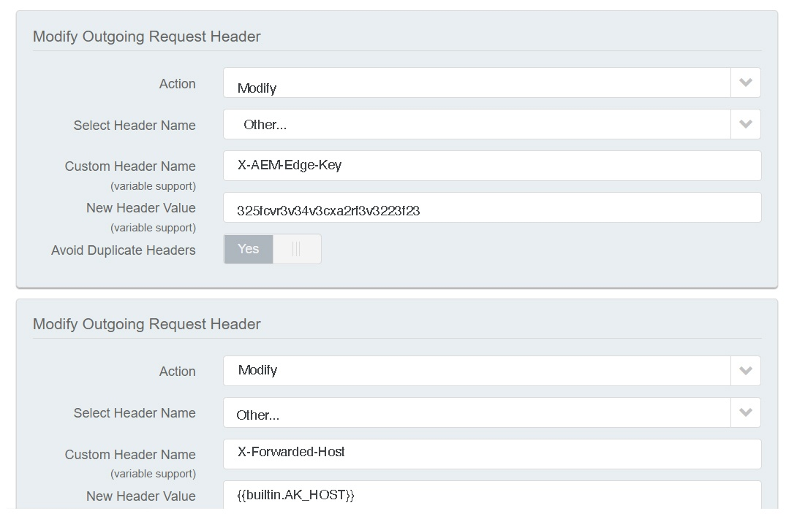

# CDN i AEM as a Cloud Service {#cdn}

>[!CONTEXTUALHELP]
>id="aemcloud_golive_cdn"
>title="CDN i AEM as a Cloud Service"
>abstract="AEM när Cloud Servicen levereras med ett inbyggt CDN. Det huvudsakliga syftet är att minska fördröjningen genom att leverera tillgängligt innehåll från CDN-noderna vid kanten, nära webbläsaren. Det är helt managerat och konfigurerat för optimal prestanda i AEM-program."

AEM när Cloud Servicen levereras med ett inbyggt CDN. Dess huvudsakliga syfte är att minska latensen genom att leverera tillgängligt innehåll från CDN-noder nära webbläsaren. Det är helt managerat och konfigurerat för optimal prestanda i AEM-program.

Det AEM hanterade CDN uppfyller de flesta kunders krav på prestanda och säkerhet. För publiceringsnivån kan kunderna välja att peka på det från sina egna CDN, som de måste hantera. Detta kommer att tillåtas från fall till fall, baserat på att vissa krav uppfylls, inklusive, men inte begränsat till, den kund som har en äldre integrering med sin CDN-leverantör som är svår att överge.

Se även följande videofilmer [Cloud 5 AEM CDN del 1](https://experienceleague.adobe.com/docs/experience-manager-learn/cloud-service/cloud-5/cloud5-aem-cdn-part1.html) och [Cloud 5 AEM CDN del 2](https://experienceleague.adobe.com/docs/experience-manager-learn/cloud-service/cloud-5/cloud5-aem-cdn-part2.html) för mer information om CDN på AEM as a Cloud Service.

## AEM hanterat CDN  {#aem-managed-cdn}

Följ avsnitten nedan om du vill använda självbetjäningsgränssnittet för Cloud Manager för att förbereda innehållsleveransen genom att använda det medföljande CDN-nätverket:

1. [Hantera SSL-certifikat](/help/implementing/cloud-manager/managing-ssl-certifications/introduction.md)
1. [Hantera anpassade domännamn](/help/implementing/cloud-manager/custom-domain-names/introduction.md)

>[!NOTE]
>
>Anpassade domäner stöds i Cloud Manager **endast** om du använder det AEM hanterade CDN. Om du har ett eget CDN och [peka på det AEM hanterade CDN](#point-to-point-CDN) du måste använda det specifika CDN för att hantera domäner, inte Cloud Manager.

**Begränsa trafik**

För en AEM hanterad CDN-installation kan all offentlig trafik som standard gå vidare till publiceringstjänsten, både för produktionsmiljöer och icke-produktionsmiljöer (utvecklingsmiljöer och scenmiljöer). Om du vill begränsa trafiken till publiceringstjänsten för en viss miljö (till exempel begränsa mellanlagring med ett intervall av IP-adresser) kan du göra detta på ett självbetjäningssätt via användargränssnittet i Cloud Manager.

Se [Hantera IP-Tillåtelselista](/help/implementing/cloud-manager/ip-allow-lists/introduction.md) om du vill veta mer.

>[!CAUTION]
>
>Endast begäranden från tillåtna IP-adresser hanteras av AEM hanterade CDN. Om du pekar ditt eget CDN mot det AEM hanterade CDN måste du se till att IP-adresserna för ditt CDN ingår i tillåtelselista.

## Customer CDN points to AEM Managed CDN {#point-to-point-CDN}

>[!CONTEXTUALHELP]
>id="aemcloud_golive_byocdn"
>title="Customer CDN points to AEM Managed CDN"
>abstract="AEM som Cloud Service erbjuder ett alternativ för kunderna att använda sitt befintliga CDN. För publiceringsnivån kan kunderna välja att peka på det från sina egna CDN, som de måste hantera. Detta kommer att tillåtas från fall till fall, baserat på att vissa krav uppfylls, inklusive, men inte begränsat till, den kund som har en äldre integrering med sin CDN-leverantör som är svår att överge."

Om en kund måste använda sitt befintliga CDN kan de hantera det och peka det mot det AEM hanterade CDN, förutsatt att följande uppfylls:

* Kunden måste ha ett befintligt CDN som är betungande att ersätta.
* Kunden måste hantera det.
* Kunden måste kunna konfigurera CDN så att det fungerar med AEM as a Cloud Service - se konfigurationsinstruktionerna nedan.
* Kunden måste ha tekniska CDN-experter som är i drift om det uppstår problem.
* Kunden måste utföra och klara ett lasttest innan han/hon kan börja producera.

Konfigurationsinstruktioner:

1. Peka ditt CDN mot Adobe CDN:s ingress som ursprungsdomän. Till exempel, `publish-p<PROGRAM_ID>-e<ENV-ID>.adobeaemcloud.com`.
1. SNI måste också ställas in på Adobe CDN:s ingress.
1. Ange värdhuvudet som den ursprungliga domänen. Till exempel: `Host:publish-p<PROGRAM_ID>-e<ENV-ID>.adobeaemcloud.com`.
1. Ange `X-Forwarded-Host` header med domännamnet så att AEM kan avgöra värdhuvudet. Till exempel: `X-Forwarded-Host:example.com`.
1. Ange `X-AEM-Edge-Key`. Värdet ska komma från Adobe.

   * Detta behövs för att CDN-nätverket i Adobe ska kunna validera källan för förfrågningarna och skicka `X-Forwarded-*` rubriker i AEM. Till exempel:`X-Forwarded-For` används för att fastställa klientens IP-adress. Det blir alltså den betrodda uppringarens (dvs. kundhanterade CDN) ansvar att se till att `X-Forwarded-*` rubriker (se anteckningen nedan).
   * Åtkomst till Adobe CDN-ingången kan blockeras om en `X-AEM-Edge-Key` finns inte. Informera Adobe om du behöver direktåtkomst till Adobe CDN:s ingress (som ska blockeras).

Se [Exempel på CDN-leverantörskonfigurationer](#sample-configurations) för exempel på konfiguration från ledande CDN-leverantörer.

Innan du godkänner direkttrafik bör du validera med Adobe kundsupport att hela trafikflödet fungerar korrekt.

När du har fått `X-AEM-Edge-Key`kan du testa att begäran dirigeras korrekt enligt följande.

I Linux:

```
curl https://publish-p<PROGRAM_ID>-e<ENV-ID>.adobeaemcloud.com -H "X-Forwarded-Host: example.com" -H "X-AEM-Edge-Key: <PROVIDED_EDGE_KEY>"
```

I Windows:

```
curl https://publish-p<PROGRAM_ID>-e<ENV-ID>.adobeaemcloud.com --header "X-Forwarded-Host: example.com" --header "X-AEM-Edge-Key: <PROVIDED_EDGE_KEY>"
```

>[!NOTE]
>
>När du använder ditt eget CDN behöver du inte installera domäner och certifikat i Cloud Manager. Cirkulationen i CDN i Adobe görs med standarddomänen `publish-p<PROGRAM_ID>-e<ENV-ID>.adobeaemcloud.com` som ska skickas i begäran `Host` header. Skriva över begäran `Host` huvud med ett anpassat domännamn kan göra så att begäran inte dirigeras korrekt av CDN:n i Adobe.


>[!NOTE]
>
>Kunder som hanterar sitt eget CDN bör säkerställa integriteten för de huvuden som skickas vidare till AEM CDN. Vi rekommenderar till exempel att kunderna tar bort alla `X-Forwarded-*` och ange kända och kontrollerade värden. Till exempel: `X-Forwarded-For` måste innehålla klientens IP-adress, medan `X-Forwarded-Host` måste innehålla webbplatsens värd.

>[!NOTE]
>
>Sandlådeprogrammiljöer har inte stöd för ett CDN som kunden tillhandahåller.

Det extra hoppet mellan kundens CDN och det AEM CDN behövs bara om ett cache-minne saknas. Genom att använda de strategier för cacheoptimering som beskrivs i den här artikeln bör tillägget av en kund-CDN endast medföra försumbar fördröjning.

Observera att den här kundens CDN-konfiguration stöds för publiceringsnivån, men inte framför författarnivån.

### Exempel på CDN-leverantörskonfigurationer {#sample-configurations}

Nedan visas flera konfigurationsexempel från ett antal ledande CDN-leverantörer.

**Akamai**




**Amazon CloudFront**


**Cloudflare**


## Geolocation-rubriker {#geo-headers}

Den AEM hanterade CDN lägger till rubriker i varje begäran med:

* landskod: `x-aem-client-country`
* Kontinentalkod: `x-aem-client-continent`

>[!NOTE]
>
>Vid kundhanterad CDN återspeglar dessa huvuden kundens CDN-proxyserver snarare än den faktiska klienten.  För kundhanterad CDN bör därför rubriker i geopositionering hanteras av kundens CDN.

Värdena för landskoderna är de Alpha-2-koder som beskrivs [här](https://en.wikipedia.org/wiki/ISO_3166-1).

Värdena för kontinentkoderna är:

* AF Africa
* AN Antarktis
* AS Asien
* EU Europa
* NA Nordamerika
* OC Oceanien
* Sydamerika

Denna information kan vara användbar vid användning, t.ex. omdirigering till en annan URL som baseras på begärans ursprung (land). Använd rubriken Variera för att cachelagra svar som är beroende av geoinformation. Omdirigeringar till en viss landningssida bör till exempel alltid innehålla `Vary: x-aem-client-country`. Om det behövs kan du använda `Cache-Control: private` för att förhindra cachelagring. Se även [Cachelagring](/help/implementing/dispatcher/caching.md#html-text).
