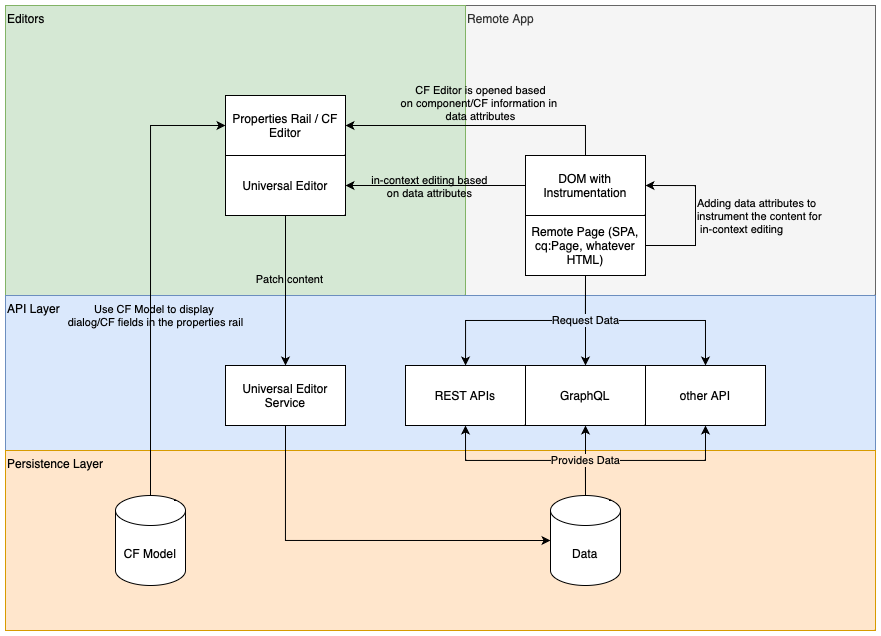
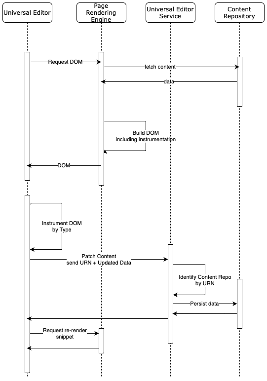
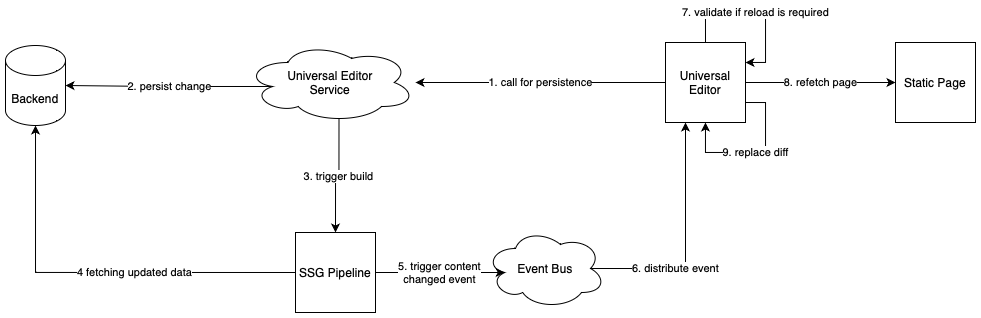

# Universal Editor Architecture {#architecture}

Läs mer om arkitekturen i den universella redigeraren och hur data flödar mellan tjänster och lager.

## Byggblock för arkitektur {#building-blocks}

Den universella redigeraren består av fyra viktiga byggstenar som interagerar så att skribenterna kan redigera alla delar av innehållet i alla implementeringar för att leverera enastående upplevelser, öka innehållets hastighet och skapa en toppmodern utvecklarupplevelse.

1. [Redigerare](#editors)
1. [Remote App](#remote-app)
1. [API-lager](#api-layer)
1. [Lager för beständighet](#persistence-layer)

I det här dokumentet beskrivs dessa byggstenar och hur de utbyter data.

>[!TIP]
>
>Om du vill se hur Universal Editor och dess arkitektur fungerar i praktiken kan du läsa dokumentet [Komma igång med Universal Editor i AEM](getting-started.md) om du vill lära dig hur du får tillgång till den universella redigeraren och hur du börjar använda den i ditt första AEM.

### Redigerare {#editors}

* **Universal Editor** - Universell redigerare använder en instrumenterad DOM för att tillåta redigering på plats av innehåll. Se dokumentet [Attribut och typer](attributes-types.md) om du vill ha information om nödvändiga metadata. Se dokumentet [Komma igång med Universal Editor i AEM](getting-started.md) för ett exempel på instrumentering i AEM.
* **Properties Rail** - Vissa egenskaper hos komponenterna kan inte redigeras i sitt sammanhang, t.ex. rotationstid för en karusell eller vilken dragspelsflik som alltid ska öppnas eller stängas. För att sådan komponentinformation ska kunna redigeras finns en formulärbaserad redigerare i sidlisten i redigeraren.

### Remote App {#remote-app}

DOM måste vara instrumenterad för att ett program ska kunna redigeras i sitt sammanhang i den universella redigeraren. Fjärrprogrammet måste återge vissa attribut i DOM. Se dokumentet [Attribut och typer](attributes-types.md) om du vill ha information om nödvändiga metadata. Se dokumentet [Komma igång med Universal Editor i AEM](getting-started.md) för ett exempel på instrumentering i AEM.

Den universella redigeraren strävar efter ett minimum av SDK, och därför är det implementeringen av fjärrappen som ansvarar för instrumenteringen.

### API-lager {#api-layer}

* **Innehållsdata** - För den universella redigeraren är varken källsystemen för innehållsdata eller hur de konsumeras viktigt. Det är bara viktigt att definiera och tillhandahålla de attribut som krävs med kontextredigerbara data.
* **Beständiga data** - För varje redigerbar data finns det en URN-identifierare. Denna URN används för att dirigera beständigheten till rätt system och resurs.

### Lager för beständighet {#persistence-layer}

* **Content Fragment Model** - För att stöda en rät för redigering av egenskaper för innehållsfragment, redigeraren för innehållsfragment och formulärbaserade redigerare krävs modeller per komponent och innehållsfragment.
* **Innehåll** - Innehåll kan lagras var som helst, t.ex. i AEM, Magento.

## Universal Editor Service och Backend System Dispatch {#service}

Universal Editor skickar alla innehållsändringar till en central tjänst som kallas Universal Editor Service. Den här tjänsten, som körs på Adobe I/O Runtime, läser in plugin-program som är tillgängliga i tilläggsregistret baserat på angiven URN. Plugin-programmet ansvarar för att kommunicera med serverdelen och returnera ett enhetligt svar.

## Renderar pipelines {#rendering-pipelines}

### Återgivning på serversidan {#server-side}

### Statisk webbplatsgenerering {#static-generation}

### Återgivning på klientsidan {#client-side}

## Ytterligare resurser {#additional-resources}

Mer information om Universal Editor finns i de här dokumenten.

* [Introduktion till Universal Editor](introduction.md) - Lär dig hur den universella redigeraren möjliggör redigering av alla aspekter av innehåll i alla implementeringar för att leverera enastående upplevelser, öka innehållets hastighet och leverera en toppmodern utvecklarupplevelse.
* [Skapa innehåll med den universella redigeraren](authoring.md) - Lär dig hur enkelt och intuitivt det är för skribenter att skapa innehåll med den universella redigeraren.
* [Komma igång med Universal Editor i AEM](getting-started.md) - Lär dig hur du får tillgång till den universella redigeraren och hur du börjar använda den i ditt första AEM.
* [Attribut och typer](attributes-types.md) - Läs mer om de dataattribut och datatyper som krävs för den universella redigeraren.
* [Autentisering av universell redigerare](authentication.md) - Lär dig hur den universella redigeraren autentiseras.
