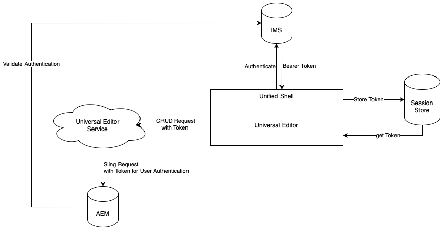

# Autentisering av universell redigerare {#authentication}

Lär dig hur den universella redigeraren autentiseras.

{{universal-editor-status}}

## Alternativ {#options}

Universal Editor använder Adobe Identity Management System-autentisering (IMS), som tillhandahålls via det enhetliga gränssnittet.

Alla program/fjärrsidor ansvarar för autentisering till de backend-system som krävs. Tjänsten Universal Editor behöver denna autentisering för backend-system för att kunna utföra CRUD-åtgärder som fristående tjänster.

## Standardflöde {#standard-flow}

Detta är lösningen för AEM as a Cloud Service och AMS som använder IMS för att använda Universell redigerare.

Om du vill använda den universella redigeraren måste användaren vara inloggad i det enhetliga gränssnitt som autentiserar mot IMS. Den angivna IMS-token lagras i användarens sessionsarkiv.

När en användare utför en CRUD-åtgärd skickas ett anrop till Universal Editor-tjänsten med IMS-bearer-token i HTTP-huvudet. Tjänsten Universal Editor använder sedan bearer-token för att autentisera begäran mot AEM backend-system för att köra åtgärder i användarens namn.

## Ytterligare resurser {#additional-resources}

Mer information om Universal Editor finns i de här dokumenten.

* [Introduktion till Universal Editor](introduction.md) - Lär dig hur den universella redigeraren möjliggör redigering av alla aspekter av innehåll i alla implementeringar, så att du kan leverera enastående upplevelser, öka innehållets hastighet och skapa en toppmodern utvecklarupplevelse.
* [Skapa innehåll med den universella redigeraren](/help/sites-cloud/authoring/universal-editor/authoring.md) - Lär dig hur enkelt och intuitivt det är för skribenter att skapa innehåll med den universella redigeraren.
* [Publicera innehåll med den universella redigeraren](/help/sites-cloud/authoring/universal-editor/publishing.md) - Lär dig hur den universella redigeraren publicerar innehåll och hur dina appar kan hantera det publicerade innehållet.
* [Komma igång med Universal Editor i AEM](getting-started.md) - Lär dig hur du får tillgång till den universella redigeraren och hur du börjar använda den i ditt första AEM.
* [Universal Editor Architecture](architecture.md) - Lär dig mer om arkitekturen i den universella redigeraren och hur data flödar mellan tjänster och lager.
* [Attribut och typer](attributes-types.md) - Läs mer om de dataattribut och datatyper som krävs för den universella redigeraren.
