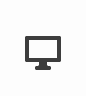
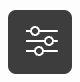
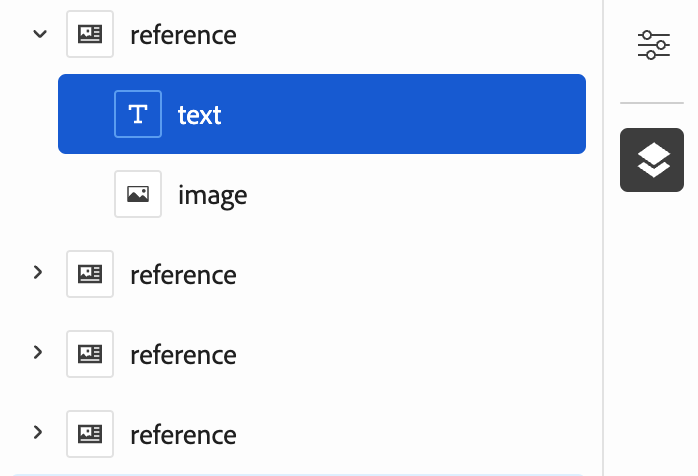

# Skapa innehåll med den universella redigeraren {#authoring}

Se hur enkelt och intuitivt det är för skribenter att skapa innehåll med den universella redigeraren.

## Introduktion {#introduction}

Med den universella redigeraren kan du redigera alla delar av innehållet i alla implementeringar så att du kan leverera enastående upplevelser, öka innehållets hastighet och skapa en toppmodern utvecklarupplevelse.

För att göra detta har den universella redigeraren ett intuitivt användargränssnitt som kräver minimal utbildning för att man ska kunna börja redigera material. I det här dokumentet beskrivs hur du skapar i Universell redigerare.

>[!TIP]
>
>En mer detaljerad introduktion till Universal Editor finns i dokumentet [Introduktion till Universal Editor.](introduction.md)

>[!NOTE]
>
>Den universella redigeraren är fortfarande under utveckling. Det kan för närvarande inte redigera alla innehållstyper.

## Förbered appen {#prepare-app}

Om du vill skapa innehåll för ett program med den universella redigeraren måste appen vara instrumenterad av en utvecklare för att stödja redigeraren.

>[!TIP]
>
>Se [Komma igång med Universal Editor i AEM](getting-started.md) om du vill se ett exempel på hur du konfigurerar ett AEM program så att det fungerar med den universella redigeraren.

## Logga in {#sign-in}

När appen har instrumenterats för att fungera med den universella redigeraren måste du logga in i den universella redigeraren. Du behöver en Adobe ID för att logga in och [har tillgång till den universella redigeraren.](getting-started.md#request-access)

När du har loggat in anger du URL-adressen till sidan som du vill redigera i dialogrutan [platsfält.](#location-bar) så att du kan börja redigera innehåll som [textinnehåll](#text-mode) eller [mediainnehåll.](#media-mode)

## Förstå användargränssnittet {#ui}

Gränssnittet är uppdelat i fem huvudområden.

* [Rubriken Experience Cloud](#experience-cloud-header)
* [The Universal Editor header](#universal-editor-header)
* [Skrivskenan](#mode-rail)
* [Redigeraren](#editor)
* [Komponenträgen](#component-rail)

### Sidhuvudet Experience Cloud {#experience-cloud-header}

Sidhuvudet Experience Cloud finns alltid längst upp på skärmen. Det är en ankarpunkt som talar om var du befinner dig i Experience Cloud och som hjälper dig att navigera till andra program i Experience Cloud.

#### Experience Manager {#experience-manager}

Klicka på länken Adobe Experience Cloud till vänster om rubriken för att navigera till roten för din Experience Manager-lösning för att komma åt verktyg som [Cloud Manager,](/help/onboarding/cloud-manager-introduction.md) [Cloud Acceleration Manager,](/help/journey-migration/cloud-acceleration-manager/introduction/overview-cam.md) och [Programvarudistribution.](https://experienceleague.adobe.com/docs/experience-cloud/software-distribution/home.html)

#### Organisation {#organization}

Här visas den organisation du är inloggad på. Tryck eller klicka för att växla till en annan organisation om din Adobe ID är kopplad till flera.

#### Lösningar {#solutions}

Om du trycker eller klickar på lösningens väljare kan du snabbt gå över till andra Experience Cloud-lösningar.

#### Hjälp {#help}

Hjälpikonen ger snabb åtkomst till utbildningsresurser och supportresurser.

#### Meddelanden {#notifications}

Den här ikonen är märkt med antalet tilldelade ofullständiga [meddelanden.](/help/implementing/cloud-manager/notifications.md)

#### Användaregenskaper {#user-properties}

Tryck eller klicka på ikonen som representerar användaren för att få åtkomst till dina användarinställningar. Om du inte har konfigurerat någon användarbild tilldelas ikonen slumpmässigt.

### The Universal Editor Header {#universal-editor-header}

Rubriken Universal Editor visas alltid längst upp på skärmen precis nedanför [Experience Cloud.](#experience-cloud-header) Du får snabb åtkomst för att navigera till en annan sida för att redigera och publicera den aktuella sidan.

#### Hamburger-menyn {#hamburger-menu}

Hamburgermenyn är inte implementerad än.

#### Platsfält {#location-bar}

Platsfältet visar adressen till sidan som du redigerar. Tryck eller klicka för att ange adressen till en annan sida som ska redigeras.

>[!TIP]
>
>Använda snabbtangenten `L` för att öppna adressfältet.

>[!NOTE]
>
>Alla sidor som du vill redigera med Universal Editor måste vara [som har stöd för Universal Editor.](getting-started.md)

#### Emulatorinställningar {#emulator}

Tryck eller klicka på emuleringsikonen för att definiera hur den universella redigeraren ska återge sidan.

Om du trycker eller klickar på emuleringsikonen visas alternativen.

Som standard öppnas redigeraren i skrivbordslayout där höjd och bredd definieras automatiskt av webbläsaren.

Du kan också välja att emulera en mobil enhet och i Universell redigerare:

* Definiera dess orientering
* Definiera bredd och höjd
* Ändra orientering

#### Öppna programförhandsgranskning {#open-app-preview}

Tryck eller klicka på ikonen för att öppna förhandsgranskning av program för att öppna sidan som du redigerar på en egen webbläsarflik, utan redigeraren, för att förhandsgranska innehållet.

>[!TIP]
>
>Använda snabbtangenten `O` (bokstaven O) för att öppna förhandsgranskningen av programmet.

#### Publicera {#publish}

Tryck eller klicka på publiceringsknappen så att du kan publicera ändringarna i innehållet live för läsning.

>[!TIP]
>
>Se dokumentet [Publicera innehåll med den universella visuella redigeraren](publishing.md) för mer information om publicering med Universal Editor.

### Mode Rail {#rail}

Lägesfältet visas alltid längs den vänstra sidan av redigeraren. Du kan enkelt växla mellan olika redigeringslägen i redigeraren.

#### Förhandsgranskningsläge {#preview-mode}

I förhandsgranskningsläget återges sidan i redigeraren som den skulle se ut i din publicerade tjänst. Detta gör att innehållsförfattaren kan navigera i innehållet genom att klicka på länkar, osv.

>[!TIP]
>
>Använda snabbtangenten `P` för att växla till förhandsvisningsläge.

#### Textläge {#text-mode}

I textläge kan innehållsförfattaren klicka för att markera textinnehåll.

* Du kan [redigera ren text](#editing-content) på plats.
* Du kan också [redigera RTF](#editing-rich-text) på plats med ytterligare formateringsalternativ som visas i komponentspåret.

>[!TIP]
>
>Använda snabbtangenten `T` för att växla till textläge.

#### Medieläge {#media-mode}

I medieläge kan innehållsförfattaren klicka för att välja medieinnehåll.

Information om innehållet visas i komponentfältet och författaren kan också [redigera medieinnehållet.](#editing-media)

>[!TIP]
>
>Använda snabbtangenten `M` för att växla till medieläge.

#### Komponentläge {#component-mode}

I komponentläget kan innehållsförfattaren klicka för att välja [Innehållsfragment.](/help/assets/content-fragments/content-fragments.md)

När du väljer ett innehållsfragment visas detaljerna om det i komponentlisten där du kan [redigera innehållsfragmentet.](#edit-content-fragment)

>[!TIP]
>
>Använda snabbtangenten `C` för att växla till komponentläge.

### Redigeraren {#editor}

Redigeraren tar upp större delen av fönstret och är där sidan som anges i [platsfältet](#location-bar) återges.

* Om redigeraren är i ett redigeringsläge som [textläge](#text-mode) eller [medieläge,](#media-mode) innehållet kan redigeras, men du kan inte följa länkar.
* Om redigeraren är i [förhandsgranskningsläge,](#preview-mode) innehållet kommer att kunna navigeras och du kan följa länkar, men du kan inte redigera innehållet.

### Komponentspår {#component-rail}

Komponentlisten visas alltid till höger i redigeraren. Beroende på dess läge kan det visa information för en komponent som är markerad i innehållet eller hierarkin för sidinnehållet.

#### Egenskapsläge {#properties-mode}

I egenskapsläget visar rälen egenskaperna för den komponent som är markerad i redigeraren. Det här är standardläget för komponenträlen när en sida läses in.

Beroende på vilken typ av komponent du väljer kan information visas och ändras i egenskapsfältet.

Observera att inte alla komponenter har information som kan visas och/eller redigeras.

>[!TIP]
>
>Använda snabbtangenten `D` för att växla till egenskapsläge.

#### Läge för innehållsträd {#content-tree-mode}

I innehållsträdsläge visar rälen sidinnehållets hierarki.

När du väljer ett objekt i innehållsträdet rullar redigeraren till det innehållet och markerar det.

>[!TIP]
>
>Använda snabbtangenten `F` för att växla till innehållsträdsläge.

#### Redigera {#edit}

När [komponentläge,](#component-mode) om du väljer en [Innehållsfragment,](/help/assets/content-fragments/content-fragments.md) redigeringsalternativet visas på komponenträlen.

Om du trycker eller klickar på redigeringsknappen öppnas knappen [Innehållsfragmentsredigerare](/help/assets/content-fragments/content-fragments-managing.md#opening-the-fragment-editor) på en ny flik, som ger dig tillgång till den fulla kraften i Content Fragment Editor.

Du kan också redigera detaljer för innehållsfragmentet i komponentspåret beroende på arbetsflödets behov.

>[!TIP]
>
>Använda snabbtangenten `E` om du vill redigera en markerad komponent.

#### Lägg till {#add}

Om du väljer en behållarkomponent i innehållsträdet eller i redigeraren visas alternativet Lägg till på komponenträlen.

Om du trycker eller klickar på knappen Lägg till öppnas en listruta med komponenter som är tillgängliga för [lägg till i den markerade behållaren.](#adding-components)

>[!TIP]
>
>Använda snabbtangenten `A` om du vill lägga till en komponent i en markerad behållarkomponent.

#### Ta bort {#delete}

Om du markerar en komponent i en behållarkomponent antingen i innehållsträdet eller i redigeraren visas borttagningsalternativet på komponenträlen.

Tryck eller klicka på knappen Ta bort [tar bort komponenten.](#deleting-components)

>[!TIP]
>
>Använda snabbtangenten `Shift+Backspace` om du vill ta bort en markerad komponent från en behållare.

## Redigera innehåll {#editing-content}

Det är enkelt och intuitivt att redigera innehåll. I redigeringslägen ([textläge](#text-mode), [medieläge](#media-mode)och [komponentläge](#component-mode)) när du för musen över innehåll i redigeraren markeras redigerbart innehåll med en blå ruta.

Observera att när du trycker eller klickar på innehåll i redigeringsläge görs ett försök att markera det för redigering. Om du vill navigera i ditt innehåll genom att följa länkar växlar du till [förhandsgranskningsläge.](#preview-mode)

Beroende på [läge](#mode-rail) du befinner dig i och det innehåll du väljer kan ha olika redigeringsalternativ och du kan granska ytterligare egenskaper för innehållet med hjälp av [komponentskena.](#component-rail)

### Redigera oformaterad text {#edit-plain-text}

Om du är [textläge](#text-mode) och väljer en oformaterad textkomponent kan du redigera texten på plats.

Skriv bara för att uppdatera innehållet. Tryck på Enter eller tryck eller klicka utanför textrutan för att spara ändringarna.

### Redigera RTF {#edit-rich-text}

Om du är [textläge](#text-mode) och markerar en RTF-komponent kan du redigera texten på plats.

Skriv bara för att uppdatera innehållet. Tryck på Enter eller tryck eller klicka utanför textrutan för att spara ändringarna.

Dessutom är formateringsalternativ och information på texten tillgängliga i komponentspåret.

Formateringsändringar sparas automatiskt i innehållet.

### Redigera media {#edit-media}

Om du är [medieläge](#media-mode) och du markerar en bild kan du visa information om den i komponenträlen.

Tryck eller klicka på **Ersätt** under förhandsgranskningen av den markerade bilden i komponentlisten för att ersätta bilden med en annan bild från ditt resursbibliotek.

1. The [resursväljare](/help/assets/asset-selector.md#using-asset-selector) öppnas så att du kan välja en resurs.
1. Tryck eller klicka för att välja en ny resurs.
1. Tryck eller klicka **Välj** för att återgå till den del av järnvägen där tillgången ersattes.

Ändringarna sparas automatiskt i innehållet.

>[!TIP]
>
>Använda snabbtangenten `R` om du vill öppna resursväljaren och ersätta den markerade bilden.

### Redigera innehållsfragment {#edit-content-fragment}

Om du är [komponentläge](#component-mode) och du väljer [Innehållsfragment,](/help/assets/content-fragments/content-fragments.md) du kan redigera informationen i komponenterna.

De fält som definieras i innehållsmodellen för det valda innehållsfragmentet visas och kan redigeras i komponentfältet.

Ändringarna sparas automatiskt i innehållet.

Om du vill redigera ditt innehållsfragment i dialogrutan [Innehållsfragmentsredigerare](/help/assets/content-fragments/content-fragments-managing.md#opening-the-fragment-editor) i stället klickar du på [redigeringsknapp](#edit) i lägesrälen.

### Lägga till komponenter i behållare {#adding-components}

1. Markera en behållarkomponent i innehållsträdet eller i redigeraren.
1. Tryck eller klicka sedan på ikonen Lägg till i komponenträlen.

   

Komponenten infogas i behållaren och kan redigeras i redigeraren.

### Ta bort komponenter från behållare {#deleting-components}

1. Markera en behållarkomponent i innehållsträdet eller i redigeraren.
1. Tryck eller klicka på ikonen för avfasning för behållaren för att expandera dess innehåll i innehållsträdet.
1. Markera sedan en komponent i behållaren i innehållsträdet.
1. Tryck eller klicka på ikonen Ta bort i komponenträlen.

   

Den markerade komponenten har tagits bort.

### Ändra ordning på komponenter i behållare {#reordering-components}

1. Markera en behållarkomponent i innehållsträdet eller i redigeraren.
1. Om inte redan [content tree-läge,](#content-tree-mode) växla till den.
1. Tryck eller klicka på ikonen för avfasning för behållaren för att expandera dess innehåll i innehållsträdet.
1. Dra handtagsikonerna intill komponenterna i behållaren för att visa att du kan ordna om dem. Dra komponenterna för att ordna om dem i behållaren.

   
1. Den dragna komponenten blir grå i komponentträdet, medan insättningspunkten representeras av en blå linje. Släpp komponenten för att placera den på dess nya plats.

Komponenterna ordnas om i både innehållsträdet och i redigeraren

## Förhandsgranska innehåll {#previewing-content}

När du är klar med redigeringen av innehållet vill du ofta navigera i det och se hur det ser ut i innehållet på andra sidor. I [förhandsgranskningsläge](#preview-mode) Du kan klicka på länkar för att navigera i innehållet som en läsare skulle kunna. Innehållet återges i redigeraren på samma sätt som det publiceras.

Observera att när du trycker eller klickar på ett innehåll i förhandsgranskningsläget fungerar det som om det gjordes för en läsare av innehållet. Om du vill markera innehållet för redigering växlar du till ett redigeringsläge som [textläge](#text-mode) eller [medieläge.](#media-mode)

## Ytterligare resurser {#additional-resources}

Mer information om Universal Editor finns i de här dokumenten.

* [Introduktion till Universal Editor](introduction.md) - Lär dig hur den universella redigeraren möjliggör redigering av alla aspekter av innehåll i alla implementeringar, så att du kan leverera enastående upplevelser, öka innehållets hastighet och skapa en toppmodern utvecklarupplevelse.
* [Publicera innehåll med den universella redigeraren](publishing.md) - Lär dig hur den universella Visual Editor publicerar innehåll och hur dina appar kan hantera det publicerade innehållet.
* [Komma igång med Universal Editor i AEM](getting-started.md) - Lär dig hur du får tillgång till den universella redigeraren och hur du börjar använda den i ditt första AEM.
* [Universal Editor Architecture](architecture.md) - Lär dig mer om arkitekturen i den universella redigeraren och hur data flödar mellan tjänster och lager.
* [Attribut och typer](attributes-types.md) - Läs mer om de dataattribut och datatyper som krävs för den universella redigeraren.
* [Autentisering av universell redigerare](authentication.md) - Lär dig hur den universella redigeraren autentiseras.
