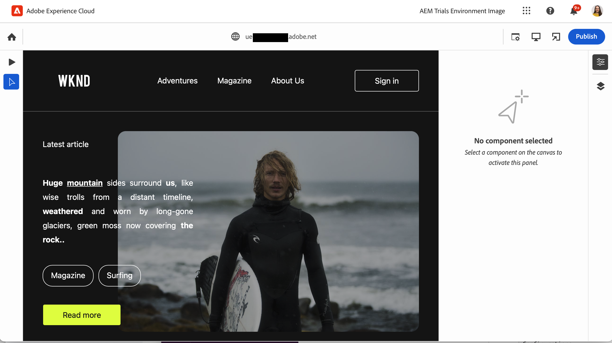
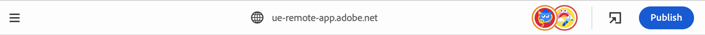
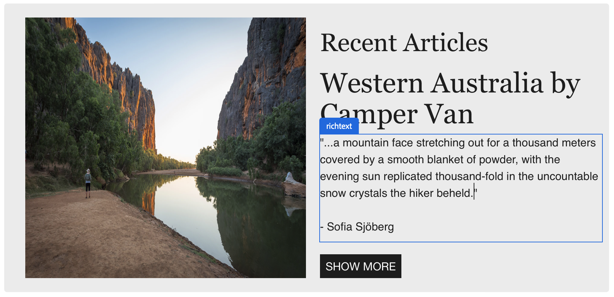

# Skapa innehåll med den universella redigeraren {#authoring}

Se hur enkelt och intuitivt det är för skribenter att skapa innehåll med den universella redigeraren.

## Introduktion {#introduction}

Med den universella redigeraren kan du redigera alla delar av innehållet i alla implementeringar så att du kan leverera enastående upplevelser, öka innehållets hastighet och skapa en toppmodern utvecklarupplevelse.

För att göra detta får skribenterna ett intuitivt användargränssnitt som kräver minimal utbildning för att man ska kunna börja redigera innehåll.

>[!TIP]
>
>En mer detaljerad introduktion till Universal Editor finns i dokumentet [Introduktion till Universal Editor.](introduction.md)

>[!NOTE]
>
>Den universella redigeraren är fortfarande under utveckling och kan för närvarande inte redigera alla innehållstyper.

## Förbered appen {#prepare-app}

Om du vill skapa innehåll för ett program med den universella redigeraren måste appen vara instrumenterad av en utvecklare för att stödja redigeraren.

>[!TIP]
>
>Se dokumentet [Komma igång med Universal Editor i AEM](getting-started.md) om du vill se ett exempel på hur du konfigurerar ett AEM program så att det fungerar med den universella redigeraren.

## Logga in {#sign-in}

När appen har instrumenterats för att fungera med den universella redigeraren måste du logga in i den universella redigeraren. Du behöver en Adobe ID för att logga in och [har tillgång till den universella redigeraren.](getting-started.md#request-access)

När du har loggat in anger du URL-adressen till sidan som du vill redigera i dialogrutan [adressfält.](#address-bar) så att du kan börja [redigera innehållet.](#edit-content)

## Förstå användargränssnittet {#ui}

Gränssnittet är uppdelat i fyra huvudområden.

* [Rubriken Experience Cloud](#experience-cloud-header)
* [The Universal Editor header](#universal-editor-header)
* [Järnvägen](#rail)
* [Redigeraren](#editor)

### Sidhuvudet Experience Cloud {#experience-cloud-header}

Sidhuvudet Experience Cloud finns alltid längst upp på skärmen. Det är en ankarpunkt som talar om var du befinner dig i Experience Cloud och som hjälper dig att navigera till andra program i Experience Cloud.

#### Experience Manager {#experience-manager}

Klicka på länken Adobe Experience Cloud till vänster om rubriken för att navigera till roten för din Experience Manager-lösning för att komma åt verktyg som [Cloud Manager,](/help/onboarding/cloud-manager-introduction.md) [Cloud Acceleration Manager,](/help/journey-migration/cloud-acceleration-manager/introduction/overview-cam.md) och [Programvarudistribution.](https://experienceleague.adobe.com/docs/experience-cloud/software-distribution/home.html)

#### Organisation {#organization}

Här visas den organisation du är inloggad på. Tryck eller klicka för att växla till en annan organisation om din Adobe ID är kopplad till flera.

#### Lösningar {#solutions}

Om du trycker eller klickar på lösningens väljare kan du snabbt gå över till andra Experience Cloud-lösningar.

#### Hjälp {#help}

Hjälpikonen ger snabb åtkomst till utbildningsresurser och supportresurser.

#### Meddelanden {#notifications}

Den här ikonen är märkt med antalet tilldelade ofullständiga [meddelanden.](/help/implementing/cloud-manager/notifications.md)

#### Användaregenskaper {#user-properties}

Tryck eller klicka på ikonen som representerar användaren för att få åtkomst till dina användarinställningar. Om du inte har konfigurerat någon användarbild tilldelas ikonen slumpmässigt.

### The Universal Editor Header {#universal-editor-header}

Rubriken Universal Editor visas alltid längst upp på skärmen precis nedanför [Experience Cloud.](#experience-cloud-header) Du kan snabbt navigera till en annan sida för att redigera och publicera den aktuella sidan.

#### Hamburger-menyn {#hamburger-menu}

Hamburgermenyn är inte implementerad än.

#### Platsfält {#Location-bar}

Platsfältet visar adressen till sidan som du redigerar. Tryck eller klicka för att ange adressen till en annan sida som ska redigeras.

>[!TIP]
>
>Använda snabbtangenten `L` för att öppna adressfältet.

>[!NOTE]
>
>Alla sidor som du vill redigera med Universal Editor måste vara [som har stöd för Universal Editor.](getting-started.md)

#### Öppna programförhandsgranskning {#open-app-preview}

Tryck eller klicka på ikonen för att öppna appförhandsgranskning för att öppna sidan som du redigerar i en egen webbläsare, utan redigeraren, för att förhandsgranska ändringarna.

>[!TIP]
>
>Använda snabbtangenten `O` för att öppna förhandsgranskningen av programmet.

#### Publicera {#publish}

Tryck eller klicka på publiceringsknappen så att du kan publicera ändringarna i innehållet live för läsning.

>[!TIP]
>
>Se dokumentet [Publicera innehåll med den universella visuella redigeraren](publishing.md) för mer information om publicering med Universal Editor.

### The Rail {#rail}

Rälen visas alltid till vänster om redigeraren. Det gör det enkelt att växla mellan förhandsgranskningsläge och redigeringsläge i redigeraren.

#### Förhandsgranskningsläge {#preview-mode}

I förhandsgranskningsläget återges sidan i redigeraren som den skulle se ut i din publicerade tjänst. Detta gör att innehållsförfattaren kan navigera i innehållet genom att klicka på länkar, osv.

>[!TIP]
>
>Använda snabbtangenten `P` för att växla till förhandsvisningsläge.

#### Redigeringsläge {#edit-mode}

I redigeringsläge återges sidan i redigeraren, men innehållsförfattaren kan klicka för att markera innehållet och redigera det. Det här är standardläget för redigeraren när en sida läses in.

### Redigeraren {#editor}

Redigeraren tar upp större delen av fönstret och är där sidan som anges i [adressfältet](#address-bar) återges.

Beroende på om redigeraren är i [redigeringsläge](#edit-mode) eller [förhandsgranskningsläge,](#edit-mode) innehållet kan antingen redigeras eller navigeras.

## Redigera innehåll {#editing-content}

Det är enkelt och intuitivt att redigera innehåll. I [redigeringsläge,](#edit-mode) När du för musen över innehåll i redigeraren markeras redigerbart innehåll med en blå ruta.

Tryck eller klicka bara på innehållet i den blå rutan för att starta en redigerare på plats och göra ändringarna. Tryck på Retur för att spara ändringarna.

Observera att när du trycker eller klickar på innehåll i redigeringsläge görs ett försök att markera det för redigering. Om du vill navigera i ditt innehåll genom att följa länkar växlar du till [förhandsgranskningsläge.](#preview-mode)

## Förhandsgranska innehåll {#previewing-content}

När du är klar med redigeringen av innehållet vill du ofta navigera i det och se hur det ser ut i innehållet på andra sidor. I [förhandsgranskningsläge](#preview-mode) Du kan klicka på länkar för att navigera i innehållet som en läsare skulle kunna. Innehållet återges i redigeraren på samma sätt som det publiceras.

Observera att när du trycker eller klickar på ett innehåll i förhandsgranskningsläget fungerar det som om det gjordes för en läsare av innehållet. Om du vill markera innehållet för redigering växlar du till [redigeringsläge.](#edit-mode)

## Ytterligare resurser {#additional-resources}

Mer information om Universal Editor finns i de här dokumenten.

* [Introduktion till Universal Editor](introduction.md) - Lär dig hur den universella redigeraren möjliggör redigering av alla aspekter av innehåll i alla implementeringar, så att du kan leverera enastående upplevelser, öka innehållets hastighet och skapa en toppmodern utvecklarupplevelse.
* [Publicera innehåll med den universella redigeraren](publishing.md) - Lär dig hur den universella Visual Editor publicerar innehåll och hur dina appar kan hantera det publicerade innehållet.
* [Komma igång med Universal Editor i AEM](getting-started.md) - Lär dig hur du får tillgång till den universella redigeraren och hur du börjar använda den i ditt första AEM.
* [Universal Editor Architecture](architecture.md) - Lär dig mer om arkitekturen i den universella redigeraren och hur data flödar mellan tjänster och lager.
* [Attribut och typer](attributes-types.md) - Läs mer om de dataattribut och datatyper som krävs för den universella redigeraren.
* [Autentisering av universell redigerare](authentication.md) - Lär dig hur den universella redigeraren autentiseras.
