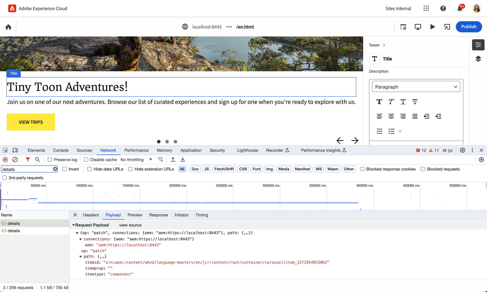

# Universella redigeringsanrop {#calls}

Lär dig mer om de olika typer av samtal som görs till appen av den universella redigeraren som kan hjälpa dig vid felsökning.

{{universal-editor-status}}

## Ökning {#overview}

Den universella redigeraren kommunicerar med ditt instrumenterade program via en serie definierade anrop. Detta är genomskinligt och påverkar inte slutanvändarens upplevelse.

För utvecklaren kan det dock vara värdefullt att förstå dessa anrop och vad de gör när du felsöker programmet i den universella redigeraren. Om du har instrumenterat din app och den inte fungerar som förväntat kan det vara bra att öppna **Nätverk** -fliken för utvecklingsverktygen i webbläsaren och inspektera samtalen när du redigerar innehåll i appen.



* The **Nyttolast** av samtalet innehåller information om vad som uppdateras av redigeraren, bland annat information om vad som ska uppdateras och hur det ska uppdateras.
* The **Svar** innehåller information om exakt vad som uppdaterades av redigeringstjänsten. Detta är för att underlätta uppdatering av innehållet i redigeraren. I vissa fall, som `move` måste hela sidan uppdateras.

När ett samtal har slutförts aktiveras händelser som innehåller nyttolasten för begäran och svaret, som kan anpassas för din egen app. Se dokumentet [Universella redigeringshändelser](/help/implementing/universal-editor/events.md) för mer information.

Nedan följer en lista över de typer av anrop som den universella redigeraren gör till ditt program tillsammans med exempel på nyttolaster och svar.

## Uppdatera {#update}

An `update` anropet inträffar när du redigerar innehåll i appen med den universella redigeraren. The `update` kvarstår ändringarna.

Nyttolasten innehåller information om vad som ska skrivas tillbaka till JCR.

* `resource`: JCR-sökvägen som ska uppdateras
* `prop`: Den JCR-egenskap som uppdateras
* `type`: JCR-värdetypen för egenskapen som uppdateras
* `value`: Uppdaterade data

>[!BEGINTABS]

>[!TAB Exempel på nyttolast]

```json
{
  "connections": [
    {
      "name": "aem",
      "protocol": "aem",
      "uri": "https://localhost:8443"
    }
  ],
  "target": {
    "resource": "urn:aem:/content/wknd/language-masters/en/jcr:content/root/container/carousel/item_1571954853062",
    "type": "text",
    "prop": "jcr:title"
  },
  "value": "Tiny Toon Adventures"
}
```

>[!TAB Exempelsvar]

```json
{
  "updates": [
    {
      "resource": "urn:aem:/content/wknd/language-masters/en/jcr:content/root/container/carousel/item_1571954853062",
      "prop": "jcr:title",
      "type": "text"
    }
  ]
}
```

>[!ENDTABS]

## Information {#details}

A `details` anropet inträffar när appen läses in i Universal Editor för att hämta appens innehåll.

Dess nyttolast innehåller de data som ska återges samt detaljer om vad data representerar (schemat) så att de kan återges i den universella redigeraren.

* För en komponent hämtar Universal Editor endast en `data` -objektet, eftersom dataschemat definieras i programmet.
* För innehållsfragment hämtar den universella redigeraren även en `schema` eftersom innehållsfragmentmodellen är definierad i JCR.

>[!BEGINTABS]

>[!TAB Exempel på nyttolast]

```json
{
  "connections": [
    {
      "name": "aem",
      "protocol": "aem",
      "uri": "https://localhost:8443"
    }
  ],
  "target": {
    "resource": "urn:aem:/content/wknd/language-masters/en/jcr:content/root/container/carousel/item_1571954853062",
    "type": "component",
    "prop": ""
  }
}
```

>[!TAB Exempelsvar]

```json
{
  "data": {
    "jcr:primaryType": "nt:unstructured",
    "jcr:title": "Tiny Toon Adventures",
    "fileReference": "/content/dam/wknd-shared/en/adventures/riverside-camping-australia/adobestock-216674449.jpeg",
    "cq:panelTitle": "WKND Adventures",
    "actionsEnabled": "true",
    "jcr:lastModifiedBy": "admin",
    "titleFromPage": "false",
    "jcr:description": "<p>With WKND Adventures, you don't just see the world you experinece it.</p>\r\n",
    "jcr:lastModified": "Fri Jan 19 2024 11:05:59 GMT+0100",
    "descriptionFromPage": "true",
    "sling:resourceType": "wknd/components/teaser",
    "textIsRich": "true",
    "cq:styleIds": [
      "1555543212672"
    ],
    "actions": {
      "jcr:primaryType": "nt:unstructured",
      "item0": {
        "jcr:primaryType": "nt:unstructured",
        "link": "/content/wknd/language-masters/en/adventures",
        "text": "View Trips"
      }
    }
  }
}
```

>[!ENDTABS]

## Lägg till {#add}

An `add` anropet inträffar när du placerar en ny komponent i programmet med den universella redigeraren.

Nyttolasten innehåller en `path` objekt som innehåller var innehållet ska läggas till.

Den innehåller även `content` objekt med ytterligare objekt för slutpunktsspecifik information om innehållet som ska lagras [för varje plugin.](/help/implementing/universal-editor/architecture.md) Om din app till exempel baseras på innehåll från AEM och Magento, innehåller nyttolasten ett dataobjekt för varje system.

>[!BEGINTABS]

>[!TAB Exempel på nyttolast]

```json
{
  "connections": [
    {
      "name": "aemconnection",
      "protocol": "aem",
      "uri": "https://author-pXXXX-eYYYYY.adobeaemcloud.com"
    }
  ],
  "target": {
    "container": {
      "resource": "urn:aemconnection:/content/wknd/language-masters/en/universal-editor-container/jcr:content/root/container",
      "type": "container",
      "prop": ""
    }
  },
  "content": {
    "name": "text",
    "aem": {
      "page": {
        "resourceType": "wknd/components/text",
        "template": {
          "text": "Default Text"
        }
      }
    }
  }
}
```

>[!TAB Exempelsvar]

```json
{
  "updates": [
    {
      "resource": "urn:aemconnection:/content/wknd/language-masters/en/universal-editor-container/jcr:content/root/container",
      "type": "container"
    }
  ],
  "resource": "urn:aemconnection:/content/wknd/language-masters/en/universal-editor-container/jcr:content/root/container/text_1138559521"
}
```

>[!ENDTABS]

## Flytta {#move}

A `move` anropet inträffar när du flyttar en komponent i programmet med den universella redigeraren.

Nyttolasten innehåller en `from` objekt som definierar var komponenten fanns och en `to` objekt som definierar var det flyttades.

>[!BEGINTABS]

>[!TAB Exempel på nyttolast]

```json
{
  "connections": [
    {
      "name": "aemconnection",
      "protocol": "aem",
      "uri": "https://author-pXXXX-eYYYYY.adobeaemcloud.com"
    }
  ],
  "from": {
    "container": {
      "resource": "urn:aemconnection:/content/wknd/language-masters/en/universal-editor-container/jcr:content/root/container",
      "type": "container",
      "prop": ""
    },
    "component": {
      "resource": "urn:aemconnection:/content/wknd/language-masters/en/universal-editor-container/jcr:content/root/container/image_275525847",
      "type": "media",
      "prop": "fileReference"
    }
  },
  "to": {
    "container": {
      "resource": "urn:aemconnection:/content/wknd/language-masters/en/universal-editor-container/jcr:content/root/container",
      "type": "container",
      "prop": ""
    }
  }
}
```

>[!TAB Exempelsvar]

```json
{
  "updates": [
    {
      "resource": "urn:aemconnection:/content/wknd/language-masters/en/universal-editor-container/jcr:content/root/container",
      "type": "container"
    }
  ]
}
```

>[!ENDTABS]

## Ta bort {#remove}

A `remove` anropet inträffar när du tar bort en komponent i programmet med den universella redigeraren.

Dess nyttolast inkluderar sökvägen till objektet som tas bort.

>[!BEGINTABS]

>[!TAB Exempel på nyttolast]

```json
{
  "connections": [
    {
      "name": "aemconnection",
      "protocol": "aem",
      "uri": "https://author-pXXXX-eYYYYY.adobeaemcloud.com"
    }
  ],
  "target": {
    "component": {
      "resource": "urn:aemconnection:/content/wknd/language-masters/en/universal-editor-container/jcr:content/root/container/text_593170193",
      "type": "text",
      "prop": "text"
    },
    "container": {
      "resource": "urn:aemconnection:/content/wknd/language-masters/en/universal-editor-container/jcr:content/root/container",
      "type": "container",
      "prop": ""
    }
  }
}
```

>[!TAB Exempelsvar]

```json
{
  "updates": [
    {
      "resource": "urn:aemconnection:/content/wknd/language-masters/en/universal-editor-container/jcr:content/root/container",
      "prop": "",
      "type": "container"
    }
  ]
}
```

>[!ENDTABS]

## Publicera {#publish}

A `publish` anropet inträffar när du klickar på **Publicera** om du vill publicera det redigerade innehållet i Universal Editor.

Den universella redigeraren itererar över innehållet och skapar en lista med referenser som också måste publiceras.

>[!BEGINTABS]

>[!TAB Exempel på nyttolast]

```json
{
  "connections": [
    {
      "name": "aemconnection",
      "protocol": "aem",
      "uri": "https://author-pXXXX-eYYYYY.adobeaemcloud.com"
    }
  ],
  "references": [
    "urn:aemconnection:/content/dam/wknd-shared/en/magazine/arctic-surfing/aloha-spirits-in-northern-norway/jcr:content/data/master",
    "urn:aemconnection:/content/dam/wknd-shared/en/adventures/bali-surf-camp/bali-surf-camp/jcr:content/data/master",
    "urn:aemconnection:/content/dam/wknd-shared/en/adventures/climbing-new-zealand/climbing-new-zealand/jcr:content/data/master",
    "urn:aemconnection:/content/dam/wknd-shared/en/adventures/cycling-southern-utah/cycling-southern-utah/jcr:content/data/master",
    "urn:aemconnection:/content/dam/wknd-shared/en/adventures/cycling-tuscany/cycling-tuscany/jcr:content/data/master",
    "urn:aemconnection:/content/dam/wknd-shared/en/adventures/downhill-skiing-wyoming/downhill-skiing-wyoming/jcr:content/data/master",
    "urn:aemconnection:/content/dam/wknd-shared/en/adventures/napa-wine-tasting/napa-wine-tasting/jcr:content/data/master",
    "urn:aemconnection:/content/dam/wknd-shared/en/adventures/riverside-camping-australia/riverside-camping-australia/jcr:content/data/master",
    "urn:aemconnection:/content/dam/wknd-shared/en/adventures/ski-touring-mont-blanc/ski-touring-mont-blanc/jcr:content/data/master",
    "urn:aemconnection:/content/dam/wknd-shared/en/adventures/surf-camp-in-costa-rica/surf-camp-costa-rica/jcr:content/data/master",
    "urn:aemconnection:/content/dam/wknd-shared/en/adventures/tahoe-skiing/tahoe-skiing/jcr:content/data/master",
    "urn:aemconnection:/content/dam/wknd-shared/en/adventures/west-coast-cycling/west-coast-cycling/jcr:content/data/master",
    "urn:aemconnection:/content/dam/wknd-shared/en/adventures/yosemite-backpacking/yosemite-backpacking/jcr:content/data/master",
    "urn:aemconnection:/content/wknd/us/en/newsletter/jcr:content/root/container/title",
    "urn:aemconnection:/content/wknd/us/en/newsletter/jcr:content/root/container/text",
    "urn:aemconnection:/content/wknd/language-masters/en/universal-editor-container/jcr:content/root/title",
    "urn:aemconnection:/content/wknd/language-masters/en/universal-editor-container/jcr:content/root/container",
    "urn:aemconnection:/content/wknd/language-masters/en/universal-editor-container/jcr:content/root/container/image",
    "urn:aemconnection:/content/wknd/language-masters/en/universal-editor-container/jcr:content/root/container/text",
    "urn:aemconnection:/content/wknd/language-masters/en/universal-editor-container/jcr:content/root/container/image_229050934",
    "urn:aemconnection:/content/wknd/language-masters/en/universal-editor-container/jcr:content/root/container/image_2123678383",
    "urn:aemconnection:/content/wknd/language-masters/en/universal-editor-container/jcr:content/root/container/text_1668104604",
    "urn:aemconnection:/content/wknd/language-masters/en/universal-editor-container/jcr:content/root/container/text_1138559521",
    "urn:aemconnection:/content/wknd/language-masters/en/universal-editor-container/jcr:content/root/container/image_275525847"
  ]
}
```

>[!TAB Exempelsvar]

```json
{
  "publishes": [
    "/content/dam/wknd-shared/en/magazine/arctic-surfing/aloha-spirits-in-northern-norway",
    "/content/dam/wknd-shared/en/adventures/bali-surf-camp/bali-surf-camp",
    "/content/dam/wknd-shared/en/adventures/climbing-new-zealand/climbing-new-zealand",
    "/content/dam/wknd-shared/en/adventures/cycling-southern-utah/cycling-southern-utah",
    "/content/dam/wknd-shared/en/adventures/cycling-tuscany/cycling-tuscany",
    "/content/dam/wknd-shared/en/adventures/downhill-skiing-wyoming/downhill-skiing-wyoming",
    "/content/dam/wknd-shared/en/adventures/napa-wine-tasting/napa-wine-tasting",
    "/content/dam/wknd-shared/en/adventures/riverside-camping-australia/riverside-camping-australia",
    "/content/dam/wknd-shared/en/adventures/ski-touring-mont-blanc/ski-touring-mont-blanc",
    "/content/dam/wknd-shared/en/adventures/surf-camp-in-costa-rica/surf-camp-costa-rica",
    "/content/dam/wknd-shared/en/adventures/tahoe-skiing/tahoe-skiing",
    "/content/dam/wknd-shared/en/adventures/west-coast-cycling/west-coast-cycling",
    "/content/dam/wknd-shared/en/adventures/yosemite-backpacking/yosemite-backpacking",
    "/content/wknd/us/en/newsletter",
    "/content/wknd/language-masters/en/universal-editor-container"
  ]
}
```

>[!ENDTABS]

## Ytterligare resurser {#additional-resources}

* [Universella redigeringshändelser](/help/implementing/universal-editor/events.md)
