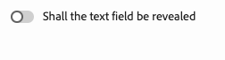

# Anpassa redigeringsmiljön {#customizing-ue}

Lär dig mer om de olika tilläggspunkterna och andra funktioner som gör att du kan anpassa redigeringsmiljön i den universella redigeraren så att den passar de behov som finns hos skribenterna.

## Inaktiverar publicering {#disable-publish}

Vissa redigeringsarbetsflöden kräver att innehållet granskas innan det publiceras. I sådana fall bör alternativet att publicera inte vara tillgängligt för någon författare.

The **Publicera** kan därför undertryckas helt i en app genom att följande metadata läggs till.

```html
<meta name="urn:adobe:aue:config:disable" content="publish"/>
```

## Filtrera komponenter {#filtering-components}

När du använder Universal Editor kan du begränsa vilka komponenter som tillåts per behållarkomponent. För att göra detta måste du infoga ytterligare en script-tagg som pekar på filterdefinitionen.

```html
<script type="application/vnd.adobe.aue.filter+json" src="/static/filter-definition.json"></script>
```

En filterdefinition kan se ut så här, vilket begränsar en behållare så att bara text och bilder kan läggas till.

```json
[
  {
    "id": "container-filter",
     "components": ["text", "image"]
   }
]
```

Sedan kan du referera till filterdefinitionen från behållarkomponenten genom att lägga till egenskapen `data-aue-filter`, skickar ID:t för filtret som du definierade tidigare.

```html
data-aue-filter="container-filter"
```

Ange `components` attribut i en filterdefinition till `null` tillåter alla komponenter, som om det inte fanns något filter.

```json
[
  {
    "id": "another-container-filter",
     "components": null
   }
]
```

## Visa och dölj komponenter i egenskapsfältet {#conditionally-hide}

Även om en eller flera komponenter i allmänhet är tillgängliga för författarna, kan det finnas situationer där det inte passar. I så fall kan du dölja komponenter i egenskapsfältet genom att lägga till en `condition` attributet till [-fält i komponentmodellen.](/help/implementing/universal-editor/field-types.md#fields)

Villkoren kan definieras med [JsonLogic-schema.](https://jsonlogic.com/) Om villkoret är true visas fältet. Om villkoret är falskt döljs fältet.

### Exempelmodell {#sample-model}

```json
 {
    "id": "conditionally-revealed-component",
    "fields": [
      {
        "component": "boolean",
        "label": "Shall the text field be revealed?",
        "name": "reveal",
        "valueType": "boolean"
      },
      {
        "component": "text-input",
        "label": "Hidden text field",
        "name": "hidden-text",
        "valueType": "string",
        "condition": { "===": [{"var" : "reveal"}, true] }
      }
    ]
 }
```

#### Villkorsfel {#false}



#### True för villkor {#true}


