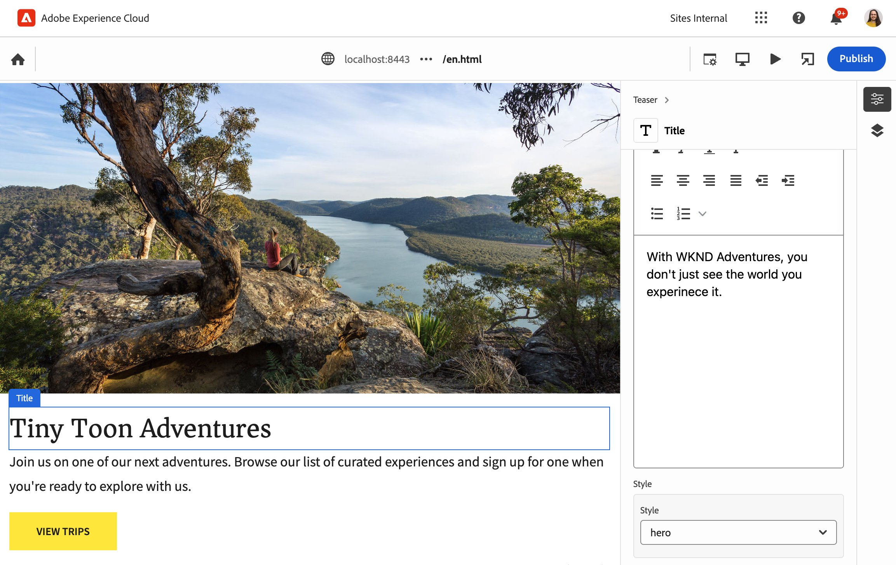

# Universal Editor Overview for AEM Developers {#developer-overview}

Om du är en AEM utvecklare som är intresserad av hur den universella redigeraren fungerar och hur du använder den i ditt projekt ger det här dokumentet dig en introduktion genom att leda dig genom att instrumentera WKND-projektet så att det fungerar tillsammans med den universella redigeraren.

{{universal-editor-status}}

## Syfte {#purpose}

Det här dokumentet är en introduktion för utvecklare av både hur den universella redigeraren fungerar och hur du kan mäta hur programmet fungerar med det.

Den gör detta genom att ta ett standardexempel som de flesta AEM utvecklare känner till, Core Components och WKND, och tolkar några exempelkomponenter som kan redigeras med Universal Editor.

>[!TIP]
>
>Det här dokumentet innehåller extra steg som illustrerar hur den universella redigeraren fungerar och är avsett att fördjupa utvecklarens förståelse för redigeraren. Det är därför inte den mest direkta vägen till att instrumentera ett program, utan det mest illustrativa i den universella redigeraren och hur det fungerar.
>
>Om du vill komma igång så snabbt som möjligt kan du läsa [Komma igång med Universal Editor i AEM](/help/implementing/universal-editor/getting-started.md) -dokument.

## Förutsättningar {#prerequisites}

Du behöver följande för att kunna följa med i den här översikten.

* [En lokal utvecklingsinstans av AEM as a Cloud Service](https://experienceleague.adobe.com/docs/experience-cloud/software-distribution/home.html)
   * Din lokala utvecklingsinstans måste vara [konfigurerad med HTTPS för utvecklingssyfte på `localhost`.](https://experienceleague.adobe.com/docs/experience-manager-learn/foundation/security/use-the-ssl-wizard.html)
   * [WKND-demowebbplatsen måste vara installerad.](https://github.com/adobe/aem-guides-wknd)
* [Åtkomst till den universella redigeraren](/help/implementing/universal-editor/getting-started.md#onboarding)
* [En lokal universell redigeringstjänst](/help/implementing/universal-editor/local-dev.md) som körs för utvecklingsändamål

Förutom att man är allmänt bekant med webbutveckling utgår man i det här dokumentet från att man är van vid AEM. Om du inte är van vid AEM kan du överväga att [WKND-självstudiekursen innan du fortsätter.](/help/implementing/developing/introduction/develop-wknd-tutorial.md)

## Starta AEM och logga in i den universella redigeraren {#sign-in}

Om du inte redan har det måste du ha den lokala AEM utvecklingsinstansen igång med WKND installerat och HTTPS aktiverat som [som beskrivs i kravbreven.](#prerequisites) I den här översikten antas att din instans körs på `https://localhost:8443`.

1. Öppna mallsidan för WKND English i AEM Editor.

   ```text
   https://localhost:8443/editor.html/content/wknd/language-masters/en.html
   ```

1. I **Sidinformation** menyn i redigeraren väljer **Visa som publicerad**. Då öppnas samma sida på en ny flik med AEM Editor inaktiverat.

   ```text
   https://localhost:8443/content/wknd/language-masters/en.html?wcmmode=disabled
   ```

1. Kopiera länken.

1. Logga nu in på Universal Editor.

   ```text
   https://experience.adobe.com/#/aem/editor
   ```

1. Klistra in länken som du kopierade tidigare av WKND-innehållet i **Webbplats-URL** och klickar på **Öppna**.

   

## Universal Editor försöker läsa in innehållet {#sameorigin}

Universal Editor läser in innehåll som ska redigeras i en ram. AEM standardinställningar för X-Frame-alternativ förhindrar detta, vilket tydligt kan ses som ett fel i webbläsaren och detaljeras i konsolutdata när du försöker läsa in din lokala kopia av WKND.


Alternativet X-bildruta `sameorigin` förhindrar återgivning AEM sidor i en ram. Du måste ta bort det här sidhuvudet för att sidorna ska kunna läsas in i Universal Editor.

1. Öppna Configuration Manager.

   ```text
   https://localhost:8443/system/console/configMgr
   ```

1. Redigera OSGi-konfigurationen `org.apache.sling.engine.impl.SlingMainServlet`

   

1. Ta bort egenskapen `X-Frame-Options=SAMEORIGIN` för egenskapen **Ytterligare svarsrubriker**.

1. Spara ändringarna.

Om du nu läser in den universella redigeraren igen ser du att AEM sida läses in.

>[!TIP]
>
>* Se dokumentet [Komma igång med Universal Editor i AEM](/help/implementing/universal-editor/getting-started.md#sameorigin) för mer information om OSGi-konfigurationen.
>* Se dokumentet [Konfigurera OSGi för Adobe Experience Manager as a Cloud Service](/help/implementing/deploying/configuring-osgi.md) för mer information om OSGi i AEM.

## Hantera samma webbplatskookies {#samesite-cookies}

När Universal Editor läser in sidan, läses den in till AEM inloggningssida för att säkerställa att du är autentiserad att göra ändringar.

Du kan dock inte logga in. När du visar webbläsarkonsolen ser du att webbläsaren har blockerat indata i bildrutan


Inloggningstokens cookie skickas till AEM som en tredjepartsdomän. Därför måste cookies på samma plats tillåtas i AEM.

1. Öppna Configuration Manager.

   ```text
   https://localhost:8443/system/console/configMgr
   ```

1. Redigera OSGi-konfigurationen `com.day.crx.security.token.impl.impl.TokenAuthenticationHandler`

   

1. Ändra egenskapen **Attributet SameSite för cookie-filen för inloggningstoken** till `None`.

1. Spara ändringarna.

Om du nu läser in den universella redigeraren igen kan du logga in på AEM och målsidan läses in.

>[!TIP]
>
>* Se dokumentet [Komma igång med Universal Editor i AEM](/help/implementing/universal-editor/getting-started.md#samesite-cookies) för mer information om OSGi-konfigurationen.
>* Se dokumentet [Konfigurera OSGi för Adobe Experience Manager as a Cloud Service](/help/implementing/deploying/configuring-osgi.md) för mer information om OSGi i AEM.

## Universell redigerare Ansluter till fjärrramen {#ue-connect-remote-frame}

När sidan har lästs in i Universal Editor och du har loggat in på AEM försöker Universal Editor ansluta till fjärrbildrutan. Detta görs via ett JavaScript-bibliotek som måste läsas in i fjärrbildrutan. Om JavaScript-biblioteket inte finns skapar sidan slutligen ett timeout-fel i konsolen.


Du måste lägga till det nödvändiga JavaScript-biblioteket till sidkomponenten i WKND-appen.

1. Öppna CRXDE Lite.

   ```text
   https://localhost:8443/crx/de
   ```

1. Under `/apps/wknd/components/page`, redigera filen `customheaderlibs.html`.

   

1. Lägg till JavaScript-biblioteket i slutet av filen.

   ```html
   <script src="https://cdn.jsdelivr.net/gh/adobe/universal-editor-cors/dist/universal-editor-embedded.js"></script>
   ```

1. Klicka **Spara alla** och sedan läsa in Universal Editor igen.

Sidan läses nu in med rätt JavaScript-bibliotek så att den universella redigeraren kan ansluta till sidan och timeoutfelet visas inte längre i konsolen.

>[!TIP]
>
>* Biblioteket kan läsas in antingen i sidhuvudet eller i sidfoten.
>* The `universal-editor-embedded.js` bibliotek [är tillgängligt på NPM](https://www.npmjs.com/package/@adobe/universal-editor-cors) och du kan lägga det själv om det behövs eller placera det direkt i programmet.

## Definiera en anslutning för att behålla ändringar {#connection}

WKND-sidan läses nu in korrekt i Universell redigerare och JavaScript-biblioteket läses in för att ansluta redigeraren till din app.

Men du märkte troligen snabbt att du inte kan interagera med sidan i Universal Editor. Universal Editor kan inte redigera sidan. För att den universella redigeraren ska kunna redigera innehållet måste du definiera en anslutning så att den vet var innehållet ska skrivas. För lokal utveckling måste du skriva tillbaka till den lokala AEM-utvecklingsinstansen på `https://localhost:8443`.

1. Öppna CRXDE Lite.

   ```text
   https://localhost:8443/crx/de
   ```

1. Under `/apps/wknd/components/page`, redigera filen `customheaderlibs.html`.

   

1. Lägg till de metadata som krävs för anslutningen till den lokala AEM i slutet av filen.

   ```html
   <meta name="urn:adobe:aue:system:aem" content="aem:https://localhost:8443">
   ```

1. Lägg till de metadata som behövs för anslutningen till den lokala Universal Editor-tjänsten i slutet av filen.

   ```html
   <meta name="urn:adobe:aue:config:service" content="https://localhost:8000">
   ```

1. Klicka **Spara alla** och sedan läsa in Universal Editor igen.

Nu kan den universella redigeraren inte bara läsa in ditt innehåll från den lokala AEM utvecklingsinstansen, utan även veta var de ändringar du gör med den lokala universella redigeringstjänsten ska sparas. Det här är det första steget när du ska göra ditt program redigerbart med den universella redigeraren.

>[!TIP]
>
>* Se dokumentet [Komma igång med Universal Editor i AEM](/help/implementing/universal-editor/getting-started.md#connection) om du vill ha mer information om anslutningsmetadata.
>* Se dokumentet [Universal Editor Architecture](/help/implementing/universal-editor/architecture.md#service) om du vill ha mer information om strukturen för Universal Editor.
>* Se dokumentet [Local AEM Development with the Universal Editor](/help/implementing/universal-editor/local-dev.md) om du vill ha mer information om hur du ansluter till en självständig version av Universal Editor.

## Instrumenting Components {#instrumenting-components}

Men du märker antagligen att du fortfarande inte kan göra så mycket med den universella redigeraren. Om du försöker klicka på lagret högst upp på WKND-sidan i Universalläsaren kan du inte markera det (eller något annat på sidan).

Komponenterna måste också vara instrumenterade för att kunna redigeras med den universella redigeraren. Om du vill göra det måste du redigera teaserkomponenten. Därför måste du täcka över kärnkomponenterna eftersom kärnkomponenterna är under `/libs`, som är oföränderlig.

1. Öppna CRXDE Lite.

   ```text
   https://localhost:8443/crx/de
   ```

1. Markera noden `/libs/core/wcm/components` och klicka **Överläggsnod** i verktygsfältet.

1. Med `/apps/` markerat som **Överläggsplats**, klicka **OK**.

   

1. Välj `teaser` nod under `/libs/core/wcm/components` och klicka **Kopiera** i verktygsfältet.

1. Markera den överlappande noden vid `/apps/core/wcm/components` och klicka **Klistra in** i verktygsfältet.

1. Dubbelklicka på filen `/apps/core/wcm/components/teaser/v2/teaser/teaser.html` för att redigera den.

   

1. I slutet av den första `div` på ungefär rad 26 lägger du till instrumenteringsinformation för komponenten.

   ```text
   itemscope
   itemid="urn:aem:${resource.path}"
   itemtype="component"
   data-editor-itemlabel="Teaser"
   ```

1. Klicka **Spara alla** i verktygsfältet och läsa in den universella redigeraren igen.

1. Klicka på teaserkomponenten överst på sidan i Universalläsaren och se att du nu kan markera den.

1. Klicka på **Innehållsträd** -ikonen i egenskapsfältet i Universal Editor ser du att redigeraren känner igen alla tassers på sidan nu när du har instrumenterat den. Det lager du valde är det som är markerat.

   

>[!TIP]
>
>Se dokumentet [Använda Sling Resource Merger i Adobe Experience Manager as a Cloud Service](/help/implementing/developing/introduction/sling-resource-merger.md) om du vill ha mer information om hur du täcker över noder.

## Teaser-underkomponenterna för instrument {#subcomponents}

Nu kan du markera suddgummit, men fortfarande inte redigera det. Detta beror på att teaser är en sammansättning av olika komponenter som bild- och titelkomponenten. Du måste mäta dessa underkomponenter för att kunna redigera dem.

1. Öppna CRXDE Lite.

   ```text
   https://localhost:8443/crx/de
   ```

1. Markera noden `/apps/core/wcm/components/teaser/v2/teaser/` och dubbelklicka på `title.html` -fil.

   

1. Infoga följande egenskaper i slutet av `h2` -tagg (nära rad 17).

   ```text
   itemprop="jcr:title"
   itemtype="text"
   data-editor-itemlabel="Title"
   ```

1. Klicka **Spara alla** i verktygsfältet och läsa in den universella redigeraren igen.

1. Klicka på titeln för samma teaser-komponent överst på sidan och se att du nu kan markera den. Innehållsträdet visar också titeln som en del av den valda teaserkomponenten.

   

Nu kan du redigera teaserkomponentens titel!

## Vad betyder allt det? {#what-does-it-mean}

Nu när du kan redigera teaser titel ska vi titta på vad du har gjort och hur.

Du har identifierat teaser-komponenten för Universal Editor genom att instrumentera den.

* `itemscope` identifierar det som ett objekt för Universal Editor.
* `itemid` identifierar resursen i AEM som redigeras.
* `itemtype` definierar att objekten ska behandlas som en sidkomponent (till skillnad från en behållare).
* `data-editor-itemlabel` visar en användarvänlig etikett i användargränssnittet för det valda lagret.

Du har även instrumenterat titelkomponenten i teaserkomponenten.

* `itemprop` är JCR-attributet som är skrivet.
* `itemtype` är hur attributet ska redigeras. I det här fallet med textredigeraren eftersom det är en titel (till skillnad från RTF-redigeraren).

## Definiera autentiseringsrubriker {#auth-header}

Nu kan du redigera titeln på teaser in-line och ändringarna sparas i webbläsaren.


Om du läser in webbläsaren igen läses den tidigare titeln in igen. Detta beror på att även om den universella redigeraren kan ansluta till din AEM kan redigeraren ännu inte autentisera till din AEM för att skriva tillbaka ändringar i JCR.

Om du visar nätverksfliken för webbläsarutvecklarverktygen och söker efter `update`ser du att 500-fel uppstår när du försöker redigera titeln.


När du använder Universal Editor för att redigera AEM produktionsinnehåll används samma IMS-token som du använde för att logga in på redigeraren för att autentisera AEM för att underlätta återskrivningen till JCR.

När du utvecklar lokalt kan du inte använda AEM identitetsleverantör, så du måste ange ett sätt att autentisera manuellt genom att explicit ange en autentiseringshuvud.

1. Klicka på knappen **Autentiseringsrubriker** i verktygsfältet.

1. Kopiera den autentiseringsrubrik som krävs för att autentisera den lokala AEM och klicka på **Spara**.

   

1. Läs in den universella redigeraren igen och redigera nu teaser titel.

Det finns inte längre några fel rapporterade i webbläsarkonsolen och ändringarna sparas sedan i den lokala AEM.

Om du undersöker trafiken i webbläsarens utvecklingsverktyg och letar efter `update` -händelser kan du se uppdateringens detaljer.


```json
{
  "op": "patch",
  "connections": {
    "aem": "aem:https://localhost:8443"
  },
  "path": {
    "itemid": "urn:aem:/content/wknd/language-masters/en/jcr:content/root/container/carousel/item_1571954853062",
    "itemtype": "text",
    "itemprop": "jcr:title"
  },
  "value": "Tiny Toon Adventures"
}
```

* `op` är åtgärden, som i det här fallet är en korrigering av det befintliga innehållet i det redigerade fältet.
* `connections` är anslutningen till din lokala AEM
* `path` är den exakta noden och egenskaperna som uppdateras i JCR-uttrycket
* `value` är den uppdatering du har gjort.

Du kan se ändringen som finns kvar i JCR.


>[!TIP]
>
>Det finns många verktyg tillgängliga online för att generera nödvändiga autentiseringshuvuden för dina test- och utvecklingssyften.
>
>Exempel på huvud för grundläggande autentisering `Basic YWRtaW46YWRtaW4=` är för användar-/lösenordskombinationen av `admin:admin` som är vanligt för lokal AEM.

## Instrumentera appen för Properties Rail {#properties-rail}

Du har nu ett program som är instrumenterat för att kunna redigeras med Universal Editor!

Redigeringen är för närvarande begränsad till redigering av teaserns titel. Det finns dock tillfällen när redigering på plats inte räcker. Text som t.ex. teaserns titel kan redigeras där den finns med tangentbordsinmatning. Men mer komplicerade objekt måste kunna visas och tillåta redigering av strukturerade data som skiljer sig från hur de återges i webbläsaren. Det här är egenskaperna som är avsedda för.

Uppdatera nu appen så att egenskapsfältet används för redigering. Då återgår du till sidhuvudfilen för sidkomponenten i programmet, där du redan har upprättat anslutningarna till den lokala AEM utvecklingsinstansen och den lokala Universal Editor-tjänsten. Här måste du definiera de komponenter som är redigerbara i programmet och deras datamodeller.

1. Öppna CRXDE Lite.

   ```text
   https://localhost:8443/crx/de
   ```

1. Under `/apps/wknd/components/page`, redigera filen `customheaderlibs.html`.

   

1. Lägg till det nödvändiga skriptet för att mappa fälten till slutet av filen.

   ```html
   <script type="application/vnd.adobe.aem.editor.component-definition+json">
   {
     "groups": [
       {
         "title": "General Components",
         "id": "general",
         "components": [
           {
             "title": "Teaser",
             "id": "teaser",
             "plugins": {
               "aem": {
                 "page": {
                   "resourceType": "wknd/components/teaser"
                 }
               }
             },
             "model": {
               "id": "teaser",
               "fields": [
                 {
                   "component": "text-input",
                   "name": "jcr:title",
                   "label": "Title",
                   "valueType": "string"
                 },
                 {
                   "component": "text-area",
                   "name": "jcr:description",
                   "label": "Description",
                   "valueType": "string"
                 }
               ]
             }
           }
         ]
       }
     ]
   }
   </script>
   ```

1. Klicka **Spara alla** i verktygsfältet.

## Vad betyder allt det? {#what-does-it-mean-2}

För att kunna redigeras med egenskapsfältet måste komponenterna tilldelas till `groups`så att varje definition börjar som en lista med grupper som innehåller komponenterna.

* `title` är namnet på gruppen.
* `id` är gruppens unika identifierare, i det här fallet allmänna komponenter som utgör sidinnehållet i motsats till avancerade komponenter för sidlayout, till exempel.

Varje grupp har sedan en array med `components`.

* `title` är namnet på komponenten.
* `id` är komponentens unika identifierare, i det här fallet en teaser.

Varje komponent har sedan en plugin-definition som definierar hur komponenten mappas till AEM.

* `aem` är det plugin-program som hanterar redigeringen. Detta kan ses som den tjänst som bearbetar komponenten.
* `page` definierar vilken typ av komponent det är, i det här fallet en standardsidkomponent.
* `resourceType` är mappningen till den faktiska AEM.

Varje komponent måste sedan mappas till en `model` för att definiera enskilda redigerbara fält.

* `id` är modellens unika identifierare, som måste matcha komponentens ID.
* `fields` är en array med de enskilda fälten.
* `component` är den typ av indata som t.ex. text eller textområde.
* `name` är fältnamnet i den JCR som fältet mappas till.
* `label` är beskrivningen av fältet som visas i redigerarens användargränssnitt.
* `valueType` är datatypen.

## Instrumentera komponenten för egenskapsjärnvägen {#properties-rail-component}

Du måste också definiera på komponentnivå vilken modell komponenten ska använda.

1. Öppna CRXDE Lite.

   ```text
   https://localhost:8443/crx/de
   ```

1. Dubbelklicka på filen `/apps/core/wcm/components/teaser/v2/teaser/teaser.html` för att redigera den.

   

1. I slutet av den första `div` på ungefär rad 32, efter `itemscope` egenskaper som du har lagt till tidigare lägger du till instrumenteringsinformation för den modell som den teaser-komponenten ska använda.

   ```text
   data-editor-itemmodel="teaser"
   ```

1. Klicka **Spara alla** i verktygsfältet och läsa in den universella redigeraren igen.

1. Klicka en gång till på teaserns titel för att redigera den.

1. Klicka på egenskapsfältet för att visa egenskapsfliken och visa fälten som du just instrumenterat.

   

Nu kan du redigera lagrets titel antingen direkt som du gjorde tidigare eller i egenskapsfältet. I båda fallen sparas ändringarna i den lokala AEM.

## Lägg till ytterligare fält i egenskapsfältet {#add-fields}

Med hjälp av den grundläggande strukturen i datamodellen för komponenten som du redan har implementerat kan du lägga till ytterligare fält enligt samma modell.

Du kan till exempel lägga till ett fält för att justera komponentens format.

1. Öppna CRXDE Lite.

   ```text
   https://localhost:8443/crx/de
   ```

1. Under `/apps/wknd/components/page`, redigera filen `customheaderlibs.html`.

   

1. Lägg till ytterligare ett objekt i `fields` -matris för formatfältet. Kom ihåg att lägga till ett kommatecken efter det sista fältet innan du infogar det nya.

   ```json
   {
      "component": "select",
      "name": "cq:styleIds",
      "label": "Style",
      "valueType": "string",
        "multi": true,
      "options": [
        {"name": "hero", "value":"1555543212672"},
        {"name": "card", "value":"1605057868937"}
      ]
   }
   ```

1. Klicka **Spara alla** i verktygsfältet och läsa in den universella redigeraren igen.

1. Klicka en gång till på teaserns titel för att redigera den.

1. Klicka på egenskapsfältet och se att det finns ett nytt fält för att justera komponentens format.

   

Alla fält i JCR för komponenten kan visas på det här sättet i Universal Editor.

## Sammanfattning {#summary}

Grattis! Nu kan du instrumentera dina egna AEM program så att de fungerar tillsammans med den universella redigeraren.

När du börjar instrumentera ditt eget program bör du tänka på de grundläggande steg du utförde i det här exemplet.

1. [Du konfigurerar utvecklingsmiljön.](#prerequisites)
   * AEM körs lokalt på HTTPS med WKND installerat
   * Universell redigeringstjänst som körs lokalt på HTTPS
1. Du har uppdaterat inställningarna AEM OSGi så att innehållet kan läsas in på fjärrbasis.
   * [`org.apache.sling.engine.impl.SlingMainServlet`](#sameorigin)
   * [`com.day.crx.security.token.impl.impl.TokenAuthenticationHandler`](#samesite-cookies)
1. [Du har lagt till ](#ue-connect-remote-frame)
1. [Du har definierat en anslutning för att behålla ändringarna i ](#connection)
   * Du definierade en anslutning till den lokala AEM utvecklingsinstansen.
   * Du har även definierat en anslutning till den lokala tjänsten Universal Editor.
1. [Du instrumenterade teaserkomponenten.](#instrumenting-components)
1. [Du instrumenterade underkomponenterna i teaser.](#subcomponents)
1. [Du har definierat ett anpassat autentiseringshuvud så att du kan spara ändringar med den lokala tjänsten Universal Editor.](#auth-header)
1. [Du instrumenterade programmet för att använda egenskapsspåret.](#properties-rail)
1. [Du instrumenterade teaser-komponenten för att använda egenskapsspåret.](#properties-rail-component)

Du kan följa dessa steg för att mäta hur din egen app kan användas med den universella redigeraren. Alla egenskaper i JCR kan visas för den universella redigeraren.

## Ytterligare resurser {#additional-resources}

Titta på följande dokument för mer information om funktionerna i den universella redigeraren.

* Om du vill komma igång så snabbt som möjligt kan du läsa [Komma igång med Universal Editor i AEM](/help/implementing/universal-editor/getting-started.md) -dokument.
* Se dokumentet [Komma igång med Universal Editor i AEM](/help/implementing/universal-editor/getting-started.md#sameorigin) för mer information om nödvändiga OSGi-konfigurationer.
* Se dokumentet [Komma igång med Universal Editor i AEM](/help/implementing/universal-editor/getting-started.md#connection) om du vill ha mer information om anslutningsmetadata.
* Se dokumentet [Universal Editor Architecture](/help/implementing/universal-editor/architecture.md#service) om du vill ha mer information om strukturen för Universal Editor.
* Se dokumentet [Local AEM Development with the Universal Editor](/help/implementing/universal-editor/local-dev.md) om du vill ha mer information om hur du ansluter till en självständig version av Universal Editor.
* Se dokumentet [Använda Sling Resource Merger i Adobe Experience Manager as a Cloud Service](/help/implementing/developing/introduction/sling-resource-merger.md) om du vill ha mer information om hur du täcker över noder.
