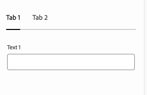

# Modelldefinitioner, fält och komponenttyper {#field-types}

Lär dig mer om fält och de komponenttyper som den universella redigeraren kan redigera i egenskapsfältet med exempel. Lär dig hur du kan mäta din egen app genom att skapa en modelldefinition och länka till komponenten.

{{universal-editor-status}}

## Ökning {#overview}

När du anpassar dina egna program för användning med den universella redigeraren måste du mäta komponenterna och definiera vilka fält och komponenttyper de kan ändra i egenskapsfältet i redigeraren. Det gör du genom att skapa en modell och länka till den från komponenten.

Det här dokumentet innehåller en översikt över en modelldefinition och över fält och de komponenttyper som är tillgängliga för dig tillsammans med exempelkonfigurationer.

>[!TIP]
>
>Om du inte känner till hur du kan mäta din app för den universella redigeraren kan du läsa dokumentet [Universell redigeringsöversikt för AEM.](/help/implementing/universal-editor/developer-overview.md)

## Modelldefinitionsstruktur {#model-structure}

Om du vill konfigurera en komponent via egenskapsspåret i Universell redigerare måste det finnas en modelldefinition som är länkad till komponenten.

Modelldefinitionen är en JSON-struktur som börjar med en array med modeller.

```json
[
  {
    "id": "model-id",        // must be unique
    "fields": []             // array of fields which shall be rendered in the properties rail
  }
]
```

Se **[Fält](#fields)** för mer information om hur du definierar `fields` array.

Om du vill använda modelldefinitionen med en komponent `data-aue-model` kan användas.

```html
<div data-aue-resource="urn:datasource:/content/path" data-aue-type="component"  data-aue-model="model-id">Click me</div>
```

## Läsa in en modelldefinition {#loading-model}

När en modell har skapats kan den refereras som en extern fil.

```html
<script type="application/vnd.adobe.aue.model+json" src="<url-of-model-definition>"></script>
```

Du kan också definiera modellen textbundet.

```html
<script type="application/vnd.adobe.aue.model+json">
  { ... model definition ... }
</script>
```

## Fält {#fields}

Ett fältobjekt har följande typdefinition.

| Konfiguration | Värdetyp | Beskrivning | Obligatoriskt |
|---|---|---|---|
| `component` | `ComponentType` | Återgivning av komponenten | Ja |
| `name` | `string` | Egenskap där uppgifterna ska sparas | Ja |
| `label` | `FieldLabel` | Fältets etikett | Ja |
| `description` | `FieldDescription` | Beskrivning av fältet | Nej |
| `placeholder` | `string` | Platshållare för fältet | Nej |
| `value` | `FieldValue` | Standardvärde | Nej |
| `valueType` | `ValueType` | Standardvalidering, kan vara `string`, `string[]`, `number`, `date`, `boolean` | Nej |
| `required` | `boolean` | Är fältet obligatoriskt | Nej |
| `readOnly` | `boolean` | Är fältet skrivskyddat | Nej |
| `hidden` | `boolean` | Är fältet dolt som standard | Nej |
| `condition` | `RulesLogic` | Regel som visar eller döljer fältet baserat på en [villkor](/help/implementing/universal-editor/customizing.md#conditionally-hide) | Nej |
| `multi` | `boolean` | Är fältet ett flerfält | Nej |
| `validation` | `ValidationType` | Valideringsregel eller -regler för fältet | Nej |
| `raw` | `unknown` | Raw-data som kan användas av komponenten | Nej |

### Komponenttyper {#component-types}

Följande komponenttyper kan användas för återgivningsfält.

| Beskrivning | Komponenttyp |
|---|---|
| [AEM](#aem-tag) | `aem-tag` |
| [AEM](#aem-content) | `aem-content` |
| [Boolean](#boolean) | `boolean` |
| [Kryssrutegrupp](#checkbox-group) | `checkbox-group` |
| [Behållare](#container) | `container` |
| [Datum och tid](#date-time) | `date-time` |
| [Multimarkering](#multiselect) | `multiselect` |
| [Nummer](#number) | `number` |
| [Alternativgrupp](#radio-group) | `radio-group` |
| [Referens](#reference) | `reference` |
| [RTF](#rich-text) | `rich-text` |
| [Välj](#select) | `select` |
| [Tabb](#tab) | `tab` |
| [Text](#text) | `text` |

#### AEM {#aem-tag}

En AEM taggkomponenttyp aktiverar en AEM taggväljare som kan användas för att bifoga taggar till komponenten.

>[!BEGINTABS]

>[!TAB Exempel]

```json
{
  "id": "aem-tag-picker",
  "fields": [
    {
      "component": "aem-tag",
      "label": "AEM Tag Picker",
      "name": "cq:tags",
      "valueType": "string"
    }
  ]
}
```

>[!TAB Skärmbild]


>[!ENDTABS]

#### AEM {#aem-content}

En AEM innehållskomponenttyp aktiverar en AEM innehållsväljare som kan användas för att ange innehållsreferenser.

>[!BEGINTABS]

>[!TAB Exempel]

```json
{
  "id": "aem-content-picker",
  "fields": [
    {
      "component": "aem-content",
      "name": "reference",
      "value": "",
      "label": "AEM Content Picker",
      "valueType": "string"
    }
  ]
}
```

>[!TAB Skärmbild]


>[!ENDTABS]

#### Boolean {#boolean}

En boolesk komponenttyp lagrar ett enkelt true/false-värde som återges som en växlingstyp. Den erbjuder en extra valideringstyp.

| Valideringstyp | Värdetyp | Beskrivning | Obligatoriskt |
|---|---|---|---|
| `customErrorMsg` | `string` | Meddelande som visas om det angivna värdet inte är ett booleskt värde | Nej |

>[!BEGINTABS]

>[!TAB Exempel 1]

```json
{
  "id": "boolean",
  "fields": [
    {
      "component": "boolean",
      "label": "Boolean",
      "name": "boolean",
      "valueType": "boolean"
    }
  ]
}
```

>[!TAB Exempel 2]

```json
{
  "id": "another-boolean",
  "fields": [
    {
      "component": "boolean",
      "label": "Boolean",
      "name": "boolean",
      "valueType": "boolean",
      "validation": {
        "customErrorMsg": "Think, McFly. Think!"
      }
    }
  ]
}
```

>[!TAB Skärmbild]


>[!ENDTABS]

#### Kryssrutegrupp {#checkbox-group}

På samma sätt som för ett booleskt värde kan en kryssrutegruppskomponenttyp användas för att välja flera sant/falskt-objekt, som återges som flera kryssrutor.

>[!BEGINTABS]

>[!TAB Exempel]

```json
{
  "id": "checkbox-group",
  "fields": [
    {
      "component": "checkbox-group",
      "label": "Checkbox Group",
      "name": "checkbox",
      "valueType": "string[]",
      "options": [
        { "name": "Option 1", "value": "option1" },
        { "name": "Option 2", "value": "option2" }
      ]
    }
  ]
}
```

>[!TAB Skärmbild]


>[!ENDTABS]

#### Behållare {#container}

En behållarkomponenttyp tillåter gruppering av komponenter. Den erbjuder en extra konfiguration.

| Konfiguration | Värdetyp | Beskrivning | Obligatoriskt |
|---|---|---|---|
| `collapsible` | `boolean` | Är behållaren komprimerbar | Nej |

>[!BEGINTABS]

>[!TAB Exempel]

```json
 {
  "id": "container",
  "fields": [
    {
      "component": "container",
      "label": "Container",
      "name": "container",
      "valueType": "string",
      "collapsible": true,
      "fields": [
        {
          "component": "text-input",
          "label": "Simple Text 1",
          "name": "text",
          "valueType": "string"
        },
        {
          "component": "text-input",
          "label": "Simple Text 2",
          "name": "text2",
          "valueType": "string"
        }
      ]
    }
  ]
}
```

>[!TAB Skärmbild]


#### Innehållsfragment {#content-fragment}

Du kan använda väljaren för innehållsfragment för att välja en [Innehållsfragment](/help/sites-cloud/authoring/fragments/content-fragments.md) och dess variationer (om det behövs). Den erbjuder en extra konfiguration.

| Konfiguration | Värdetyp | Beskrivning | Obligatoriskt |
|---|---|---|---|
| `variationName` | `string` | Variabelnamn för att lagra den valda varianten. Om värdet är odefinierat visas ingen variantväljare | Nej |

>[!BEGINTABS]

>[!TAB Exempel 1]

```json
[
  {
    "id": "aem-content-fragment",
    "fields": [
      {
        "component": "aem-content-fragment",
        "name": "picker",
        "label": "Content Fragment Picker",
        "valueType": "string",
        "variationName": "contentFragmentVariation"
      }
    ]
  }
]
```

>[!TAB Skärmbild]


>[!ENDTABS]

#### Datum och tid {#date-time}

En datumtidskomponenttyp tillåter specificering av ett datum, en tid eller en kombination av dessa. Den erbjuder ytterligare konfigurationer.

| Konfiguration | Värdetyp | Beskrivning | Obligatoriskt |
|---|---|---|---|
| `displayFormat` | `string` | Format som datumsträngen ska visas med | Ja |
| `valueFormat` | `string` | Format som datumsträngen ska lagras i | Ja |

Den erbjuder även en ytterligare valideringstyp.

| Valideringstyp | Värdetyp | Beskrivning | Obligatoriskt |
|---|---|---|---|
| `customErrorMsg` | `string` | Meddelande som visas om `valueFormat` är inte uppfyllt | Nej |

>[!BEGINTABS]

>[!TAB Exempel 1]

```json
{
  "id": "date-time",
  "fields": [
    {
      "component": "date-time",
      "label": "Date & Time",
      "name": "date",
      "valueType": "date"
    }
  ]
}
```

>[!TAB Exempel 2]

```json
{
  "id": "another-date-time",
  "fields": [
    {
      "component": "date-time",
       "valueType": "date-time",
      "name": "field1",
      "label": "Date Time",
      "description": "This is a date time field that stores both date and time.",
      "required": true,
      "placeholder": "YYYY-MM-DD HH:mm:ss",
      "displayFormat": null,
      "valueFormat": null,
      "validation": {
        "customErrorMsg": "Marty! You have to come back with me!"
      }
    },
    {
      "component": "date-time",
      "valueType": "date",
      "name": "field2",
      "label": "Another Date Time",
      "description": "This is another date time field that only stores the date.",
      "required": true,
      "placeholder": "YYYY-MM-DD",
      "displayFormat": null,
      "valueFormat": null,
      "validation": {
        "customErrorMsg": "Back to the future!"
      }
    },
    {
      "component": "date-time",
      "valueType": "time",
      "name": "field3",
      "label": "Yet Another Date Time",
      "description": "This is another date time field that only stores the time.",
      "required": true,
      "placeholder": "HH:mm:ss",
      "displayFormat": null,
      "valueFormat": null,
      "validation": {
        "customErrorMsg": "Great Scott!"
      }
    }
  ]
}
```

>[!TAB Skärmbild]


>[!ENDTABS]

#### Experience Fragment {#experience-fragment}

Experience Fragment-väljaren kan användas för att välja en [Experience Fragment](/help/sites-cloud/authoring/fragments/experience-fragments.md) och dess variationer (om det behövs). Den erbjuder en extra konfiguration.

| Konfiguration | Värdetyp | Beskrivning | Obligatoriskt |
|---|---|---|---|
| `variationName` | `string` | Variabelnamn för att lagra den valda varianten. Om värdet är odefinierat visas ingen variantväljare | Nej |

>[!BEGINTABS]

>[!TAB Exempel 1]

```json
[
  {
    "id": "aem-experience-fragment",
    "fields": [
      {
        "component": "aem-experience-fragment",
        "name": "picker",
        "label": "Experience Fragment Picker",
        "valueType": "string",
        "variationName": "experienceFragmentVariation"
      }
    ]
  }
]
```

>[!TAB Skärmbild]


>[!ENDTABS]


#### Multimarkering {#multiselect}

En komponenttyp för flerval visar flera objekt för markering i en listruta, inklusive möjligheten att gruppera de element som kan markeras.

>[!BEGINTABS]

>[!TAB Exempel 1]

```json
{
  "id": "multiselect",
  "fields": [
    {
      "component": "multiselect",
      "name": "multiselect",
      "label": "Multi Select",
      "valueType": "string",
      "options": [
        { "name": "Option 1", "value": "option1" },
        { "name": "Option 2", "value": "option2" }
      ]
    }
  ]
}
```

>[!TAB Exempel 2]

```json
{
  "id": "multiselect-grouped",
  "fields": [
    {
      "component": "multiselect",
      "name": "property",
      "label": "Multiselect field",
      "valueType": "string",
      "required": true,
      "maxSize": 2,
      "options": [
        {
          "name": "Theme",
          "children": [
            { "name": "Light", "value": "light" },
            { "name": "Dark",  "value": "dark" }
          ]
        },
        {
          "name": "Type",
          "children": [
            { "name": "Alpha", "value": "alpha" },
            { "name": "Beta", "value": "beta" },
            { "name": "Gamma", "value": "gamma" }
          ]
        }
      ]
    }
  ]
}
```

>[!TAB Skärmbilder]


>[!ENDTABS]

#### Nummer {#number}

En talkomponenttyp tillåter indata för ett tal. Det erbjuder ytterligare valideringstyper.

| Valideringstyp | Värdetyp | Beskrivning | Obligatoriskt |
|---|---|---|---|
| `numberMin` | `number` | Minsta tillåtna antal | Nej |
| `numberMax` | `number` | Högsta tillåtna antal | Nej |
| `customErrorMsg` | `string` | Meddelande som visas om `numberMin` eller `numberMax` är inte uppfyllt | Nej |

>[!BEGINTABS]

>[!TAB Exempel 1]

```json
{
  "id": "number",
  "fields": [
    {
      "component": "number",
      "name": "number",
      "label": "Number",
      "valueType": "number",
      "value": 0
    }
  ]
}
```

>[!TAB Exempel 2]

```json
{
  "id": "another-number",
  "fields": [
   {
      "component": "number",
      "valueType": "number",
      "name": "field1",
      "label": "Number Field",
      "description": "This is a number field.",
      "required": true,
      "placeholder": null,
      "validation": {
        "numberMin": 0,
        "numberMax": 88,
        "customErrorMsg": "You also need 1.21 gigawatts."
      }
    }
  ]
}
```

>[!TAB Skärmbild]


>[!ENDTABS]

#### Alternativgrupp {#radio-group}

En alternativgruppskomponenttyp tillåter en ömsesidigt uteslutande markering av flera alternativ som återges som en grupp som liknar en kryssrutegrupp.

>[!BEGINTABS]

>[!TAB Exempel]

```json
{
  "id": "radio-group",
  "fields": [
    {
      "component": "radio-group",
      "label": "Radio Group",
      "name": "radio",
      "valueType": "string",
      "options": [
        { "name": "Option 1", "value": "option1" },
        { "name": "Option 2", "value": "option2" }
      ]
    }
  ]
}
```

>[!TAB Skärmbild]


>[!ENDTABS]

#### Referens {#reference}

En referenskomponenttyp tillåter en referens till ett annat dataobjekt från det aktuella objektet.

>[!BEGINTABS]

>[!TAB Exempel]

```json
{
  "id": "reference",
  "fields": [
    {
      "component": "reference",
      "label": "Reference",
      "name": "reference",
      "valueType": "string"
    }
  ]
}
```

>[!TAB Skärmbild]


>[!ENDTABS]

#### RTF {#rich-text}

RTF ger möjlighet till RTF-inmatning med flera rader. Det erbjuder ytterligare valideringstyper.

| Valideringstyp | Värdetyp | Beskrivning | Obligatoriskt |
|---|---|---|---|
| `maxSize` | `number` | Högsta tillåtna antal tecken | Nej |
| `customErrorMsg` | `string` | Meddelande som visas om `maxSize` har överskridits | Nej |

>[!BEGINTABS]

>[!TAB Exempel 1]

```json
{
  "id": "richtext",
  "fields": [
    {
      "component": "richtext",
      "name": "rte",
      "label": "Rich Text",
      "valueType": "string"
    }
  ]
}
```

>[!TAB Exempel 2]

```json
{
  "id": "another-richtext",
  "fields": [
    {
      "component": "richtext",
      "name": "rte",
      "label": "Rich Text",
      "valueType": "string",
      "validation": {
        "maxSize": 1000,
        "customErrorMsg": "That's about as funny as a screen door on a battleship."
      }
    }
  ]
}
```

>[!TAB Skärmbild]


>[!ENDTABS]

#### Välj {#select}

En select-komponenttyp gör att du kan välja ett enstaka alternativ i en lista med fördefinierade alternativ i en nedrullningsbar meny.

>[!BEGINTABS]

>[!TAB Exempel]

```json
{
  "id": "select",
  "fields": [
    {
      "component": "select",
      "label": "Select",
      "name": "select",
      "valueType": "string",
      "options": [
        { "name": "Option 1", "value": "option1" },
        { "name": "Option 2", "value": "option2" }
      ]
    }
  ]
}
```

>[!TAB Skärmbild]


>[!ENDTABS]

#### Tabb {#tab}

Med en flikkomponenttyp kan du gruppera andra inmatningsfält tillsammans på flera flikar för att förbättra layoutordningen för författarna.

A `tab` kan betraktas som en avgränsare i arrayen med `fields`. Allt som kommer efter en `tab` placeras på den fliken tills en ny `tab` påträffas, där följande objekt placeras på den nya fliken.

Om du vill att objekt ska visas ovanför alla flikar måste de definieras före alla tabbar.

>[!BEGINTABS]

>[!TAB Exempel]

```json
{
  "id": "tab",
  "fields": [
    {
      "component": "tab",
      "label": "Tab 1",
      "name": "tab1"
    },
    {
      "component": "text-input",
      "label": "Text 1",
      "name": "text1",
      "valueType": "string"
    },
    {
      "component": "tab",
      "label": "Tab 2",
      "name": "tab2"
    },
    {
      "component": "text-input",
      "label": "Text 2",
      "name": "text2",
      "valueType": "string"
    }
  ]
}
```

>[!TAB Skärmbild]



>[!ENDTABS]

#### Text {#text}

Text tillåter en enda rad med textinmatning.  Det innehåller ytterligare valideringstyper.

| Valideringstyp | Värdetyp | Beskrivning | Obligatoriskt |
|---|---|---|---|
| `minLength` | `number` | Minsta antal tillåtna tecken | Nej |
| `maxLength` | `number` | Högsta antal tillåtna tecken | Nej |
| `regExp` | `string` | Reguljärt uttryck som indatatexten måste matcha | Nej |
| `customErrorMsg` | `string` | Meddelande som visas om `minLength`, `maxLength`och/eller `regExp` har överträtts | Nej |

>[!BEGINTABS]

>[!TAB Exempel 1]

```json
{
  "id": "simpletext",
  "fields": [
    {
      "component": "text",
      "name": "text",
      "label": "Simple Text",
      "valueType": "string"
    }
  ]
}
```

>[!TAB Exempel 2]

```json
{
  "id": "another simpletext",
  "fields": [
    {
      "component": "text",
      "name": "text",
      "label": "Simple Text",
      "valueType": "string",
      "description": "This is a text input with validation.",
      "required": true,
      "validation": {
        "minLength": 1955,
        "maxLength": 1985,
        "regExp": "^foo:.*",
        "customErrorMsg": "Why don't you make like a tree and get outta here?"
      }
    }
  ]
}
```

>[!TAB Skärmbild]


>[!ENDTABS]
