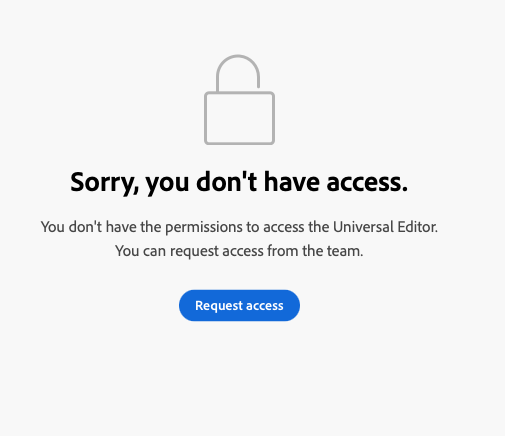

# Komma igång med Universal Editor i AEM {#getting-started}

Lär dig hur du får tillgång till den universella redigeraren och hur du börjar använda den i ditt första AEM.

>[!TIP]
>
>Om du hellre vill dyka rakt in i ett exempel kan du läsa [Universal Editor Sample App på GitHub.](https://github.com/adobe/universal-editor-sample-editable-app)

{{universal-editor-status}}

## Inledande steg {#onboarding}

Även om den universella redigeraren kan redigera innehåll från valfri källa, kommer det här dokumentet att använda ett AEM program som exempel.

Det finns flera steg för att komma igång med AEM och instrumentera den så att den kan använda den universella redigeraren.

1. [Begär åtkomst till Universal Editor.](#request-access)
1. [Inkludera grundbiblioteket för Universal Editor.](#core-library)
1. [Lägg till nödvändig OSGi-konfiguration.](#osgi-configurations)
1. [Instrumentera sidan.](#instrument-page)

Det här dokumentet vägleder dig genom de här stegen.

## Begär åtkomst till den universella redigeraren {#request-access}

Du måste först begära åtkomst till Universal Editor. Öppna [`https://experience.adobe.com/#/aem/editor&quot;](https://experience.adobe.com/#/aem/editor), logga in och validera om du har tillgång till Universell redigerare.

Om du inte har åtkomst kan du begära det via ett formulär som är länkat på samma sida.



Klicka **Begär åtkomst** och fylla i formuläret enligt anvisningarna för att begära åtkomst. En Adobe-representant kommer att granska din begäran och inhämta information för att diskutera ditt användningsfall.

## Include the Universal Editor Core Library {#core-library}

Innan ditt program kan instrumenteras för användning med den universella redigeraren måste det innehålla följande beroende.

```javascript
@adobe/universal-editor-cors
```

Om du vill aktivera instrumenteringen måste följande import läggas till i `index.js`.

```javascript
import "@adobe/universal-editor-cors";
```

### Alternativ för appar som inte kan reagera {#alternative}

Om du inte implementerar ett React-program och/eller kräver återgivning på serversidan, kan du lägga till följande i dokumentets brödtext.

```html
<script src="https://cdn.jsdelivr.net/gh/adobe/universal-editor-cors/dist/universal-editor-embedded.js" async></script>
```

## Lägg till nödvändiga OSGi-konfigurationer {#osgi-configurations}

För att kunna redigera AEM med din app med Universal Editor måste CORS och cookie-inställningarna göras i AEM.

Följande [OSGi-konfigurationer måste anges för AEM.](/help/implementing/deploying/configuring-osgi.md)

* `SameSite Cookies = None` in `com.day.crx.security.token.impl.impl.TokenAuthenticationHandler`
* Ta bort X-FRAME-OPTIONS: SAMEORIGIN Header i `org.apache.sling.engine.impl.SlingMainServlet`

### com.day.crx.security.token.impl.impl.TokenAuthenticationHandler {#samesite-cookies}

Inloggningstokens cookie måste skickas till AEM som en tredjepartsdomän. Därför måste cookie-filen för samma plats anges explicit till `None`.

Den här egenskapen måste anges i `com.day.crx.security.token.impl.impl.TokenAuthenticationHandler` OSGi-konfiguration.

```xml
<?xml version="1.0" encoding="UTF-8"?>
<jcr:root xmlns:sling="http://sling.apache.org/jcr/sling/1.0"
          xmlns:jcr="http://www.jcp.org/jcr/1.0" jcr:primaryType="sling:OsgiConfig"
          token.samesite.cookie.attr="None" />
```

### org.apache.sling.engine.impl.SlingMainServlet {#sameorigin}

X-Frame-Options: SAMEORIGIN förhindrar återgivning AEM sidor i en iframe. Om du tar bort sidhuvudet kan sidorna läsas in.

Den här egenskapen måste anges i `org.apache.sling.engine.impl.SlingMainServlet` OSGi-konfiguration.

```xml
<?xml version="1.0" encoding="UTF-8"?>
<jcr:root xmlns:sling="http://sling.apache.org/jcr/sling/1.0"
          xmlns:jcr="http://www.jcp.org/jcr/1.0"
          jcr:primaryType="sling:OsgiConfig"
          sling.additional.response.headers="[X-Content-Type-Options=nosniff]"/>
```

## Instrument för sidan {#instrument-page}

Tjänsten Universal Editor kräver en [enhetligt resursnamn (URN)](https://en.wikipedia.org/wiki/Uniform_Resource_Name) för att identifiera och använda rätt serverdelssystem för innehållet i den app som redigeras. Därför krävs ett URN-schema för att mappa tillbaka innehåll till innehållsresurser.

De instrumentattribut som läggs till på sidan består huvudsakligen av [HTML Microdata,](https://developer.mozilla.org/en-US/docs/Web/HTML/Microdata) en branschstandard som också kan användas för att göra HTML mer semantiskt, göra HTML-dokument indexerbara och så vidare.

### Skapa anslutningar {#connections}

Anslutningar som används i appen lagras som `<meta>` taggar på sidans `<head>`.

```html
<meta name="urn:adobe:aue:<category>:<referenceName>" content="<protocol>:<url>">
```

* `<category>` - Det här är en klassificering av anslutningen med två alternativ.
   * `system` - För anslutningsslutpunkter
   * `config` - för [definiera valfria konfigurationsinställningar](#configuration-settings)
* `<referenceName>` - Det här är ett kort namn som återanvänds i dokumentet för att identifiera anslutningen. T.ex. `aemconnection`
* `<protocol>` - Detta anger vilket beständighets-plugin-program för Universal Editor Persistence Service som ska användas. T.ex. `aem`
* `<url>` - Detta är URL:en till det system där ändringarna ska kvarstå. T.ex. `http://localhost:4502`

Identifierare `urn:adobe:aue:system` representerar anslutningen för Adobe Universal Editor.

`data-aue-resource`s använder `urn` för att förkorta identifieraren.

```html
data-aue-resource="urn:<referenceName>:<resource>"
```

* `<referenceName>` - Detta är den namngivna referens som omnämns i `<meta>` -tagg. T.ex. `aemconnection`
* `<resource>` - Detta är en pekare till resursen i målsystemet. t.ex. en AEM innehållssökväg som `/content/page/jcr:content`

>[!TIP]
>
>Se dokumentet [Attribut och typer](attributes-types.md) om du vill ha mer information om de dataattribut och datatyper som krävs för den universella redigeraren.

### Exempelanslutning {#example}

```html
<meta name="urn:adobe:aue:system:<referenceName>" content="<protocol>:<url>">

<html>
<head>
    <meta name="urn:adobe:aue:system:aemconnection" content="aem:https://localhost:4502">
    <meta name="urn:adobe:aue:system:fcsconnection" content="fcs:https://example.franklin.adobe.com/345fcdd">
</head>
<body>
        <aside>
          <ul data-aue-resource="urn:aemconnection:/content/example/list" data-aue-type="container">
            <li data-aue-resource="urn:aemconnection/content/example/listitem" data-aue-type="component">
              <p data-aue-prop="name" data-aue-type="text">Jane Doe</p>
              <p data-aue-prop="title" data-aue-type="text">Journalist</p>
              
            </li>

...

            <li data-aue-resource="urn:fcsconnection:/documents/mytext" data-aue-type="component">
              <p data-aue-prop="name" data-aue-type="text">John Smith</p>
              <p data-aue-resource="urn:aemconnection/content/example/another-source" data-aue-prop="title" data-aue-type="text">Photographer</p>
              
            </li>
          </ul>
        </aside>
</body>
</html>
```

### Konfigurationsinställningar {#configuration-settings}

Du kan använda `config` i anslutningens URN för att ange service- och tilläggsslutpunkter om det behövs.

Om du inte vill använda Universal Editor, som hanteras av Adobe, men din egen värdversion, kan du ange detta i en metatagg. Om du vill skriva över standardtjänstslutpunkten som tillhandahålls av Universal Editor anger du en egen tjänstslutpunkt:

* Meta name - `urn:adobe:aue:config:service`
* Metainnehåll - `content="https://adobe.com"` (exempel)

```html
<meta name="urn:adobe:aue:config:service" content="<url>">
```

Om du bara vill aktivera vissa tillägg för en sida kan du ange detta i en metatagg. Om du vill hämta tillägg anger du slutpunkterna för tillägget:

* Meta name: `urn:adobe:aue:config:extensions`
* Metainnehåll: `content="https://adobe.com,https://anotherone.com,https://onemore.com"` (exempel)

```html
<meta name="urn:adobe:aue:config:extensions" content="<url>,<url>,<url>">
```

## Du är redo att använda den universella redigeraren {#youre-ready}

Din app är nu instrumenterad för att använda den universella redigeraren!

Se [Skapa innehåll med den universella redigeraren](authoring.md) om du vill lära dig hur enkelt och intuitivt det är för skribenter att skapa innehåll med den universella redigeraren.

## Ytterligare resurser {#additional-resources}

Mer information om Universal Editor finns i de här dokumenten.

* [Introduktion till Universal Editor](introduction.md) - Lär dig hur den universella redigeraren möjliggör redigering av alla aspekter av innehåll i alla implementeringar, så att du kan leverera enastående upplevelser, öka innehållets hastighet och skapa en toppmodern utvecklarupplevelse.
* [Skapa innehåll med den universella redigeraren](authoring.md) - Lär dig hur enkelt och intuitivt det är för skribenter att skapa innehåll med den universella redigeraren.
* [Publicera innehåll med den universella redigeraren](publishing.md) - Lär dig hur den universella redigeraren publicerar innehåll och hur dina appar kan hantera det publicerade innehållet.
* [Universal Editor Architecture](architecture.md) - Lär dig mer om arkitekturen i den universella redigeraren och hur data flödar mellan tjänster och lager.
* [Attribut och typer](attributes-types.md) - Läs mer om de dataattribut och datatyper som krävs för den universella redigeraren.
* [Autentisering av universell redigerare](authentication.md) - Lär dig hur den universella redigeraren autentiseras.
