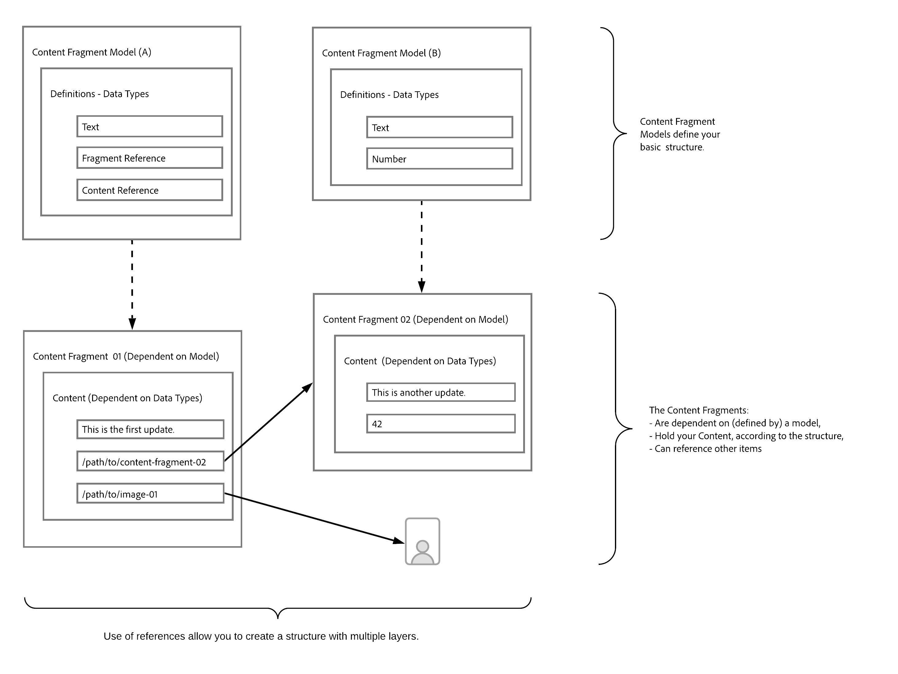

# Lär dig grunderna i innehållsmodellering för Headless med AEM {#content-modeling-headless-basics}

## Story hittills {#story-so-far}

I början av [AEM Headless Content Architect Journey](overview.md) innehöll [Introduktion](introduction.md) grundläggande koncept och terminologi som är relevant för att modellera innehåll för headless.

Den här artikeln bygger vidare på dessa artiklar så att du förstår hur du modellerar ditt innehåll för AEM headless-projekt.

## Syfte {#objective}

* **Målgrupp**: Nybörjare
* **Mål**: Presentera koncepten för innehållsmodellering för Headless CMS.

## Innehållsmodellering med modeller för innehållsfragment {#architect-content-fragment-models}

Modellering av innehåll (data) är en uppsättning etablerade tekniker som ofta används i utvecklade relationsdatabaser, så vad innebär innehållsmodellering för AEM Headless?

### Varför? {#why}

För att säkerställa att programmet konsekvent och effektivt kan begära och ta emot önskat innehåll från AEM måste det här innehållet struktureras.

Detta innebär att din ansökan i förväg vet vilken form av svar det är och därför hur den ska behandlas. Detta är mycket enklare än att ta emot frihandsinnehåll, som måste analyseras för att avgöra vad det innehåller och därför hur det kan användas.

### Introduktion till Hur? {#how}

AEM använder Content Fragments för att tillhandahålla de strukturer som behövs för Headless-leverans av ditt innehåll till dina program.

Innehållsmodellens struktur är:

* som realiseras av definitionen av din Content Fragment Model,
* används som bas för de innehållsfragment som används för att generera innehåll.

>[!NOTE]
>
>Modellerna för innehållsfragment används också som bas för AEM GraphQL Schemas, som används för att hämta ditt innehåll - mer om det på Developer Journey.

Begäranden om ditt innehåll görs med AEM GraphQL API, en anpassad implementering av GraphQL standard-API. Med AEM GraphQL API kan program utföra (komplexa) frågor på dina innehållsfragment, där varje fråga anpassas efter en viss modelltyp.

Det returnerade innehållet kan sedan användas av dina program.

## Skapa strukturen med Content Fragment Models {#create-structure-content-fragment-models}

I Content Fragment Models finns olika mekanismer som gör att du kan definiera innehållets struktur.

En innehållsfragmentmodell beskriver en enhet.

>[!NOTE]
>Funktionen för innehållsfragment måste vara aktiverad i Configuration Browser så att du kan skapa nya modeller.

>[!TIP]
>
>Modellen bör namnges så att innehållsförfattaren vet vilken modell som ska väljas när ett innehållsfragment skapas.

Inom en modell:

1. Med **datatyper** kan du definiera de enskilda attributen.
Definiera till exempel fältet som innehåller en lärares namn som **Text** och deras tjänsteår som **Number**.
1. Med datatyperna **Innehållsreferens** och **Fragmentreferens** kan du skapa relationer till annat innehåll i AEM.
1. Datatypen **Fragmentreferens** gör att du kan realisera flera strukturnivåer genom att kapsla dina innehållsfragment (enligt modelltypen). Detta är viktigt för er innehållsmodellering.

Till exempel:

## Datatyper {#data-types}

AEM tillhandahåller följande datatyper som du kan använda för att utforma ditt innehåll:

* Enkelradig text
* Flerradstext
* Nummer
* Boolean
* Datum och tid
* Uppräkning
* Taggar
* Innehållsreferens
* Fragmentreferens
* JSON-objekt

>[!NOTE]
>
>Mer information finns under Content Fragment Models - Data Types.

## Referenser och kapslat innehåll {#references-nested-content}

Två datatyper ger referenser till innehåll utanför ett visst fragment:

* **Innehållsreferens**
Detta ger en enkel referens till annat innehåll av valfri typ.
Du kan till exempel referera till en bild på en viss plats.

* **Fragmentreferens**
Detta innehåller referenser till andra innehållsfragment.
Den här typen av referens används för att skapa kapslat innehåll, vilket introducerar de relationer som behövs för att modellera innehållet.
Datatypen kan konfigureras så att fragmentförfattare kan:
   * Redigera det refererade fragmentet direkt.
   * Skapa ett nytt innehållsfragment, baserat på lämplig modell

>[!NOTE]
>
>Du kan också skapa improviserade referenser genom att använda länkar i textblock.

## Strukturnivåer (kapslade fragment) {#levels-of-structure-nested-fragments}

Med datatypen **Fragmentreferens** kan du skapa flera nivåer av struktur och relationer för innehållsmodellering.

Med den här referensen kan du *ansluta* olika modeller för innehållsfragment som representerar relationer. Detta gör att det headless-program kan följa anslutningarna och komma åt innehållet efter behov.

>[!NOTE]
>
>Detta bör användas med försiktighet och den bästa metoden kan definieras som *nest så mycket som behövs, men så lite som möjligt*.

Fragmentreferenser gör just det - de gör att du kan referera till ett annat fragment.

Du kan till exempel ha definierat följande modeller för innehållsfragment:

* Ort
* Företag
* Person
* Utmärkelser

Det verkar ganska enkelt, men ett företag har både koncernchef och medarbetare...och dessa är alla människor, var och en definierade som en person.

Och en person kan ha en utmärkelse (eller kanske två).

* Mitt företag
   * VD - person
   * Medarbetare - person
      * Personliga utmärkelser - Utmärkelse

Och det är bara till att börja med. Beroende på komplexiteten kan en utmärkelse vara företagsspecifik eller ett företag ha sitt huvudkontor i en viss stad.

Att representera dessa inbördes relationer kan uppnås med Fragmentreferenser, så som de tolkas av dig (arkitekten), innehållsförfattaren och de headless-program som du använder.

## What&#39;s Next {#whats-next}

Nu när du har lärt dig grunderna är nästa steg att [Lär dig mer om att skapa innehållsfragmentmodeller i AEM](model-structure.md). Här presenteras och behandlas de olika referenser som finns tillgängliga och hur du skapar strukturnivåer med fragmentreferenserna - en viktig del av modelleringen för headless.

## Ytterligare resurser {#additional-resources}

* [Modeller för innehållsfragment](/help/sites-cloud/administering/content-fragments/managing-content-fragment-models.md)

   * [Modeller för innehållsfragment - datatyper](/help/sites-cloud/administering/content-fragments/content-fragment-models.md#data-types)

* [Authoring Concepts](/help/sites-cloud/authoring/author-publish.md)

* [Grundläggande hantering](/help/sites-cloud/authoring/basic-handling.md) - Den här sidan är primärt baserad på konsolen **Platser**, men många/de flesta funktioner är också relevanta för att skapa **innehållsfragment** under konsolen **Assets**.

* [Arbeta med innehållsfragment](/help/sites-cloud/administering/content-fragments/overview.md)
