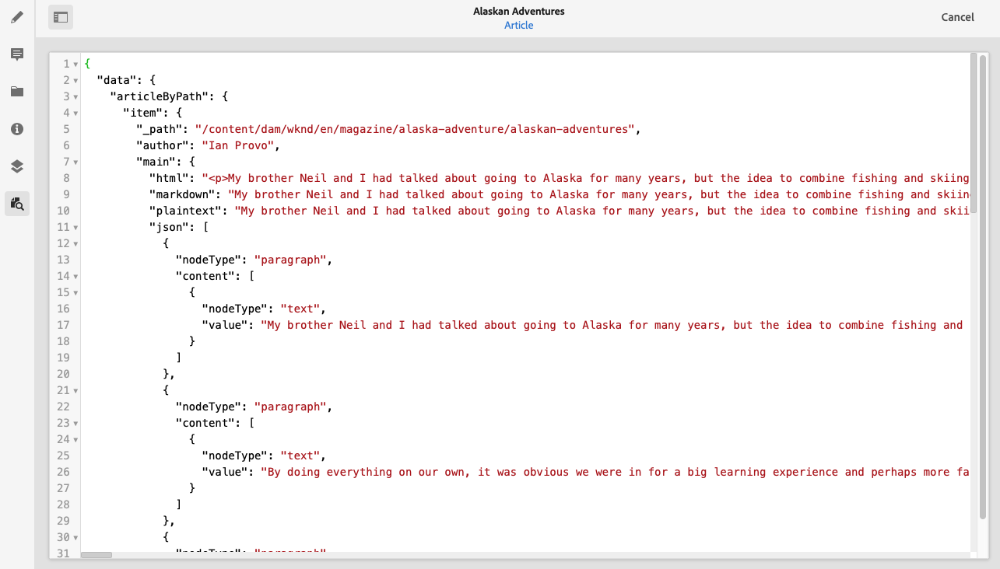
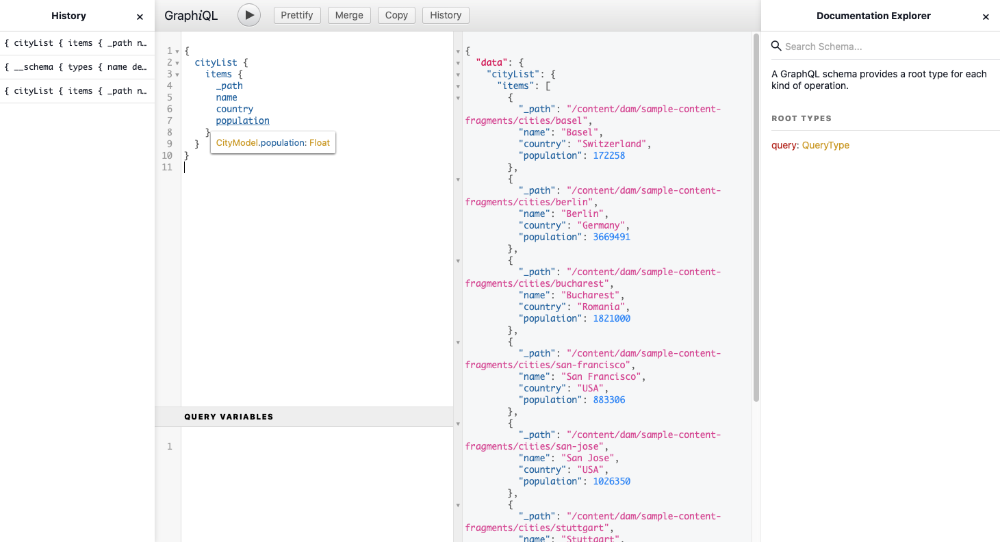

# Få åtkomst till ditt innehåll via AEM-API:er {#access-your-content}

I den här delen av [AEM Headless Developer Journey](overview.md) du kan lära dig hur du använder GraphQL-frågor för att komma åt innehållet i dina innehållsfragment och skicka det till din app (headless-leverans).

## Story hittills {#story-so-far}

I det föregående dokumentet om den AEM resan utan headless [Så här modellerar du ditt innehåll](model-your-content.md) Du lärde dig grunderna i innehållsmodellering i AEM, så du bör nu förstå hur du modellerar innehållsstrukturen och sedan inse den strukturen med hjälp AEM Content Fragment Models och Content Fragments:

* Identifiera koncept och terminologi i samband med innehållsmodellering.
* Förstå varför innehållsmodellering behövs för leverans av Headless-innehåll.
* Förstå hur ni kan förverkliga den här strukturen med AEM Content Fragment Models (och skapa innehåll med Content Fragments).
* Förstå hur du modellerar innehåll, principer med grundläggande exempel.

Den här artikeln bygger på dessa grundläggande funktioner så att du förstår hur du får tillgång till ditt befintliga headless-innehåll i AEM med hjälp av det AEM GraphQL-API:t.

* **Målgrupp**: Nybörjare
* **Syfte**: Lär dig hur du kommer åt innehållet i dina innehållsfragment med hjälp AEM GraphQL-frågor:
   * Nu kommer GraphQL och AEM GraphQL API.
   * Ta en titt på detaljerna i AEM GraphQL API.
   * Titta på några exempelfrågor för att se hur saker och ting fungerar i praktiken.

## Så du vill komma åt ditt innehåll? {#so-youd-like-to-access-your-content}

Så.. du har fått allt det här innehållet, är strukturerat (i innehållsfragment) och bara väntar på att mata din nya app. Frågan är - hur man får dit den?

Vad du behöver är ett sätt att rikta specifikt innehåll, välja vad du behöver och returnera det till appen för vidare bearbetning.

Med Adobe Experience Manager (AEM) as a Cloud Service kan du selektivt komma åt dina innehållsfragment med hjälp av det AEM GraphQL-API:t och endast returnera det innehåll du behöver. Det innebär att du kan leverera strukturerat innehåll utan extra kostnad och använda det i dina program.

>[!NOTE]
>
>AEM GraphQL API är en anpassad implementering som baseras på GraphQL standard-API-specifikationen.

## GraphQL - en introduktion {#graphql-introduction}

GraphQL är en öppen källkodsspecifikation som innehåller:

* ett frågespråk där du kan välja specifikt innehåll från strukturerade objekt.
* en körningsmiljö där du kan utföra dessa frågor med ditt strukturerade innehåll.

GraphQL är ett starkt typbestämt API. Detta innebär att *alla* innehållet måste vara tydligt strukturerat och strukturerat efter typ, så att GraphQL *förstår* vad du ska komma åt och hur. Datafälten definieras i GraphQL-scheman, som definierar strukturen för innehållsobjekten.

GraphQL slutpunkter innehåller sedan de sökvägar som svarar på GraphQL-frågorna.

Allt detta innebär att appen kan välja innehåll som den behöver på ett korrekt, tillförlitligt och effektivt sätt - precis vad du behöver när du använder AEM.

>[!NOTE]
>
>Se *GraphQL*.org och *GraphQL*.com.

<!--
## AEM and GraphQL {#aem-graphql}

GraphQL is used in various locations in AEM; for example:

* Content Fragments
  * A customized API has been developed for this use-case (Headless Delivery to your app).
    * This is the AEM GraphQL API.
* Commerce
  * AEM Commerce consumes data from a Commerce platform via GraphQL.
  * There are GraphQL integrations between AEM and various third-party commerce solutions, used with the extension hooks provided by the CIF Core Components.
    * This does not use the AEM GraphQL API.

>[!NOTE]
>
>This step of the Headless Journey is only concerned with the AEM GraphQL API and Content Fragments.
-->

## AEM GRAPHQL API {#aem-graphql-api}

AEM GraphQL API är en anpassad version som baseras på GraphQL API-standardspecifikationen som är särskilt konfigurerad för att du ska kunna utföra (komplexa) frågor på dina innehållsfragment.

Innehållsfragment används eftersom innehållet är strukturerat enligt modeller för innehållsfragment. Detta uppfyller GraphQL grundläggande krav.

* En innehållsfragmentmodell består av ett eller flera fält.
   * Varje fält definieras enligt en datatyp.
* Content Fragment Models används för att generera motsvarande AEM GraphQL-scheman.

För att få åtkomst till GraphQL för AEM (och innehållet) används en slutpunkt för att ange åtkomstsökvägen.

Innehållet som returneras via AEM GraphQL API kan sedan användas av dina program.

För att du ska få hjälp med direkt inmatning och testfrågor finns en implementering av standardgränssnittet GraphiQL som också kan användas med AEM GraphQL (som kan installeras med AEM). Den innehåller funktioner som syntaxmarkering, automatisk komplettering, automatisk föreslå, samt historik och onlinedokumentation.

>[!NOTE]
>
>Implementeringen AEM GraphQL API baseras på GraphQL Java-bibliotek.

<!--
### Use Cases for Author and Publish Environments {#use-cases-author-publish-environments}

The use cases for the AEM GraphQL API can depend on the type of AEM as a Cloud Service environment:

* Publish environment; used to: 
  * Query content for JS application (standard use-case)

* Author environment; used to: 
  * Query content for "content management purposes":
    * GraphQL in AEM as a Cloud Service is currently a read-only API.
    * The REST API can be used for CR(u)D operations.
-->

## Innehållsfragment för användning med AEM GraphQL API {#content-fragments-use-with-aem-graphql-api}

Innehållsfragment kan användas som bas för GraphQL för AEM scheman och frågor som:

* Med dem kan du utforma, skapa, strukturera och publicera sidoberoende innehåll som kan levereras utan problem.
* De baseras på en Content Fragment Model, som fördefinierar strukturen för det resulterande fragmentet med hjälp av ett urval datatyper.
* Ytterligare strukturlager kan uppnås med datatypen Fragmentreferens, som är tillgänglig när du definierar en modell.

### Modeller för innehållsfragment {#content-fragments-models}

Dessa modeller för innehållsfragment:

* Används för att generera scheman en gång **Aktiverad**.
* Ange de datatyper och fält som krävs för GraphQL. De ser till att programmet bara begär det som är möjligt och får det som förväntas.
* Datatypen **Fragmentreferenser** kan användas i din modell för att referera till ett annat innehållsfragment, och därför införs ytterligare strukturnivåer.

### Fragmentreferenser {#fragment-references}

The **Fragmentreferens**:

* Är en specifik datatyp tillgänglig när du definierar en innehållsfragmentmodell.
* Refererar till ett annat fragment, beroende på en viss innehållsfragmentmodell.
* Gör att du kan skapa och sedan hämta strukturerade data.

   * Vid definition som **multifeed**, kan flera delfragment refereras (hämtas) av det primära fragmentet.

### JSON Preview {#json-preview}

Om du vill ha hjälp med att designa och utveckla dina modeller för innehållsfragment kan du förhandsgranska JSON-utdata i redigeraren för innehållsfragment.



<!--
## GraphQL Schema Generation from Content Fragments {#graphql-schema-generation-content-fragments}

GraphQL is a strongly-typed API, which means that content must be clearly structured and organized by type. The GraphQL specification provides a series of guidelines on how to create a robust API for interrogating content on a certain instance. To do this, a client must fetch the Schema, which contains all the types necessary for a query. 

For Content Fragments, the GraphQL schemas (structure and types) are based on **Enabled** Content Fragment Models and their data types.

>[!CAUTION]
>
>All the GraphQL schemas (derived from Content Fragment Models that have been **Enabled**) are readable through the GraphQL endpoint.
>
>This means that you need to ensure that no sensitive content is available, to ensure that no sensitive data is exposed via GraphQL endpoints; for example, this includes information that could be present as field names in the model definition.

For example, if a user created a Content Fragment Model called `Article`, then AEM generates the object `article` that is of a type `ArticleModel`. The fields within this type correspond to the fields and data types defined in the model.

1. A Content Fragment Model:

   

1. The corresponding GraphQL schema (output from GraphiQL automatic documentation):
   

   This shows that the generated type `ArticleModel` contains several [fields](#fields). 
   
   * Three of them have been controlled by the user: `author`, `main` and `referencearticle`.

   * The other fields were added automatically by AEM, and represent helpful methods to provide information about a certain Content Fragment; in this example, `_path`, `_metadata`, `_variations`. These [helper fields](#helper-fields) are marked with a preceding `_` to distinguish between what has been defined by the user and what has been auto-generated.

1. After a user creates a Content Fragment based on the Article model, it can then be interrogated through GraphQL. For examples, see the Sample Queries.md#graphql-sample-queries) (based on a sample Content Fragment structure for use with GraphQL.

In GraphQL for AEM, the schema is flexible. This means that it is auto-generated each and every time a Content Fragment Model is created, updated or deleted. The data schema caches are also refreshed when you update a Content Fragment Model.

The Sites GraphQL service listens (in the background) for any modifications made to a Content Fragment Model. When updates are detected, only that part of the schema is regenerated. This optimization saves time and provides stability.

So for example, if you:

1. Install a package containing `Content-Fragment-Model-1` and `Content-Fragment-Model-2`:
 
   1. GraphQL types for `Model-1` and `Model-2` are generated.

1. Then modify `Content-Fragment-Model-2`:

   1. Only the `Model-2` GraphQL type will get updated.

   1. Whereas `Model-1` will remain the same. 

>[!NOTE]
>
>This is important to note in case you want to do bulk updates on Content Fragment Models through the REST api, or otherwise.

The schema is served through the same endpoint as the GraphQL queries, with the client handling the fact that the schema is called with the extension `GQLschema`. For example, performing a simple `GET` request on `/content/cq:graphql/global/endpoint.GQLschema` will result in the output of the schema with the Content-type: `text/x-graphql-schema;charset=iso-8859-1`.

### Schema Generation - Unpublished Models {#schema-generation-unpublished-models}

When Content Fragments are nested it can happen that a parent Content Fragment Model is published, but a referenced model is not.

>[!NOTE]
>
>The AEM UI prevents this happening, but if publishing is made programmatically, or with content packages, it can occur.

When this happens, AEM generates an *incomplete* Schema for the parent Content Fragment Model. This means that the Fragment Reference, which is dependent on the unpublished model, is removed from the schema.

## AEM GraphQL Endpoints {#aem-graphql-endpoints}

An endpoint is the path used to access GraphQL for AEM. Using this path you (or your app) can:

* access the GraphQL schemas,
* send your GraphQL queries,
* receive the responses (to your GraphQL queries).

AEM allows for:

* A global endpoint - available for use by all sites.
* Endpoints for specific Sites configurations - that you can configure (in the Configuration Browser), specific to a specified site/project.

## Permissions {#permissions}

The permissions are those required for accessing Assets.

## The AEM GraphiQL Interface {#aem-graphiql-interface}

To help you directly input, and test queries, an implementation of the standard GraphiQL interface is available for use with AEM GraphQL. This can be installed with AEM.

>[!NOTE]
>
>GraphiQL is bound the global endpoint (and does not work with other endpoints for specific Sites configurations).

It provides features such as syntax-highlighting, auto-complete, auto-suggest, together with a history and online documentation.


-->

## Använda AEM GraphQL API {#actually-using-aem-graphiql}

### Inledande konfiguration {#initial-setup}

Innan du börjar med frågor om ditt innehåll måste du:

* Aktivera slutpunkten
   * Använd Verktyg > Allmänt > GraphQL
   * [Aktivera din GraphQL-slutpunkt](/help/headless/graphql-api/graphql-endpoint.md)
      * Detta aktiverar även GraphiQL IDE.

### Exempelstruktur {#sample-structure}

Om du vill använda det AEM GraphQL-API:t i en fråga kan vi använda de två mycket grundläggande modellstrukturerna för innehållsfragment:

* Företag
   * Namn - text
   * CEO (Person) - Fragmentreferens
   * Anställda (personer) - fragmentreferens(er)
* Person
   * Namn - text
   * Förnamn - text

Som du ser refererar fälten CEO och Employees till Personfragmenten.

Fragmentmodellerna används:

* när du skapar innehåll i Content Fragment Editor
* för att generera de GraphQL-scheman som du ska fråga efter

### Var ska du testa dina frågor? {#where-to-test-your-queries}

Frågorna kan anges i GraphiQL-gränssnittet. Du kan öppna frågeredigeraren från:

* **verktyg** > **Allmänt** > **GraphQL Query Editor**
* direkt, till exempel `http://localhost:4502/aem/graphiql.html`


### Komma igång med frågor {#getting-Started-with-queries}

En enkel fråga är att returnera namnet på alla poster i företagsschemat. Här begär du en lista med alla företagsnamn:

```xml
query {
  companyList {
    items {
      name
    }
  }
}
```

En något mer komplex fråga är att markera alla personer som inte har namnet&quot;Jobs&quot;. Detta filtrerar alla personer för alla som inte har namnet Jobs. Detta uppnås med operatorn EQUALS_NOT (det finns många fler):

```xml
query {
  personList(filter: {
    name: {
      _expressions: [
        {
          value: "Jobs"
          _operator: EQUALS_NOT
        }
      ]
    }
  }) {
    items {
      name
      firstName
    }
  }
}
```

Du kan också skapa mer komplexa frågor. Du kan till exempel söka efter alla företag som har minst en anställd med namnet &quot;Smith&quot;. Den här frågan visar filtrering för alla personer med namnet &quot;Smith&quot;, vilket returnerar information från de kapslade fragmenten:

```xml
query {
  companyList(filter: {
    employees: {
      _match: {
        name: {
          _expressions: [
            {
              value: "Smith"
            }
          ]
        }
      }
    }
  }) {
    items {
      name
      ceo {
        name
        firstName
      }
      employees {
        name
        firstName
      }
    }
  }
}
```

<!-- need code / curl / cli examples-->

Mer information om hur du använder AEM GraphQL API tillsammans med de nödvändiga elementen finns i följande exempel:

* Lär dig använda GraphQL med AEM
* Strukturen för exempelinnehållsfragment
* Lära sig använda GraphQL med AEM - exempelinnehåll och frågor

## What&#39;s Next {#whats-next}

Nu när du har lärt dig hur du får åtkomst till och frågar efter headless-innehåll med det AEM GraphQL API som du nu kan [lära dig hur du använder REST API för att få tillgång till och uppdatera innehållet i dina innehållsfragment](update-your-content.md).

## Ytterligare resurser {#additional-resources}

* [Adobe Experience Manager as a Cloud Service API:er](https://developer.adobe.com/experience-cloud/experience-manager-apis/)
* [GraphQL.org](https://graphql.org)
   * [Scheman](https://graphql.org/learn/schema/)
   * [Variabel](https://graphql.org/learn/queries/#variables)
   * [GraphQL Java-bibliotek](https://graphql.org/code/#java)
* [GraphiQL](https://graphql.org/learn/serving-over-http/#graphiql)
* [Lär dig använda GraphQL med AEM](/help/headless/graphql-api/content-fragments.md)
   * [Aktivera din GraphQL-slutpunkt](/help/headless/graphql-api/graphql-endpoint.md)
   * [Installera AEM GraphiQL-gränssnitt](/help/headless/graphql-api/graphiql-ide.md)
* [Strukturen för exempelinnehållsfragment](/help/headless/graphql-api/sample-queries.md#content-fragment-structure-graphql)
* [Lära sig använda GraphQL med AEM - exempelinnehåll och frågor](/help/headless/graphql-api/sample-queries.md)
   * [Exempelfråga - Ett enskilt specifikt stadsfragment](/help/headless/graphql-api/sample-queries.md#sample-single-specific-city-fragment)
   * [Exempelfråga för metadata - Ange metadata för utmärkelserna med namnet GB](/help/headless/graphql-api/sample-queries.md#sample-metadata-awards-gb)
   * [Exempelfråga - Alla städer med en namngiven variant](/help/headless/graphql-api/sample-queries.md#sample-cities-named-variation)
* [Aktivera funktionen för innehållsfragment i konfigurationsläsaren](/help/sites-cloud/administering/content-fragments/setup.md#enable-content-fragment-functionality-configuration-browser)
* [Arbeta med innehållsfragment](/help/sites-cloud/administering/content-fragments/overview.md)
   * [Modeller för innehållsfragment](/help/sites-cloud/administering/content-fragments/content-fragment-models.md)
   * [JSON-utdata](/help/assets/content-fragments/content-fragments-json-preview.md)
* [CORS (Cross-Origin Resource Sharing)](https://experienceleague.adobe.com/docs/experience-manager-learn/foundation/security/understand-cross-origin-resource-sharing.html?lang=en#understand-cross-origin-resource-sharing-(cors))
* [GraphQL Persistent Queries - aktivera cachelagring i Dispatcher](/help/headless/deployment/dispatcher-caching.md)
* [Genererar åtkomsttoken för API:er på serversidan](/help/implementing/developing/introduction/generating-access-tokens-for-server-side-apis.md)
* [Komma igång med AEM Headless](https://experienceleague.adobe.com/docs/experience-manager-learn/getting-started-with-aem-headless/graphql/overview.html) - En kort videosjälvstudiekurs med en översikt över hur du använder AEM headless-funktioner, inklusive innehållsmodellering och GraphQL.
