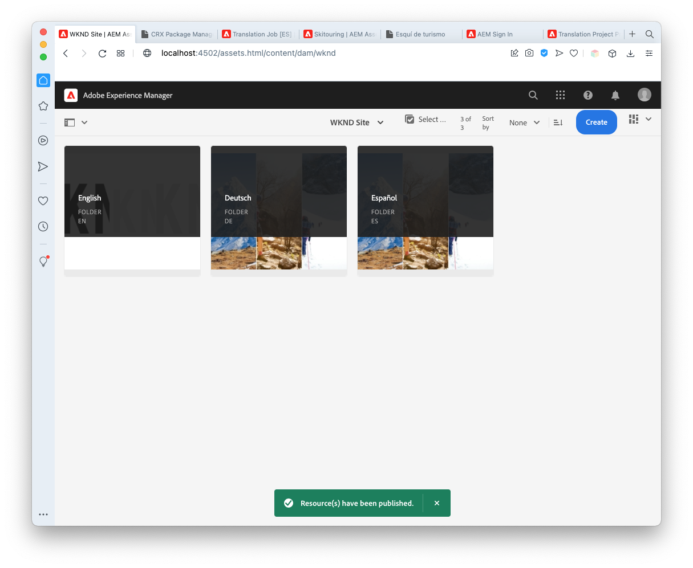

# Publicera översatt innehåll {#publish-content}

Lär dig hur du publicerar lokaliserat innehåll.

## Story hittills {#story-so-far}

I det föregående dokumentet på den AEM headless-lokaliseringsresan, [Översätt innehåll,](configure-connector.md), lärde du dig att använda AEM översättningsprojekt för att översätta det headlösa innehållet. Nu bör du:

* Förstå vad ett översättningsprojekt är.
* Skapa nya översättningsprojekt.
* Använd översättningsprojekt för att översätta ert headless-innehåll.

Nu när den första översättningen är klar går den här artikeln igenom nästa steg i publiceringen av det innehållet och vad du ska göra för att uppdatera dina översättningar när det underliggande rotinnehållet för språk ändras.

## Syfte {#objective}

Det här dokumentet hjälper dig att förstå hur du publicerar headless-innehåll i AEM och hur du skapar ett kontinuerligt arbetsflöde för att hålla översättningarna uppdaterade. När du har läst det här dokumentet bör du:

* Förstå AEM författarpubliceringsmodell.
* Lär dig hur du publicerar översatt innehåll.
* Kan implementera en kontinuerlig uppdateringsmodell för ditt översatta innehåll.

## AEM Author-Publish Model {#author-publish}

Innan du publicerar ditt innehåll är det en bra idé att förstå AEM författarpubliceringsmodell. I sina enklaste termer delar AEM in användare i två grupper.

1. De som skapar och hanterar innehållet och systemet
1. De som konsumerar innehållet från systemet.

AEM separeras därför fysiskt i två instanser.

1. **författarinstansen** är det system där innehållsförfattare och administratörer arbetar med att skapa och hantera innehåll.
1. **publish**-instansen är det system som skickar innehållet till konsumenterna.

När innehållet har skapats på författarinstansen måste det överföras till publiceringsinstansen för att det ska vara tillgängligt för konsumtion. Processen att överföra från författare till publicering kallas **publikation**.

## Publicera översatt innehåll {#publishing}

När du är nöjd med hur det översatta innehållet ser ut kan du publicera det så att det går att använda det utan rubriker. Det enklaste sättet att göra detta är att navigera till projektresursmappen.

```text
/content/dam/<your-project>/
```

Under den här sökvägen har du undermappar för varje översättningsspråk och kan välja vilka som ska publiceras.

1. Gå till **Navigering** -> **Resurser** -> **Filer** och öppna projektmappen.
1. Här visas rotmappen för språket och alla andra språkmappar. Välj det eller de lokaliserade språk som du vill publicera.
   
1. Tryck eller klicka på **Hantera publikation**.
1. I fönstret **Hantera publikation** kontrollerar du att **Publicera** automatiskt är markerat under **Åtgärd** och att **Now** är markerat under **Schemaläggning**. Tryck eller klicka på **Nästa**.
   
1. I nästa **Manage Publication**-fönster bekräftar du att rätt sökväg är/är markerad. Tryck eller klicka på **Publicera**.
   
1. AEM bekräftar publiceringsåtgärden med ett popup-meddelande längst ned på skärmen.
   

Ditt översatta innehåll publiceras nu! Den kan nu nås och användas av era headless-tjänster.

>[!TIP]
>
>Du kan markera flera objekt (d.v.s. flera språkmappar) när du publicerar för att publicera flera lokaliseringar samtidigt.

Det finns ytterligare alternativ när du publicerar innehåll, till exempel schemaläggning av en publiceringstid som ligger utanför den här kundresan. Mer information finns i avsnittet [Ytterligare resurser](#additional-resources) i slutet av dokumentet.

## Uppdatera ditt översatta innehåll {#updating-translations}

Lokalisering och översättning är sällan en engångsåtgärd. Vanligtvis fortsätter innehållsförfattarna att lägga till och ändra ditt innehåll i språkroten när den inledande lokaliseringen är klar. Det innebär att du måste uppdatera det översatta innehållet.

Specifika projektkrav definierar hur ofta du behöver uppdatera översättningarna och vilken beslutsprocess som ska följas innan en uppdatering genomförs. När du väl har bestämt dig för att uppdatera dina översättningar är processen i AEM mycket enkel. När den inledande översättningen baserades på ett översättningsprojekt så gör även alla uppdateringar det.

1. Navigera till **Navigering** -> **Resurser** -> **Filer**. Kom ihåg att innehåll utan rubrik i AEM lagras som resurser som kallas för innehållsfragment.
1. Välj språkroten för projektet. I det här fallet har vi valt `/content/dam/wknd/en`.
1. Tryck eller klicka på rälsväljaren och visa panelen **Referenser**.
1. Tryck eller klicka på **Språkkopior**.
1. Markera kryssrutan **Språkkopior**.
1. Expandera avsnittet **Uppdatera språkkopior** längst ned på referenspanelen.
1. I listrutan **Projekt** väljer du **Lägg till i ett befintligt översättningsprojekt**.
1. I listrutan **Befintligt översättningsprojekt** väljer du det projekt som skapats för den inledande översättningen.
1. Tryck eller klicka på **Start**.


Innehållet läggs till i det befintliga översättningsprojektet. Så här visar du översättningsprojektet:

1. Navigera till **Navigering** -&amp; **Projekt**.
1. Tryck eller klicka på det projekt som du just har uppdaterat.
1. Tryck eller klicka på språket eller något av språken som du uppdaterade.

Du kommer att se att ett nytt jobbkort har lagts till i projektet. I det här exemplet har en annan spanska översättning lagts till.


Du kommer att märka att statistiken på det nya kortet (antalet resurser och innehållsfragment) är annorlunda. Detta beror på att AEM känner igen vad som har ändrats sedan den senaste översättningen och bara inkluderar nytt innehåll som behöver översättas (både omöversatt uppdaterat innehåll och förstagångsöversättning av nytt innehåll).

Från och med nu [börjar och hanterar du översättningsjobbet på samma sätt som i originalet.](translate-content.md#using-translation-project)

## Slut på resan? {#end-of-journey}

Grattis! Du har slutfört den obegränsade lokaliseringsresan! Nu bör du:

* Få en översikt över vad headless content delivery är.
* Få en grundläggande förståelse AEM headless-funktioner.
* Förstå AEM lokaliseringsfunktioner och hur de relaterar till headless-innehåll.
* Har möjlighet att börja lokalisera sitt eget headless-innehåll.

Nu kan du lokalisera ditt eget headless-innehåll i AEM. AEM är dock ett kraftfullt verktyg och det finns många andra alternativ. Kolla in några av de ytterligare resurser som finns i nästa avsnitt för att lära dig mer om de funktioner du såg under den här resan.

## Ytterligare resurser {#additional-resources}

* [Hantera översättningsprojekt](/help/sites-cloud/administering/translation/managing-projects.md)  - Läs mer om översättningsprojekt och andra funktioner som arbetsflöden för översättning och flerspråkiga projekt.
* [Designkoncept](/help/sites-cloud/authoring/getting-started/concepts.md)  - Läs mer om författaren och publicera AEM i detalj. Det här dokumentet fokuserar på att skapa sidor i stället för på innehållsfragment, men teorin gäller fortfarande.
* [Publicera sidor](/help/sites-cloud/authoring/fundamentals/publishing-pages.md)  - Läs mer om de extrafunktioner som är tillgängliga vid publicering av innehåll. Det här dokumentet fokuserar på att skapa sidor i stället för på innehållsfragment, men teorin gäller fortfarande.
