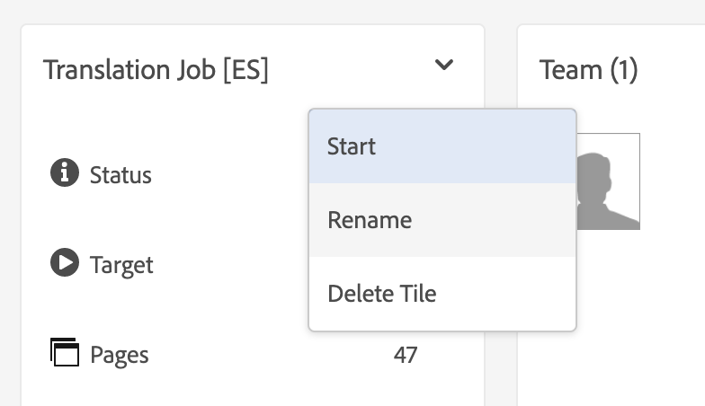
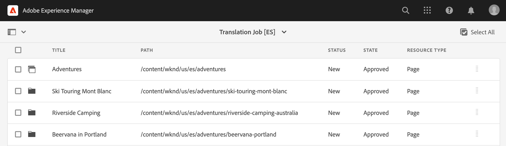

# Översätta innehåll {#translate-content}

Använd översättningskopplingen och reglerna för att översätta ditt headless-innehåll.

## Story hittills {#story-so-far}

I det föregående dokumentet på den AEM headless-lokaliseringsresan, [Configure Translation Rules](translation-rules.md), lärde du dig att använda AEM översättningsregler för att identifiera översättningsinnehållet. Nu bör du:

* Förstå vad översättningsreglerna gör.
* Du kan definiera egna översättningsregler.

Nu när du har konfigurerat reglerna för anslutning och översättning tar den här artikeln dig igenom nästa steg när du översätter ditt headless-innehåll.

## Syfte {#objective}

Det här dokumentet hjälper dig att förstå hur du använder AEM översättningsprojekt tillsammans med kopplingen och dina översättningsregler för att översätta innehåll. När du har läst det här dokumentet bör du:

* Förstå vad ett översättningsprojekt är.
* Skapa nya översättningsprojekt.
* Använd översättningsprojekt för att översätta ert headless-innehåll.

## Skapa ett översättningsprojekt {#creating-translation-project}

Med översättningsprojekt kan du hantera översättning av AEM utan rubriker. Ett översättningsprojekt innehåller det innehåll som ska översättas till andra språk.

När innehåll läggs till i ett översättningsprojekt skapas ett översättningsjobb för det. Jobb innehåller kommandon och statusinformation som du använder för att hantera de mänskliga översättnings- och maskinöversättningsarbetsflödena som körs på resurserna.

Så här skapar du ett översättningsprojekt:

1. Navigera till **Navigering** -> **Resurser** -> **Filer**. Kom ihåg att innehåll utan rubrik i AEM lagras som resurser som kallas för innehållsfragment.
1. Välj språkroten för projektet. I det här fallet har vi valt `/content/dam/wknd/en`.
1. Tryck eller klicka på rälsväljaren och visa panelen **Referenser**.
1. Tryck eller klicka på **Språkkopior**.
1. Markera kryssrutan **Språkkopior**.
1. Expandera avsnittet **Uppdatera språkkopior** längst ned på referenspanelen.
1. I listrutan **Projekt** väljer du **Skapa översättningsprojekt**.
1. Ange en lämplig titel för översättningsprojektet.
1. Tryck eller klicka på **Start**.


Du får ett meddelande om att projektet har skapats.

>[!NOTE]
>
>Det antas att den nödvändiga språkstrukturen för översättningsspråken redan har skapats som en del av [definitionen av innehållsstrukturen.](getting-started.md#content-structure) Detta bör göras i samarbete med innehållsarkitekten.

## Använda ett översättningsprojekt {#using-translation-project}

När du skapade översättningsprojektet utvärderade AEM innehållet utan rubrik under den bana du valde samt baserat på de regler du tidigare definierat. Baserat på dessa regler extraherades innehållet som kräver översättning till ett nytt översättningsprojekt.

Så här visar du översättningsprojektet:

1. Navigera till **Navigering** -&amp; **Projekt**.
1. Tryck eller klicka på det projekt som skapades i föregående avsnitt.


Projektet är uppdelat i flera kort.

* **Sammanfattning**  - Det här kortet visar grundläggande rubrikinformation för projektet inklusive ägare, språk och översättningsleverantör.
* **Översättningsjobb**  - Kortet visar en översikt över det faktiska översättningsjobbet inklusive status, antal resurser osv.
* **Team**  - Det här kortet visar de användare som samarbetar i det här översättningsprojektet. Den här resan kommer inte att omfatta det här ämnet.
* **Uppgifter**  - Ytterligare uppgifter som är kopplade till översättning av innehåll som att göra objekt eller arbetsflödesobjekt. Den här resan kommer inte att omfatta det här ämnet.

Om du vill se detaljerna om det headless-innehåll som ingår i projektet:

1. Tryck eller klicka på ellipsknappen längst ned på **översättningsjobbkortet**.
1. I fönstret **Översättningsjobb** visas alla objekt i jobbet.
   
1. Tryck eller klicka på en rad för att visa detaljerna på den raden. Tänk på att en rad kan representera flera innehållsobjekt som ska översättas.
1. Tryck eller klicka på markeringsrutan för ett radobjekt om du vill se ytterligare alternativ, som alternativet att ta bort det från jobbet eller visa det i konsolerna Innehållsfragment eller Resurser.


Översättningsjobbets innehåll startar vanligtvis i tillståndet **Draft** enligt kolumnen **State** i fönstret **Översättningsjobb**.

Om du vill starta översättningsjobbet går du tillbaka till översättningsprojektöversikten och trycker eller klickar på knappen för att visa översättningen högst upp på **översättningsjobbskortet** och väljer **Start**.



AEM kommunicerar nu med din översättningskonfiguration och koppling för att skicka innehållet till översättningstjänsten. Du kan visa översättningens förlopp genom att gå tillbaka till **översättningsjobbet**-fönstret och visa **kolumnen State** för posterna.



Maskinöversättningar returneras automatiskt med tillståndet **Godkänd**. Översättning till människor möjliggör mer interaktion, men ligger utanför den här resan.

## Granskning av översatt innehåll {#reviewing}

[Som vi tidigare har sett flödar maskinöversatt innehåll tillbaka i AEM med status ](#using-translation-project)   **** Godkänd eftersom antagandet är att ingen mänsklig åtgärd krävs eftersom maskinöversättning används. Det är dock fortfarande möjligt att granska det översatta innehållet.

Gå bara till det slutförda översättningsjobbet och markera ett radobjekt genom att trycka eller klicka i kryssrutan. Ikonen **Visa i innehållsfragment** visas i verktygsfältet.


Tryck eller klicka på den ikonen för att öppna det översatta innehållsfragmentet i redigeringskonsolen för att visa information om det översatta innehållet.


Du kan ändra innehållsfragmentet ytterligare om det behövs, förutsatt att du har rätt behörighet, men att redigera innehållsfragment ligger utanför den här kundresan. Mer information om det här avsnittet finns i avsnittet [Ytterligare resurser](#additional-resources) i slutet av dokumentet.

Projektets uppdrag är att samla alla resurser som hör till en översättning på ett och samma ställe för enkel åtkomst och en tydlig översikt. Men som du kan se genom att visa detaljerna för ett översatt objekt, flödar översättningarna tillbaka till resursmappen för översättningsspråket. I vårt exempel här

```text
/content/dam/wknd/es
```

Om du navigerar till den här mappen via **Navigering** -> **Filer** -> **Resurser**, visas det översatta innehållet.


AEM översättningsramverk tar emot översättningarna från översättningskopplingen och skapar sedan automatiskt innehållsstrukturen baserat på språkroten och med hjälp av översättningarna från kopplingen.

Det är viktigt att förstå att detta innehåll inte publiceras. Det ligger kvar på redigeringsinstansen för AEM tills du bestämmer att det är klart för publicering. Vi kommer att se hur vi gör detta i nästa steg av lokaliseringsresan.

## Översättning av människor {#human-translation}

Om översättningstjänsten tillhandahåller mänsklig översättning erbjuder granskningsprocessen fler alternativ. Översättningar kommer till exempel tillbaka i projektet med statusen **Utkast** och måste granskas och godkännas eller avvisas manuellt.

Översättning till människor ligger utanför den här lokaliseringsresan. Mer information om det här avsnittet finns i avsnittet [Ytterligare resurser](#additional-resources) i slutet av dokumentet.

## What&#39;s Next {#what-is-next}

Nu när du är klar med den här delen av den headless lokaliseringsresan bör du:

* Förstå vad ett översättningsprojekt är.
* Skapa nya översättningsprojekt.
* Använd översättningsprojekt för att översätta ert headless-innehåll.

Bygg vidare på den här kunskapen och fortsätt din AEM vanliga lokaliseringsresa genom att nästa gång läsa dokumentet [Publicera översatt innehåll](publish-content.md) där du får lära dig hur du publicerar översatt innehåll och hur du uppdaterar översättningarna allt eftersom rotinnehållet för ditt språk ändras.

## Ytterligare resurser {#additional-resources}

Vi rekommenderar att du går vidare till nästa del av den headless-baserade lokaliseringsresan genom att granska dokumentet [Publicera översatt innehåll,](publish-content.md), men följande är ytterligare, valfria resurser som gör en djupdykning i vissa koncept som nämns i det här dokumentet, men de behöver inte fortsätta på den headless-resan.

* [Hantera översättningsprojekt](/help/sites-cloud/administering/translation/managing-projects.md)  - Läs mer om översättningsprojekt och andra funktioner som arbetsflöden för översättning och flerspråkiga projekt.
