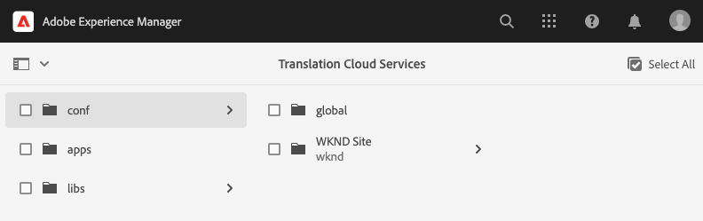

# Konfigurera översättningsanslutningen {#configure-connector}

Lär dig hur du ansluter AEM till en översättningstjänst.

## Story hittills {#story-so-far}

I det föregående dokumentet om den AEM översättningsresan utan headless [Kom igång med AEM headless translation](learn-about.md) har du lärt dig att ordna rubrikfritt innehåll och hur AEM översättningsverktyg fungerar, och du bör nu:

* Förstå hur viktig innehållsstrukturen är för översättning.
* Förstå hur AEM lagrar headless-innehåll.
* Bekanta dig med AEM översättningsverktyg.

Den här artikeln bygger på dessa grundläggande funktioner så att du kan ta det första konfigurationssteget och konfigurera en översättningstjänst som du sedan använder under resan för att översätta ditt innehåll.

## Syfte {#objective}

Det här dokumentet hjälper dig att förstå hur du konfigurerar en AEM till den översättningstjänst du valt. När du har läst bör du:

* Förstå de viktiga parametrarna i översättningsintegreringsramverket i AEM.
* Du kan skapa en egen anslutning till översättningstjänsten.

## Översättningsintegreringsramverket {#tif}

AEM Translation Integration Framework (TIF) integreras med översättningstjänster från tredje part för att samordna översättning av AEM. Det handlar om tre grundläggande steg.

1. Anslut till översättningstjänsten.
1. Skapa en konfiguration för Translation Integration Framework.
1. Koppla konfigurationen till ditt innehåll.

I följande avsnitt beskrivs dessa steg mer ingående.

## Ansluta till en översättningstjänstleverantör {#connect-translation-provider}

Det första steget är att välja vilken översättningstjänst du vill använda. Det finns många alternativ för översättningstjänster för människor och datorer som är tillgängliga för AEM. De flesta leverantörer erbjuder ett översättningspaket som ska installeras. Se [Ytterligare resurser](#additional-resources) för ett urval av tillgängliga alternativ.

>[!NOTE]
>
>Översättningsexperten ansvarar vanligtvis för att välja vilken översättningstjänst som ska användas, men administratören ansvarar vanligtvis för att installera det nödvändiga översättningsanslutningspaketet.

För den här resan använder vi Microsoft Translator som AEM tillhandahåller en körklar testlicens. Se [Ytterligare resurser](#additional-resources) om du vill ha mer information om den här providern.

Om du väljer en annan provider måste administratören installera kopplingspaketet enligt översättningstjänstens instruktioner.

>[!NOTE]
>
>Om du använder den färdiga Microsoft Translator i AEM behöver du inte göra ytterligare inställningar och fungerar som det ska utan ytterligare anslutningskonfiguration.
>
>Om du väljer att använda Microsoft Translator-anslutningen för testning behöver du inte utföra stegen i de följande två avsnitten: [Skapa en konfiguration för översättningsintegrering](#create-config) och [Associera konfigurationen med ditt innehåll.](#associate) Du bör dock läsa dem så att du vet hur du gör när du behöver konfigurera den önskade anslutningen.
>
>Testversionen av Microsoft Translator Connector är inte avsedd för produktion och om du bestämmer dig för att licensiera den måste systemadministratören följa stegen som beskrivs i [Ytterligare resurser](#additional-resources) i slutet av dokumentet för att konfigurera licensen.

## Skapa en konfiguration för översättningsintegrering {#create-config}

När kopplingspaketet för den översättningstjänst du föredrar har installerats måste du skapa en konfiguration för översättningsintegreringsramverket för den tjänsten. Konfigurationen innehåller följande information:

* Vilken översättningstjänstleverantör som ska användas
* Om översättning till människa eller dator ska utföras
* Om annat innehåll som är associerat med innehållsfragmentet ska översättas, t.ex. taggar

Så här skapar du en ny översättningskonfiguration:

1. Klicka eller tryck på den globala navigeringsmenyn **verktyg** -> **Cloud Services** -> **Cloud Services för översättning**.
1. Navigera till den plats där du vill skapa konfigurationen i innehållsstrukturen. Detta baseras ofta på ett visst projekt eller kan vara globalt.
   * I det här fallet kan till exempel en konfiguration göras globalt för att gälla allt innehåll, eller bara för WKND-projektet.

   

1. Ange följande information i fälten och klicka eller tryck sedan på **Skapa**.
   1. Välj **Konfigurationstyp** i listrutan. Välj **Översättningsintegrering** från listan.
   1. Ange **Titel** för din konfiguration. The **Titel** identifierar konfigurationen i **Cloud Services** Console samt i listrutor för sidegenskaper.
   1. Du kan även skriva en **Namn** som ska användas för den databasnod som lagrar konfigurationen.

   

1. Tryck eller klicka **Skapa** och **Redigera konfiguration** visas där du kan konfigurera konfigurationsegenskaperna.

1. Kom ihåg att innehållsfragment lagras som resurser i AEM. Tryck eller klicka på **Resurser** -fliken.


1. Ange följande information.

   1. **Översättningsmetod** - Välj **Maskinöversättning** eller **Översättning av människor** beroende på översättningsleverantör. För den här resan antar vi maskinöversättning.
   1. **Översättningsproviders** - Välj den koppling du installerade för översättningstjänsten i listan.
   1. **Innehållskategori** - Välj den kategori som bäst passar översättningen (endast för maskinöversättning).
   1. **Översätt innehållsfragmentresurser** - Markera det här alternativet om du vill översätta resurser som är kopplade till innehållsfragment.
   1. **Översätt resurser** - Markera detta för att översätta resurserna.
   1. **Översätt metadata** - Markera det här alternativet om du vill översätta metadata för resurser.
   1. **Översätt taggar** - Markera det här alternativet om du vill översätta taggar som är kopplade till resursen.
   1. **Automatisk översättning** - Markera den här egenskapen om du vill att översättningar ska skickas automatiskt till översättningstjänsten.
   1. **Inaktivera översättning med endast uppdatering** - När det här alternativet är markerat skickas alla översättningsbara fält för översättning när du uppdaterar översättningsprojektet, inte bara de som ändrats sedan den senaste översättningen. Uppdateringen av ditt översättningsprojekt diskuteras senare under kundresan.
   1. **Aktivera fält för innehållsmodell för översättning** - Markera det här alternativet så att översättningskonfigurationen automatiskt känner igen fält i innehållsmodellerna baserat på **Översättningsbar** flagga.
      * Om det är tillgängligt bör det här alternativet vara markerat för att förenkla översättningsprocessen.
      * Det här alternativet är bara tillgängligt i prerelease-kanalen på AEM as a Cloud Service.
      * Se [Avsnittet Ytterligare resurser](#additional-resources) för mer information om betaversionskanalen.

1. Tryck eller klicka **Spara och stäng**.

Du har nu konfigurerat kopplingen till översättningstjänsten.

## Associera konfigurationen med ditt innehåll {#associate}

AEM är ett flexibelt och kraftfullt verktyg som stöder flera samtidiga översättningstjänster via flera anslutningar och flera konfigurationer. Att konfigurera en sådan konfiguration ligger utanför den här kundresan. Den här flexibiliteten innebär dock att du måste ange vilka anslutningar och konfigurationer som ska användas för att översätta innehållet genom att koppla den här konfigurationen till innehållet.

Det gör du genom att navigera till innehållets språkrot. I våra exempel är detta

```text
/content/dam/<your-project>/en
```

1. Gå till den globala navigeringen och gå till **Navigering** -> **Resurser** -> **Filer**.
1. I resurskonsolen väljer du den språkrot som du vill konfigurera och klickar eller trycker på **Egenskaper**.
1. Tryck eller klicka på **Cloud Services** -fliken.
1. Under **Cloud Service Configurations** i **Lägg till konfiguration** väljer du kontakt. Den ska visas i listrutan när du har installerat paketet som [som beskrivits tidigare.](#connect-translation-provider)
1. Under **Cloud Service Configurations** i **Lägg till konfiguration** väljer du även din konfiguration.
1. Tryck eller klicka **Spara och stäng**.


## What&#39;s Next {#what-is-next}

Nu när du är klar med den här delen av den headless översättningsresan ska du:

* Förstå de viktiga parametrarna i översättningsintegreringsramverket i AEM.
* Du kan skapa en egen anslutning till översättningstjänsten.

Bygg vidare på den här kunskapen och fortsätt din AEM resa med headless translation genom att nästa gång du granskar dokumentet [Konfigurera översättningsregler,](translation-rules.md) där du får lära dig att definiera vilket innehåll som ska översättas.

## Ytterligare resurser {#additional-resources}

Vi rekommenderar att du går vidare till nästa del av den headless-översättningsresan genom att granska dokumentet [Konfigurera översättningsregler](translation-rules.md) Nedan följer ytterligare, valfria resurser som gör en djupdykning i vissa koncept som nämns i det här dokumentet, men som inte behöver fortsätta på den headless-resan.

* [Konfigurera översättningsintegreringsramverket](/help/sites-cloud/administering/translation/integration-framework.md) - Granska en lista över valda översättningskopplingar och lär dig hur du konfigurerar översättningsintegreringsramverket så att det integreras med översättningstjänster från tredje part.
* [Ansluta till Microsoft Translator](/help/sites-cloud/administering/translation/connect-ms-translator.md) - AEM tillhandahåller en testversion av Microsoft Translation-kontot för testning.
* [AEM as a Cloud Service prerelease Channel](/help/release-notes/prerelease.md#enable-prerelease) - Lär dig hur du väljer att använda betaversionskanalen i AEM as a Cloud Service för att testa nya och kommande funktioner.
