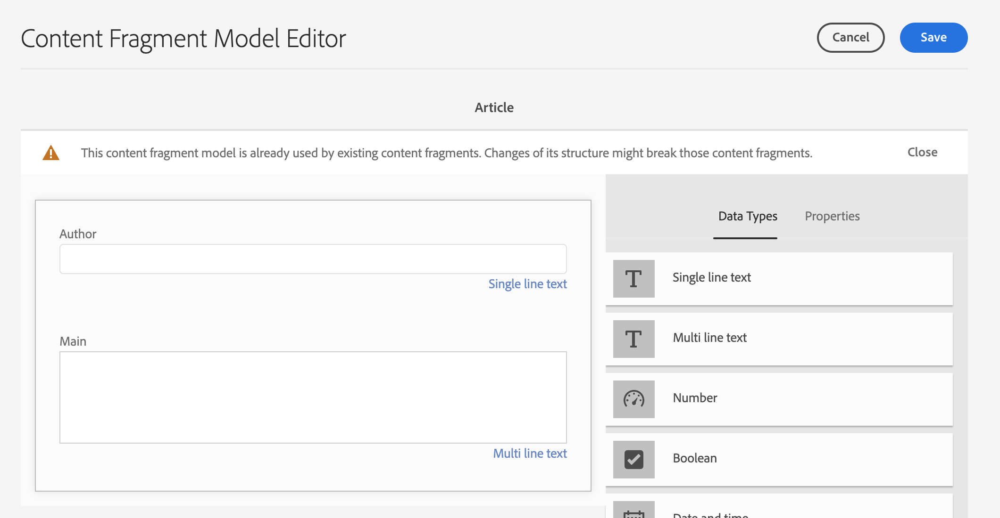
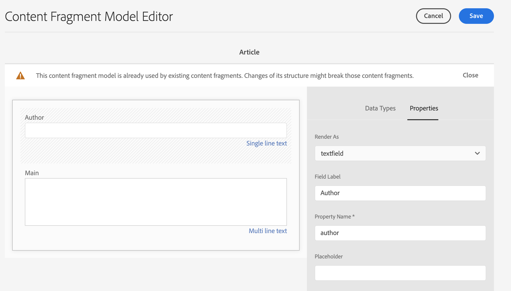

# Kom igång med AEM Headless Translation {#getting-started}

Lär dig hur du ordnar ditt headless-innehåll och hur AEM översättningsverktyg fungerar.

## Story hittills {#story-so-far}

I föregående dokument på den AEM översättningsresan utan rubriker [Lär dig mer om headless-innehåll och hur du översätter i AEM](learn-about.md) lärde du dig den grundläggande teorin om vad ett headless CMS är och du bör nu:

* Förstå de grundläggande begreppen för leverans av headless-innehåll.
* Lär dig hur AEM hanterar headless och translation.

Den här artikeln bygger på dessa grundläggande funktioner så att du förstår hur AEM lagrar och hanterar headless-innehåll och hur du kan använda AEM översättningsverktyg för att översätta innehållet.

## Syfte {#objective}

Det här dokumentet hjälper dig att förstå hur du kommer igång med att översätta headless-innehåll i AEM. När du har läst bör du:

* Förstå hur viktig innehållsstrukturen är för översättning.
* Förstå hur AEM lagrar headless-innehåll.
* Bekanta dig med AEM översättningsverktyg.

## Krav och krav {#requirements-prerequisites}

Det finns ett antal krav innan du börjar översätta ditt AEM innehåll.

### Kunskap {#knowledge}

* Upplev hur man översätter innehåll i ett CMS-system
* Upplev de grundläggande funktionerna i ett storskaligt CMS-system
* Kunskap AEM grundläggande hantering
* Förståelse för översättningstjänsten som du använder
* Ha en grundläggande förståelse för innehållet som du översätter

>[!TIP]
>
>Om du inte är van vid att använda ett stort CMS-system som AEM bör du granska [Basic Handling](/help/sites-cloud/authoring/getting-started/basic-handling.md)-dokumentationen innan du fortsätter. Dokumentationen för grundläggande hantering är inte en del av resan, så gå tillbaka till den här sidan när du är klar.

### Verktyg {#tools}

* Tillgång till sandlådor för att testa översättning av ditt innehåll
* Autentiseringsuppgifter för att ansluta till den översättningstjänst du föredrar
* Bli medlem i gruppen `project-administrators` i AEM

## Strukturen är nyckeln {#content-structure}

AEM innehåll, oavsett om det är headless eller traditionella webbsidor, styrs av sin struktur. AEM ställer få krav på innehållsstrukturen, men om du tar hänsyn till innehållshierarkin som en del av projektplaneringen blir översättningen mycket enklare.

>[!TIP]
>
>Planera för översättning i början av det headless-projektet. Arbeta nära med projektledaren och innehållsarkitekterna tidigt.
>
>En projektledare för internationalisering kan krävas som en separat person vars ansvar är att definiera vilket innehåll som ska översättas och vad som inte ska översättas, och vilket översatt innehåll som kan ändras av regionala eller lokala innehållsproducenter.

## Så här lagrar AEM Headless-innehåll {#headless-content-in-aem}

För översättningsspecialisten är det inte viktigt att förstå hur AEM hanterar headless-innehåll. Att känna till de grundläggande begreppen och terminologin kan dock vara praktiskt när du senare använder AEM översättningsverktyg. Viktigast av allt är att ni måste förstå ert eget innehåll och hur det är strukturerat för att kunna översätta det effektivt.

### Innehållsmodeller {#content-models}

För att headless-innehåll ska kunna levereras på ett enhetligt sätt i alla kanaler, regioner och på alla språk måste innehållet vara välstrukturerat. AEM använder innehållsmodeller för att tillämpa den här strukturen. Tänk på Innehållsmodeller som en typ av mall eller mönster för att skapa headless-innehåll. Eftersom alla projekt har sina egna behov definierar alla projekt sina egna modeller för innehållsfragment. AEM har inga fasta krav eller strukturer för sådana modeller.

Innehållsarkitekten arbetar tidigt i projektet för att definiera den här strukturen. Som översättningsspecialist bör ni ha ett nära samarbete med innehållsarkitekten för att förstå och organisera innehållet.

>[!NOTE]
>
>Innehållsarkitekten ansvarar för att definiera innehållsmodellerna. Översättningsexperten bör bara känna till sin struktur enligt följande steg.

Eftersom innehållsmodellerna definierar innehållsstrukturen måste du veta vilka fält i modellerna som måste översättas. I allmänhet arbetar du med innehållsarkitekten för att definiera detta. Följ stegen nedan för att bläddra bland fälten i dina innehållsmodeller.

1. Navigera till **Verktyg** -> **Resurser** -> **Modeller för innehållsfragment**.
1. Modeller för innehållsfragment lagras vanligtvis i en mappstruktur. Tryck eller klicka på mappen för ditt projekt.
1. Modellerna listas. Tryck eller klicka på modellen för att visa informationen.
   
1. **Modellredigeraren för innehållsfragment** öppnas.
   1. Den vänstra kolumnen innehåller modellens fält. Den här kolumnen intresserar oss.
   1. Den högra kolumnen innehåller de fält som kan läggas till i modellen. Den här kolumnen kan vi ignorera.
      
1. Tryck eller klicka på ett av modellens fält. AEM markerar det och detaljerna för det fältet visas i den högra kolumnen.
   

Observera fältet **Egenskapsnamn** för alla fält som måste översättas. Du kommer att behöva den här informationen senare under resan. Dessa **egenskapsnamn** s krävs för att informera AEM vilka fält i ditt innehåll som måste översättas.

>[!TIP]
>
>Innehållsarkitekten förser översättningsexperten med **egenskapsnamnet** s för alla fält som krävs för översättning. Dessa fältnamn behövs för att kunna användas senare under resan. De föregående stegen tillhandahålls för att förstå översättningsspecialisten.

### Innehållsfragment {#content-fragments}

Innehållsmodellerna används av innehållsförfattarna för att skapa det faktiska rubrikfria innehållet. Innehållsförfattare väljer vilken modell de vill basera sitt innehåll på och skapar sedan innehållsfragment. Innehållsfragment är förekomster av modellerna och representerar faktiskt innehåll som ska levereras utan krångel.

Om Innehållsmodellerna är mönstren för innehållet, är innehållsfragmenten det faktiska innehållet baserat på dessa mönster. Innehållsfragmenten representerar innehållet som måste översättas.

Innehållsfragment hanteras som resurser i AEM som en del av DAM (Digital Asset Management). Detta är viktigt eftersom de alla finns under sökvägen `/content/dam`.

## Rekommenderad innehållsstruktur {#recommended-structure}

Som vi tidigare har rekommenderat arbetar du med din innehållsarkitekt för att fastställa lämplig innehållsstruktur för ditt eget projekt. Följande är dock en beprövad, enkel och intuitiv struktur som är mycket effektiv.

Definiera en basmapp för projektet under `/content/dam`.

```text
/content/dam/<your-project>
```

Språket som ditt innehåll skrivs på kallas för språkrot. I vårt exempel är det engelska och det bör vara under den här vägen.

```text
/content/dam/<your-project>/en
```

Allt projektinnehåll som kan behöva lokaliseras ska placeras under språkroten.

```text
/content/dam/<your-project>/en/<your-project-content>
```

Översättningar ska skapas som jämställda mappar tillsammans med språkroten och deras mappnamn representerar språkets ISO-2-språkkod. Tyska skulle till exempel ha följande sökväg.

```text
/content/dam/<your-project>/de
```

>[!NOTE]
>
>Innehållsarkitekten ansvarar vanligtvis för att skapa dessa språkmappar. Om de inte skapas kan AEM inte skapa översättningsjobb senare.

Den slutliga strukturen kan se ut ungefär så här.

```text
/content
    |- dam
        |- your-project
            |- en
                |- some
                |- exciting
                |- headless
                |- content
            |- de
            |- fr
            |- it
            |- ...
        |- another-project
        |- ...
```

Du bör notera den specifika sökvägen för ditt innehåll, eftersom det krävs senare för att konfigurera översättningen.

>[!NOTE]
>
>Innehållsarkitekten ansvarar vanligtvis för att definiera innehållsstrukturen, men kan samarbeta med översättningsspecialisten.
>
>Den beskrivs här för fullständighetens skull.

## AEM översättningsverktyg {#translation-tools}

Nu när du förstår vad innehållsfragment är och vikten av innehållsstruktur kan vi titta på hur du översätter det här innehållet. Översättningsverktygen i AEM är mycket kraftfulla, men enkla att förstå på en hög nivå.

* **Translation Connector**  - Kopplingen är länken mellan AEM och den översättningstjänst som du använder.
* **Översättningsregler**  - Regler definierar vilket innehåll under särskilda sökvägar som ska översättas.
* **Översättningsprojekt**  - Översättningsprojekt samlar in innehåll som ska hanteras som en enda översättningsåtgärd och spårar översättningens förlopp, interagerar med kopplingen för att överföra innehållet som ska översättas och ta emot det tillbaka från översättningstjänsten.

Vanligtvis konfigurerar du bara anslutningen en gång för din instans och regler per headless-projekt. Sedan använder ni översättningsprojekt för att översätta innehållet och hålla översättningarna uppdaterade kontinuerligt.

## What&#39;s Next {#what-is-next}

Nu när du är klar med den här delen av den headless översättningsresan ska du:

* Förstå hur viktig innehållsstrukturen är för översättning.
* Förstå hur AEM lagrar headless-innehåll.
* Bekanta dig med AEM översättningsverktyg.

Bygg vidare på den här kunskapen och fortsätt din AEM resa med headless translation genom att nästa gång du granskar dokumentet [Konfigurera översättningskopplingen](configure-connector.md) där du får lära dig hur du ansluter AEM till en översättningstjänst.|

## Ytterligare resurser {#additional-resources}

Vi rekommenderar att du går vidare till nästa del av den headless-översättningsresan genom att granska dokumentet [Konfigurera översättningskopplingen](configure-connector.md). Följande är ytterligare, valfria resurser som gör en djupdykning i vissa koncept som nämns i det här dokumentet, men de behöver inte fortsätta på den headless-resan.

* [AEM grundläggande hantering](/help/sites-cloud/authoring/getting-started/basic-handling.md)  - Lär dig grunderna i AEM gränssnitt för att enkelt navigera och utföra viktiga uppgifter som att hitta ditt innehåll.
* [Identifiera innehåll som ska översättas](/help/sites-cloud/administering/translation/rules.md)  - Lär dig hur översättningsregler identifierar innehåll som behöver översättas.
* [Configuring the Translation Integration Framework](/help/sites-cloud/administering/translation/integration-framework.md)  - Lär dig hur du konfigurerar översättningsintegreringsramverket för integrering med översättningstjänster från tredje part.
* [Hantera översättningsprojekt](/help/sites-cloud/administering/translation/managing-projects.md)  - Lär dig hur du skapar och hanterar både maskinöversättning och mänskliga översättningsprojekt i AEM.
