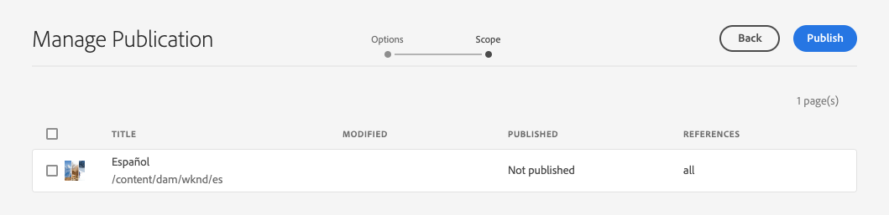
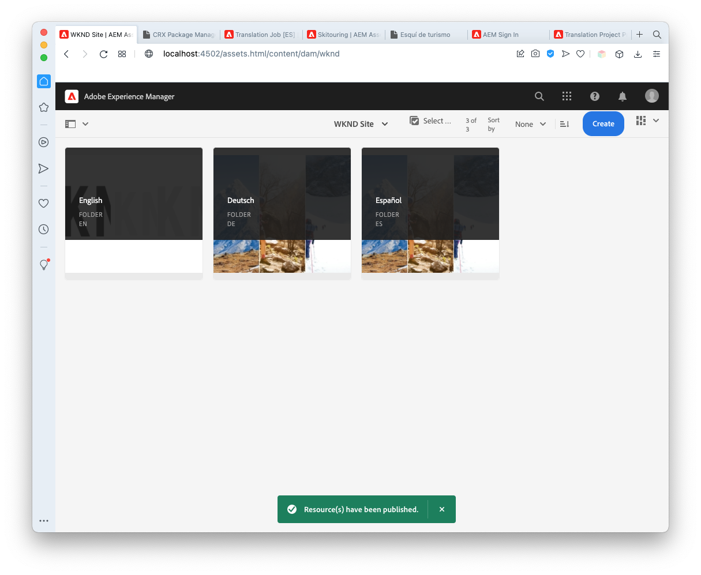
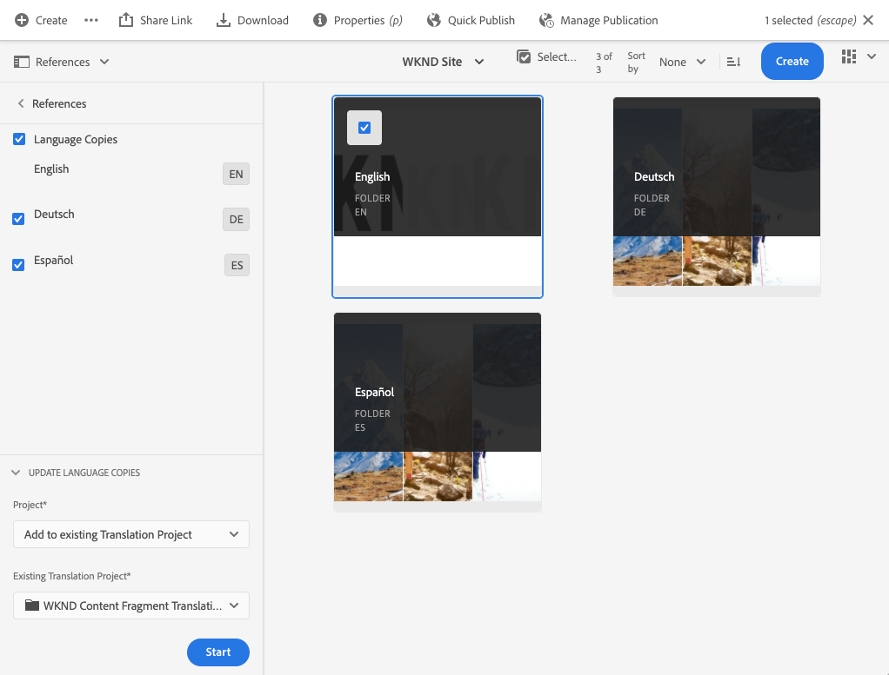
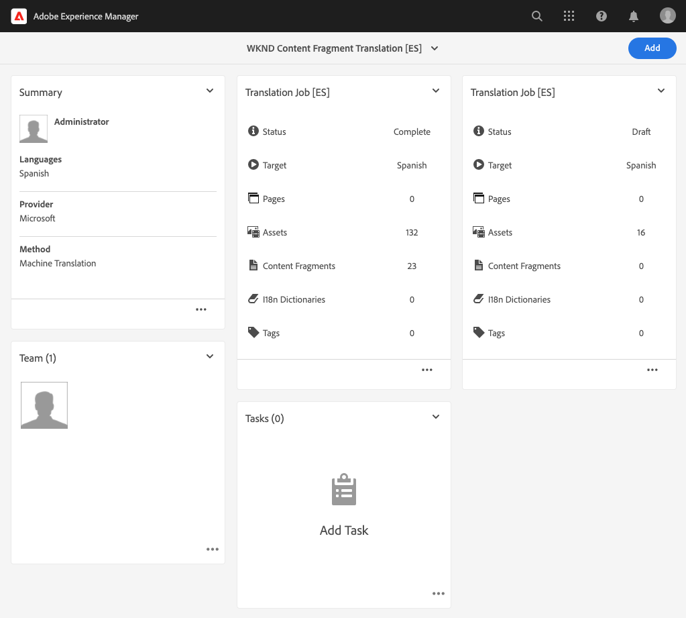

# Publicera översatt rubrikfritt innehåll {#publish-content}

Lär dig hur du publicerar översatt innehåll och uppdaterar översättningarna när innehållet uppdateras.

## Story hittills {#story-so-far}

I det tidigare dokumentet på AEM Headless Translation-resa, [Translate Content](configure-connector.md), lärde du dig att använda AEM Translation Projects för att översätta ditt headless-innehåll. Nu bör du:

* Förstå vad ett översättningsprojekt är.
* Skapa nya översättningsprojekt.
* Använd översättningsprojekt för att översätta ert headless-innehåll.

Nu när den första översättningen är klar går den här artikeln igenom nästa steg i publiceringen av det innehållet och vad du ska göra för att uppdatera översättningarna när det underliggande innehållet i språkroten ändras.

## Syfte {#objective}

Det här dokumentet hjälper dig att förstå hur du publicerar headless-innehåll i AEM och hur du skapar ett kontinuerligt arbetsflöde för att hålla översättningarna uppdaterade. När du har läst det här dokumentet bör du:

* Förstå AEM författarpubliceringsmodell.
* Lär dig hur du publicerar översatt innehåll.
* Kan implementera en kontinuerlig uppdateringsmodell för ditt översatta innehåll.

## AEM Author-Publish Model {#author-publish}

Innan du publicerar ditt innehåll är det en god idé att förstå AEM modell för författarpublicering. I förenklade termer delar AEM upp användare av systemet i två grupper.

1. De som skapar och hanterar innehållet och systemet
1. De som konsumerar innehållet från systemet

AEM är därför fysiskt indelat i två instanser.

1. Instansen **author** är det system där innehållsförfattare och administratörer arbetar med att skapa och hantera innehåll.
1. Instansen **publish** är det system som levererar innehållet till konsumenterna.

När innehållet har skapats på författarinstansen måste det överföras till publiceringsinstansen för att det ska vara tillgängligt för konsumtion. Processen att överföra från författare till publicering kallas **publikation**.

## Publicera översatt innehåll {#publishing}

När du är nöjd med hur det översatta innehållet ser ut måste det publiceras så att headless-tjänster kan förbruka det. Den här uppgiften är vanligtvis inte översättningsspecialistens ansvar, men beskrivs här för att illustrera hela arbetsflödet.

>[!NOTE]
>
>När översättningen är klar informerar översättningsexperten i allmänhet innehållsägarna om att översättningarna är klara för publicering. Innehållsägarna publicerar dem sedan.
>
>Följande steg är fullständiga.

Det enklaste sättet att publicera översättningarna är att navigera till projektresursmappen.

```text
/content/dam/<your-project>/
```

Under den här sökvägen har du undermappar för varje översättningsspråk och kan välja vilka som ska publiceras.

1. Gå till **Navigering** > **Assets** > **Filer** och öppna projektmappen.
1. Här visas språkrotmappen och alla andra språkmappar. Välj det eller de lokaliserade språk som du vill publicera.
   
1. Välj **Hantera publikation**.
1. I fönstret **Hantera publikation** kontrollerar du att **Publicera** automatiskt har markerats under **Åtgärd** och att **Nu** har markerats under **Schemaläggning**. Välj **Nästa**.
   
1. Bekräfta att rätt sökväg har valts i nästa **Hantera publikation**-fönster. Välj **Publicera**.
   
1. AEM bekräftar publiceringsåtgärden med ett popup-meddelande längst ned på skärmen.
   

Ditt översatta headless-innehåll publiceras nu! Den kan nu nås och användas av era headless-tjänster.

>[!TIP]
>
>Du kan markera flera objekt (d.v.s. flera språkmappar) när du publicerar, så att du kan publicera flera översättningar samtidigt.

Det finns ytterligare alternativ när du publicerar innehåll, till exempel schemaläggning av en publiceringstid, som ligger utanför den här kundresan. Mer information finns i avsnittet [Ytterligare resurser](#additional-resources) i slutet av dokumentet.

## Uppdatera ditt översatta innehåll {#updating-translations}

Översättning är sällan en engångsåtgärd. Vanligtvis fortsätter innehållsförfattarna att lägga till och ändra ditt innehåll i språkroten när den inledande översättningen är klar. Det innebär att du även måste uppdatera det översatta innehållet.

Specifika projektkrav definierar hur ofta du behöver uppdatera översättningarna och vilken beslutsprocess som ska följas innan du utför en uppdatering. När du väl har bestämt dig för att uppdatera översättningarna är processen i AEM mycket enkel. När den inledande översättningen baserades på ett översättningsprojekt så gör även alla uppdateringar det.

Som tidigare skiljer sig dock processen något om du väljer att automatiskt skapa ett översättningsprojekt eller manuellt skapa ett översättningsprojekt.

### Uppdatera ett automatiskt skapat översättningsprojekt {#updating-automatic-project}

1. Navigera till **Navigering** > **Assets** > **Filer**. Kom ihåg att headless-innehåll i AEM lagras som resurser som kallas innehållsfragment.
1. Välj språkroten för projektet. I det här fallet har vi valt `/content/dam/wknd/en`.
1. Markera spårväljaren och visa panelen **Referenser**.
1. Välj **Språkkopior**.
1. Markera kryssrutan **Språkkopior**.
1. Expandera avsnittet **Uppdatera språkkopior** längst ned på referenspanelen.
1. I listrutan **Projekt** väljer du **Lägg till i ett befintligt översättningsprojekt**.
1. I listrutan **Befintligt översättningsprojekt** väljer du det projekt som skapats för den inledande översättningen.
1. Välj **Start**.



Innehållet läggs till i det befintliga översättningsprojektet. Så här visar du översättningsprojektet:

1. Navigera till **Navigering** > **Projekt**.
1. Välj det projekt som du just har uppdaterat.
1. Välj språk eller något av språken som du uppdaterade.

Ett nytt jobbkort har lagts till i projektet. I det här exemplet har en annan spanska översättning lagts till.



Du kan lägga märke till att statistiken på det nya kortet (antal tillgångar och innehållsfragment) är annorlunda. Detta beror på att AEM känner igen vad som har ändrats sedan den senaste översättningen och bara inkluderar det innehåll som måste översättas. Detta inkluderar omöversättning av uppdaterat innehåll och förstagångsöversättning av nytt innehåll.

Från och med nu [startar och hanterar du ditt översättningsjobb på samma sätt som du gjorde det ursprungliga](translate-content.md#using-translation-project).

### Uppdatera ett manuellt skapat översättningsprojekt {#updating-manual-project}

Om du vill uppdatera en översättning kan du lägga till ett nytt jobb i ditt befintliga projekt som ansvarar för översättning av det uppdaterade innehållet.

1. Navigera till **Navigering** > **Projekt**.
1. Välj det projekt som du vill uppdatera.
1. Välj knappen **Lägg till** längst upp i fönstret.
1. I fönstret **Lägg till panel** väljer du **Översättningsjobb** och sedan **Skicka**.

   

1. På kortet för det nya översättningsjobbet väljer du knappen för att markera den övre delen av kortet och väljer **Uppdatera mål** för att definiera målspråket för det nya jobbet.

   

1. I dialogrutan **Välj målspråk** använder du listrutan för att välja språk och väljer **Klar**.

   

1. När det nya översättningsjobbets målspråk är inställt väljer du ellipsknappen längst ned på jobbkortet för att visa information om jobbet.
1. Jobbet är tomt när det skapas. Lägg till innehåll i jobbet genom att trycka på eller klicka på knappen **Lägg till** och använda sökvägsläsaren [ på samma sätt som när du ursprungligen skapade översättningsprojektet](translate-content.md##manually-creating).

>[!TIP]
>
>Banwebbläsarens kraftfulla filter kan vara användbara för att hitta just det innehåll som har uppdaterats.
>
>Du kan läsa mer om sökvägsläsaren i avsnittet [ytterligare resurser](#additional-resources).

Från och med nu [startar och hanterar du ditt översättningsjobb på samma sätt som du gjorde det ursprungliga](translate-content.md#using-translation-project).

## Slut på resan? {#end-of-journey}

Grattis! Du har fullföljt den headless översättningsresan! Nu bör du:

* Få en översikt över vad headless content delivery är.
* Lär dig mer om AEM headless-funktioner.
* Förstå AEM översättningsfunktioner och hur de relaterar till headless-innehåll.
* Förmåga att börja översätta sitt eget headless-innehåll.

Nu kan du översätta ditt eget headless-innehåll i AEM. AEM är dock ett kraftfullt verktyg och det finns många andra alternativ. Ta en titt på några av de ytterligare resurser som är tillgängliga i avsnittet [Ytterligare resurser](#additional-resources) om du vill veta mer om de funktioner du såg under den här resan.

## Ytterligare resurser {#additional-resources}

* [Hantera översättningsprojekt](/help/sites-cloud/administering/translation/managing-projects.md) - Lär dig mer om översättningsprojekt och andra funktioner som mänskliga översättningsarbetsflöden och flerspråkiga projekt.
* [Redigeringsbegrepp](/help/sites-cloud/authoring/author-publish.md) - Läs mer om författaren och publiceringsmodellen för AEM. Det här dokumentet fokuserar på att skapa sidor i stället för på innehållsfragment, men teorin gäller fortfarande.
* [Publicera sidor](/help/sites-cloud/authoring/sites-console/publishing-pages.md) - Läs om de ytterligare funktioner som är tillgängliga när du publicerar innehåll. Det här dokumentet fokuserar på att skapa sidor i stället för på innehållsfragment, men teorin gäller fortfarande.
* [Redigeringsmiljö och redigeringsverktyg](/help/sites-cloud/authoring/path-selection.md#path-selection) - AEM innehåller olika sätt att ordna och redigera ditt innehåll, bland annat en robust sökvägsläsare.
