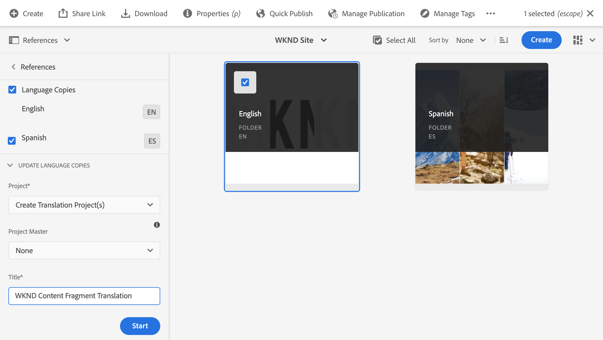
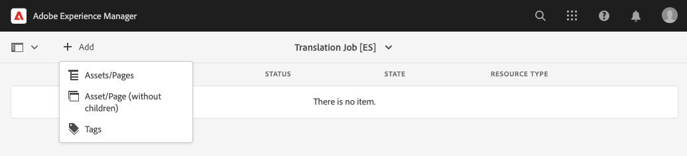

# Översätt rubrikfritt innehåll {#translate-content}

Använd översättningskopplingen för att översätta ditt headless-innehåll.

## Story hittills {#story-so-far}

I det föregående dokumentet om den AEM översättningsresan utan headless [Konfigurera översättningsanslutning](configure-connector.md) du lärde dig om översättningsramverket i AEM. Nu bör du:

* Förstå de viktiga parametrarna i översättningsintegreringsramverket i AEM.
* Du kan skapa en egen anslutning till översättningstjänsten.

Nu när du har konfigurerat kontakten tar den här artikeln dig genom nästa steg i översättningen av ditt headless-innehåll.

## Syfte {#objective}

Det här dokumentet hjälper dig att förstå hur du använder AEM översättningsprojekt tillsammans med kopplingen för att översätta innehåll. När du har läst det här dokumentet bör du:

* Förstå vad ett översättningsprojekt är.
* Skapa nya översättningsprojekt.
* Använd översättningsprojekt för att översätta ert headless-innehåll.

## Skapa ett översättningsprojekt {#creating-translation-project}

Med översättningsprojekt kan du hantera översättning av AEM utan rubriker. I ett översättningsprojekt samlas det innehåll som ska översättas till andra språk på en och samma plats för att ge en central bild av översättningsarbetet.

När innehåll läggs till i ett översättningsprojekt skapas ett översättningsjobb för det. Jobb innehåller kommandon och statusinformation som du använder för att hantera de mänskliga översättnings- och maskinöversättningsarbetsflödena som körs på resurserna.

Översättningsprojekt kan skapas på två sätt:

1. Välj språkroten för innehållet och låt AEM automatiskt skapa översättningsprojektet baserat på innehållssökvägen.
1. Skapa ett tomt projekt och välj manuellt det innehåll som ska läggas till i översättningsprojektet

Båda metoderna är vanligtvis bara olika beroende på vilken person som utför översättningen:

* Översättningsprojektledaren (TPM) behöver ofta flexibiliteten att manuellt välja innehåll till översättningsprojektet.
* Om innehållsägaren också ansvarar för översättning är det ofta enklare att låta AEM automatiskt skapa projektet baserat på den valda innehållssökvägen.

Båda metoderna beskrivs i följande avsnitt.

### Skapa ett översättningsprojekt automatiskt baserat på innehållssökväg {#automatically-creating}

För rättighetsinnehavare som också ansvarar för översättning är det ofta enklare att AEM automatiskt skapa översättningsprojektet. Så här skapar AEM automatiskt ett översättningsprojekt baserat på din innehållssökväg:

1. Navigera till **Navigering** -> **Resurser** -> **Filer**. Kom ihåg att innehåll utan rubrik i AEM lagras som resurser som kallas för innehållsfragment.
1. Välj språkroten för projektet. I det här fallet har vi valt `/content/dam/wknd/en`.
1. Tryck eller klicka på rälsväljaren och visa **Referenser** -panelen.
1. Tryck eller klicka på **Språkkopior**.
1. Kontrollera **Språkkopior** kryssrutan.
1. Expandera avsnittet **Uppdatera språkkopior** längst ned på referenspanelen.
1. I **Projekt** listruta, välja **Skapa översättningsprojekt**.
1. Ange en lämplig titel för översättningsprojektet.
1. Tryck eller klicka **Starta**.



Du får ett meddelande om att projektet har skapats.

>[!NOTE]
>
>Det antas att den nödvändiga språkstrukturen för översättningsspråken redan har skapats som en del av [definition av innehållsstrukturen.](getting-started.md#content-structure) Detta bör göras i samarbete med innehållsarkitekten.
>
>Om språkmapparna inte skapas i förväg kommer du inte att kunna skapa språkkopior enligt beskrivningen i föregående steg.

### Skapa ett översättningsprojekt manuellt genom att välja ditt innehåll {#manually-creating}

För översättningsprojektledare är det ofta nödvändigt att manuellt välja specifikt innehåll som ska inkluderas i ett översättningsprojekt. Om du vill skapa ett sådant manuellt översättningsprojekt måste du börja med att skapa ett tomt projekt och sedan välja det innehåll som ska läggas till i det.

1. Navigera till **Navigering** -> **Projekt**.
1. Tryck eller klicka **Skapa** -> **Mapp** för att skapa en mapp för dina projekt.
   * Detta är valfritt, men användbart om du vill organisera översättningsarbetet.
1. I **Skapa projekt** fönster, lägga till **Titel** för mappen och sedan trycka eller klicka **Skapa**.

   

1. Tryck eller klicka på mappen för att öppna den.
1. Tryck eller klicka på **Skapa** -> **Projekt**.
1. Projekten bygger på mallar. Tryck eller klicka på **Översättningsprojekt** för att markera den och sedan trycka eller klicka på **Nästa**.

   

1. På **Grundläggande** anger du ett namn för det nya projektet.

   

1. På **Avancerat** -fliken använder du **Målspråk** för att välja vilket eller vilka språk ditt innehåll ska översättas till. Tryck eller klicka **Skapa**.

   

1. Tryck eller klicka **Öppna** i bekräftelsedialogrutan.

   

Projektet har skapats, men innehåller inget innehåll att översätta. I nästa avsnitt beskrivs hur projektet är strukturerat och hur du lägger till innehåll.

## Använda ett översättningsprojekt {#using-translation-project}

Översättningsprojekt är utformade för att samla ihop allt innehåll och alla uppgifter som hör till en översättningsåtgärd på ett och samma ställe för att göra översättningen enkel och enkel att hantera.

Så här visar du översättningsprojektet:

1. Navigera till **Navigering** -> **Projekt**.
1. Tryck eller klicka på det projekt som skapades i föregående avsnitt.


Projektet är uppdelat i flera kort.

* **Sammanfattning** - Det här kortet visar grundläggande rubrikinformation för projektet inklusive ägare, språk och översättningsleverantör.
* **Översättningsjobb** - Kortet eller korten ger en översikt över det faktiska översättningsjobbet inklusive status, antal tillgångar osv. Vanligtvis finns det ett jobb per språk med ISO-2-språkkoden tillagd till jobbnamnet.
* **Team** - Det här kortet visar vilka användare som samarbetar i det här översättningsprojektet. Den här resan täcker inte det här ämnet.
* **Uppgifter** - Ytterligare uppgifter som är kopplade till översättning av innehåll som att göra objekt eller arbetsflödesobjekt. Den här resan täcker inte det här ämnet.

Hur du använder ett översättningsprojekt beror på hur det skapades: antingen automatiskt AEM eller manuellt.

### Använda ett automatiskt skapat översättningsprojekt {#using-automatic-project}

När du automatiskt skapar översättningsprojektet utvärderar AEM innehållet utan rubrik under den sökväg du valde. Utifrån utvärderingen extraheras det innehåll som kräver översättning till ett nytt översättningsprojekt. Jag vet vilka fält som ska översättas baserat på de fält som flaggats som **Översättningsbar** av innehållsarkitekten.

Om du vill se detaljerna om det headless-innehåll som ingår i projektet:

1. Tryck eller klicka på ellipsknappen längst ned i **Översättningsjobb** kort.
1. The **Översättningsjobb** visas alla objekt i jobbet.
   
1. Tryck eller klicka på en rad för att visa detaljerna på den raden. Tänk på att en rad kan representera flera innehållsobjekt som ska översättas.
1. Tryck eller klicka på markeringsrutan för ett radobjekt om du vill se ytterligare alternativ, som alternativet att ta bort det från jobbet eller visa det i konsolerna Innehållsfragment eller Resurser.


Översättningsjobbets innehåll startar vanligtvis i **Utkast** enligt **Läge** kolumn i **Översättningsjobb** -fönstret.

Starta översättningsjobbet genom att gå tillbaka till översättningsprojektöversikten och trycka eller klicka på knappen för att markera översättningen längst upp i **Översättningsjobb** och välj **Starta**.


AEM kommunicerar nu med din översättningskonfiguration och koppling för att skicka innehållet till översättningstjänsten. Du kan visa översättningens förlopp genom att gå tillbaka till **Översättningsjobb** och visa **Läge** kolumn för posterna.


Maskinöversättningar returneras automatiskt med statusen **Godkänd**. Översättning till människor möjliggör mer interaktion, men ligger utanför den här resan.

### Använda ett manuellt skapat översättningsprojekt {#using-manual-project}

När du skapar ett översättningsprojekt manuellt skapar AEM de nödvändiga jobben, men väljer inte automatiskt något innehåll som ska inkluderas. Detta ger översättningsprojektledaren flexibilitet att välja och välja vilket innehåll som ska översättas.

Så här lägger du till innehåll i ett översättningsjobb:

1. Tryck eller klicka på ellipsknappen längst ned på en av **Översättningsjobb** kort.
1. Se till att jobbet inte innehåller något innehåll. Tryck eller klicka på **Lägg till** överst i fönstret och sedan **Resurser/sidor** i listrutan.

   

1. En sökvägsläsare öppnas där du kan välja specifikt vilket innehåll som ska läggas till. Leta upp innehållet och tryck eller klicka för att välja.

   

1. Tryck eller klicka **Välj** för att lägga till det markerade innehållet i jobbet.
1. I **Översätt** dialogruta, ange att du vill **Skapa språkkopia**.

   

1. Innehållet ingår nu i jobbet.

   

1. Tryck eller klicka på markeringsrutan för ett radobjekt om du vill se ytterligare alternativ, som alternativet att ta bort det från jobbet eller visa det i konsolerna Innehållsfragment eller Resurser.


1. Upprepa de här stegen för att inkludera allt nödvändigt innehåll i jobbet.

>[!TIP]
>
>Sökvägsläsaren är ett kraftfullt verktyg som du kan använda för att söka efter, filtrera och navigera i ditt innehåll. Tryck eller klicka på **Endast innehåll/filter** för att växla sidopanelen och visa avancerade filter som **Ändringsdatum** eller **Översättningsstatus**.
>
>Du kan läsa mer om sökvägsläsaren i [ytterligare resursavsnitt.](#additional-resources)

Du kan använda föregående steg för att lägga till nödvändigt innehåll till alla språk (jobb) för projektet. När du har markerat allt innehåll kan du starta översättningen.

Översättningsjobbets innehåll startar vanligtvis i **Utkast** enligt **Läge** kolumn i **Översättningsjobb** -fönstret.

Starta översättningsjobbet genom att gå tillbaka till översättningsprojektöversikten och trycka eller klicka på knappen för att markera översättningen längst upp i **Översättningsjobb** och välj **Starta**.


AEM kommunicerar nu med din översättningskonfiguration och koppling för att skicka innehållet till översättningstjänsten. Du kan visa översättningens förlopp genom att gå tillbaka till **Översättningsjobb** och visa **Läge** kolumn för posterna.


Maskinöversättningar returneras automatiskt med statusen **Godkänd**. Översättning till människor möjliggör mer interaktion, men ligger utanför den här resan.

## Granskning av översatt innehåll {#reviewing}

[Som tidigare visats](#using-translation-project) maskinöversatt innehåll flödas tillbaka till AEM med statusen **Godkänd** Eftersom antagandet är att maskinöversättning används krävs ingen mänsklig åtgärd. Det är dock fortfarande möjligt att granska det översatta innehållet.

Gå bara till det slutförda översättningsjobbet och markera ett radobjekt genom att trycka eller klicka i kryssrutan. Ikonen **Visa i innehållsfragment** visas i verktygsfältet.


Tryck eller klicka på den ikonen för att öppna det översatta innehållsfragmentet i redigeringskonsolen för att visa information om det översatta innehållet.


Du kan ändra innehållsfragmentet ytterligare om det behövs, förutsatt att du har rätt behörighet, men att redigera innehållsfragment ligger utanför den här kundresan. Se [Ytterligare resurser](#additional-resources) i slutet av det här dokumentet om du vill ha mer information om det här avsnittet.

Projektets syfte är att samla alla resurser som hör till en översättning på ett och samma ställe för enkel åtkomst och en tydlig översikt. Men som du kan se genom att visa detaljerna för ett översatt objekt, flödar översättningarna tillbaka till resursmappen för översättningsspråket. I det här exemplet är mappen

```text
/content/dam/wknd/es
```

Om du navigerar till den här mappen via **Navigering** -> **Filer** -> **Resurser** ser du det översatta innehållet.


AEM översättningsramverk tar emot översättningarna från översättningskopplingen och skapar sedan automatiskt innehållsstrukturen baserat på språkroten och med hjälp av översättningarna från kopplingen.

Det är viktigt att förstå att detta innehåll inte publiceras och därför inte är tillgängligt för era headless-tjänster. Vi kommer att lära oss om den här strukturen för författarpublicering och se hur vi kan publicera vårt översatta innehåll i nästa steg av översättningsresan.

## Översättning av människor {#human-translation}

Om översättningstjänsten tillhandahåller mänsklig översättning erbjuder granskningsprocessen fler alternativ. Översättningar kommer till exempel tillbaka i projektet med statusen **Utkast** och måste granskas och godkännas eller avvisas manuellt.

Översättning till människor ligger utanför den här lokaliseringsresan. Se [Ytterligare resurser](#additional-resources) i slutet av det här dokumentet om du vill ha mer information om det här avsnittet. Förutom de ytterligare godkännandealternativen är arbetsflödet för mänskliga översättningar detsamma som maskinöversättningar som beskrivs under den här resan.

## What&#39;s Next {#what-is-next}

Nu när du är klar med den här delen av den headless översättningsresan ska du:

* Förstå vad ett översättningsprojekt är.
* Skapa nya översättningsprojekt.
* Använd översättningsprojekt för att översätta ert headless-innehåll.

Bygg vidare på den här kunskapen och fortsätt din AEM resa med headless translation genom att nästa gång du granskar dokumentet [Publicera översatt innehåll](publish-content.md) där du får lära dig hur du publicerar översatt innehåll och hur du uppdaterar översättningarna när rotinnehållet för ditt språk ändras.

## Ytterligare resurser {#additional-resources}

Vi rekommenderar att du går vidare till nästa del av den headless-översättningsresan genom att granska dokumentet [Publicera översatt innehåll,](publish-content.md) Nedan följer ytterligare, valfria resurser som gör en djupdykning i vissa koncept som nämns i det här dokumentet, men som inte behöver fortsätta på den headless-resan.

* [Hantera översättningsprojekt](/help/sites-cloud/administering/translation/managing-projects.md) - Läs mer om översättningsprojekt och andra funktioner som arbetsflöden för översättning och flerspråkiga projekt.
* [Redigeringsmiljö och -verktyg](/help/sites-cloud/authoring/fundamentals/environment-tools.md##path-selection) - AEM innehåller olika sätt att ordna och redigera ditt innehåll, bland annat en robust sökvägsläsare.
