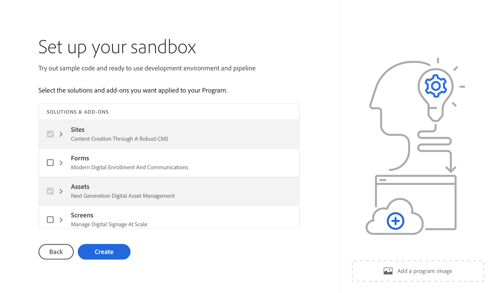

# Skapa ett program {#create-program}

I den här delen av [introduktionsresan](overview.md) får du lära dig hur du använder Cloud Manager för att skapa ditt första program.

## Syfte {#objective}

När du har granskat det föregående dokumentet på den här introduktionsresan [Åtkomst till Cloud Manager](cloud-manager.md) har du säkerställt att du har lämplig åtkomst till Cloud Manager. Nu kan du skapa ditt första program.

När du har läst dokumentet kan du:

* Förstå och förklara vad ett program är.
* Se skillnaden mellan produktion och sandlådeprogram.
* Skapa ett eget program.

## Vad är ett program? {#programs}

Programmen är den högsta organisationsnivån i Cloud Manager. Beroende på din licens hos Adobe kan du ordna din lösning och ge vissa teammedlemmar tillgång till dessa program.

Cloud Manager är en uppsättning Cloud Manager-miljöer. Dessa program stöder logiska uppsättningar av affärsinitiativ, som vanligtvis motsvarar en licensierad Service level agreement (SLA). Ett program kan t.ex. representera Adobe Experience Manager (AEM) resurser för att stödja en global offentlig webbplats för en organisation, medan ett annat program representerar en intern central DAM.

Titta på exemplet med det teoretiska WKND Travel and Adventure Enterprises, en hyresgäst som specialiserar sig på reserelaterade medier. De kan ha två program. Ett AEM Sites-program för divisionen WKND Magazine och ett AEM Assets-program för divisionen WKND Media. Olika teammedlemmar skulle då ha tillgång till de olika programmen på grund av sin egen uppdelning av arbetskrav.

Det finns två olika typer av program:

* Ett **produktionsprogram** har skapats för att aktivera livatrafik för din webbplats. Det här programmet är din&quot;verkliga&quot; miljö.
* Ett **sandlådeprogram** skapas vanligtvis för att fungera som träning, som kör demos, aktivering, POC eller dokumentation.

Eftersom de har olika syften har de olika miljöerna olika alternativ. Processen att skapa dem liknar dock den du gör. För den här introduktionsresan skapar du en sandlådemiljö.

>[!TIP]
>
>Om du måste skapa ett produktionsprogram kan du läsa avsnittet [Ytterligare resurser](#additional-resources) för att få en länk till en detaljerad beskrivning av program.

## Skapa ett sandlådeprogram {#create-sandbox}

1. Logga in på Cloud Manager på [my.cloudmanager.adobe.com](https://my.cloudmanager.adobe.com/) och välj lämplig organisation.

1. Klicka på **Lägg till program** i skärmens övre högra hörn från Cloud Manager landningssida.

   

1. Välj **Konfigurera en sandlåda** i guiden Skapa program och ange sedan ett programnamn och välj **Fortsätt**.

   

1. I dialogrutan **Konfigurera din sandlåda** kan du välja vilka lösningar du vill aktivera i ditt sandlådeprogram. Lösningarna **Webbplatser** och **Assets** ingår alltid i sandlådeprogram och väljs automatiskt. Dessa lösningar är tillräckliga för ditt introduktionsexempel. Klicka på **Skapa**.

   

Du ser ett nytt sandlådeprogramkort på landningssidan med en statusindikator allt eftersom installationsprocessen fortskrider.

När programmet är klart kan medlemmar i din organisation som har tilldelats produktprofilen **Developer** logga in på Cloud Manager och hantera Cloud Manager Git-databaser.

## Vad kommer härnäst? {#whats-next}

När du har skapat ditt första program kan du nu skapa miljöer för det. Fortsätt din introduktionsresa genom att nästa gång granska dokumentet [Skapa miljöer](create-environments.md).

Se även [Anlita din Edge Delivery Services-webbplats](/help/implementing/cloud-manager/edge-delivery/create-edge-delivery-site.md).

## Ytterligare resurser {#additional-resources}

Här följer ytterligare, valfria resurser om du vill gå längre än vad som ingår i introduktionsresan.

* [Program och programtyper](/help/implementing/cloud-manager/getting-access-to-aem-in-cloud/program-types.md) - Lär dig mer om hierarkin för Cloud Manager och hur de olika typerna av program passar in i strukturen och hur de skiljer sig.
* [Skapar sandlådeprogram](/help/implementing/cloud-manager/getting-access-to-aem-in-cloud/creating-sandbox-programs.md) - Lär dig hur du använder Cloud Manager för att skapa ett eget sandlådeprogram för utbildning, demo, POC eller andra icke-produktionssyften.
* [Skapar produktionsprogram](/help/implementing/cloud-manager/getting-access-to-aem-in-cloud/creating-production-programs.md) - Lär dig hur du använder Cloud Manager för att skapa ett eget produktionsprogram som värd för livetrafik.
* [Med Adobe Cloud Manager - Program](https://experienceleague.adobe.com/sv/docs/experience-manager-learn/cloud-service/cloud-manager/programs) - Cloud Manager-program representerar AEM-miljöer med stöd för logiska uppsättningar av affärsinitiativ, som vanligtvis motsvarar en köpt Service level agreement (SLA).
* [AEM as a Cloud Service Team- och produktprofiler](/help/onboarding/aem-cs-team-product-profiles.md) - Lär dig hur AEM as a Cloud Service team och produktprofiler kan ge och begränsa åtkomst till licensierade Adobe-lösningar.
