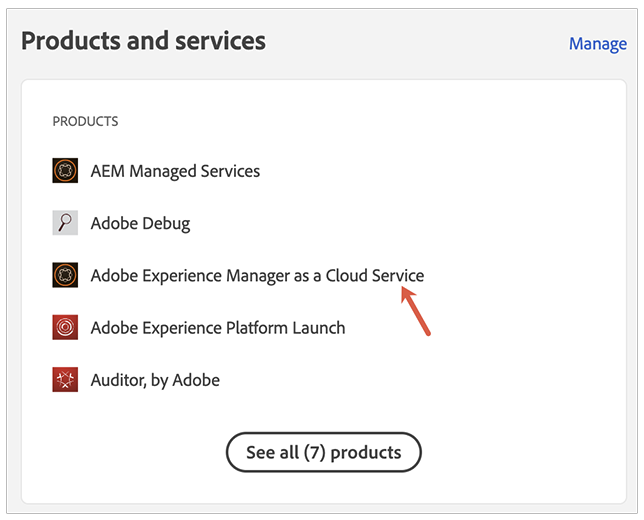

# Meddelandeprofiler {#notification-profiles}

Lär dig hur du skapar användarprofiler i Admin Console för att hantera mottagning av viktiga e-postmeddelanden.

## Översikt {#overview}

Adobe måste då och då kontakta användare om sina AEM as a Cloud Service miljöer. Förutom meddelanden i produkten använder Adobe ibland även e-post för meddelanden. Det finns två typer av sådana e-postmeddelanden:

* **Incidentmeddelande** - Dessa meddelanden skickas under en incident eller när Adobe har identifierat ett potentiellt tillgänglighetsproblem i din AEM as a Cloud Service miljö.
* **Proaktiv avisering** - Dessa meddelanden skickas när en medlem i Adobe supportteam vill ge vägledning om en eventuell optimering eller rekommendation som kan vara till nytta för er AEM as a Cloud Service miljö.

>[!NOTE]
>
>Det går inte att tilldela grupper till proaktiva meddelanden. Du måste tilldela användare till produktprofilerna direkt i stället.

För att rätt användare ska kunna ta emot dessa meddelanden måste du konfigurera och tilldela användarprofiler enligt beskrivningen i det här dokumentet.

## Förutsättningar {#prerequisites}

Eftersom användarprofiler skapas och underhålls i Admin Console måste du göra följande innan du skapar profiler för meddelanden:

* Har behörighet att lägga till och profilera medlemskap.
* Har en giltig Adobe Admin Console-profil.

## Skapa nya produktprofiler för Cloud Manager {#create-profiles}

För att kunna ställa in mottagning av meddelanden måste du skapa två användarprofiler. Dessa steg får endast utföras en gång.

1. Logga in Admin Console på [`https://adminconsole.adobe.com`.](https://adminconsole.adobe.com)

1. Se till att du är i rätt organisation.

1. Från **Ökning** sida, markera **Adobe Experience Manager as a Cloud Service** från **Produkter och tjänster** kort.

   

1. Navigera till **Cloud Manager** -instans i listan över alla instanser.

   

1. Du ser listan över alla konfigurerade Cloud Manager-produktprofiler.

   

1. Klicka **Ny profil** och lämna följande uppgifter:

   * **Produktprofilnamn**: `Incident Notification - Cloud Service`
   * **Visningsnamn**: `Incident Notification - Cloud Service`
   * **Beskrivning**: Cloud Manager-profil för de användare som ska få meddelanden under en incident eller när Adobe har identifierat ett potentiellt tillgänglighetsproblem med din AEM as a Cloud Service miljö

1. Klicka **Spara**.

1. Klicka **Ny profil** en gång till och lämna följande uppgifter:

   * **Produktprofilnamn**: `Proactive Notification - Cloud Service`
   * **Visningsnamn**: `Proactive Notification - Cloud Service`
   * **Beskrivning**: Cloud Manager-profil för de användare som ska få meddelanden när en medlem i Adobe-supportteamet vill ge vägledning om en eventuell optimering eller rekommendationer som ska utföras med din AEM as a Cloud Service miljökonfiguration

1. Klicka **Spara**.

De två nya meddelandeprofilerna skapas.

>[!NOTE]
>
>Det är viktigt att Cloud Manager **produktprofilnamn** är exakt detsamma som angivet. Kopiera och klistra in det angivna produktprofilnamnet för att undvika fel. Eventuella avvikelser eller skrivfel leder till att meddelanden inte skickas som du vill.
>
>Om ett fel uppstår eller om profilerna inte har definierats kommer Adobe som standard att meddela befintliga användare som har tilldelats **Cloud Manager Developer** eller **Distributionshanteraren** profiler.

## Tilldela användare till meddelandeprofiler {#add-users}

Nu när profilerna har skapats måste du tilldela rätt användare. Du kan göra detta när du skapar nya användare eller genom att uppdatera befintliga användare.

### Lägg till nya användare i profiler {#new-user}

Följ de här stegen för att lägga till användare för vilka Federated ID ännu inte har konfigurerats.

1. Identifiera den eller de användare som ska ta emot incidenter eller proaktiva meddelanden.

1. Logga in Admin Console på [`https://adminconsole.adobe.com`](https://adminconsole.adobe.com) om du fortfarande inte är inloggad.

1. Se till att du har valt rätt organisation.

1. Från **Ökning** sida, markera **Adobe Experience Manager as a Cloud Service** från **Produkter och tjänster** kort.

   

1. Om det federerade ID:t för dina teammedlemmar ännu inte har konfigurerats väljer du **Användare** i den övre navigeringen och sedan väljer **Lägg till användare**. Gå annars till avsnittet [Lägg till befintliga användare i profiler.](#existing-users)

   

1. I **Lägg till användare i ditt team** anger du e-post-ID för den användare som du vill lägga till och väljer `Adobe ID` för **ID-typ**.

1. Klicka på plusknappen under **Välj produkter** för att börja produktvalet.

1. Välj **Adobe Experience Manager as a Cloud Service** och tilldela en eller båda de nya profilerna till användaren.

   * **Incidentmeddelande - Cloud Service**
   * **Proaktiv avisering - Cloud Service**

1. Klicka **Spara** och ett välkomstmeddelande skickas till användaren som du har lagt till.

Den inbjudna användaren får nu meddelanden. Upprepa de här stegen för de användare i ditt team som du vill ska få meddelanden om.

### Lägg till befintliga användare i profiler {#existing-user}

Följ de här stegen för att lägga till användare för vilka det redan finns Federated ID.

1. Identifiera den eller de användare som ska ta emot incidenter eller proaktiva meddelanden.

1. Logga in Admin Console på [`https://adminconsole.adobe.com`](https://adminconsole.adobe.com) om du fortfarande inte är inloggad.

1. Se till att du har valt rätt organisation.

1. Från **Ökning** sida, markera **Adobe Experience Manager as a Cloud Service** från **Produkter och tjänster** kort.

1. Välj **Användare** från den övre navigeringen.

1. Om det federerade ID:t redan finns för den teammedlem som du vill lägga till i en meddelandeprofil letar du reda på användaren i listan och klickar på den. Gå annars till avsnittet [Lägg till nya användare i profiler.](#add-user)

1. I **Produkter** i fönstret för användarinformation klickar du på ellipsknappen och väljer **Redigera**.

1. I **Redigera produkter** klickar du på pennknappen under **Välj produkter** för att börja produktvalet.

1. Välj **Adobe Experience Manager as a Cloud Service** och tilldela en eller båda de nya profilerna till användaren.

   * **Incidentmeddelande - Cloud Service**
   * **Proaktiv avisering - Cloud Service**

1. Klicka **Spara** och ett välkomstmeddelande skickas till användaren som du har lagt till.

Den inbjudna användaren får nu meddelanden. Upprepa de här stegen för de användare i ditt team som du vill ska få meddelanden om.

## Ytterligare resurser {#additional-resources}

Här följer ytterligare, valfria resurser om du vill gå längre än vad som ingår i introduktionsresan.

* [Actions Center](/help/operations/actions-center.md) - Utnyttja åtgärdscentret för att enkelt vidta åtgärder vid incidenter och annan viktig information.
