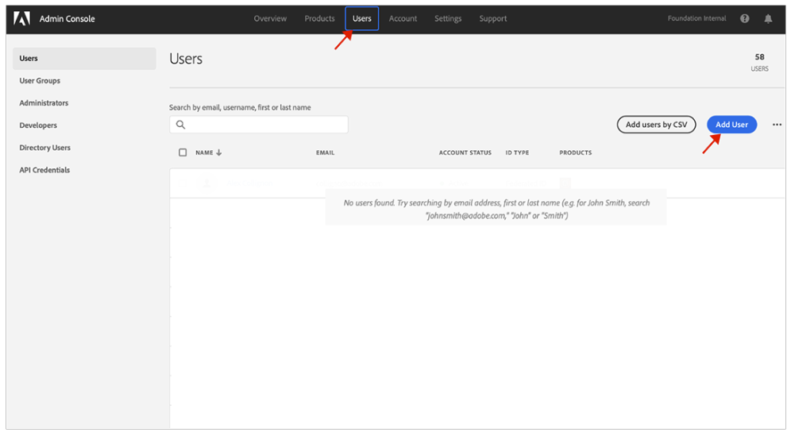

# Användargrupper för meddelanden {#user-groups}

Lär dig hur du skapar en användargrupp i Admin Console för att hantera mottagning av viktiga e-postmeddelanden.

## Översikt {#overview}

emellanåt behöver Adobe kontakta om sina AEM as a Cloud Service miljöer. Förutom meddelanden i produkten använder Adobe ibland även e-post för sådana meddelanden. Det finns två typer av sådana meddelanden:

* **Incidentmeddelande - Cloud Service** - Dessa meddelanden skickas under en incident eller när Adobe har identifierat ett potentiellt tillgänglighetsproblem i din AEM as a Cloud Service miljö.
* **Proaktiv avisering - Cloud Service** - Dessa meddelanden skickas när en medlem i Adobe supportteam vill ge vägledning om en eventuell optimering eller rekommendation som kan vara till nytta för er AEM as a Cloud Service miljö.

För att rätt användare ska få dessa meddelanden måste du konfigurera användargrupper.

## Förutsättningar {#prerequisites}

Eftersom användargrupper skapas och underhålls i Admin Console måste du:

* Har behörighet att lägga till och redigera gruppmedlemskap.
* Har en giltig Adobe Admin Console-profil.

## Skapa nya produktprofiler för Cloud Manager {#create-groups}

För att kunna ställa in mottagning av meddelanden måste du skapa två användargrupper. Dessa steg får endast utföras en gång.

1. Logga in Admin Console på [`https://adminconsole.adobe.com`.](https://adminconsole.adobe.com)

1. Från **Översikt** sida, markera **Adobe Experience Manager as a Cloud Service** från **Produkter och tjänster** kort.

   

1. Navigera till **Cloud Manager** -instans i listan över alla instanser.

   

1. Du ser listan över alla konfigurerade Cloud Manager-produktprofiler. Till exempel:

   

1. Klicka på Ny profil och ange följande information:

* Produktprofilnamn: Incidentmeddelande - Cloud Service
* Visningsnamn: Incidentmeddelande - Cloud Service
* Beskrivning: Cloud Manager-profil för de användare som ska få meddelanden under en incident eller när Adobe har identifierat ett potentiellt tillgänglighetsproblem i din AEM as a Cloud Service miljö.

1. Klicka på Spara och upprepa steg 4 med följande information:

* Produktprofilnamn: Proaktiv avisering - Cloud Service
* Visningsnamn: Proaktiv avisering - Cloud Service
* Beskrivning: Cloud Manager-profil för de användare som får meddelanden när en medlem i Adobe support vill ge vägledning om en eventuell optimering eller rekommendationer som ska utföras med din AEM as a Cloud Service miljökonfiguration.

>[!NOTE]
>
>Det är viktigt att namnet på Cloud Manager-profilen är exakt detsamma som ovan. Kopiera och klistra in produktprofilens namn från beskrivningen. Eventuella avvikelser eller skrivfel leder till att meddelanden inte skickas som du vill. Om fel uppstår eller profiler inte har definierats kommer Adobe som standard att meddela befintliga användare som har tilldelats till Cloud Manager Developer (är det eller, eller, och) Deployment Manager-profiler.

## Tilldela användarna till de nya produktprofilerna för meddelanden {#add-users}

Nu när grupperna har skapats måste du tilldela rätt användare. Du kan göra detta när du skapar nya användare eller genom att uppdatera befintliga användare.

### Lägg till nya användare i grupper {#new-user}

1. Identifiera den eller de användare som ska få incidenter eller proaktiva meddelanden.

1. Logga in Admin Console på [`https://adminconsole.adobe.com`](https://adminconsole.adobe.com) om du fortfarande inte är inloggad.

1. Från **Översikt** sida, markera **Adobe Experience Manager as a Cloud Service** från **Produkter och tjänster** kort.

   

1. Välj **Användare** i den övre navigeringen och sedan väljer **Lägg till användare**.

1. I dialogrutan Lägg till användare i ditt team anger du e-post-ID för den användare som du vill lägga till.

* Om ditt gruppmedlems-ID inte har konfigurerats ännu väljer du Adobe ID som ID-typ.
* Om användaren redan finns, se steg 7.

1. Klicka på plusknappen under **Välj produkter** rubrik för att börja produktval och välja **Adobe Experience Manager as a Cloud Service** och tilldela **Incidentmeddelande - Cloud Service** eller **Proaktiv avisering - Cloud Service** eller både och till användaren.

1. Klicka **Spara** och ett välkomstmeddelande skickas till användaren som du har lagt till. Den inbjudna användaren får nu meddelanden.

1. Upprepa dessa steg för de användare i ditt team som du vill ska få meddelanden om.

1. Om användaren redan finns söker du efter användarens namn och:

* Klicka på användarens namn.
* I **Produkter** avsnitt, klicka **Redigera**.
* Klicka på pennknappen **Välj produkter** rubrik för att börja produktval och välja **Adobe Experience Manager as a Cloud Service** och tilldela **Incidentmeddelande - Cloud Service** eller **Proaktiv avisering - Cloud Service** eller både och till användaren.
* Klicka **Spara** och ett välkomstmeddelande skickas till användaren som du har lagt till. Den inbjudna användaren får nu meddelanden.
