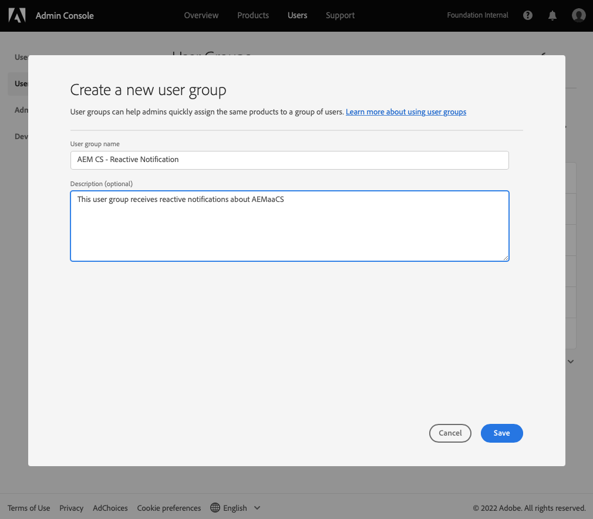
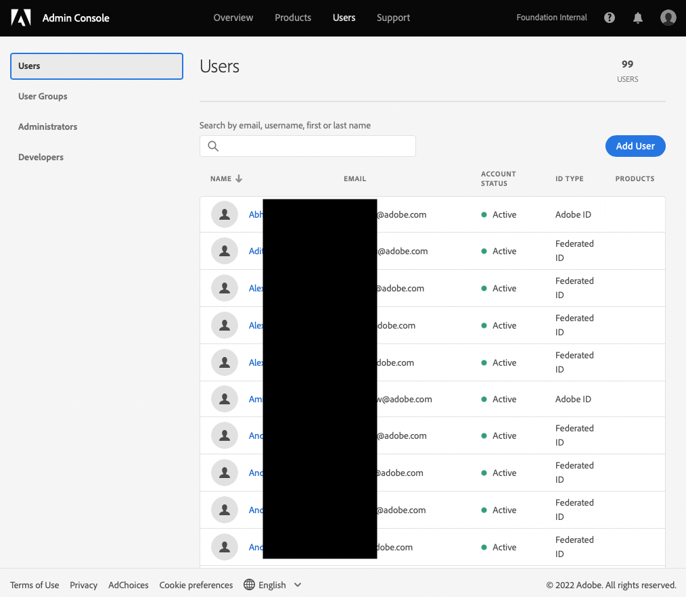
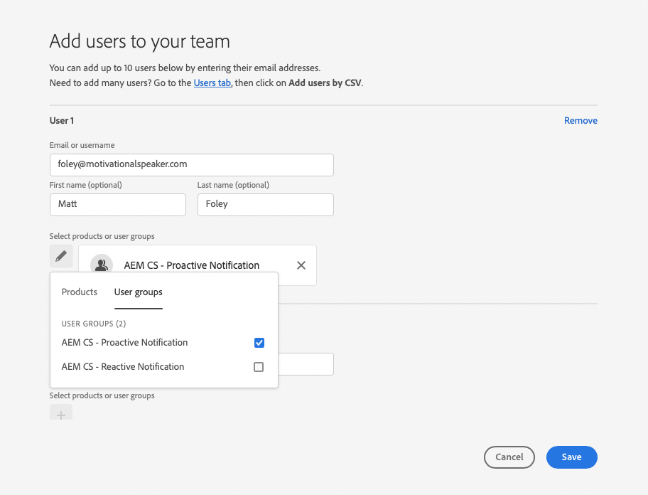
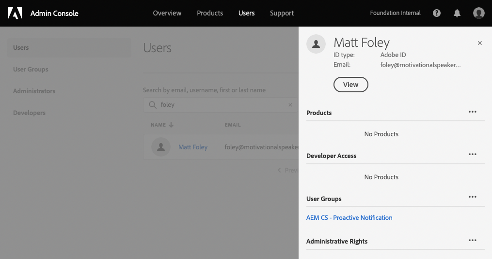

# Användargrupper för meddelanden {#user-groups}

Lär dig hur du skapar en användargrupp i Admin Console för att hantera mottagning av viktiga e-postmeddelanden.

## Översikt {#overview}

emellanåt behöver Adobe kontakta om sina AEM as a Cloud Service miljöer. Förutom meddelanden i produkten använder Adobe ibland även e-post för sådana meddelanden. Det finns två typer av sådana meddelanden:

* **Reaktiv avisering** - Dessa meddelanden skickas under en incident eller när Adobe har identifierat ett potentiellt tillgänglighetsproblem i din AEM as a Cloud Service miljö.
* **Proaktiv avisering** - Dessa meddelanden skickas när en medlem i Adobe supportteam vill ge vägledning om en eventuell optimering eller rekommendation som kan vara till nytta för er AEM as a Cloud Service miljö.

För att rätt användare ska få dessa meddelanden måste du konfigurera användargrupper.

## Förutsättningar {#prerequisites}

Eftersom användargrupper skapas och underhålls i Admin Console måste du:

* Har behörighet att lägga till och redigera gruppmedlemskap.
* Har en giltig Adobe Admin Console-profil.

## Skapa användargrupper för meddelanden {#create-groups}

För att kunna ställa in mottagning av meddelanden måste du skapa två användargrupper. Dessa steg får endast utföras en gång.

1. Logga in Admin Console på [`https://adminconsole.adobe.com`.](https://adminconsole.adobe.com)

1. Klicka på **Användare** och sedan **Användargrupper** i den vänstra navigeringspanelen.

   

1. Klicka på **Ny användargrupp** och ange **Användargruppsnamn** exakt som angivet och valfritt **Beskrivning**.

   * Gruppnamnen måste matcha följande. Justera eller ändra inte gruppnamnen på något sätt.
      * `AEM CS - Reactive Notification`
      * `AEM CS - Proactive Notification`

   

1. Klicka **Spara**.

1. Upprepa stegen för den andra gruppen.

I de fall där grupperna inte är definierade kommer Adobe att meddela befintliga användare via Cloud Manager **Utvecklare** eller **Distribution** profiler.

## Lägg till användare i grupper {#add-users}

Nu när grupperna har skapats måste du tilldela rätt användare. Du kan göra detta när du skapar nya användare eller genom att uppdatera befintliga användare.

### Lägg till nya användare i grupper {#new-user}

1. Logga in Admin Console på [`https://adminconsole.adobe.com`](https://adminconsole.adobe.com) om du fortfarande inte är inloggad.

1. Klicka på **Användare** och sedan **Användare** i den vänstra navigeringspanelen.

   

1. Klicka på **Lägg till användare** och ange användarens e-postadress. Du kan också ange för- och efternamn.

   * Om användaren redan finns matchar Admin Console e-postadressen och fyller i fälten i förväg.

1. Klicka på plustecknet under användarnamnsfälten och klicka sedan på **Användargrupper** i popup-fönstret för att välja grupper för användaren.

   

1. Klicka **Spara** för att spara den nya användaren.

Upprepa dessa steg för varje användare som du vill tilldela meddelandegrupperna till.

### Lägg till befintliga användare i grupper {#existing-user}

1. Logga in Admin Console på [`https://adminconsole.adobe.com`](https://adminconsole.adobe.com) om du fortfarande inte är inloggad.

1. Klicka på **Användare** och sedan **Användare** i den vänstra navigeringspanelen.

   

1. Klicka på raden för den användare som du vill lägga till i en meddelandegrupp. En panel där användarinformationen visas öppnas.

1. Klicka på ellipsikonen till höger om **Användargrupper** på detaljpanelen.