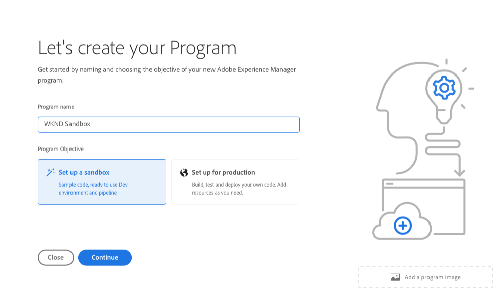
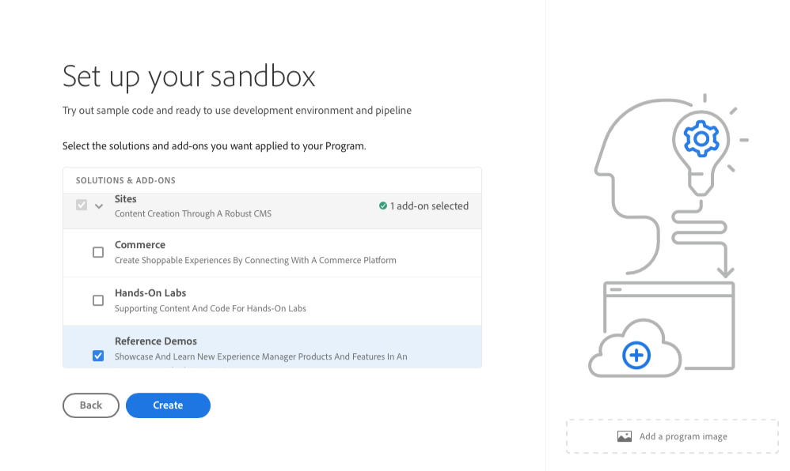
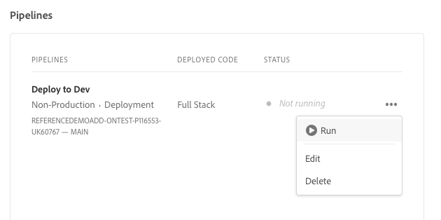
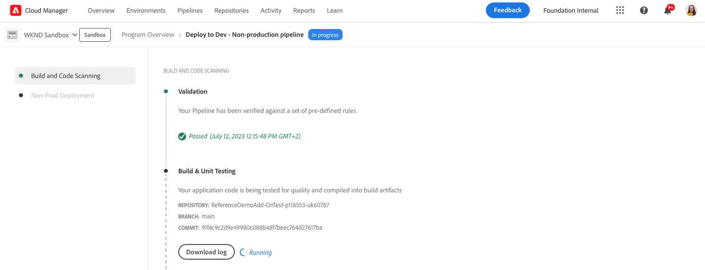

# Skapa program {#creating-a-program}

Lär dig hur du konfigurerar ett nytt program och en ny pipeline för att distribuera tillägget.

## Story hittills {#story-so-far}

I det föregående dokumentet om AEM Reference Demos Add-On-resan, [Förstå installationen av tillägget för referensdemo,](installation.md) du har lärt dig hur installationsprocessen för tillägget Referensdemonstrationer fungerar, vilket visar hur de olika delarna fungerar tillsammans. Nu bör du:

* Få en grundläggande förståelse för Cloud Manager.
* Förstå hur rörledningar levererar innehåll och konfigurationer till AEM.
* Se hur mallarna kan skapa nya webbplatser med demomaterial med bara några klick.

Den här artikeln bygger på dessa grundläggande funktioner och tar det första konfigurationssteget för att skapa ett program för testning och använder en pipeline för att distribuera tilläggsinnehållet.

## Syfte {#objective}

Det här dokumentet hjälper dig att förstå hur du konfigurerar ett nytt program och en ny pipeline för att distribuera tillägget. När du har läst bör du:

* Lär dig hur du använder Cloud Manager för att skapa ett nytt program.
* Lär dig hur du aktiverar tillägget Referensdemonstrationer för det nya programmet.
* Du kan köra en pipeline för att distribuera tilläggsinnehållet.

## Skapa ett program {#create-program}

När du har loggat in på Cloud Manager kan du skapa ett nytt sandlådeprogram för testnings- och demonstrationssyften.

>[!NOTE]
>
>Användaren måste vara medlem i **Företagsägare** i Cloud Manager i organisationen för att skapa program.

1. Logga in på Adobe Cloud Manager på [my.cloudmanager.adobe.com](https://my.cloudmanager.adobe.com/).

1. När du är inloggad kontrollerar du att du är i rätt ordning genom att kontrollera den i skärmens övre högra hörn. Om du bara är medlem i en organisation är det här steget inte nödvändigt.

   

1. Tryck eller klicka **Lägg till program** längst upp till höger i fönstret.

1. I **Låt oss skapa ditt program** dialog:

   1. Ange en **Programnamn** för att beskriva ditt program.
   1. Tryck eller klicka **Konfigurera en sandlåda** för **Programmål**
   1. Tryck eller klicka **Fortsätt**.

   

1. I **Konfigurera din sandlåda** i **Lösningar och tillägg** tabell, expandera **Webbplatser** i listan genom att trycka eller klicka på den och sedan kontrollera **Referensdemonstrationer**.

   * Om du även vill skapa demos för AEM Screens ska du kontrollera **Skärmar** i listan också. Tryck eller klicka **Uppdatera**.

   

1. Tryck eller klicka **Skapa** och Cloud Manager börjar konfigurera ditt sandlådeprogram. Du kommer nu till programöversikten och ett kort banderollmeddelande anger att processen har startats. Ett kort har lagts till på översiktssidan för ditt nya program. Installationsprocessen tar några minuter.

1. När konfigurationen är klar visas miljökortets status som **Klar**. Tryck eller klicka på kortet för att öppna miljön.

   

1. Miljön är klar och tillägget är nu aktiverat som ett alternativ, men innehållet i demon måste distribueras för att AEM ska vara tillgängligt. Gör detta genom att trycka eller klicka på ellipsknappen bredvid pipelinen Distribuera till utvecklare i **Pipelines** och välj **Kör**.

   

1. Pipelinen börjar och du dirigeras till en sida med information om distributionsförloppet. Du kan navigera bort från den här skärmen när programmet skapas och returnera det senare om det behövs.

   

Det kan ta flera minuter att slutföra pipelinen. När det är klart är tillägget och dess demoinnehåll tillgängligt för användning i AEM redigeringsmiljö.

## What&#39;s Next {#what-is-next}

Nu när du har slutfört den här delen av AEM Reference Demo Add-On-resan bör du:

* Lär dig hur du använder Cloud Manager för att skapa ett nytt program.
* Lär dig hur du aktiverar tillägget Referensdemonstrationer för det nya programmet.
* Du kan köra en pipeline för att distribuera tilläggsinnehållet.

Bygg vidare på den här kunskapen och fortsätt din AEM Reference Demo Add-On-resa genom att nästa gång du granskar dokumentet [Skapa en demowebbplats,](create-site.md) där du får lära dig att skapa en demowebbplats i AEM baserat på ett bibliotek med förkonfigurerade mallar som distribuerades via pipeline.

## Ytterligare resurser {#additional-resources}

* [Dokumentation för Cloud Manager](https://experienceleague.adobe.com/docs/experience-manager-cloud-service/onboarding/onboarding-concepts/cloud-manager-introduction.html) - Om du vill ha mer information om funktionerna i Cloud Manager kan du läsa de detaljerade tekniska dokumenten direkt.
