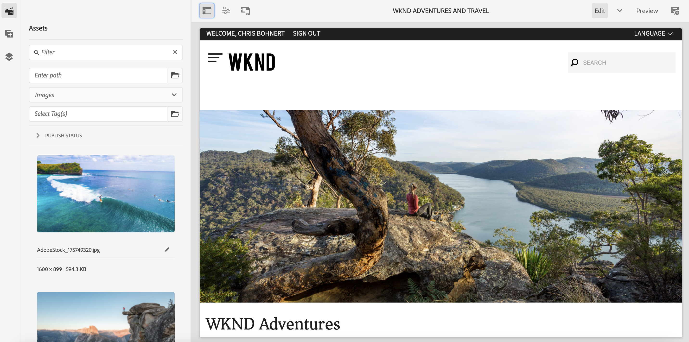

# Skapa demowebbplats {#creating-a-site}

Skapa en demowebbplats i AEM baserat på ett bibliotek med förkonfigurerade mallar.

## Story hittills {#story-so-far}

I det föregående dokumentet om AEM Reference Demos Add-On-resan, [Create Program,](create-program.md) du tog det första konfigurationssteget för att skapa ett program för testning och använde en pipeline för att distribuera tilläggsinnehållet. Nu bör du:

* Lär dig hur du använder Cloud Manager för att skapa ett nytt program.
* Lär dig hur du aktiverar tillägget Referensdemonstrationer för det nya programmet.
* Du kan köra en pipeline för att distribuera tilläggsinnehållet.

I den här artikeln beskrivs nästa steg i processen genom att skapa en ny webbplats eller ett AEM Screens-projekt i AEM baserat på mallarna i tillägget Referensdemo.

## Syfte {#objective}

Det här dokumentet hjälper dig att förstå hur du skapar en ny plats baserat på mallarna i tillägget Referensdemo. När du har läst bör du:

* Lär dig hur du kommer åt AEM.
* Lär dig hur du skapar en webbplats baserad på en mall.
* Förstå grunderna för navigering i webbplatsstrukturen och redigering av en sida.

## Skapa en demowebbplats eller ett skärmsprojekt {#create-site}

När pipeline har distribuerat tillägget för referensdemo kan du komma åt AEM redigeringsmiljö och skapa demowebbplatser baserat på tilläggsinnehållet.

1. På sidan för programöversikt i Cloud Manager trycker eller klickar du på länken till AEM redigeringsmiljö.

   

1. Tryck eller klicka på **Webbplatser**.

   

1. Tryck eller klicka på webbplatskonsolen **Skapa** längst upp till höger på skärmen och välj **Plats från mall** i listrutan.

   

1. Guiden Skapa webbplats startar. I den vänstra kolumnen ser du demomallarna som pipeline distribuerade till din redigeringsinstans. Tryck eller klicka på en för att markera den och visa information i den högra kolumnen. Om du vill testa eller demonstrera AEM Screens ska du välja **Webbplatsmall för We.Cafe**. Tryck eller klicka **Nästa**.

   

1. På nästa skärm anger du en rubrik för webbplatsen eller skärmsprojektet. Om det utelämnas kan du ange eller generera ett platsnamn från titeln. Tryck eller klicka **Skapa**.

   * Platsens titel visas i webbläsarens namnlist.
   * Webbplatsnamnet blir en del av webbadressen.
   * Webbplatsnamnet måste följa AEM regler för sidnamngivning, som finns i [Ytterligare resurser](#additional-resources) -avsnitt.

   

1. Webbplatsen har skapats med en dialogruta. Tryck eller klicka **Klar**.

   

Nu har du skapat en egen demosajt!

## Använd demowebbplats {#use-site}

Nu när demowebbplatsen har skapats kan du navigera och använda den på samma sätt som andra webbplatser i AEM.

1. Platsen visas nu i webbplatskonsolen.

   

1. Kontrollera att konsolvyn är inställd på i skärmens övre högra hörn **Kolumnvy**.

   

1. Tryck eller klicka på webbplatsen för att utforska dess struktur och innehåll. Kolumnvyn utökas kontinuerligt när du navigerar i innehållsträdet på demowebbplatsen.

   

1. Tryck eller klicka på en sida för att markera den och tryck eller klicka sedan på **Redigera** i verktygsfältet.

   

1. Du kan redigera sidan som vilken annan AEM innehållssida som helst, till exempel lägga till eller redigera komponenter eller resurser och testa AEM funktioner.

   

Grattis! Nu kan du utforska innehållet på din demowebbplats ytterligare och upptäcka allt som AEM har att erbjuda via det bästa innehållet i tillägget för referensdemo.

Skapa ytterligare sajter baserade på andra mallar för att utforska mer AEM funktionalitet.

## What&#39;s Next {#what-is-next}

Nu när du har slutfört den här delen av AEM Reference Demo Add-On-resan bör du:

* Lär dig hur du kommer åt AEM.
* Lär dig hur du skapar en webbplats baserad på en mall.
* Förstå grunderna för navigering i webbplatsstrukturen och redigering av en sida.

Nu kan du testa funktionerna i AEM med tilläggsinnehåll. Du har två alternativ för att fortsätta din resa:

* Om du vill göra en fullständig demonstration och testa AEM Screens-innehåll måste du se till att du har distribuerat en webbplats som är baserad på **Webbplatsmall för We.Cafe** enligt beskrivningen ovan och fortsätta [Aktivera AEM Screens för din demowebbplats.](screens.md)
* Om du bara har tillgång till demowebbplatsinnehåll kan du fortsätta [Hantera dina demosajter,](manage.md) där du får lära dig mer om de verktyg som finns för att hantera dina demowebbplatser och hur du tar bort dem.

## Ytterligare resurser {#additional-resources}

* [Dokumentation för Cloud Manager](https://experienceleague.adobe.com/docs/experience-manager-cloud-service/onboarding/onboarding-concepts/cloud-manager-introduction.html) - Om du vill ha mer information om funktionerna i Cloud Manager kan du läsa de detaljerade tekniska dokumenten direkt.
* [Skapa webbplats](/help/sites-cloud/administering/site-creation/create-site.md) - Lär dig hur du använder AEM för att skapa en webbplats med hjälp av webbplatsmallar för att definiera webbplatsens format och struktur.
* [AEM sidnamnskonventioner](/help/sites-cloud/authoring/fundamentals/organizing-pages.md#page-name-restrictions-and-best-practices). - På den här sidan finns information om hur du organiserar AEM sidor.
* [AEM grundläggande hantering](/help/sites-cloud/authoring/getting-started/basic-handling.md) - Utforska det här dokumentet om du inte AEM förstå grundläggande begrepp som navigering och konsolorganisering.
