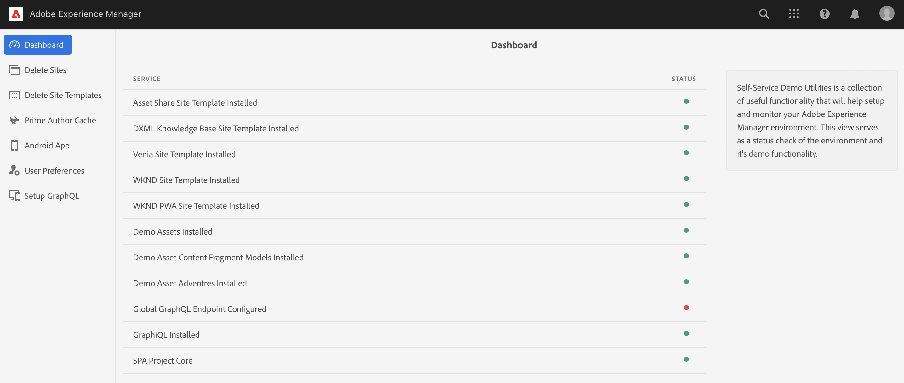

# Hantera dina demowebbplatser {#manage-demo-sites}

Lär dig mer om de verktyg du kan använda för att hantera demowebbplatser och hur du tar bort dem.

## Story hittills {#story-so-far}

I det föregående dokumentet om AEM Reference Demos Add-On-resan, [Skapa webbplats,](create-site.md) du har skapat en ny demowebbplats baserad på mallarna för tillägget Referensdemo. Nu bör du:

* Lär dig hur du kommer åt AEM.
* Lär dig hur du skapar en webbplats baserad på en mall.
* Förstå grunderna för navigering i webbplatsstrukturen och redigering av en sida.

Om du också [har AEM Screens aktiverat för din demosajt,](screens.md) Du bör också:

* Lär dig grunderna i AEM Screens.
* Förstå demoinnehållet för We.Cafe.
* Lär dig hur du konfigurerar AEM Screens för We.Cafe.

Nu när du har en egen demosajt att utforska beskriver den här artikeln de verktyg som finns för att hantera dina demosajter och hur du tar bort dem.

## Syfte {#objective}

Det här dokumentet hjälper dig att förstå hur du kan hantera de demowebbplatser du har skapat. När du har läst bör du:

* Lär dig hur du får tillgång till självbetjäningsdemoverktygen.
* Ta reda på vilka verktyg som är tillgängliga.
* Så här tar du bort en befintlig demowebbplats eller -mall.

## Åtkomst till självbetjäningsdemoverktyg {#accessing-utilities}

Nu när du har egna demosajter vill du antagligen veta hur du kan hantera dem. Det var inte bara webbplatsmallarna som distribuerades för att ge plats åt demonstrationssajterna, utan även en uppsättning verktyg för att hantera dessa sajter.

1. I det AEM globala navigeringsfältet väljer du **verktyg** -> **Referensdemonstrationer** -> **Demoverktyg**.

   

1. Demoverktyg är en samling användbara funktioner som hjälper dig att installera och övervaka din Adobe Experience Manager-miljö. Den inledande vyn är **Kontrollpanel**, som fungerar som en statuskontroll av miljön och dess demofunktioner.

   

Självbetjäningsdemoverktyg innehåller ett antal verktyg.

* **Ta bort platser** - Markera den webbplats som du vill ta bort i den här Adobe Experience Manager-instansen. Tänk på att detta är en destruktiv åtgärd som inte kan ångras när den väl har initierats.
* **Ta bort webbplatsmallar** - Markera den webbplatsmall som du vill ta bort i den här Adobe Experience Manager-instansen. Innan du tar bort en platsmall kontrollerar du att även alla webbplatser som refererar till mallen tas bort. Tänk på att detta är en destruktiv åtgärd som inte kan ångras när den väl har initierats.
* **Cache för primär författare** - Detta hämtar flera resurser i Adobe Experience Manager-instansen och snabbar upp hämtningstiden. Det kan ta flera sekunder.
* **Android-app** - Verktyg för att installera och starta demonstrationsappen för Android. Skapa en webbplats baserat på **WKND-app för en sida** för att fylla i den här sidan. Använd från en Android-enhet, emulator eller Bluestacks.
* **Användarinställningar** - Inaktivera dialogrutor för självstudiekurser.
* **Konfigurera GraphQL** - Konfigurera snabbt GraphQL globala slutpunkt.

## Ta bort demowebbplatser och mallar {#deleting}

När du har testat en uppsättning AEM funktioner behöver du kanske inte längre demowebbplatsen eller ens den mall som den baseras på. Det är enkelt att ta bort både demowebbplatser och webbplatsmallar.

1. Öppna **Demoverktyg** och klicka **Ta bort platser**.

   

1. De tillgängliga platserna visas i en lista. Markera den eller de webbplatser som du vill ta bort och tryck eller klicka sedan på **Ta bort**.

   >[!CAUTION]
   >
   >Borttagning av webbplats och mall är en destruktiv åtgärd och kan inte ångras när den har initierats.

1. Bekräfta borttagningen av platsen i dialogrutan.

   

1. AEM tar bort den eller de markerade platserna och visar förloppet där **Ta bort** knappen var tidigare.

   

Webbplatsen har nu tagits bort.

Du kan ta bort mallar på samma sätt under rubriken **Ta bort webbplatsmallar** i **Demoverktyg**.

>[!CAUTION]
>
>Innan du tar bort en platsmall kontrollerar du att även alla webbplatser som refererar till mallen tas bort.

## Slut på resan? {#end-of-journey}

Grattis! Du har slutfört AEM Reference Demos Add-On-resan! Nu bör du:

* Få en grundläggande förståelse för Cloud Manager och förstå hur rörledningar levererar innehåll och konfiguration till AEM.
* Lär dig hur du använder Cloud Manager för att skapa ett nytt program.
* Lär dig hur du aktiverar tillägget Referensdemonstrationer för det nya programmet och kan köra en pipeline för att distribuera tilläggsinnehållet.
* Lär dig hur du får åtkomst till AEM redigeringsmiljö för att skapa en plats som är baserad på en mall.
* Lär dig hur du får tillgång till självbetjäningsdemoverktygen.
* Lär dig hur du tar bort en befintlig demowebbplats eller demomall.

Du är nu redo att utforska möjligheterna att AEM med dina egna demosajter. AEM är dock ett kraftfullt verktyg och det finns många andra alternativ. Se vilka ytterligare resurser som finns i [Avsnittet Ytterligare resurser](#additional-resources) om du vill veta mer om de funktioner du såg under den här resan.

## Ytterligare resurser {#additional-resources}

* [Dokumentation för Cloud Manager](https://experienceleague.adobe.com/docs/experience-manager-cloud-service/onboarding/onboarding-concepts/cloud-manager-introduction.html) - Om du vill ha mer information om funktionerna i Cloud Manager kan du läsa de detaljerade tekniska dokumenten direkt.
* [Skapa webbplats](/help/sites-cloud/administering/site-creation/create-site.md) - Lär dig hur du använder AEM för att skapa en webbplats med hjälp av webbplatsmallar för att definiera webbplatsens format och struktur.
* [AEM sidnamnkonventioner.](/help/sites-cloud/authoring/fundamentals/organizing-pages.md#page-name-restrictions-and-best-practices) - På den här sidan finns information om hur du organiserar AEM sidor.
* [AEM grundläggande hantering](/help/sites-cloud/authoring/getting-started/basic-handling.md) - Utforska det här dokumentet om du inte AEM förstå grundläggande begrepp som navigering och konsolorganisering.
* [AEM as a Cloud Service teknisk dokumentation](https://experienceleague.adobe.com/docs/experience-manager-cloud-service.html) - Om du redan har en god förståelse för AEM kan du behöva läsa de detaljerade tekniska dokumenten direkt.
* [Webbplatsmallar](/help/sites-cloud/administering/site-creation/site-templates.md) - Om du vill veta mer om strukturen för webbplatsmallar och hur de används för att skapa webbplatser kan du läsa det här dokumentet.
